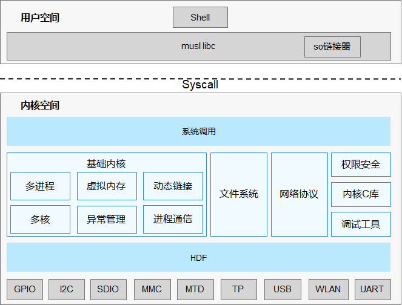
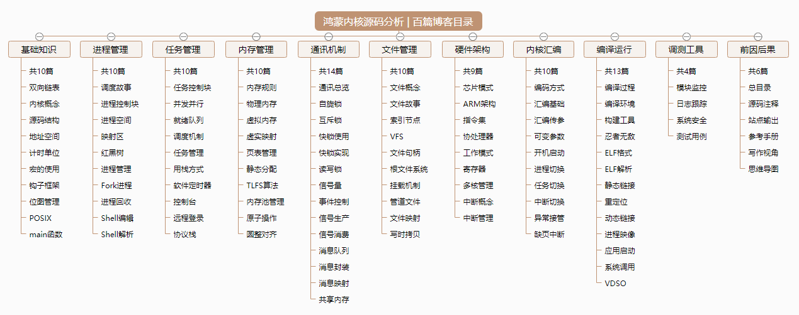

基础知识相关篇为: 

* [v01.12 鸿蒙内核源码分析(双向链表) | 谁是内核最重要结构体](/blog/01.md)
* [v02.01 鸿蒙内核源码分析(内核概念) | 名不正则言不顺](/blog/02.md)
* [v03.02 鸿蒙内核源码分析(源码结构) | 宏观尺度看内核结构](/blog/03.md)
* [v04.01 鸿蒙内核源码分析(地址空间) | 内核如何看待空间](/blog/04.md)
* [v05.03 鸿蒙内核源码分析(计时单位) | 内核如何看待时间](/blog/05.md)
* [v06.01 鸿蒙内核源码分析(优雅的宏) | 编译器也喜欢复制粘贴 ](/blog/06.md)
* [v07.01 鸿蒙内核源码分析(钩子框架) | 万物皆可HOOK ](/blog/07.md)
* [v08.04 鸿蒙内核源码分析(位图管理) | 一分钱被掰成八半使用](/blog/08.md)
* [v09.01 鸿蒙内核源码分析(POSIX) | 操作系统界的话事人 ](/blog/09.md)
* [v10.01 鸿蒙内核源码分析(main函数) | 要走了无数码农的第一次 ](/blog/10.md)


### LiteOS-A 内核

`OpenHarmony LiteOS-A` 内核是基于 `Huawei LiteOS` 内核演进发展的新一代内核，`Huawei LiteOS`是面向`IoT`领域构建的轻量级物联网操作系统。在`IoT`产业高速发展的潮流中，`OpenHarmony LiteOS-A`内核能够带给用户小体积、低功耗、高性能的体验以及统一开放的生态系统能力，新增了丰富的内核机制、更加全面的`POSIX`标准接口以及统一驱动框架`HDF`（OpenHarmony Driver Foundation）等，为设备厂商提供了更统一的接入方式，为`OpenHarmony`的应用开发者提供了更友好的开发体验。

### 架构图

**( 图一 )**


### 百篇博客目录

**( 图二 )**


### 源码结构

**( 图三 )**

```shell
/kernel/liteos_a
├── apps                   # 用户态的init和shell应用程序
├── arch                   # 体系架构的目录，如arm等
│   └── arm                # arm架构代码
├── bsd                    # freebsd相关的驱动和适配层模块代码引入，例如USB等
├── compat                 # 内核接口兼容性目录
│   └── posix              # posix相关接口
├── drivers                # 内核驱动
│   └── char               # 字符设备
│       ├── mem            # 访问物理IO设备驱动
│       ├── quickstart     # 系统快速启动接口目录
│       ├── random         # 随机数设备驱动
│       └── video          # framebuffer驱动框架
├── fs                     # 文件系统模块，主要来源于NuttX开源项目
│   ├── fat                # fat文件系统
│   ├── jffs2              # jffs2文件系统
│   ├── include            # 对外暴露头文件存放目录
│   ├── nfs                # nfs文件系统
│   ├── proc               # proc文件系统
│   ├── ramfs              # ramfs文件系统
│   └── vfs                # vfs层
├── kernel                 # 进程、内存、IPC等模块
│   ├── base               # 基础内核，包括调度、内存等模块
│   ├── common             # 内核通用组件
│   ├── extended           # 扩展内核，包括动态加载、vdso、liteipc等模块
│   ├── include            # 对外暴露头文件存放目录
│   └── user               # 加载init进程
├── lib                    # 内核的lib库
├── net                    # 网络模块，主要来源于lwip开源项目
├── platform               # 支持不同的芯片平台代码，如Hi3516DV300等
│   ├── hw                 # 时钟与中断相关逻辑代码
│   ├── include            # 对外暴露头文件存放目录
│   └── uart               # 串口相关逻辑代码
├── security               # 安全特性相关的代码，包括进程权限管理和虚拟id映射管理
├── syscall                # 系统调用 
├── testsuites             # 单元测试用例 
├── tools                  # 构建工具及相关配置和代码
└── zzz                    # 中文注解版新增目录
```

**解读**

* **kernel** ：是最重要的模块，包括了百篇博客中的 **进程管理** 、**任务管理** 、**内存管理** 、**通讯机制** 四大核心模块。
* **arch** ：开机代码就在此，包括了所有内核汇编代码，管理处理器，协处理器，中断控制器等核心硬件实现代码，包括了百篇博客中的 **硬件架构**、**内核汇编** 两个大模块。
* **fs** ：文件系统可比作内核的数据库，保存永久/临时性数据，文件系统因技术的更新，各个公司的利益保护等等诸多原因，呈现百花齐放，多达几十种， 通过加入虚拟层`vfs`统一对外部模块提供访问各文件系统服务，这些文件系统可分成以下四种，
  * 磁盘文件系统，包括 `fat`、`ntfs`、`ext4`、`zfs` ...
  * 闪存文件系统，包括 `jffs2`、`yaffs` ...
  * 内存文件系统，包括 `proc`、`ramfs`、`tmpfs`  
  * 网络文件系统，包括`nfs` (Network File System）是一种将远程主机上的分区（目录）经网络挂载到本地系统的一种机制，是一种分布式文件系统，力求客户端主机可以访问服务器端文件，并且其过程与访问本地存储时一样，它由Sun公司开发，于1984年发布。

