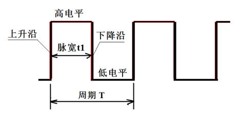
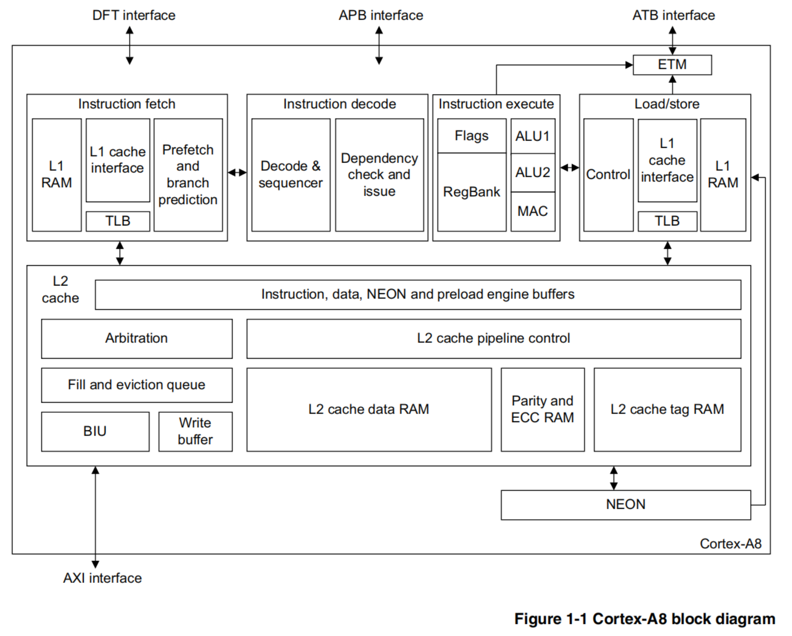
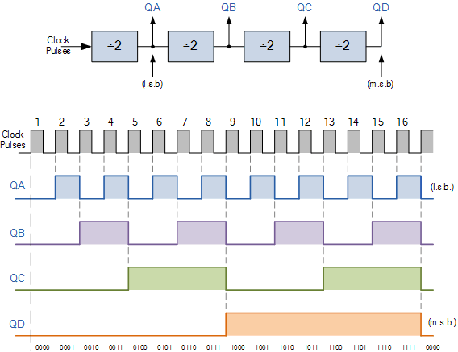

基础知识相关篇为: 

* [v01.12 鸿蒙内核源码分析(双向链表) | 谁是内核最重要结构体](/blog/01.md)
* [v02.01 鸿蒙内核源码分析(内核概念) | 名不正则言不顺](/blog/02.md)
* [v03.02 鸿蒙内核源码分析(源码结构) | 宏观尺度看内核结构](/blog/03.md)
* [v04.01 鸿蒙内核源码分析(地址空间) | 内核如何看待空间](/blog/04.md)
* [v05.03 鸿蒙内核源码分析(计时单位) | 内核如何看待时间](/blog/05.md)
* [v06.01 鸿蒙内核源码分析(优雅的宏) | 编译器也喜欢复制粘贴 ](/blog/06.md)
* [v07.01 鸿蒙内核源码分析(钩子框架) | 万物皆可HOOK ](/blog/07.md)
* [v08.04 鸿蒙内核源码分析(位图管理) | 一分钱被掰成八半使用](/blog/08.md)
* [v09.01 鸿蒙内核源码分析(POSIX) | 操作系统界的话事人 ](/blog/09.md)
* [v10.01 鸿蒙内核源码分析(main函数) | 要走了无数码农的第一次 ](/blog/10.md)


### 时间都去哪了 ?

* 施教授说时间就是运动,地球围绕太阳公转一圈叫一年,地球自转一圈叫一天,地球自转了365天才围绕太阳转完了一圈,所以一年等于365天,这些都是运动.
* 我们能感知到时间的流逝,大概也是因为我们身体在运动,细胞一次次的复制,衰老,死亡,直至最后一次再也无法复制代表着生命彻底终结.我们日常总是被时间催促着走,就这样一天又一天,一年再一年.疫情都第三年了,口罩也带习惯了,不敢回头看,常常感叹,时间都去哪了 ？还没好好感受年轻就老了,还没好好看看你眼睛就花了,转眼就只剩下满脸的皱纹了.哎呀 ! 老衲快不行了,要泪崩了 ...

### 计算机怎么理解时间

* 没有时间,我们的生活将是无序的,对计算机更是如此的,而且只会更敏感,否则如何能做到精确到纳秒级的运算,它是如何理解时间的呢？它的敏感源又是什么呢 ？ 答案是:**晶振** 全称是石英晶体振荡器,是一种高精度和高稳定度的振荡器.位置一般在主板上,晶振为系统提供很稳定的脉冲信号,一秒钟内产生的脉冲次数也被称为系统时钟频率.一个标准的脉冲信号如 **( 图一 )** 所示.
  
    

* **时钟周期** 这里的时钟指的就是晶振,也叫晶振周期/振荡周期.它是计算机的最小时间单元,其他周期只能是它的倍数.
* **机器周期** 为什么要搞出来个机器周期,因为到了`CPU`操作层面时钟周期不好用,有点类似美元和人民币的关系,美元已经是世界货币了,但每个国家国情不同,操作起来还是得用本国货币方便.一个机器周期等于多个时钟周期.它是`CPU`完成一个基本**操作**的时间单元.比如: 取指,译码,存储器读/写,运算等等操作.
* **指令周期** 它是`CPU`完成一条**指令**的时间.又称提取－执行周期(fetch-and-execute cycle)是指CPU要执行一条机器指令经过的步骤,由若干机器周期组成.不同的机器分解指令周期的方式也不同,有的处理器对每条指令分解出相同数量的机器周期,另一些处理器根据指令的复杂程度分解出不同数量的机器周期,**( 图二 )** 为 **Cortex-A8**处理器架构图,图中清晰的说明了指令从 **取指 - >** **译码 ->** **执行 ->** **储存**四个阶段.
    

* **总线周期** 它是`CPU`操作总线设备的时间,由于存贮器和`I/O`端口是挂接在总线上的,对它们的访问,是通过总线实现的.通常将进行一次访问所需时间称为一个总线周期.这种访问速度较慢,因硬件发展的原因,各个设备的工作频率无法同步,甚至相差几个数量级,`CPU`很快,硬盘很慢,大家又需要协同工作,愉快的玩耍,就出现了**分频**概念,将高频信号变成低频信号,**( 图三 )** 显示分频器分出来的四个频率代表**二分频**,**四分频**,**八分频** ,**十六分频**
 

* 从时间长短角度总结下 **时钟周期 <** **机器周期 <** **指令周期<** **总线周期**

### 周期 ,Tick ,秒

* 对于`CPU`来说,它的计时单位是`Cycle`(时钟周期),对于操作系统来说它的计时单位是`Tick`(节拍),而用户的时间单位是秒/毫秒,这就存在一个互逆的换算过程,鸿蒙是如何换算的呢 ? 看几个宏定义就清楚了.

```c
#ifndef OS_SYS_CLOCK //HZ:是每秒中的周期性变动重复次数的计量
#define OS_SYS_CLOCK (get_bus_clk()) //系统主时钟频率 例如:50000000 即20纳秒震动一次
#endif
#ifndef LOSCFG_BASE_CORE_TICK_PER_SECOND
#define LOSCFG_BASE_CORE_TICK_PER_SECOND 100 //每秒Tick数,内核定时器触发单位
#endif
#define OS_CYCLE_PER_TICK (g_sysClock / LOSCFG_BASE_CORE_TICK_PER_SECOND) //每个tick时钟周期数
```

`Tick`由系统集成商根据实际情况来配置,`Tick`大系统更灵敏,对CPU的要求更高,也会带来更多的性能损耗.
从代码中可以计算出 **OS_CYCLE_PER_TICK = 50万** 个时钟周期,假设指令平均执行周期按10个时钟周期算(实际不能这么计算),可执行5万条机器指令.
* 在`CP15`协处理器中有个专门的 **CNTFRQ** 寄存器用于存储时钟周期,详见代码:

```c
/* 
    * 见于 << arm 架构参考手册>> B4.1.21 处 CNTFRQ寄存器表示系统计数器的时钟频率.
    * 这个寄存器是一个通用的计时器寄存器.
    * MRC p15, 0, <Rt>, c14, c0, 0 ; Read CNTFRQ into Rt
    * MCR p15, 0, <Rt>, c14, c0, 0 ; Write Rt to CNTFRQ
    */
UINT32 HalClockFreqRead(VOID)
{
    return READ_TIMER_REG32(TIMER_REG_CNTFRQ);
}

VOID HalClockFreqWrite(UINT32 freq)
{
    WRITE_TIMER_REG32(TIMER_REG_CNTFRQ, freq);
}
```

* 鸿蒙内核以全局变量`g_sysClock`表示系统时钟,由硬时钟模块完成对它的初始化,并创建硬定时器`OsTickHandler`

```c
//硬时钟初始化
LITE_OS_SEC_TEXT_INIT VOID HalClockInit(VOID)
{
    UINT32 ret;

    g_sysClock = HalClockFreqRead();//读取CPU的时钟频率
    ret = LOS_HwiCreate(OS_TICK_INT_NUM, MIN_INTERRUPT_PRIORITY, 0, OsTickHandler, 0);//创建硬中断定时器
    if (ret != LOS_OK) {
        PRINT_ERR("%s, %d create tick irq failed, ret:0x%x\n", __FUNCTION__, __LINE__, ret);
    }
}
```

* 用户与操作系统之间的时间转换函数为

```c
LITE_OS_SEC_TEXT_MINOR UINT32 LOS_MS2Tick(UINT32 millisec)
{
    if (millisec == OS_MAX_VALUE) {
        return OS_MAX_VALUE;
    }
    return ((UINT64)millisec * LOSCFG_BASE_CORE_TICK_PER_SECOND) / OS_SYS_MS_PER_SECOND;
}
LITE_OS_SEC_TEXT_MINOR UINT32 LOS_Tick2MS(UINT32 tick)
{
    return ((UINT64)tick * OS_SYS_MS_PER_SECOND) / LOSCFG_BASE_CORE_TICK_PER_SECOND;
}
LITE_OS_SEC_TEXT_MINOR UINT32 OsNS2Tick(UINT64 nanoseconds)
{
    const UINT32 nsPerTick = OS_SYS_NS_PER_SECOND / LOSCFG_BASE_CORE_TICK_PER_SECOND;
    UINT64 ticks = (nanoseconds + nsPerTick - 1) / nsPerTick;
    if (ticks > OS_MAX_VALUE) {
        ticks = OS_MAX_VALUE;
    }
    return (UINT32)ticks;
}
```

### Tick硬中断 | OsTickHandler

```c
LITE_OS_SEC_TEXT VOID OsTickHandler(VOID)
{
#ifdef LOSCFG_SCHED_TICK_DEBUG 
    OsSchedDebugRecordData();
#endif
#ifdef LOSCFG_KERNEL_VDSO
    OsVdsoTimevalUpdate();//更新vdso数据页时间,vdso可以直接在用户进程空间绕过系统调用获取系统时间(例如:gettimeofday)
#endif
#ifdef LOSCFG_BASE_CORE_TICK_HW_TIME
    HalClockIrqClear(); /* diff from every platform */
#endif
    OsSchedTick();//由时钟发起的调度
}
```

* **OsTickHandler** 是控制内核正常运行的发动机,本质是硬中断,在所有硬中断中优先级最低,注意没有硬中断内核将是一片死寂,毫无生气.硬件定时器是有时间规律的重复硬中断,中断处理函数反复的检查任务列表,是否当前任务继续执行,是否时间片到了该切换任务执行了,是否有更高优先级任务需先执行.同时检查软件定时器的任务列表的时间是否到了,可以说软件定时器的时间基础就是硬件定时器,其精确度是一个`Tick`.
* 涉及内容具体可翻看系列篇 **中断管理篇**,**调度机制篇**,**软件定时器篇** ,**VDSO篇**  


