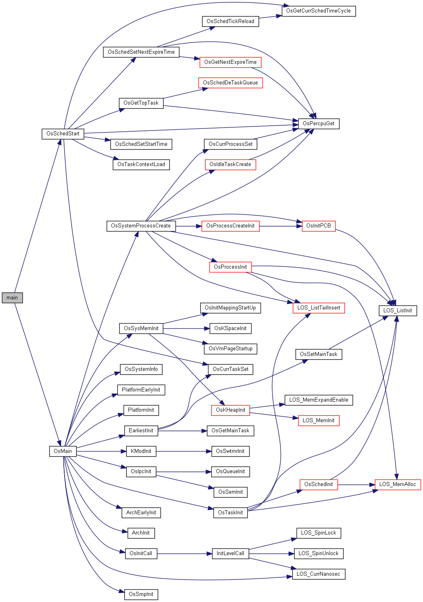
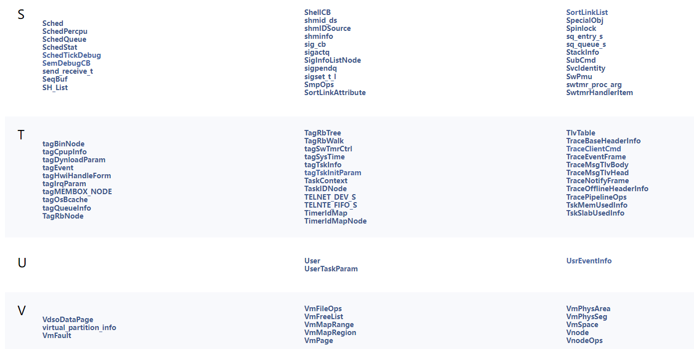
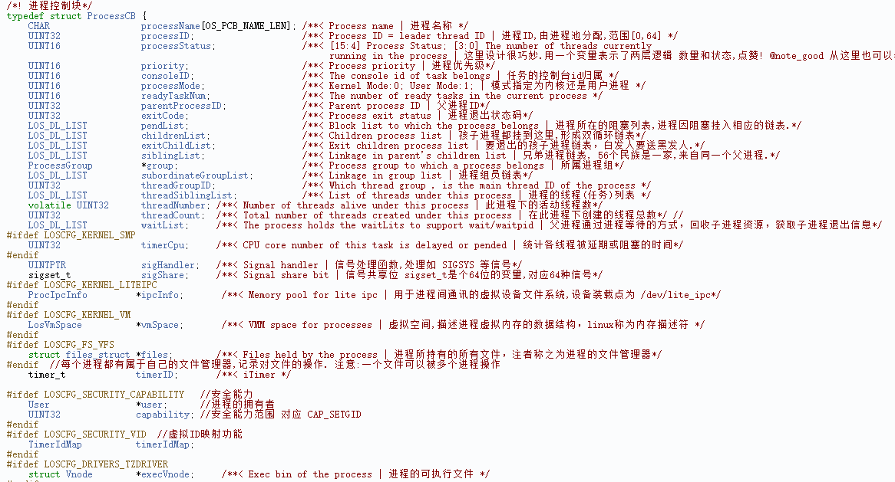
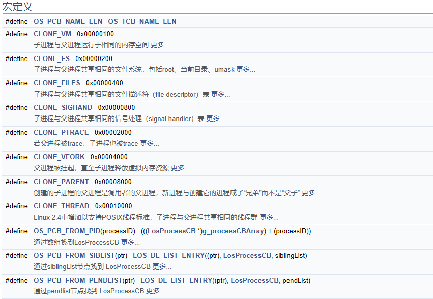
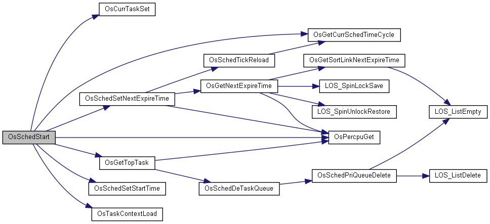
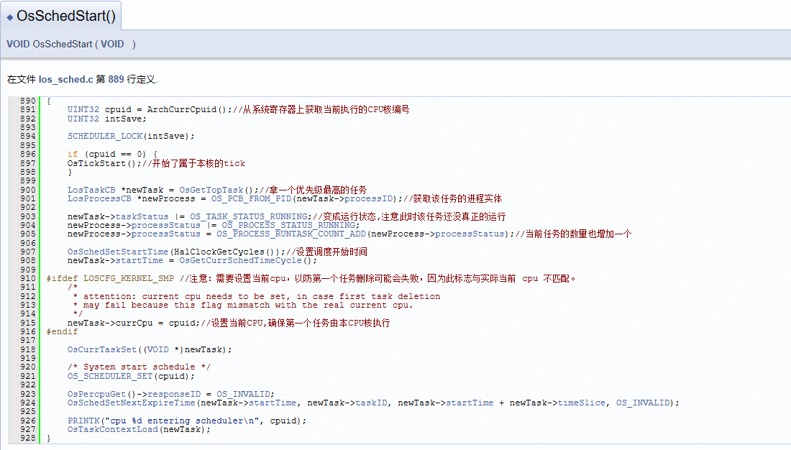
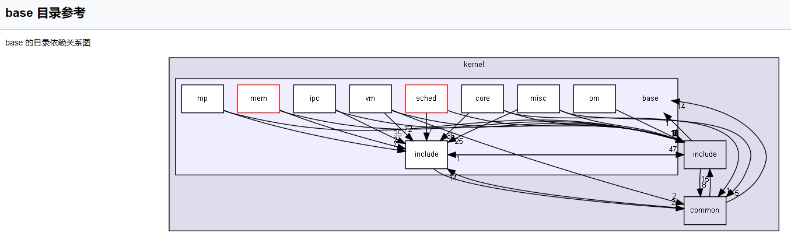
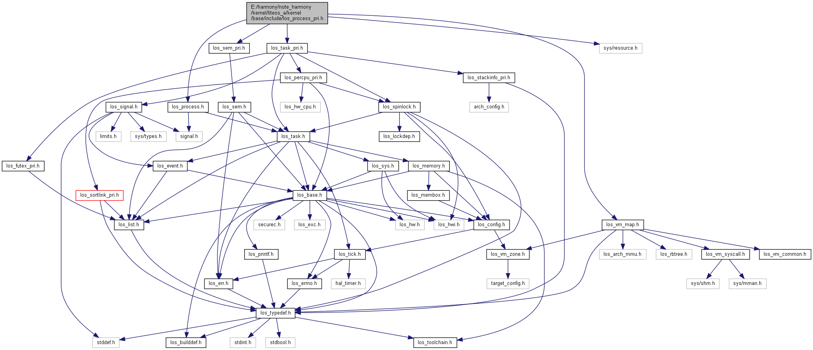

前因后果相关篇为:

* [v101.03 鸿蒙内核源码分析(总目录) | 精雕细琢 锤炼精品](/blog/101.md)
* [v102.05 鸿蒙内核源码分析(源码注释) | 每天死磕一点点](/blog/102.md)
* [v103.05 鸿蒙内核源码分析(静态站点) | 码农都不爱写注释和文档](/blog/103.md)
* [v104.01 鸿蒙内核源码分析(参考手册) | 阅读内核源码必备工具](/blog/104.md)


### 工欲善其事 必先利其器

本篇尝试去摸索下鸿蒙内核毛细血管级的脉络,跟踪以下几个问题.

* 鸿蒙有多少个结构体,结构体中每个成员变量的含义是什么？
* 鸿蒙main长啥样,其是如何初始化各个模块的？
* 鸿蒙的任意一个函数的调用和引用关系关系是怎样的？
  

它已成为众多鸿蒙内核阅读者必不可少的参考手册.  

### 鸿蒙 main 函数长啥样

前往 >> [鸿蒙研究站 | 参考手册版块](https://weharmony.gitee.io/doxygen/index.html) 点击函数跟踪.



```c
/**
 * @brief 
 * 内核入口函数,由汇编调用,见于reset_vector_up.S 和 reset_vector_mp.S 
 * up指单核CPU, mp指多核CPU bl        main
 * @return LITE_OS_SEC_TEXT_INIT 
 */
LITE_OS_SEC_TEXT_INIT INT32 main(VOID)//由主CPU执行,默认0号CPU 为主CPU 
{
    UINT32 uwRet;

    uwRet = OsMain();// 内核各模块初始化
    if (uwRet != LOS_OK) {
        return LOS_NOK;
    }

    CPU_MAP_SET(0, OsHwIDGet());//设置CPU映射,参数0 代表0号CPU

    OsSchedStart();//调度开始

    while (1) {
        __asm volatile("wfi");//WFI: wait for Interrupt 等待中断,即下一次中断发生前都在此hold住不干活
    }
}
```

### 结构体/宏/枚举类型

前往 >> [鸿蒙研究站 | 查看所有结构体索引](https://weharmony.gitee.io/doxygen/classes.html)





### < 任意函数关系图 | 代码实现 | 注解说明 >  三位一体




### 模块之间关系图



### 任意头文件的关系图




  

