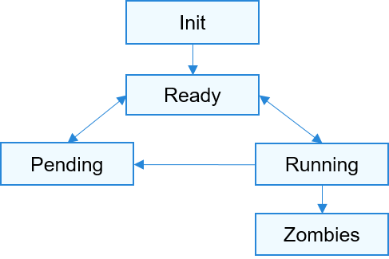

进程管理相关篇为: 

* [v11.04 鸿蒙内核源码分析(调度故事) | 大郎,该喝药了](/blog/11.md)
* [v12.03 鸿蒙内核源码分析(进程控制块) | 可怜天下父母心](/blog/12.md)
* [v13.01 鸿蒙内核源码分析(进程空间) | 有爱的地方才叫家 ](/blog/13.md)
* [v14.01 鸿蒙内核源码分析(线性区) | 人要有空间才能好好相处](/blog/14.md)
* [v15.01 鸿蒙内核源码分析(红黑树) | 众里寻他千百度 ](/blog/15.md)
* [v16.06 鸿蒙内核源码分析(进程管理) | 家家有本难念的经](/blog/16.md)
* [v17.05 鸿蒙内核源码分析(Fork进程) | 一次调用 两次返回](/blog/17.md)
* [v18.02 鸿蒙内核源码分析(进程回收) | 临终托孤的短命娃](/blog/18.md)
* [v19.03 鸿蒙内核源码分析(Shell编辑) | 两个任务 三个阶段](/blog/19.md)
* [v20.01 鸿蒙内核源码分析(Shell解析) | 应用窥伺内核的窗口](/blog/20.md)


### 本篇说清楚进程

读本篇之前建议先读 v08.xx 鸿蒙内核源码分析(总目录) 调度故事篇,其中有对进程生活场景式的比喻.

### **官方基本概念**

* 从系统的角度看,进程是资源管理单元.进程可以使用或等待CPU,使用内存空间等系统资源,并独立于其它进程运行.

* 鸿蒙内核的进程模块可以给用户提供多个进程,实现了进程之间的切换和通信,帮助用户管理业务程序流程.这样用户可以将更多的精力投入到业务功能的实现中.

* 鸿蒙内核中的进程采用抢占式调度机制,支持时间片轮转调度方式和FIFO调度机制.

* 鸿蒙内核的进程一共有32个优先级(0-31),用户进程可配置的优先级有22个(10-31),最高优先级为10,最低优先级为31.

* 高优先级的进程可抢占低优先级进程,低优先级进程必须在高优先级进程阻塞或结束后才能得到调度.

* 每一个用户态进程均拥有自己独立的进程空间,相互之间不可见,实现进程间隔离.

### **官方概念解读**

官方文档最重要的一句话是进程是资源管理单元,注意是管理资源的, 资源是什么？ 内存,任务,文件,信号量等等都是资源.故事篇中对进程做了一个形象的比喻(导演),负责节目(任务)的演出,负责协调节目运行时所需的各种资源.让节目能高效顺利的完成.

鸿蒙内核源码分析定位为深挖内核地基,构筑底层网图.就要解剖真身.进程(`LosProcessCB`)原始真身如下,本篇一一剖析它,看看它到底长啥样.

### **ProcessCB真身**

```c
typedef struct ProcessCB {
    //进程名称
    CHAR                 processName[OS_PCB_NAME_LEN]; /**< Process name */ 
    //进程ID,由进程池分配,范围[0,64]
    UINT32               processID;                    /**< process ID = leader thread ID */
    //这里设计很巧妙.用一个16表示了两层逻辑 数量和状态,点赞!
    UINT16               processStatus;              /**< [15:4] process Status; [3:0] The number of threads       currently running in the process */
    //进程优先级
    UINT16               priority;                     /**< process priority */ 
    //进程的调度方式,默认抢占式
    UINT16               policy;                       /**< process policy */
    //进程时间片,默认2个tick
    UINT16               timeSlice;                    /**< Remaining time slice */
    //任务的控制台id归属
    UINT16               consoleID;                    /**< The console id of task belongs */
    //模式指定为内核还是用户进程
    UINT16               processMode;                  /**< Kernel Mode:0; User Mode:1; */
    //父进程ID
    UINT32               parentProcessID;              /**< Parent process ID */
    //进程退出状态码
    UINT32               exitCode;                     /**< process exit status */
     //进程所属的阻塞列表,如果因拿锁失败,就由此节点挂到等锁链表上
    LOS_DL_LIST          pendList;                     /**< Block list to which the process belongs */
    //孩子进程都挂到这里,形成双循环链表
    LOS_DL_LIST          childrenList;                 /**< my children process list */
    //那些要退出孩子进程挂到这里,白发人送黑发人.
    LOS_DL_LIST          exitChildList;                /**< my exit children process list */
    //兄弟进程链表, 56个民族是一家,来自同一个父进程.
    LOS_DL_LIST          siblingList;                  /**< linkage in my parent's children list */
    //所属进程组
    ProcessGroup         *group;                       /**< Process group to which a process belongs */
    //进程是组长时,有哪些组员进程
    LOS_DL_LIST          subordinateGroupList;         /**< linkage in my group list */
    //哪个线程组是进程的主线程ID
    UINT32               threadGroupID;              /**< Which thread group , is the main thread ID of the process */
    //进程的各线程调度位图
    UINT32               threadScheduleMap;            /**< The scheduling bitmap table for the thread group of the
                                                            process */
    //进程的线程(任务)列表
    LOS_DL_LIST          threadSiblingList;            /**< List of threads under this process */
    //进程的线程组调度优先级哈希表
    LOS_DL_LIST          threadPriQueueList[OS_PRIORITY_QUEUE_NUM]; /**< The process's thread group schedules the
                                                                         priority hash table */
    //此进程下的活动线程数
    volatile UINT32      threadNumber; /**< Number of threads alive under this process */
    //在此进程下创建的线程总数
    UINT32               threadCount;  /**< Total number of threads created under this process */
    //进程持有等待链表以支持wait/waitpid
    LOS_DL_LIST          waitList;     /**< The process holds the waitLits to support wait/waitpid */
#if (LOSCFG_KERNEL_SMP == YES)
    //统计各线程被延期或阻塞的时间
    UINT32               timerCpu;     /**< CPU core number of this task is delayed or pended */
#endif
    //信号处理函数,处理如 SIGSYS 等信号 
    UINTPTR              sigHandler;   /**< signal handler */
    //信号共享位
    sigset_t             sigShare;     /**< signal share bit */ 
#if (LOSCFG_KERNEL_LITEIPC == YES)
    //用于进程间通讯的虚拟设备文件系统,设备装载点为 /dev/lite_ipc
    ProcIpcInfo         ipcInfo;       /**< memory pool for lite ipc */ 
#endif
    //虚拟空间,描述进程虚拟内存的数据结构,linux称为内存描述符
    LosVmSpace          *vmSpace;       /**< VMM space for processes */ 
#ifdef LOSCFG_FS_VFS
    //进程所持有的所有文件,注者称之为进程的文件管理器
    struct files_struct *files;        /**< Files held by the process */ 
#endif //每个进程都有属于自己的文件管理器,记录对文件的操作. 注意:一个文件可以被多个进程操作
    timer_t             timerID;       /**< iTimer */

#ifdef LOSCFG_SECURITY_CAPABILITY //安全能力
    User                *user;  //进程的拥有者
    UINT32              capability; //安全能力范围 对应 CAP_SETGID
#endif
#ifdef LOSCFG_SECURITY_VID
    TimerIdMap          timerIdMap;
#endif
#ifdef LOSCFG_DRIVERS_TZDRIVER
    struct file         *execFile;     /**< Exec bin of the process */
#endif
    mode_t umask;
} LosProcessCB;
```

结构体还是比较复杂,虽一一都做了注解,但还是不够清晰,没有模块化.这里把它分解成以下**六大块**逐一分析:

### 第一大块:和任务(线程)关系

```c
    //哪个线程组是进程的主线程ID    
    UINT32               threadGroupID;              /**< Which thread group , is the main thread ID of the process */
    //进程的各线程调度位图
    UINT32               threadScheduleMap;            /**< The scheduling bitmap table for the thread group of the
                                                            process */
    //进程的线程(任务)列表
    LOS_DL_LIST          threadSiblingList;            /**< List of threads under this process */
    //进程的线程组调度优先级哈希表
    LOS_DL_LIST          threadPriQueueList[OS_PRIORITY_QUEUE_NUM]; /**< The process's thread group schedules the
                                                                         priority hash table */
    //此进程下的活动线程数
    volatile UINT32      threadNumber; /**< Number of threads alive under this process */
    //在此进程下创建的线程总数
    UINT32               threadCount;  /**< Total number of threads created under this process */
    //进程持有等待链表以支持wait/waitpid
    LOS_DL_LIST          waitList;     /**< The process holds the waitLits to support wait/waitpid */
```

进程和线程的关系是`1:N`的关系,进程可以有多个任务但一个任务不能同属于多个进程. 任务就是线程,是CPU的调度单元.线程的概念在 v08.xx 鸿蒙内核源码分析(总目录)  中的线程篇中有详细的介绍,可自行翻看. 任务是作为一种资源被进程管理的,进程为任务提供内存支持,提供文件支持,提供设备支持.

进程怎么管理线程的,进程怎么同步线程的状态？

* 1.进程加载时会找到main函数创建第一个线程,一般为主线程,main函数就是入口函数,一切从哪里开始.

* 2.执行过程中根据代码(以java举例 如遇到 `new thread` )创建新的线程,其本质和main函数创建的线程没有区别,只是入口函数变成了`run()`,统一参与调度.

* 3.线程和线程的关系可以是独立(detached)的,也可以是联结(join)的.联结指的是一个线程可以操作另一个线程(包括回收资源,被对方干掉).

* 4.进程的主线程或所有线程运行结束后,进程转为僵尸态,一般只能由所有线程结束后,进程才能自然消亡.

* 5.进程创建后进入就绪态,发生进程切换时,就绪列表中最高优先级的进程被执行,从而进入运行态.若此时该进程中已无其它线程处于就绪态,则该进程从就绪列表删除,只处于运行态;若此时该进程中还有其它线程处于就绪态,则该进程依旧在就绪队列,此时进程的就绪态和运行态共存.这里要注意的是进程可以允许多种状态并存! 状态并存很自然的会想到位图管理,系列篇中有对位图详细的介绍.

* 6.进程内所有的线程均处于阻塞态时,进程在最后一个线程转为阻塞态时,同步进入阻塞态,然后发生进程切换.

* 7.阻塞进程内的任意线程恢复就绪态时,进程被加入到就绪队列,同步转为就绪态,若此时发生进程切换,则进程状态由就绪态转为运行态

* 8.进程内的最后一个就绪态线程处于阻塞态时,进程从就绪列表中删除,进程由就绪态转为阻塞态.

* 9.进程由运行态转为就绪态的情况有以下两种:

  * 有更高优先级的进程创建或者恢复后,会发生进程调度,此刻就绪列表中最高优先级进程变为运行态,那么原先运行的进程由运行态变为就绪态.

  * 若进程的调度策略为 `SCHED_RR`(抢占式),且存在同一优先级的另一个进程处于就绪态,则该进程的时间片消耗光之后,该进程由运行态转为就绪态,另一个同优先级的进程由就绪态转为运行态.

### 第二大块:和其他进程的关系

```c
     //进程名称
    CHAR                 processName[OS_PCB_NAME_LEN]; /**< Process name */
    //进程ID,由进程池分配,范围[0,64]
    UINT32               processID;                    /**< process ID = leader thread ID */
    //这里设计很巧妙.用一个16表示了两层逻辑 数量和状态,点赞!
    UINT16               processStatus;                /**< [15:4] process Status; [3:0] The number of threads currently
                                                            running in the process */
    //进程优先级
    UINT16               priority;                     /**< process priority */ 
    //进程的调度方式,默认抢占式
    UINT16               policy;                       /**< process policy */ 
    //进程时间片,默认2个tick
    UINT16               timeSlice;                    /**< Remaining time slice */
    //任务的控制台id归属
    UINT16               consoleID;                    /**< The console id of task belongs  */
    //模式指定为内核还是用户进程
    UINT16               processMode;                  /**< Kernel Mode:0; User Mode:1; */ 
    //父进程ID
    UINT32               parentProcessID;              /**< Parent process ID */ 
    //进程退出状态码
    UINT32               exitCode;                     /**< process exit status */ 
    //进程所属的阻塞列表,如果因拿锁失败,就由此节点挂到等锁链表上
    LOS_DL_LIST          pendList;                     /**< Block list to which the process belongs */ 
    //孩子进程都挂到这里,形成双循环链表
    LOS_DL_LIST          childrenList;                 /**< my children process list */ 
    //那些要退出孩子进程挂到这里,白发人送黑发人.
    LOS_DL_LIST          exitChildList;                /**< my exit children process list */ 
    //兄弟进程链表, 56个民族是一家,来自同一个父进程.
    LOS_DL_LIST          siblingList;                  /**< linkage in my parent's children list */ 
    #if (LOSCFG_KERNEL_LITEIPC == YES)
    //用于进程间通讯的虚拟设备文件系统,设备装载点为 /dev/lite_ipc
    ProcIpcInfo         ipcInfo;       /**< memory pool for lite ipc */ 
    #endif
```

进程是家族式管理的,内核态进程和用户态进程分别有自己的根祖先,祖先进程在内核初始化时就创建好了,分别是1号(用户进程祖先)和2号(内核进程祖先)进程.进程刚生下来就确定了自己的基因,基因决定了你的权限不同, 父亲是谁,兄弟姐妹都有谁都已经安排好了,跟人一样,没法选择出生. 但进程可以有自己的子子孙孙, 从你这一脉繁衍下来的,这很像人类的传承方式.最终会形成树状结构,每个进程都能找到自己的位置.进程的管理遵循以下几点原则:

* 1.进程退出时会主动释放持有的进程资源,但持有的进程pid资源需要父进程通过wait/waitpid或父进程退出时回收.

* 2.一个子进程的消亡要通知父进程,以便父进程在族谱上抹掉它的痕迹,一些异常情况下的坏孩子进程消亡没有告知父进程的,系统也会有定时任务能检测到而回收其资源.

* 3.进程创建后,只能操作自己进程空间的资源,无法操作其它进程的资源(共享资源除外).

* 4.进程间有多种通讯方式,事件,信号,消息队列,管道等等, liteipc是进程间基于文件的一种通讯方式,它的特点是传递的信息量可以很大.

* 5.高优先级的进程可抢占低优先级进程,低优先级进程必须在高优先级进程阻塞或结束后才能得到调度.

### 第三大块:进程的五种状态

* 初始化(Init):该进程正在被创建.

* 就绪(Ready):该进程在就绪列表中,等待CPU调度.

* 运行(Running):该进程正在运行.

* 阻塞(Pend):该进程被阻塞挂起.本进程内所有的线程均被阻塞时,进程被阻塞挂起.

* 僵尸态(Zombies):该进程运行结束,等待父进程回收其控制块资源.


### 第四大块:和内存的关系

```c
    //虚拟空间,描述进程虚拟内存的数据结构,linux称为内存描述符
    LosVmSpace          *vmSpace;       /**< VMM space for processes */ 
```

* 进程与内存有关的就只有LosVmSpace一个成员变量,叫是进程空间,每一个用户态进程均拥有自己独立的进程空间,相互之间不可见,实现进程间隔离,独立进程空间意味着每个进程都要将自己的虚拟内存和物理内存进行映射.并将映射区保存在自己的进程空间.另外进程的代码区,数据区,堆栈区,映射区都存放在自己的空间中,但内核态进程的空间是共用的,只需一次映射.
* 具体的进入v08.xx 鸿蒙内核源码分析(总目录) 查看内存篇.详细介绍了虚拟内存,物理内存,线性地址,映射关系,共享内存,分配回收,页面置换的概念和实现.

### 第五大块:和文件的关系

```c
#ifdef LOSCFG_FS_VFS
    //进程所持有的所有文件,注者称之为进程的文件管理器
    struct files_struct *files;        /**< Files held by the process */ 
#endif //每个进程都有属于自己的文件管理器,记录对文件的操作. 注意:一个文件可以被多个进程操作
```

进程与文件系统有关的就只有files_struct,可理解为进程的文件管理器,文件也是很复杂的一大块, 后续有系列篇来讲解文件系统的实现. 理解文件系统的主脉络是:

* 1.一个真实的物理文件(`inode`),可以同时被多个进程打开,并有进程独立的文件描述符, 进程文件描述符(`ProcessFD`)后边映射的是系统文件描述符(`SystemFD`).

* 2.系统文件描述符(`0-stdin,1-stdout,2-stderr`)默认被内核占用,任何进程的文件描述符前三个都是(`stdin,stdout,stderr`),默认已经打开,可以直接往里面读写数据.

* 3.文件映射跟内存映射一样,每个进程都需要单独对同一个文件进行映射,page_mapping记录了映射关系,而页高速缓存(`page cache`)提供了文件实际内存存放位置.

* 4.内存<->文件的置换以页为单位(4K),进程并不能对硬盘文件直接操作,必须通过页高速缓存(`page cache`)完成.其中会涉及到一些经典的概念比如`COW`(写时拷贝)技术.后续会详细说明.

### 第六大块:辅助工具

```c
#if (LOSCFG_KERNEL_SMP == YES)
    //统计各线程被延期或阻塞的时间
    UINT32               timerCpu;     /**< CPU core number of this task is delayed or pended */
#endif
#ifdef LOSCFG_SECURITY_CAPABILITY //安全能力
    User                *user;  //进程的拥有者
    UINT32              capability; //安全能力范围 对应 CAP_SETGID
#endif
#ifdef LOSCFG_SECURITY_VID
    TimerIdMap          timerIdMap;
#endif
#ifdef LOSCFG_DRIVERS_TZDRIVER
    struct file         *execFile;     /**< Exec bin of the process */
#endif
```

其余是一些安全性,统计性的能力.

以上就是进程的全貌,看清楚它鸿蒙内核的影像会清晰很多!
