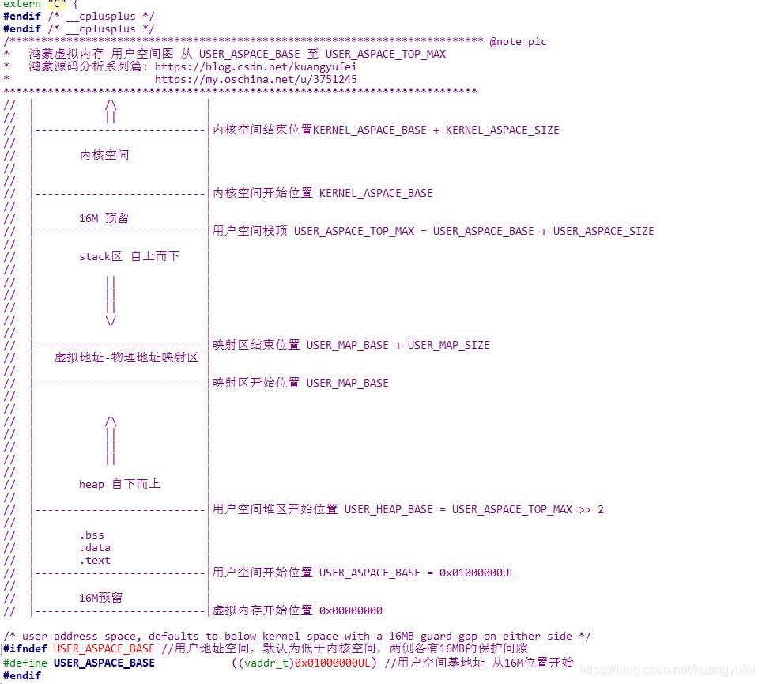

进程管理相关篇为: 

* [v11.04 鸿蒙内核源码分析(调度故事) | 大郎，该喝药了](/blog/11.md)
* [v12.03 鸿蒙内核源码分析(进程控制块) | 可怜天下父母心](/blog/12.md)
* [v13.01 鸿蒙内核源码分析(进程空间) | 有爱的地方才叫家 ](/blog/13.md)
* [v14.01 鸿蒙内核源码分析(线性区) | 人要有空间才能好好相处](/blog/14.md)
* [v15.01 鸿蒙内核源码分析(红黑树) | 众里寻他千百度 ](/blog/15.md)
* [v16.06 鸿蒙内核源码分析(进程管理) | 家家有本难念的经](/blog/16.md)
* [v17.05 鸿蒙内核源码分析(Fork进程) | 一次调用 两次返回](/blog/17.md)
* [v18.02 鸿蒙内核源码分析(进程回收) | 临终托孤的短命娃](/blog/18.md)
* [v19.03 鸿蒙内核源码分析(Shell编辑) | 两个任务 三个阶段](/blog/19.md)
* [v20.01 鸿蒙内核源码分析(Shell解析) | 应用窥伺内核的窗口](/blog/20.md)


### 映射区

**映射区**，也称为**线性区**，是进程管理空间的单元，是大家耳熟能详的 **堆区**，**栈区**，**数据区 ...** 的统称。它当然是很重要的，拿**堆区**举例，应用层被大家所熟知的`new`操作是由**堆区**分配的，但具体是怎么分配的很少有人关心，其过程大致分几个步骤：

* 1．在进程虚拟空间上的**堆区中画出**一个映射区，贴上一个堆区标签，它是一段连续的，长度为 `malloc`的参数大小的虚拟地址范围，也称其为**线性地址**，交给应用说你已经拥有它了。`malloc`多少次就开多少个这样的映射区。但此时只是记了个账而已，跟咱们商业银行卡里的余额一样，发工资了收到短信通知显示了一个让你面带微笑的数字，没让您看到真正的银子，那咱银子在哪呢 ? 您先甭管，反正现在不用，用的时候自然会给您，而进程虚拟空间相当于商业银行。
* 2．将映射区的虚拟地址和物理地址做映射，并将映射关系保存在进程空间中的**映射区**内。注意这个映射区它也是一个映射区，它是最早被映射的一个区，系列篇之 **页表管理** 中详细说明了它的实现。其具体的位置在**栈区**和**堆区**的中间，**栈区**是由高地址向下生长，**堆区**是由低地址向上生长，都向中央映射区靠拢。
* 3．将映射区的红黑树节点交给红黑树管理，方便后续的查询和销账。这个阶段相当于将余额数字和咱的银子捆绑在一块入库，中央银行得承认这银子属于咱的不是。
* 4．只有应用在真正访问虚拟地址时，会根据进程映射表查询到物理内存是否已经被这段虚拟地址所使用，如果没有，则产生 **缺页中断**。相当于取钱时银行才给您准备好钱，没钱就去中央银行调取，只有中央银行才能发行毛爷爷，银子相当于物理地址，都想要，谁愿意跟它过不去呢 ? 余额显示的数字就相当于虚拟地址，看着也能乐半天，有中央银行背书就行。关于这块系列篇 **缺页中断篇** 中有详细的说明。

回顾下 **进程虚拟空间图**


### 结构体

映射区在鸿蒙内核的表达结构体为 `VmMapRegion`

```c
struct VmMapRegion {
    LosRbNode           rbNode;         /**< region red-black tree node | 红黑树节点,通过它将本映射区挂在VmSpace.regionRbTree*/
    LosVmSpace          *space;   ///< 所属虚拟空间,虚拟空间由多个映射区组成
    LOS_DL_LIST         node;           /**< region dl list | 链表节点,通过它将本映射区挂在VmSpace.regions上*/    
    LosVmMapRange       range;          /**< region address range | 记录映射区的范围*/
    VM_OFFSET_T         pgOff;          /**< region page offset to file | 以文件开始处的偏移量, 必须是分页大小的整数倍, 通常为0, 表示从文件头开始映射。*/
    UINT32              regionFlags;    /**< region flags: cow, user_wired | 映射区标签*/
    UINT32              shmid;          /**< shmid about shared region | shmid为共享映射区id,id背后就是共享映射区*/
    UINT8               forkFlags;      /**< vm space fork flags: COPY, ZERO, | 映射区标记方式*/
    UINT8               regionType;     /**< vm region type: ANON, FILE, DEV | 映射类型是匿名,文件,还是设备,所谓匿名可理解为内存映射*/
 	union {
        struct VmRegionFile {// <磁盘文件 , 物理内存, 用户进程虚拟地址空间 > 
            int f_oflags; ///< 读写标签
            struct Vnode *vnode;///< 文件索引节点
            const LosVmFileOps *vmFOps;///< 文件处理各操作接口,open,read,write,close,mmap
        } rf;
  //匿名映射是指那些没有关联到文件页，如进程堆、栈、数据区和任务已修改的共享库等与物理内存的映射
        struct VmRegionAnon {//<swap区 , 物理内存, 用户进程虚拟地址空间 > 
            LOS_DL_LIST  node;          /**< region LosVmPage list | 映射区虚拟页链表*/
        } ra;
        struct VmRegionDev {//设备映射,也是一种文件
            LOS_DL_LIST  node;          /**< region LosVmPage list | 映射区虚拟页链表*/
            const LosVmFileOps *vmFOps; ///< 操作设备像操作文件一样方便.
        } rd;
    } unTypeData;
};
```

**解读**

* `rbNode` 红黑树结点，映射区通过它挂到所属进程的红黑树上，每个进程都有一颗红黑树，用于管理本进程空间的映射区，它是第一个成员变量，所以在代码中可以按以下方式使用。

  ```c
  ULONG_T LOS_RbAddNode(LosRbTree *pstTree, LosRbNode *pstNew);  
  BOOL OsInsertRegion(LosRbTree *regionRbTree, LosVmMapRegion *region)
  {
      LOS_RbAddNode(regionRbTree, (LosRbNode *)region)
          // ...
  }
  ```

* `space` 所属进程空间，一个映射区只属于一个进程空间，共享映射区指的是该映射区与其他进程的某个映射区都映射至同一块已知物理内存(指：地址和大小明确)。
* `node` 从代码历史来看，鸿蒙最早管理映射区使用的是双向链表，后来才使用红黑树，但看代码中没有使用`node`的地方，可以把它删除掉了。
* `range` 记录映射区的范围，结构体很简单，只能是一段连续的虚拟地址。

  ```c
  typedef struct VmMapRange {//映射区范围结构体
    VADDR_T             base;           /**< vm region base addr | 映射区基地址*/
    UINT32              size;           /**< vm region size | 映射区大小*/
  } LosVmMapRange;
  ```

* `pgOff` 页偏移 ，与文件映射有关 ，文件是按页(4K)读取进存储空间的，此处记录文件的页偏移
* `regionFlags` 区标识 ，包括 堆区，栈区，数据区，共享区，映射区等等，整个进程虚拟地址空间由它们组成，统称为映射区。

  ```c
  //...
  #define     VM_MAP_REGION_FLAG_STACK                (1<<9)  ///< 映射区的类型:栈区
  #define     VM_MAP_REGION_FLAG_HEAP                 (1<<10)  ///< 映射区的类型:堆区
  #define     VM_MAP_REGION_FLAG_DATA                 (1<<11)  ///< data数据区 编译在ELF中
  #define     VM_MAP_REGION_FLAG_TEXT                 (1<<12)  ///< 代码区
  #define     VM_MAP_REGION_FLAG_BSS                  (1<<13)  ///< bbs数据区 由运行时动态分配,bss段（Block Started by Symbol segment）通常是指用来存放程序中未初始化的全局变量的一块内存区域。
  #define     VM_MAP_REGION_FLAG_VDSO                 (1<<14)  ///< VDSO（Virtual Dynamic Shared Object，虚拟动态共享库）由内核提供的虚拟.so文件，它不在磁盘上，而在内核里，内核将其映射到一个地址空间中，被所有程序共享，正文段大小为一个页面。
  #define     VM_MAP_REGION_FLAG_MMAP                 (1<<15)  ///< 映射区,虚拟空间内有专门用来存储<虚拟地址-物理地址>映射的区域
  #define     VM_MAP_REGION_FLAG_SHM                  (1<<16)  ///< 共享内存区, 被多个进程映射区映射
  ```

* `shmid` 共享ID， `regionFlags` 为 `VM_MAP_REGION_FLAG_SHM`时有效，详细内容前往系列篇之**共享内存**了解
* `forkFlags` 表示映射区的两种创建方式 **分配** 和 **共享**
* `regionType` 映射区的映射类型，类型划定的标准是文件， 类型不同决定了`unTypeData`不同，它是个联合体，说明映射区只能映射一种类型， 映射区的目的是要处理/计算数据，数据可能来源于普通文件，I/O设备，或者是物理内存 映射有三种类型
  * 匿名映射，那些没有关联到文件页，如进程堆、栈、数据区和任务已修改的共享库，可以理解为与物理内存的直接映射

```c
struct VmRegionAnon {
    LOS_DL_LIST  node;          /**< region LosVmPage list | 映射区虚拟页链表*/
} ra;
```

  * 文件映射，跟文件绑定在一块，对外以文件的方式操作映射区，其实背后也需要与物理内存的映射做承载，具体看系列篇之**文件映射**

```c
struct VmRegionFile {// <磁盘文件 , 物理内存, 用户进程虚拟地址空间 > 
    int f_oflags; ///< 读写标签
    struct Vnode *vnode;///< 文件索引节点
    const LosVmFileOps *vmFOps;///< 文件处理各操作接口,open,read,write,close,mmap
} rf;
```

  * 设备映射，设备也是一种文件类型 ，对外同样的是以文件的方式操作映射区，但实现与文件映射完全不同不需要与物理内存映射，而是操作设备的驱动程序，具体看系列篇之**I/O映射**

```c
struct VmRegionDev {//设备映射,也是一种文件
    LOS_DL_LIST  node;          /**< region LosVmPage list | 映射区虚拟页链表*/
    const LosVmFileOps *vmFOps; ///< 操作设备像操作文件一样方便.
} rd;
```

### 创建映射区


**解读**
哪些地方会创建映射区呢? 看上面完整的调用图，大概有五个入口：

* 系统调用 **SysBrk --> LOS_DoBrk** ，这个函数看网上很多文章说它，总觉得没有说透，它的作用是创建和修改**堆区**，在堆区初始状态下(堆底地址等于堆顶地址时)，会创建一个映射区作为堆区，从**进程虚拟空间图**中可知，**堆区**是挨着**数据区**的，开始位置是固定的，对于每个进程来说，内核维护着一个`brk`(break)变量，在鸿蒙内核就是`heapNow`，它指向堆区顶部。堆顶可由系统调用**SysBrk** 动态调整，具体看下虚拟空间对堆的描述。

```c
typedef struct VmSpace {
    //...堆区描述
    VADDR_T             heapBase;       /**< vm space heap base address | 堆区基地址，表堆区范围起点*/
    VADDR_T             heapNow;        /**< vm space heap base now | 堆顶地址，表示堆区范围终点，do_brk()直接修改堆的大小返回新的堆区结束地址， heapNow >= heapBase*/
    LosVmMapRegion      *heap;          /**< heap region | 堆区是个特殊的映射区，用于满足进程的动态内存需求，大家熟知的malloc,realloc,free其实就是在操作这个区*/       
}

#define USER_HEAP_BASE              ((vaddr_t)(USER_ASPACE_TOP_MAX >> 2))   ///< 堆的开始地址
vmSpace->heapBase = USER_HEAP_BASE;//用户堆区开始地址,只有用户进程需要设置这里，动态内存的开始地址
vmSpace->heapNow = USER_HEAP_BASE;//堆区最新指向地址，用户堆空间大小可通过系统调用 do_brk()扩展
```

  为了更好的理解**SysBrk**的实现，此处将代码全部贴出，关键处已添加注释。

```c
VOID *LOS_DoBrk(VOID *addr)
{
    LosVmSpace *space = OsCurrProcessGet()->vmSpace;
    size_t size;
    VOID *ret = NULL;
    LosVmMapRegion *region = NULL;
    VOID *alignAddr = NULL;
    VOID *shrinkAddr = NULL;
    if (addr == NULL) {//参数地址未传情况
        return (void *)(UINTPTR)space->heapNow;//以现有指向地址为基础进行扩展
    }

    if ((UINTPTR)addr < (UINTPTR)space->heapBase) {//heapBase是堆区的开始地址，所以参数地址不能低于它
        return (VOID *)-ENOMEM;
    }
    size = (UINTPTR)addr - (UINTPTR)space->heapBase;//算出大小
    size = ROUNDUP(size, PAGE_SIZE); //圆整size
    alignAddr = (CHAR *)(UINTPTR)(space->heapBase) + size;//得到新的映射区的结束地址
    PRINT_INFO("brk addr %p , size 0x%x, alignAddr %p, align %d\n", addr, size, alignAddr, PAGE_SIZE);
    (VOID)LOS_MuxAcquire(&space->regionMux);
    if (addr < (VOID *)(UINTPTR)space->heapNow) {//如果地址小于堆区现地址
        shrinkAddr = OsShrinkHeap(addr, space);//收缩堆区
        (VOID)LOS_MuxRelease(&space->regionMux);
        return shrinkAddr;
    }
    if ((UINTPTR)alignAddr >= space->mapBase) {//参数地址 大于映射区地址
        VM_ERR("Process heap memory space is insufficient");//进程堆空间不足
        ret = (VOID *)-ENOMEM;
        goto REGION_ALLOC_FAILED;
    }
    if (space->heapBase == space->heapNow) {//往往是第一次调用本函数才会出现，因为初始化时 heapBase = heapNow
        region = LOS_RegionAlloc(space, space->heapBase, size,//分配一个可读/可写/可使用的映射区，只需分配一次
                                 VM_MAP_REGION_FLAG_PERM_READ | VM_MAP_REGION_FLAG_PERM_WRITE |//映射区的大小由range.size决定
                                 VM_MAP_REGION_FLAG_FIXED | VM_MAP_REGION_FLAG_PERM_USER, 0);
        if (region == NULL) {
            ret = (VOID *)-ENOMEM;
            VM_ERR("LOS_RegionAlloc failed");
            goto REGION_ALLOC_FAILED;
        }
        region->regionFlags |= VM_MAP_REGION_FLAG_HEAP;//贴上映射区类型为堆区的标签,注意一个映射区可以有多种标签
        space->heap = region;//指定映射区为堆区
    }
    space->heapNow = (VADDR_T)(UINTPTR)alignAddr;//更新堆区顶部位置
    space->heap->range.size = size; //更新堆区大小,经此操作映射区变大或缩小了
    ret = (VOID *)(UINTPTR)space->heapNow;//返回堆顶
    REGION_ALLOC_FAILED:
    (VOID)LOS_MuxRelease(&space->regionMux);
    return ret;
}
```

* 系统调用 **SysMmap --> LOS_MMap** ，动态内存一定是从堆区申请的吗 ? 如果`malloc`的请求超过`MMAP_THRESHOLD`(默认128KB)，**musl**库则会创建一个匿名映射而不是直接在堆区域分配);具体看下

```c
void *malloc(size_t n)
{
    if (n > MMAP_THRESHOLD) { //申请内存大于 128K时,创建一个映射区
        size_t len = n + OVERHEAD + PAGE_SIZE - 1 & -PAGE_SIZE;
        char *base = __mmap(0, len, PROT_READ|PROT_WRITE,
                            MAP_PRIVATE|MAP_ANONYMOUS, -1, 0);
        if (base == (void *)-1) return 0;
        c = (void *)(base + SIZE_ALIGN - OVERHEAD);
        c->csize = len - (SIZE_ALIGN - OVERHEAD);
        c->psize = SIZE_ALIGN - OVERHEAD;
        return CHUNK_TO_MEM(c);
    }
    // ...
}
```

  其中的**__mmap**是系统调用，最终会跑到 **LOS_MMap** ，划出一个新的映射区
* 系统调用共享内存 **SysShmAt** , 划出一个共享映射区，
* 栈区 **OsStackAlloc**
* 内核内部使用 **OsUserInitProcess**
