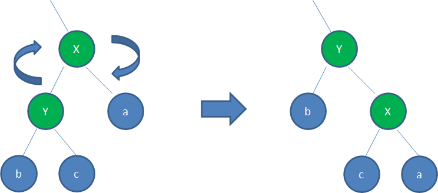

进程管理相关篇为: 

* [v11.04 鸿蒙内核源码分析(调度故事) | 大郎，该喝药了](/blog/11.md)
* [v12.03 鸿蒙内核源码分析(进程控制块) | 可怜天下父母心](/blog/12.md)
* [v13.01 鸿蒙内核源码分析(进程空间) | 有爱的地方才叫家 ](/blog/13.md)
* [v14.01 鸿蒙内核源码分析(线性区) | 人要有空间才能好好相处](/blog/14.md)
* [v15.01 鸿蒙内核源码分析(红黑树) | 众里寻他千百度 ](/blog/15.md)
* [v16.06 鸿蒙内核源码分析(进程管理) | 家家有本难念的经](/blog/16.md)
* [v17.05 鸿蒙内核源码分析(Fork进程) | 一次调用 两次返回](/blog/17.md)
* [v18.02 鸿蒙内核源码分析(进程回收) | 临终托孤的短命娃](/blog/18.md)
* [v19.03 鸿蒙内核源码分析(Shell编辑) | 两个任务 三个阶段](/blog/19.md)
* [v20.01 鸿蒙内核源码分析(Shell解析) | 应用窥伺内核的窗口](/blog/20.md)


### 二叉查找树 | BST

要理解红黑树，需要从二叉查找树(`Binary Search Tree`)开始说起。其特点是：

* 1．左子树上所有结点的值均小于或等于它的根结点的值。
* 2．右子树上所有结点的值均大于或等于它的根结点的值。
* 3．左、右子树也分别为二叉排序树。

例如:想要找到下图节点 **10** 就需要经过路径 **[ 9 | 13 | 11 ]**


在理想的情况下，二叉查找树增删查改的时间复杂度为O(logN)（其中N为节点数），最坏的情况下为O(N)。

但 **BST** 的特点是在操作过程中容易失去平衡，数在插入的时候会导致树倾斜，不同的插入顺序会导致树的高度不一样，而树的高度直接的影响了树的查找效率。理想的高度是`logN`，最坏的情况是所有的节点都在一条斜线上，这样的树的高度为`N`。例如:下图为初始的二叉查找树

接下来依次插入如下五个结点：**7,6,5,4,3**，结果将变成简直没法看的


### 红黑树

基于`BST`存在的问题，一种新的树——平衡二叉查找树即 **红黑树**（Red-Black Tree，以下简称RBTree），它在插入和删除的时候，会通过旋转操作将高度保持在`logN`。通俗的讲就是会自我纠正，跟人睡觉一样，将自己的身体调整到一个让最省力，最舒服的姿势。其实际应用非常广泛，比如Linux内核中的完全公平调度器、高精度计时器、ext3文件系统等等，鸿蒙内核中也使用了红黑树来管理进程线性区。上图经过红黑树调整之后的姿势为：


红黑树有以下几个特点：

* 1．任何一个节点都有颜色，黑色或者红色。
* 2．根节点是黑色的。
* 3．父子节点之间不能出现两个连续的红节点。
* 4．任何一个节点向下遍历到其子孙的叶子节点，所经过的黑节点个数必须相等。
* 5．空节点被认为是黑色的。
* 6．从根到叶子的最长的可能路径不多于最短的可能路径的两倍长。

红黑树具体的调整姿势的方法有两种：

* **变色** 根据红黑树的规则，尝试把红色结点变为黑色，或者把黑色结点变为红色。
* **旋转**，根据旋转方向又分成 **左旋转** 和 **右旋转**
  * 左旋转(逆时针旋转) 红黑树的两个结点，使得父结点被自己的右孩子取代，而自己成为自己的左孩子。
  
  * 右旋转(顺时针旋转) 红黑树的两个结点，使得父结点被自己的左孩子取代，而自己成为自己的右孩子。
  
* 有兴趣的可以前往 [红黑树演示网站](http://rbtree.phpisfuture.com/) 玩一下，很有意思

### 在鸿蒙使用

鸿蒙使用红黑树主要用来管理进程的 **线性区** ，关于线性区不清楚的请自行翻看系列篇，简单说就是一个虚拟地址连续的内存记录。我们动态申请堆内存其实就是申请了一个线性区，释放内存时就需要查找这个记录，这种使用频率很高，而红黑树的查找效率最高。鸿蒙红黑树功能的核心结构体是 **LosRbTree** ，每一个进程都有一颗属于自己的红黑树。

```
typedef struct VmMapRange {//线性区范围结构体
    VADDR_T             base;           /**< vm region base addr | 线性区基地址*/
    UINT32              size;           /**< vm region size | 线性区大小*/
} LosVmMapRange;

typedef struct TagRbNode {//节点
    struct TagRbNode *pstParent; ///< 爸爸是谁 ?
    struct TagRbNode *pstRight;  ///< 右孩子是谁 ?
    struct TagRbNode *pstLeft;  ///< 左孩子是谁 ?
    ULONG_T lColor; //是红还是黑节点
} LosRbNode;

typedef struct TagRbTree {//红黑树控制块
    LosRbNode *pstRoot;//根节点
    LosRbNode stNilT;//叶子节点
    LOS_DL_LIST stWalkHead;
    ULONG_T ulNodes;

    pfRBCmpKeyFn pfCmpKey; //比较两个节点大小 处理函数
    pfRBFreeFn pfFree; //释放结点占用内存函数
    pfRBGetKeyFn pfGetKey;//获取指定线性区范围 VmMapRange 函数
} LosRbTree;
```

**解读**

* 红黑树初始化，在进程空间初始化期间会初始化红黑树，并指定三个回调函数(方便红黑树节点的遍历)。

    ```
    //初始化进程的红黑树
    VOID LOS_RbInitTree(LosRbTree *pstTree, pfRBCmpKeyFn pfCmpKey, pfRBFreeFn pfFree, pfRBGetKeyFn pfGetKey)
    {
        OsRbInitTree(pstTree);
        pstTree->pfCmpKey = pfCmpKey;
        pstTree->pfFree = pfFree;
        pstTree->pfGetKey = pfGetKey;
        return;
    }
    //初始化进程虚拟空间
    STATIC BOOL OsVmSpaceInitCommon(LosVmSpace *vmSpace, VADDR_T *virtTtb){
        //...
        LOS_RbInitTree(&vmSpace->regionRbTree, OsRegionRbCmpKeyFn, OsRegionRbFreeFn, OsRegionRbGetKeyFn);
    }
    ///通过红黑树节点找到对应的线性区
    VOID *OsRegionRbGetKeyFn(LosRbNode *pstNode)
    {
        LosVmMapRegion *region = (LosVmMapRegion *)LOS_DL_LIST_ENTRY(pstNode, LosVmMapRegion, rbNode);
        return (VOID *)&region->range;
    }
    ///比较两个红黑树节点
    ULONG_T OsRegionRbCmpKeyFn(const VOID *pNodeKeyA, const VOID *pNodeKeyB)
    {
        LosVmMapRange rangeA = *(LosVmMapRange *)pNodeKeyA;
        LosVmMapRange rangeB = *(LosVmMapRange *)pNodeKeyB;
        UINT32 startA = rangeA.base;
        UINT32 endA = rangeA.base + rangeA.size - 1;
        UINT32 startB = rangeB.base;
        UINT32 endB = rangeB.base + rangeB.size - 1;

        if (startA > endB) {// A基地址大于B的结束地址
            return RB_BIGGER; //说明线性区A更大,在右边
        } else if (startA >= startB) {
            if (endA <= endB) {
                return RB_EQUAL; //相等,说明 A在B中
            } else {
                return RB_BIGGER; //说明 A的结束地址更大
            }
        } else if (startA <= startB) { //A基地址小于等于B的基地址
            if (endA >= endB) {
                return RB_EQUAL; //相等 说明 B在A中
            } else {
                return RB_SMALLER;//说明A的结束地址更小
            }
        } else if (endA < startB) {//A结束地址小于B的开始地址
            return RB_SMALLER;//说明A在
        }
        return RB_EQUAL;
    }
    ```

* 插入结点，注意线性区结构体(`VmMapRegion`)的首个成员便是红黑树节点，对于红黑树来说线性区只是一个红黑树节点。

  ```
  struct VmMapRegion {
    LosRbNode           rbNode;         /**< region red-black tree node | 红黑树节点,通过它将本线性区挂在VmSpace.regionRbTree*/
    // ...
  }
  //插入线性区,指的是向进程的红黑树 `LosRbTree` 插入 `LosRbNode`
  BOOL OsInsertRegion(LosRbTree *regionRbTree, LosVmMapRegion *region)
    {
        if (LOS_RbAddNode(regionRbTree, (LosRbNode *)region) == FALSE) {
            VM_ERR("insert region failed, base: %#x, size: %#x", region->range.base, region->range.size);
            OsDumpAspace(region->space);
            return FALSE;
        }
        return TRUE;
    }
  ```

  具体插入过程不去说明，已经是很成熟的算法，通过比较线性区的范围来决定是插入进具体位置，插入过程会涉及到红黑树 **颜色翻转** 和 **左右旋转** 两种变化


  


