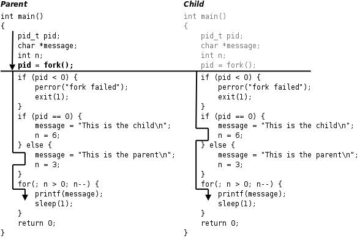

进程管理相关篇为: 

* [v11.04 鸿蒙内核源码分析(调度故事) | 大郎,该喝药了](/blog/11.md)
* [v12.03 鸿蒙内核源码分析(进程控制块) | 可怜天下父母心](/blog/12.md)
* [v13.01 鸿蒙内核源码分析(进程空间) | 有爱的地方才叫家 ](/blog/13.md)
* [v14.01 鸿蒙内核源码分析(线性区) | 人要有空间才能好好相处](/blog/14.md)
* [v15.01 鸿蒙内核源码分析(红黑树) | 众里寻他千百度 ](/blog/15.md)
* [v16.06 鸿蒙内核源码分析(进程管理) | 家家有本难念的经](/blog/16.md)
* [v17.05 鸿蒙内核源码分析(Fork进程) | 一次调用 两次返回](/blog/17.md)
* [v18.02 鸿蒙内核源码分析(进程回收) | 临终托孤的短命娃](/blog/18.md)
* [v19.03 鸿蒙内核源码分析(Shell编辑) | 两个任务 三个阶段](/blog/19.md)
* [v20.01 鸿蒙内核源码分析(Shell解析) | 应用窥伺内核的窗口](/blog/20.md)


笔者第一次看到fork时,说是一次调用,两次返回,当时就懵圈了,多新鲜,真的很难理解.因为这足以颠覆了以往对函数的认知, 函数调用还能这么玩,父进程调用一次,父子进程各返回一次.而且只能通过返回值来判断是哪个进程的返回.所以一直有几个问题缠绕在脑海中.

* fork是什么？ 外部如何正确使用它.
* 为什么要用fork这种设计？ fork的本质和好处是什么？
* 怎么做到的？ 调用fork()使得父子进程各返回一次,怎么做到返回两次的,其中到底发生了什么？
* 为什么`pid = 0` 代表了是子进程的返回？ 为什么父进程不需要返回 0 ？

直到看了linux内核源码后才搞明白,但系列篇的定位是挖透鸿蒙的内核源码,所以本篇将深入fork函数,用鸿蒙内核源码去说明白这些问题.在看本篇之前建议要先看系列篇的其他篇幅.如(任务切换篇,寄存器篇,工作模式篇,系统调用篇 等),有了这些基础,会很好理解fork的实现过程.

## fork是什么

先看一个网上经常拿来说fork的一个代码片段.

```c
#include <sys/types.h>
#include <unistd.h>
#include <stdio.h>
#include <stdlib.h>

int main(void)
{
     pid_t pid;
     char *message;
     int n;
     pid = fork();
     if (pid < 0) {
          perror("fork failed");
          exit(1);
     }
     if (pid == 0) {
          message = "This is the child\n";
          n = 6;
     } else {
          message = "This is the parent\n";
          n = 3;
     }
     for(; n > 0; n--) {
          printf(message);
          sleep(1);
     }
     return 0;
}
```

* `pid < 0`  fork 失败
* `pid == 0` fork成功,是子进程的返回
* `pid > 0`  fork成功,是父进程的返回
* `fork`的返回值这样规定是有道理的.`fork`在子进程中返回0,子进程仍可以调用`getpid`函数得到自己的进程id,也可以调用`getppid`函数得到父进程的id.在父进程中用`getpid`可以得到自己的进程id,然而要想得到子进程的id,只有将`fork`的返回值记录下来,别无它法.
* 子进程并没有真正执行`fork()`,而是内核用了一个很巧妙的方法获得了返回值,并且将返回值硬生生的改写成了0,这是笔者认为`fork`的实现最精彩的部分.

## 运行结果

```shell
$ ./a.out 
This is the child
This is the parent
This is the child
This is the parent
This is the child
This is the parent
This is the child
$ This is the child
This is the child
```

这个程序的运行过程如下图所示.


**解读**

* `fork()` 是一个系统调用,因此会切换到SVC模式运行.在SVC栈中父进程复制出一个子进程,父进程和子进程的PCB信息相同,用户态代码和数据也相同.
* 从案例的执行上可以看出,fork 之后的代码父子进程都会执行,即代码段指向(PC寄存器)是一样的.实际上fork只被父进程调用了一次,子进程并没有执行`fork`函数,但是却获得了一个返回值,`pid == 0`,这个非常重要.这是本篇说明的重点.
* 从执行结果上看,父进程打印了三次(This is the parent),因为 n = 3.  子进程打印了六次(This is the child),因为 n = 6. 而子程序并没有执行以下代码:

``` c
    pid_t pid;
    char *message;
    int n;
```

子进程是从`pid = fork()` 后开始执行的,按理它不会在新任务栈中出现这些变量,而实际上后面又能顺利的使用这些变量,说明父进程当前任务的用户态的数据也复制了一份给子进程的新任务栈中.

* 被fork成功的子进程跑的首条代码指令是 `pid = 0`,这里的0是返回值,存放在`R0`寄存器中.说明父进程的任务上下文也进行了一次拷贝,父进程从内核态回到用户态时恢复的上下文和子进程的任务上下文是一样的,即 PC寄存器指向是一样的,如此才能确保在代码段相同的位置执行.
* 执行`./a.out`后 第一条打印的是`This is the child`说明 `fork()`中发生了一次调度,CPU切到了子进程的任务执行,`sleep(1)`的本质在系列篇中多次说过是任务主动放弃CPU的使用权,将自己挂入任务等待链表,由此发生一次任务调度,CPU切到父进程执行,才有了打印第二条的`This is the parent`,父进程的`sleep(1)`又切到子进程如此往返,直到 n = 0, 结束父子进程.
  
* 但这个例子和笔者的解读只解释了fork是什么的使用说明书,并猜测其中做了些什么,并没有说明为什么要这样做和代码是怎么实现的. 正式结合鸿蒙的源码说清楚为什么和怎么做这两个问题？

## 为什么是fork

fork函数的特点概括起来就是"调用一次,返回两次",在父进程中调用一次,在父进程和子进程中各返回一次.从上图可以看出,一开始是一个控制流程,调用fork之后发生了分叉,变成两个控制流程,这也就是"fork"(分叉)这个名字的由来了.
系列篇已经写了40+多篇,已经很容易理解一个程序运行起来就需要各种资源(内存,文件,ipc,监控信息等等),资源就需要管理,进程就是管理资源的容器.这些资源相当于干活需要各种工具一样,干活的工具都差不多,实在没必再走流程一一申请,而且申请下来会发现和别人手里已有的工具都一样, 别人有直接拿过来使用它不香吗？ 所以最简单的办法就是认个干爹,让干爹拷贝一份干活工具给你.这样只需要专心的干好活(任务)就行了. fork的本质就是copy,具体看代码.

## fork怎么实现的？

```c
//系统调用之fork
int SysFork(void)
{
    return OsClone(CLONE_SIGHAND, 0, 0);//本质就是克隆
}

LITE_OS_SEC_TEXT INT32 OsClone(UINT32 flags, UINTPTR sp, UINT32 size)
{
    UINT32 cloneFlag = CLONE_PARENT | CLONE_THREAD | CLONE_VFORK | CLONE_VM;
    if (flags & (~cloneFlag)) {
        PRINT_WARN("Clone dont support some flags!\n");
    }
    return OsCopyProcess(cloneFlag & flags, NULL, sp, size);
}

STATIC INT32 OsCopyProcess(UINT32 flags, const CHAR *name, UINTPTR sp, UINT32 size)
{
    UINT32 intSave, ret, processID;
    LosProcessCB *run = OsCurrProcessGet();//获取当前进程
    LosProcessCB *child = OsGetFreePCB();//从进程池中申请一个进程控制块,鸿蒙进程池默认64
    processID = child->processID;
    OsForkInitPCB(flags, child, name, sp, size);//初始化进程控制块
    OsCopyProcessResources(flags, child, run);//拷贝进程的资源,包括虚拟空间,文件,安全,IPC等
    OsChildSetProcessGroupAndSched(child, run);//设置进程组和加入进程调度就绪队列
    LOS_MpSchedule(OS_MP_CPU_ALL);//给各CPU发送准备接受调度信号
    if (OS_SCHEDULER_ACTIVE) {//当前CPU core处于活动状态
        LOS_Schedule();// 申请调度
    }
    return processID;
}
```
实现大致分为3步, 首先初始化子进程 `PCB`, 其次,拷贝父进程的资源(比如页表, 文件等), 最后将子进程加入调度队列.
### 初始化PCB

`OsForkInitPCB` 的实现如下:

```c
/*!
 * 初始化进程控制块
 */
STATIC UINT32 OsForkInitPCB(UINT32 flags, LosProcessCB *child, const CHAR *name, UINTPTR sp, UINT32 size)
{
    UINT32 ret;
    LosProcessCB *run = OsCurrProcessGet();//获取当前进程
	//初始化PCB信息,进程模式,优先级,调度方式,名称等信息
    OsInitPCB(child, run->processMode, OS_PROCESS_PRIORITY_LOWEST, LOS_SCHED_RR, name);
    OsCopyParent(flags, child, run);//拷贝父亲大人的基因信息
    return OsCopyTask(flags, child, name, sp, size);//拷贝任务,设置任务入口函数,栈大小
}
```
首先先初始化PCB块, 调用 `OsInitPCB`:
```c
/*!
 * 初始化PCB块
 */
STATIC UINT32 OsInitPCB(LosProcessCB *processCB, UINT32 mode, UINT16 priority, UINT16 policy, const CHAR *name)
{
    UINT32 count;
    LosVmSpace *space = NULL;
    LosVmPage *vmPage = NULL;
    status_t status;
    BOOL retVal = FALSE;
    processCB->processMode = mode; //用户态进程还是内核态进程
    processCB->processStatus = OS_PROCESS_STATUS_INIT; //进程初始状态
    processCB->parentProcessID = OS_INVALID_VALUE;  //爸爸进程,外面指定
    processCB->threadGroupID = OS_INVALID_VALUE;  //所属线程组
    processCB->priority = priority;      //进程优先级
    processCB->policy = policy;       //调度算法 LOS_SCHED_RR
    processCB->umask = OS_PROCESS_DEFAULT_UMASK;  //掩码
    processCB->timerID = (timer_t)(UINTPTR)MAX_INVALID_TIMER_VID;
	//初始化孩子任务/线程链表,上面挂的都是由此fork的孩子线程 
    //见于 OsTaskCBInit LOS_ListTailInsert(&(processCB->threadSiblingList), &(taskCB->threadList));
    LOS_ListInit(&processCB->threadSiblingList);
    //初始化孩子进程链表,上面挂的都是由此fork的孩子进程 
    //见于 OsCopyParent LOS_ListTailInsert(&parentProcessCB->childrenList, &childProcessCB->siblingList);
    LOS_ListInit(&processCB->childrenList);
    //初始化记录退出孩子进程链表,上面挂的是哪些exit 
    //见于 OsProcessNaturalExit LOS_ListTailInsert(&parentCB->exitChildList, &processCB->siblingList);
    LOS_ListInit(&processCB->exitChildList);
    //初始化等待任务链表 上面挂的是处于等待的 
    //见于 OsWaitInsertWaitLIstInOrder LOS_ListHeadInsert(&processCB->waitList, &runTask->pendList);
    LOS_ListInit(&(processCB->waitList));  

    for (count = 0; count < OS_PRIORITY_QUEUE_NUM; ++count) { //根据 priority数 创建对应个数的队列
        LOS_ListInit(&processCB->threadPriQueueList[count]); //初始化一个个线程队列,队列中存放就绪状态的线程/task 
    }//在鸿蒙内核中 task就是thread,在鸿蒙源码分析系列篇中有详细阐释 见于 https://my.oschina.net/u/3751245

    if (OsProcessIsUserMode(processCB)) {// 是否为用户模式进程
        space = LOS_MemAlloc(m_aucSysMem0, sizeof(LosVmSpace));//分配一个虚拟空间
        VADDR_T *ttb = LOS_PhysPagesAllocContiguous(1);//分配一个物理页用于存储L1页表 4G虚拟内存分成 (4096*1M)
        (VOID)memset_s(ttb, PAGE_SIZE, 0, PAGE_SIZE);//内存清0
        retVal = OsUserVmSpaceInit(space, ttb);//初始化虚拟空间和进程mmu
        vmPage = OsVmVaddrToPage(ttb);//通过虚拟地址拿到page
        processCB->vmSpace = space;//设为进程虚拟空间
        LOS_ListAdd(&processCB->vmSpace->archMmu.ptList, &(vmPage->node));//将空间映射页表挂在 空间的mmu L1页表, L1为表头
    } else {
        processCB->vmSpace = LOS_GetKVmSpace();//内核共用一个虚拟空间,内核进程 常驻内存
    }
    if (OsSetProcessName(processCB, name) != LOS_OK) {
        return LOS_ENOMEM;
    }
    return LOS_OK;
}
```
接下来理清楚父子之间的关系,执行 `OsCopyParent` :

```c
/*!
 * 拷贝父亲大人的遗传基因信息
 */
STATIC UINT32 OsCopyParent(UINT32 flags, LosProcessCB *childProcessCB, LosProcessCB *runProcessCB)
{
    UINT32 intSave;
    LosProcessCB *parentProcessCB = NULL;

    SCHEDULER_LOCK(intSave);
    if (childProcessCB->parentProcess == NULL) {
	    if (flags & CLONE_PARENT) { //这里指明 childProcessCB 和 runProcessCB 有同一个父亲,是兄弟关系
	        parentProcessCB = runProcessCB->parentProcess;
	    } else {
	        parentProcessCB = runProcessCB;         
	    }
	    childProcessCB->parentProcess = parentProcessCB;//指认父亲,这个赋值代表从此是你儿了
	    LOS_ListTailInsert(&parentProcessCB->childrenList, &childProcessCB->siblingList);//通过我的兄弟姐妹节点,挂到父亲的孩子链表上,于我而言,父亲的这个链表上挂的都是我的兄弟姐妹
	        													//不会被排序,老大,老二,老三 老天爷指定了.
    }
    if (childProcessCB->pgroup == NULL) {
        childProcessCB->pgroup = parentProcessCB->pgroup;
        LOS_ListTailInsert(&parentProcessCB->pgroup->processList, &childProcessCB->subordinateGroupList);
    }
    SCHEDULER_UNLOCK(intSave);
    return LOS_OK;
}
```

接下来拷贝任务信息, 调用 `OsCopyTask`,这里特别要说一句, 任务调度其实并不是以 `LosProcessCB` 结构体为单位, 而是 `LosTaskCB`.

```c
/*!
 * 拷贝一个Task过程
 */
STATIC UINT32 OsCopyTask(UINT32 flags, LosProcessCB *childProcessCB, const CHAR *name, UINTPTR entry, UINT32 size)
{
    LosTaskCB *childTaskCB = NULL;
    TSK_INIT_PARAM_S childPara = { 0 };
    UINT32 ret;
    UINT32 intSave;
    UINT32 taskID;
    OsInitCopyTaskParam(childProcessCB, name, entry, size, &childPara);//初始化Task参数
    LOS_TaskCreateOnly(&taskID, &childPara);//只创建任务,不调度
    childTaskCB = OS_TCB_FROM_TID(taskID);//通过taskId获取task实体
    childTaskCB->taskStatus = OsCurrTaskGet()->taskStatus;//任务状态先同步,注意这里是赋值操作. ...01101001 
    if (childTaskCB->taskStatus & OS_TASK_STATUS_RUNNING) {//因只能有一个运行的task,所以如果一样要改4号位
        childTaskCB->taskStatus &= ~OS_TASK_STATUS_RUNNING;//将四号位清0 ,变成 ...01100001 
    } else {//非运行状态下会发生什么？
        if (OS_SCHEDULER_ACTIVE) {//克隆线程发生错误未运行
            LOS_Panic("Clone thread status not running error status: 0x%x\n", childTaskCB->taskStatus);
        }
        childTaskCB->taskStatus &= ~OS_TASK_STATUS_UNUSED;//干净的Task
        childProcessCB->priority = OS_PROCESS_PRIORITY_LOWEST;//进程设为最低优先级
    }

    if (OsProcessIsUserMode(childProcessCB)) {//是否是用户进程
        SCHEDULER_LOCK(intSave);
        OsUserCloneParentStack(childTaskCB, OsCurrTaskGet());//拷贝当前任务上下文给新的任务
        SCHEDULER_UNLOCK(intSave);
    }
    OS_TASK_PRI_QUEUE_ENQUEUE(childProcessCB, childTaskCB);//将task加入子进程的就绪队列
    childTaskCB->taskStatus |= OS_TASK_STATUS_READY;//任务状态贴上就绪标签
    return LOS_OK;
}
/*!
 * 把父任务上下文克隆给子任务
 */
LITE_OS_SEC_TEXT VOID OsUserCloneParentStack(LosTaskCB *childTaskCB, LosTaskCB *parentTaskCB)
{
    TaskContext *context = (TaskContext *)childTaskCB->stackPointer;
    VOID *cloneStack = (VOID *)(((UINTPTR)parentTaskCB->topOfStack + parentTaskCB->stackSize) - sizeof(TaskContext));
 	//cloneStack指向 TaskContext
    LOS_ASSERT(parentTaskCB->taskStatus & OS_TASK_STATUS_RUNNING);//当前任务一定是正在运行的task
	//直接把任务上下文拷贝了一份
    (VOID)memcpy_s(childTaskCB->stackPointer, sizeof(TaskContext), cloneStack, sizeof(TaskContext));
    // 返回值会被记录到R0之中
    context->R[0] = 0;//R0寄存器为0,这个很重要. pid = fork()  pid == 0 是子进程返回
}
```

**解读**

* 系统调用是通过`CLONE_SIGHAND`的方式创建子进程的.具体有哪些创建方式如下:

```c
#define CLONE_VM       0x00000100 //子进程与父进程运行于相同的内存空间
#define CLONE_FS       0x00000200 //子进程与父进程共享相同的文件系统,包括root,当前目录,umask
#define CLONE_FILES    0x00000400 //子进程与父进程共享相同的文件描述符(file descriptor)表
#define CLONE_SIGHAND  0x00000800 //子进程与父进程共享相同的信号处理(signal handler)表
#define CLONE_PTRACE   0x00002000 //若父进程被trace,子进程也被trace
#define CLONE_VFORK    0x00004000 //父进程被挂起,直至子进程释放虚拟内存资源
#define CLONE_PARENT   0x00008000 //创建的子进程的父进程是调用者的父进程,新进程与创建它的进程成了"兄弟"而不是"父子"
#define CLONE_THREAD   0x00010000 //Linux 2.4中增加以支持POSIX线程标准,子进程与父进程共享相同的线程群
```

  此处不展开细说,进程之间发送信号用于异步通讯,系列篇有专门的篇幅说信号(signal),请自行翻看.
* 可以看出fork的主体函数是`OsCopyProcess`,先申请一个干净的PCB,相当于申请一个容器装资源.
* 初始化这个容器`OsForkInitPCB`, `OsInitPCB` 先把容器打扫干净,虚拟空间,地址映射表(L1表),各种链表初始化好,为接下来的内容拷贝做好准备.
* `OsCopyParent`把家族基因/关系传递给子进程,谁是你的老祖宗,你的七大姑八大姨是谁都得告诉你知道,这些都将挂到你已经初始化好的链表上.
* `OsCopyTask` 这个很重要,拷贝父进程当前执行的任务数据给子进程的新任务,系列篇中已经说过,真正让CPU干活的是任务(线程),所以子进程需要创建一个新任务 `LOS_TaskCreateOnly`来接受当前任务的数据,这个数据包括栈的数据,运行代码段指向,`OsUserCloneParentStack`将用户态的上下文数据`TaskContext`拷贝到子进程新任务的栈底位置, 也就是说新任务运行栈中此时只有上下文的数据.而且有最最最重要的一句代码 `context->R[0] = 0;` 强制性的将未来恢复上下文`R0`寄存器的数据改成了0, 这意味着调度算法切到子进程的任务后, 任务干的第一件事是恢复上下文,届时`R0`寄存器的值变成0,而`R0=0`意味着什么？ 同时`LR/SP`寄存器的值也和父进程的一样.这又意味着什么？
* 系列篇寄存器篇中以说过返回值就是存在R0寄存器中,`A()->B()`,A拿B的返回值只认`R0`的数据,读到什么就是什么返回值,而R0寄存器值等于0,等同于获得返回值为0, 而LR寄存器所指向的指令是`pid=返回值`, sp寄存器记录了栈中的开始计算的位置,如此完全还原了父进程调用`fork()`前的运行场景,唯一的区别是改变了`R0`寄存器的值,所以才有了

```c
  pid = 0;//fork()的返回值,注意子进程并没有执行fork(),它只是通过恢复上下文获得了一个返回值.
  if (pid == 0) {
      message = "This is the child\n";
      n = 6;
  }
```

  由此确保了这是子进程的返回.这是`fork()`最精彩的部分.一定要好好理解.`OsCopyTask`, `OsUserCloneParentStack`的代码细节,会让你醍醐灌顶,永生难忘.
* 父进程的返回是`processID = child->processID;`是子进程的ID,任何子进程的ID是不可能等于0的,成功了只能是大于0. 失败了就是负数 `return -ret;`
* `OsCopyProcessResources`用于赋值各种资源,包括拷贝虚拟空间内存,拷贝打开的文件列表,IPC等等.
* `OsChildSetProcessGroupAndSched`设置子进程组和调度的准备工作,加入调度队列,准备调度.
* `LOS_MpSchedule`是个核间中断,给所有CPU发送调度信号,让所有CPU发生一次调度.由此父进程让出CPU使用权,因为子进程的调度优先级和父进程是平级,而同级情况下子进程的任务已经插到就绪队列的头部位置 `OS_PROCESS_PRI_QUEUE_ENQUEUE`排在了父进程任务的前面,所以在没有比他们更高优先级的进程和任务出现之前,下一次被调度到的任务就是子进程的任务.也就是在本篇开头看到的

```shell
    $ ./a.out 
    This is the child
    This is the parent
    This is the child
    This is the parent
    This is the child
    This is the parent
    This is the child
    $ This is the child
    This is the child
```

### 拷贝进程资源

接下来通过 `OsCopyProcessResources` 来拷贝父进程的资源:

```c
/*!
 * 拷贝进程资源
 */
STATIC UINT32 OsCopyProcessResources(UINT32 flags, LosProcessCB *child, LosProcessCB *run)
{
    // OsCopyUser(child, run);
    OsCopyMM(flags, child, run);//拷贝虚拟空间
    OsCopyFile(flags, child, run);//拷贝文件信息
    return LOS_OK;
}
```

拷贝内存映射信息:

```c
/*!
 * 虚拟内存空间克隆,被用于fork进程
 */
STATUS_T LOS_VmSpaceClone(UINT32 cloneFlags, LosVmSpace *oldVmSpace, LosVmSpace *newVmSpace)
{
    LosRbNode *pstRbNode = NULL;
    LosRbNode *pstRbNodeNext = NULL;
    STATUS_T ret = LOS_OK;
    PADDR_T paddr;
    VADDR_T vaddr;
    LosVmPage *page = NULL;
    UINT32 flags, i, intSave, numPages;

    if ((OsIsVmRegionEmpty(oldVmSpace) == TRUE) || (oldVmSpace == &g_kVmSpace)) {//不允许clone内核空间,内核空间是独一无二的.
        return LOS_ERRNO_VM_INVALID_ARGS;
    }
	//空间克隆的主体实现是:线性区重新一个个分配物理内存,重新映射.
    newVmSpace->mapBase = oldVmSpace->mapBase; //复制映射区基址
    newVmSpace->heapBase = oldVmSpace->heapBase; //复制堆区基址
    newVmSpace->heapNow = oldVmSpace->heapNow;	//复制堆区当前使用到哪了
    (VOID)LOS_MuxAcquire(&oldVmSpace->regionMux);
    RB_SCAN_SAFE(&oldVmSpace->regionRbTree, pstRbNode, pstRbNodeNext)//红黑树循环开始,遍历region
        LosVmMapRegion *oldRegion = (LosVmMapRegion *)pstRbNode;
    	//复制线性区
        LosVmMapRegion *newRegion = OsVmRegionDup(newVmSpace, oldRegion, oldRegion->range.base, oldRegion->range.size);

        if (oldRegion == oldVmSpace->heap) {//如果这个线性区是堆区
            newVmSpace->heap = newRegion;//那么新的线性区也是新虚拟空间的堆区
        }

        numPages = newRegion->range.size >> PAGE_SHIFT;//计算线性区页数
        for (i = 0; i < numPages; i++) {//一页一页进行重新映射
            vaddr = newRegion->range.base + (i << PAGE_SHIFT);
            if (LOS_ArchMmuQuery(&oldVmSpace->archMmu, vaddr, &paddr, &flags) != LOS_OK) {//先查物理地址
                continue;
            }
            page = LOS_VmPageGet(paddr);//通过物理页获取物理内存的页框
            if (page != NULL) {
                LOS_AtomicInc(&page->refCounts);//refCounts 自增
            }
            if (flags & VM_MAP_REGION_FLAG_PERM_WRITE) {//可写入区标签
                LOS_ArchMmuUnmap(&oldVmSpace->archMmu, vaddr, 1);//先删除老空间映射
                //老空间重新映射
                LOS_ArchMmuMap(&oldVmSpace->archMmu, vaddr, paddr, 1, flags & ~VM_MAP_REGION_FLAG_PERM_WRITE);
            }
            LOS_ArchMmuMap(&newVmSpace->archMmu, vaddr, paddr, 1, flags & ~VM_MAP_REGION_FLAG_PERM_WRITE);//映射新空间

#ifdef LOSCFG_FS_VFS //文件系统开关
            if (LOS_IsRegionFileValid(oldRegion)) {//是都是一个文件映射线性区
                LosFilePage *fpage = NULL;
                LOS_SpinLockSave(&oldRegion->unTypeData.rf.vnode->mapping.list_lock, &intSave);
                fpage = OsFindGetEntry(&oldRegion->unTypeData.rf.vnode->mapping, newRegion->pgOff + i);
                if ((fpage != NULL) && (fpage->vmPage == page)) { /* cow page no need map */
                    OsAddMapInfo(fpage, &newVmSpace->archMmu, vaddr);// 添加文件页映射,记录页面被进程映射过
                }
                LOS_SpinUnlockRestore(&oldRegion->unTypeData.rf.vnode->mapping.list_lock, intSave);
            }
#endif
        }
    RB_SCAN_SAFE_END(&oldVmSpace->regionRbTree, pstRbNode, pstRbNodeNext)//红黑树循环结束
    (VOID)LOS_MuxRelease(&oldVmSpace->regionMux);
    return ret;
}

/*!
 * 拷贝虚拟空间
 */
STATIC UINT32 OsCopyMM(UINT32 flags, LosProcessCB *childProcessCB, LosProcessCB *runProcessCB)
{
    status_t status;
    UINT32 intSave;

    if (!OsProcessIsUserMode(childProcessCB)) { //不是用户模式,直接返回,什么意思？内核虚拟空间只有一个,无需COPY ！！！
        return LOS_OK;
    }

    if (flags & CLONE_VM) {//贴有虚拟内存的标签
        SCHEDULER_LOCK(intSave);
        //TTB虚拟地址基地址,即L1表存放位置,virtTtb是个指针,进程的虚拟空间是指定的范围的
        childProcessCB->vmSpace->archMmu.virtTtb = runProcessCB->vmSpace->archMmu.virtTtb;
        //TTB物理地址基地址,physTtb是个值,取决于运行时映射到物理内存的具体哪个位置.
        childProcessCB->vmSpace->archMmu.physTtb = runProcessCB->vmSpace->archMmu.physTtb;
        SCHEDULER_UNLOCK(intSave);
        return LOS_OK;
    }
    LOS_VmSpaceClone(flags, runProcessCB->vmSpace, childProcessCB->vmSpace);//虚拟空间clone
    return LOS_OK;
}
```

拷贝文件信息:

```c
/*!
 * 拷贝进程文件描述符(proc_fd)信息
 */
STATIC UINT32 OsCopyFile(UINT32 flags, LosProcessCB *childProcessCB, LosProcessCB *runProcessCB)
{
#ifdef LOSCFG_FS_VFS
    if (flags & CLONE_FILES) {
        childProcessCB->files = runProcessCB->files;
    } else {
#ifdef LOSCFG_IPC_CONTAINER
        if (flags & CLONE_NEWIPC) {
            OsCurrTaskGet()->cloneIpc = TRUE;
        }
#endif
        childProcessCB->files = dup_fd(runProcessCB->files);
#ifdef LOSCFG_IPC_CONTAINER
        OsCurrTaskGet()->cloneIpc = FALSE;
#endif
    }
    if (childProcessCB->files == NULL) {
        return LOS_ENOMEM;
    }

#ifdef LOSCFG_PROC_PROCESS_DIR
    INT32 ret = ProcCreateProcessDir(OsGetRootPid(childProcessCB), (UINTPTR)childProcessCB);
    if (ret < 0) {
        PRINT_ERR("ProcCreateProcessDir failed, pid = %u\n", childProcessCB->processID);
        return LOS_EBADF;
    }
#endif
#endif
    childProcessCB->consoleID = runProcessCB->consoleID;//控制台也是文件
    childProcessCB->umask = runProcessCB->umask;
    return LOS_OK;
}
```

### 子进程加入调度队列

最后将子进程加入调度队列:

```c
/*!
 * 入就绪队列
 */
STATIC VOID HPFEnqueue(SchedRunqueue *rq, LosTaskCB *taskCB)
{
    PriQueInsert(rq->hpfRunqueue, taskCB);
}

/*!
 * 设置进程组和加入进程调度就绪队列
 */
STATIC UINT32 OsChildSetProcessGroupAndSched(LosProcessCB *child, LosProcessCB *run)
{
    UINT32 intSave;
    UINT32 ret;
    ProcessGroup *pgroup = NULL;
    SCHEDULER_LOCK(intSave);
    if ((UINTPTR)OS_GET_PGROUP_LEADER(run->pgroup) == OS_USER_PRIVILEGE_PROCESS_GROUP) {
        OsSetProcessGroupIDUnsafe(child->processID, child->processID, &pgroup);
    }
    child->processStatus &= ~OS_PROCESS_STATUS_INIT; // 去掉INIT标记
    LosTaskCB *taskCB = child->threadGroup; // 获得主线程的指针
    taskCB->ops->enqueue(OsSchedRunqueue(), taskCB); // 将主线程加入就绪队列
    SCHEDULER_UNLOCK(intSave);
    (VOID)LOS_MemFree(m_aucSysMem1, pgroup);
    return LOS_OK;
}
```


