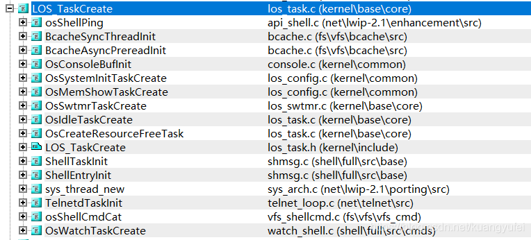
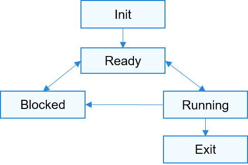
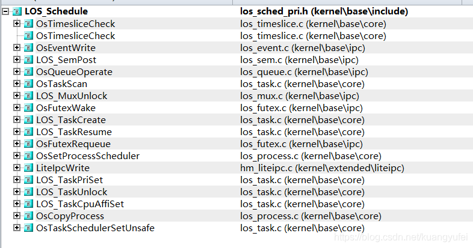

任务管理相关篇为: 

* [v21.07 鸿蒙内核源码分析(任务控制块) | 内核最重要的概念](/blog/21.md)
* [v22.05 鸿蒙内核源码分析(并发并行) | 如何搞清楚它俩区分](/blog/22.md)
* [v23.03 鸿蒙内核源码分析(就绪队列) | 美好的事物永远值得等待](/blog/23.md)
* [v24.08 鸿蒙内核源码分析(调度机制) | 公平是相对的](/blog/24.md)
* [v25.05 鸿蒙内核源码分析(任务管理) | 如何管理任务池](/blog/25.md)
* [v26.03 鸿蒙内核源码分析(用栈方式) | 谁来提供程序运行场地](/blog/26.md)
* [v27.02 鸿蒙内核源码分析(软件定时器) | 内核最高级任务竟是它](/blog/27.md)
* [v28.01 鸿蒙内核源码分析(控制台) | 一个让很多人模糊的概念](/blog/28.md)
* [v29.01 鸿蒙内核源码分析(远程登录) | 内核如何接待远方的客人](/blog/29.md)
* [v30.01 鸿蒙内核源码分析(协议栈) | 正在制作中 ... ](/blog/30.md)


### 为什么学个东西要学那么多的概念？

鸿蒙的内核中 Task 和 线程 在广义上可以理解为是一个东西,但狭义上肯定会有区别,区别在于管理体系的不同,Task是调度层面的概念,线程是进程层面概念.比如 main() 函数中首个函数 OsSetMainTask(); 就是设置启动任务,但此时啥都还没开始呢,Kprocess 进程都没创建,怎么会有大家一般意义上所理解的线程呢.狭义上的后续有 鸿蒙内核源码分析(启动过程篇) 来说明.不知道大家有没有这种体会,学一个东西的过程中要接触很多新概念,尤其像 Java/android 的生态,概念贼多,很多同学都被绕在概念中出不来,痛苦不堪.那问题是为什么需要这么多的概念呢？

举个例子就明白了:

假如您去深圳参加一个面试老板问你哪里人？你会说是 江西人,湖南人... 而不会说是张家村二组的张全蛋,这样还谁敢要你.但如果你参加同乡会别人问你同样问题,你不会说是来自东北那旮沓的,却反而要说张家村二组的张全蛋.明白了吗？张全蛋还是那个张全蛋,但因为场景变了,您的说法就得必须跟着变,否则没法愉快的聊天.程序设计就是源于生活,归于生活,大家对程序的理解就是要用生活中的场景去打比方,更好的理解概念.

那在内核的调度层面,咱们只说`task`, `task`是内核调度的单元,调度就是围着它转.

### 进程和线程的状态迁移图

先看看task从哪些渠道产生:



渠道很多,可能是shell 的一个命令,也可能由内核创建,更多的是大家编写应用程序new出来的一个线程.

调度的内容task已经有了,那他们是如何被有序调度的呢?答案:是32个进程和线程就绪队列,各32个哈,为什么是32个,鸿蒙系统源码分析(总目录) 文章里有详细说明,自行去翻.这张进程状态迁移示意图一定要看明白.

注意:进程和线程的队列内的内容只针对就绪状态,其他状态内核并没有用队列去描述它,(线程的阻塞状态用的是pendlist链表),因为就绪就意味着工作都准备好了就等着被调度到CPU来执行了.所以理解就绪队列很关键,有三种情况会加入就绪队列.



+ Init -> Ready:

进程创建或fork时,拿到该进程控制块后进入Init状态,处于进程初始化阶段,当进程初始化完成将进程插入调度队列,此时进程进入就绪状态.

+ Pend -> Ready / Pend -> Running:

阻塞进程内的任意线程恢复就绪态时,进程被加入到就绪队列,同步转为就绪态,若此时发生进程切换,则进程状态由就绪态转为运行态.

+ Running -> Ready:

进程由运行态转为就绪态的情况有以下两种:
1. 有更高优先级的进程创建或者恢复后,会发生进程调度,此刻就绪列表中最高优先级进程变为运行态,那么原先运行的进程由运行态变为就绪态.
2. 若进程的调度策略为SCHED_RR,且存在同一优先级的另一个进程处于就绪态,则该进程的时间片消耗光之后,该进程由运行态转为就绪态,另一个同优先级的进程由就绪态转为运行态.

### 谁来触发调度工作？

就绪队列让task各就各位,在其生命周期内不停的进行状态流转,调度是让task交给CPU处理,那又是什么让调度去工作的呢？它是如何被触发的？

笔者能想到的触发方式是以下四个:

- Tick(时钟管理),类似于JAVA的定时任务,时间到了就触发.系统定时器是内核时间机制中最重要的一部分,它提供了一种周期性触发中断机制,即系统定时器以HZ(时钟节拍率)为频率自行触发时钟中断.当时钟中断发生时,内核就通过时钟中断处理程序OsTickHandler对其进行处理.鸿蒙内核默认是10ms触发一次,执行以下中断函数:

```c
/*
 * Description : Tick interruption handler
 */
LITE_OS_SEC_TEXT VOID OsTickHandler(VOID)
{
    UINT32 intSave;
    TICK_LOCK(intSave);
    g_tickCount[ArchCurrCpuid()]++;
    TICK_UNLOCK(intSave);
#ifdef LOSCFG_KERNEL_VDSO
    OsUpdateVdsoTimeval();
#endif
#ifdef LOSCFG_KERNEL_TICKLESS
    OsTickIrqFlagSet(OsTicklessFlagGet());
#endif
#if (LOSCFG_BASE_CORE_TICK_HW_TIME == YES)
    HalClockIrqClear(); /* diff from every platform */
#endif
    OsTimesliceCheck();//时间片检查
	//任务扫描,发起调度
    OsTaskScan(); /* task timeout scan */
#if (LOSCFG_BASE_CORE_SWTMR == YES)
    OsSwtmrScan();//软时钟扫描检查
#endif
}
```

里面对任务进行了扫描,时间片到了或就绪队列有高或同级task,会执行调度.

- 第二个是各种软硬中断,如何USB插拔,键盘,鼠标这些外设引起的中断,需要去执行中断处理函数.
- 第三个是程序主动中断,比如运行过程中需要申请其他资源,而主动让出控制权,重新调度.
- 最后一个是创建一个新进程或新任务后主动发起的抢占式调度,新进程会默认创建一个main task, task的首条指令(入口函数)就是我们上层程序的main函数,它被放在代码段的第一的位置.
- 哪些地方会申请调度？看一张图.



这里提下图中的 OsCopyProcess(), 这是fork进程的主体函数,可以看出fork之后立即申请了一次调度.

```c
LITE_OS_SEC_TEXT INT32 LOS_Fork(UINT32 flags, const CHAR *name, const TSK_ENTRY_FUNC entry, UINT32 stackSize)
{
    UINT32 cloneFlag = CLONE_PARENT | CLONE_THREAD | CLONE_VFORK | CLONE_FILES;
    if (flags & (~cloneFlag)) {
        PRINT_WARN("Clone dont support some flags!\n");
    }
    flags |= CLONE_FILES;
    return OsCopyProcess(cloneFlag & flags, name, (UINTPTR)entry, stackSize);
}

STATIC INT32 OsCopyProcess(UINT32 flags, const CHAR *name, UINTPTR sp, UINT32 size)
{
    UINT32 intSave, ret, processID;
    LosProcessCB *run = OsCurrProcessGet();
    LosProcessCB *child = OsGetFreePCB();
    processID = child->processID;
    OsForkInitPCB(flags, child, name, sp, size);
	OsCopyProcessResources(flags, child, run);
    OsChildSetProcessGroupAndSched(child, run);
    LOS_MpSchedule(OS_MP_CPU_ALL);
    if (OS_SCHEDULER_ACTIVE) {
        LOS_Schedule();// 申请调度
    }
    return processID;
}
```

原来创建一个进程这么简单,真的就是在COPY！

### 源码告诉你调度过程是怎样的

以上是需要提前了解的信息,接下来直接上源码看调度过程吧,文件就三个函数,主要就是这个了:

```c
VOID OsSchedResched(VOID)
{
    LOS_ASSERT(LOS_SpinHeld(&g_taskSpin));//调度过程要上锁
    newTask = OsGetTopTask(); //获取最高优先级任务
    OsSchedSwitchProcess(runProcess, newProcess);//切换进程
    (VOID)OsTaskSwitchCheck(runTask, newTask);//任务检查
    OsCurrTaskSet((VOID*)newTask);//*设置当前任务
    if (OsProcessIsUserMode(newProcess)) {//判断是否为用户态,使用用户空间
        OsCurrUserTaskSet(newTask->userArea);//设置任务空间
    }
    /* do the task context switch */
    OsTaskSchedule(newTask, runTask); //切换CPU任务上下文,汇编代码实现
}
```

函数有点长,笔者留了最重要的几行,看这几行就够了,流程如下:

- 调度过程要自旋锁,多核情况下只能被一个CPU core 执行. 不允许任何中断发生, 没错,说的是任何事是不能去打断它,否则后果太严重了,这可是内核在切换进程和线程的操作啊.
- 在就绪队列里找个最高优先级的task
- 切换进程,就是task归属的那个进程设为运行进程,这里要注意,老的task和老进程只是让出了CPU指令执行权,其他都还在内存,资源也都没有释放.
- 设置新任务为当前任务
- 用户模式下需要设置task运行空间,因为每个task栈是不一样的.空间部分具体在系列篇内存中查看
- 是最重要的,切换任务上下文,参数是新老两个任务,一个要保存现场,一个要恢复现场.

什么是任务上下文？v08.xx 鸿蒙内核源码分析(总目录) 任务切换篇已有详细的描述,请自行翻看.

### 请读懂OsGetTopTask()

读懂OsGetTopTask(),就明白了就绪队列是怎么回事了.这里提下goto语句,几乎所有内核代码都会大量的使用goto语句,鸿蒙内核有617个goto远大于264个break,还有人说要废掉goto,你知道内核开发者青睐goto的真正原因吗?

```c
LITE_OS_SEC_TEXT_MINOR LosTaskCB *OsGetTopTask(VOID)
{
    UINT32 priority, processPriority;
    UINT32 bitmap;
    UINT32 processBitmap;
    LosTaskCB *newTask = NULL;
#if (LOSCFG_KERNEL_SMP == YES)
    UINT32 cpuid = ArchCurrCpuid();
#endif
    LosProcessCB *processCB = NULL;
    processBitmap = g_priQueueBitmap;
    while (processBitmap) {
        processPriority = CLZ(processBitmap);
        LOS_DL_LIST_FOR_EACH_ENTRY(processCB, &g_priQueueList[processPriority], LosProcessCB, pendList) {
            bitmap = processCB->threadScheduleMap;
            while (bitmap) {
                priority = CLZ(bitmap);
                LOS_DL_LIST_FOR_EACH_ENTRY(newTask, &processCB->threadPriQueueList[priority], LosTaskCB, pendList) {
#if (LOSCFG_KERNEL_SMP == YES)
                    if (newTask->cpuAffiMask & (1U << cpuid)) {
#endif
                        newTask->taskStatus &= ~OS_TASK_STATUS_READY;
                        OsPriQueueDequeue(processCB->threadPriQueueList,
                                          &processCB->threadScheduleMap,
                                          &newTask->pendList);
                        OsDequeEmptySchedMap(processCB);
                        goto OUT;
#if (LOSCFG_KERNEL_SMP == YES)
                    }
#endif
                }
                bitmap &= ~(1U << (OS_PRIORITY_QUEUE_NUM - priority - 1));
            }
        }
        processBitmap &= ~(1U << (OS_PRIORITY_QUEUE_NUM - processPriority - 1));
    }

OUT:
    return newTask;
}
```


  

