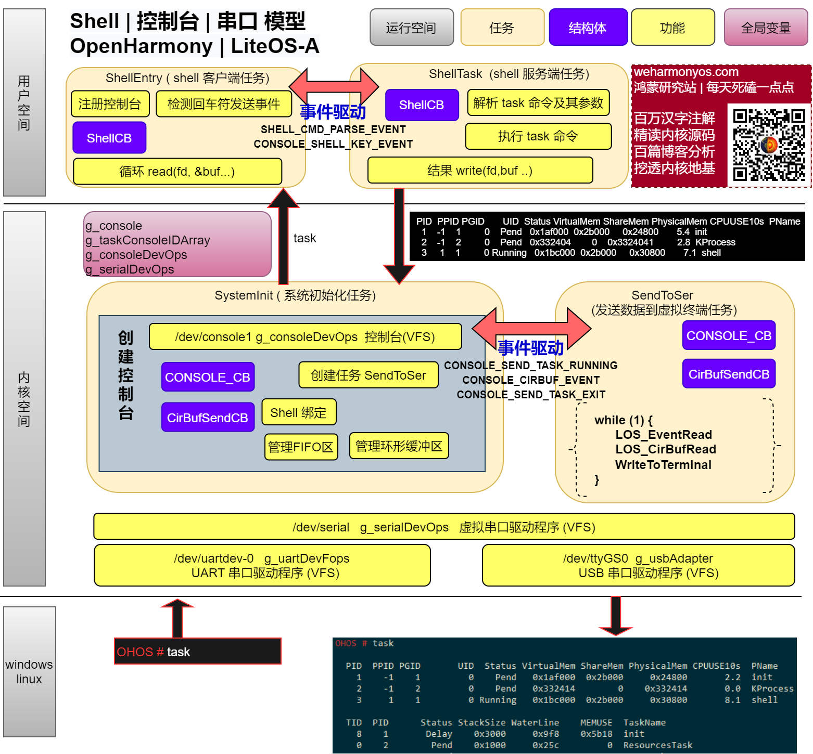
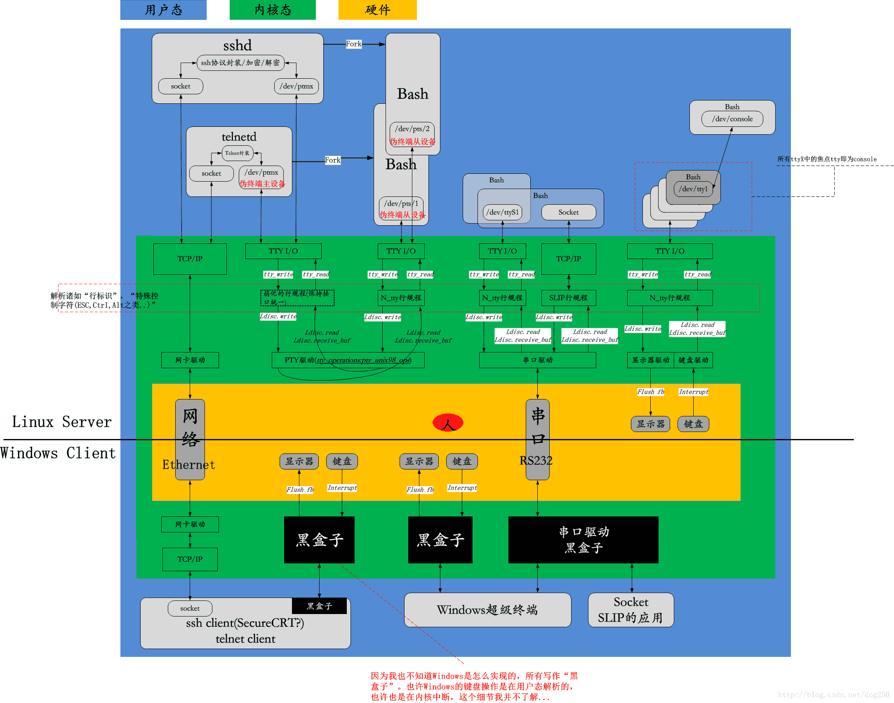

任务管理相关篇为: 

* [v21.07 鸿蒙内核源码分析(任务控制块) | 内核最重要的概念](/blog/21.md)
* [v22.05 鸿蒙内核源码分析(并发并行) | 如何搞清楚它俩区分](/blog/22.md)
* [v23.03 鸿蒙内核源码分析(就绪队列) | 美好的事物永远值得等待](/blog/23.md)
* [v24.08 鸿蒙内核源码分析(调度机制) | 公平是相对的](/blog/24.md)
* [v25.05 鸿蒙内核源码分析(任务管理) | 如何管理任务池](/blog/25.md)
* [v26.03 鸿蒙内核源码分析(用栈方式) | 谁来提供程序运行场地](/blog/26.md)
* [v27.02 鸿蒙内核源码分析(软件定时器) | 内核最高级任务竟是它](/blog/27.md)
* [v28.01 鸿蒙内核源码分析(控制台) | 一个让很多人模糊的概念](/blog/28.md)
* [v29.01 鸿蒙内核源码分析(远程登录) | 内核如何接待远方的客人](/blog/29.md)
* [v30.01 鸿蒙内核源码分析(协议栈) | 正在制作中 ... ](/blog/30.md)


本篇尝试讲明白控制台实现以及Shell如何依赖控制台工作.涉及源码部分只列出关键代码.
[详细代码前往 >> 中文注解鸿蒙内核源码 查看](https://gitee.com/weharmony/kernel_liteos_a_note)

### Shell | 控制台 | 串口模型

下图为看完鸿蒙内核Shell和控制台源码后整理的模型图


**模型说明**

* 模型涉及四个任务, 两个在用户空间,两个在内核空间.用户空间的在系列篇Shell部分中已有详细说明,请前往查看.
* `SystemInit`任务是在内核`OsMain`中创建的系统初始化任务,其中初始化了根文件系统,串口,控制台等内核模块
* 在控制台模块中创建`SendToSer`任务,这是一个负责将控制台结果输出到终端的任务.
* 结构体`CONSOLE_CB`,`CirBufSendCB`承载了控制台的实现过程.

### 代码实现

每个模块都有一个核心结构体,控制台则是

#### 结构体 | CONSOLE_CB

```c
/**
 * @brief 控制台控制块(描述符)
 */
typedef struct {
    UINT32 consoleID; ///< 控制台ID    例如 : 1 | 串口 , 2 | 远程登录
    UINT32 consoleType; ///< 控制台类型
    UINT32 consoleSem; ///< 控制台信号量
    UINT32 consoleMask; ///< 控制台掩码
    struct Vnode *devVnode; ///< 索引节点
    CHAR *name; ///< 名称 例如: /dev/console1 
    INT32 fd; ///< 系统文件句柄, 由内核分配
    UINT32 refCount; ///< 引用次数,用于判断控制台是否被占用
    UINT32 shellEntryId; ///<  负责接受来自终端信息的 "ShellEntry"任务,这个值在运行过程中可能会被换掉,它始终指向当前正在运行的shell客户端
    INT32 pgrpId; ///< 进程组ID
    BOOL isNonBlock; ///< 是否无锁方式  
#ifdef LOSCFG_SHELL
    VOID *shellHandle; ///< shell句柄,本质是 shell控制块 ShellCB
#endif
    UINT32 sendTaskID; ///< 创建任务通过事件接收数据, 见于OsConsoleBufInit
    CirBufSendCB *cirBufSendCB; ///< 循环缓冲发送控制块
    UINT8 fifo[CONSOLE_FIFO_SIZE]; ///< termios 规范模式(ICANON mode )下使用 size:1K
    UINT32 fifoOut; ///< 对fifo的标记,输出位置
    UINT32 fifoIn; ///< 对fifo的标记,输入位置
    UINT32 currentLen; ///< 当前fifo位置
    struct termios consoleTermios; ///< 线路规程
} CONSOLE_CB;
```

**解析**

* 创建控制台的过程是给`CONSOLE_CB`赋值的过程,如下

  ```c
  STATIC CONSOLE_CB *OsConsoleCreate(UINT32 consoleID, const CHAR *deviceName)
  {
    INT32 ret;
    CONSOLE_CB *consoleCB = OsConsoleCBInit(consoleID);//初始化控制台
    ret = (INT32)OsConsoleBufInit(consoleCB);//控制台buf初始化,创建 ConsoleSendTask 任务
    ret = (INT32)LOS_SemCreate(1, &consoleCB->consoleSem);//创建控制台信号量
    ret = OsConsoleDevInit(consoleCB, deviceName);//控制台设备初始化,注意这步要在 OsConsoleFileInit 的前面.
    ret = OsConsoleFileInit(consoleCB); //为 /dev/console(n|1:2)分配fd(3)
    OsConsoleTermiosInit(consoleCB, deviceName);//控制台线路规程初始化
    return consoleCB;
  }
  ```

* `Shell`是用户空间进程, 负责解析和执行用户输入的命令. 但前提是得先拿到用户的输入数据. 不管数据是从串口进来,还是远程登录进来,必须得先经过内核, 而控制台的作用就是帮你拿到数据再交给`shell`处理, `shell`再将要显示的处理结果通过控制台返回给终端用户, 那数据怎么传给`shell`呢？ 很显然用户进程只能通过系统调用 `read(fd,...)`来读取内核数据, 因为应用程序的视角是只认`fd`.通用的办法是通过文件路径来打开文件来获取`fd`.
* 还有一种办法是内核先打开文件,获取`fd`后,用户任务通过捆绑的方式获取`fd`,而`shell`和`console`之间正是通过这种方式勾搭在一块的.具体在创建`ShellEntry`任务时将自己与控制台进行捆绑.看源码实现

  ```c
  ///进入shell客户端任务初始化,这个任务负责编辑命令,处理命令产生的过程,例如如何处理方向键,退格键,回车键等
    LITE_OS_SEC_TEXT_MINOR UINT32 ShellEntryInit(ShellCB *shellCB)
    {
        UINT32 ret;
        CHAR *name = NULL;
        TSK_INIT_PARAM_S initParam = {0};
        if (shellCB->consoleID == CONSOLE_SERIAL) {
            name = SERIAL_ENTRY_TASK_NAME;
        } else if (shellCB->consoleID == CONSOLE_TELNET) {
            name = TELNET_ENTRY_TASK_NAME;
        } else {
            return LOS_NOK;
        }
        initParam.pfnTaskEntry = (TSK_ENTRY_FUNC)ShellEntry;//任务入口函数
        initParam.usTaskPrio   = 9; /* 9:shell task priority */
        initParam.auwArgs[0]   = (UINTPTR)shellCB;
        initParam.uwStackSize  = 0x1000;
        initParam.pcName       = name; //任务名称
        initParam.uwResved     = LOS_TASK_STATUS_DETACHED;
        ret = LOS_TaskCreate(&shellCB->shellEntryHandle, &initParam);//创建shell任务
    #ifdef LOSCFG_PLATFORM_CONSOLE
        (VOID)ConsoleTaskReg((INT32)shellCB->consoleID, shellCB->shellEntryHandle);//将shell捆绑到控制台
    #endif
        return ret;
    }
  ```

    `ConsoleTaskReg`将 `shellCB`和`consoleCB`捆绑在一块,二者可以相互查找.`ShellEntry`任务个人更愿意称之为`shell`的客户端任务,用死循环不断一个字符一个字符的读取用户的输入,为何要单字符
    读取可翻看系列篇的**Shell编辑篇**,简单的说是因为要处理控制字符(如:删除,回车==)

    ```c
    LITE_OS_SEC_TEXT_MINOR UINT32 ShellEntry(UINTPTR param)
    {
        CHAR ch;
        INT32 n = 0;
        ShellCB *shellCB = (ShellCB *)param;
        CONSOLE_CB *consoleCB = OsGetConsoleByID((INT32)shellCB->consoleID);//获取绑定的控制台,目的是从控制台读数据
        (VOID)memset_s(shellCB->shellBuf, SHOW_MAX_LEN, 0, SHOW_MAX_LEN);//重置shell命令buf
        while (1) {
            n = read(consoleCB->fd, &ch, 1);//系统调用,从控制台读取一个字符内容,字符一个个处理
            if (n == 1) {//如果能读到一个字符
                ShellCmdLineParse(ch, (pf_OUTPUT)dprintf, shellCB);
            }
        }
    }
    ```

* `read`函数的`consoleCB->fd`是个虚拟字符设备文件 如:`/dev/console1`,对文件的操作由`g_consoleDevOps`实现.`read`最终会调用`ConsoleRead`,再往下会调用到`UART_Read`

  ```c
    /*! console device driver function structure | 控制台设备驱动程序,统一的vfs接口的实现 */
    STATIC const struct file_operations_vfs g_consoleDevOps = {
        .open = ConsoleOpen,   /* open */
        .close = ConsoleClose, /* close */
        .read = ConsoleRead,   /* read */
        .write = ConsoleWrite, /* write */
        .seek = NULL,
        .ioctl = ConsoleIoctl,
        .mmap = NULL,
    #ifndef CONFIG_DISABLE_POLL
        .poll = ConsolePoll,
    #endif
    };
  ```

* `fifo`用于`termios`(线路规程)的规范模式,输入数据基于行进行处理.在用户输入一个行结束符(回车符,EOF等)之前,系统调用read()读不到用户输入的任何字符.除了EOF之外的行结束符(回车符等),与普通字符一样会被read()读到缓冲区`fifo`中.在规范模式中,可以进行行编辑,而且一次调用read()最多只能读取一行数据.如果read()请求读取的数据字节少于当前行可读取的字节,则read()只读取被请求的字节数,剩下的字节下次再读.详细内容见系列篇之 **线路规程篇**

* `CirBufSendCB`是专用于`SendToSer`任务的结构体,任务之间通过事件相互驱动,控制台通知`SendToSer`将数据发送给终端

  ```c
  /**
   * @brief 发送环形buf控制块,通过事件发送
   */
  typedef struct {
      CirBuf cirBufCB;        /* Circular buffer CB | 循环缓冲控制块 */
      EVENT_CB_S sendEvent;   /* Inform telnet send task | 例如: 给SendToSer任务发送事件*/
  } CirBufSendCB;
  ```

#### 发送数据给终端的任务 | ConsoleSendTask

`ConsoleSendTask`只干一件事,将数据发送给串口或远程登录,任务优先级与`shell`同级,为`9`,它由系统初始化任务`SystemInit`创建, 具体可翻看系列篇之**内核启动篇**

```c
/// 控制台缓存初始化,创建一个 发送任务
STATIC UINT32 OsConsoleBufInit(CONSOLE_CB *consoleCB)
{
    UINT32 ret;
    TSK_INIT_PARAM_S initParam = {0};
    consoleCB->cirBufSendCB = ConsoleCirBufCreate();//创建控制台
    if (consoleCB->cirBufSendCB == NULL) {
        return LOS_NOK;
    }
    initParam.pfnTaskEntry = (TSK_ENTRY_FUNC)ConsoleSendTask;//控制台发送任务入口函数
    initParam.usTaskPrio   = SHELL_TASK_PRIORITY; //优先级9
    initParam.auwArgs[0]   = (UINTPTR)consoleCB; //入口函数的参数
    initParam.uwStackSize  = LOSCFG_BASE_CORE_TSK_DEFAULT_STACK_SIZE; //16K
    if (consoleCB->consoleID == CONSOLE_SERIAL) {//控制台的两种方式
        initParam.pcName   = "SendToSer"; //任务名称(发送数据到串口) 
    } else {
        initParam.pcName   = "SendToTelnet";//任务名称(发送数据到远程登录)
    }
    initParam.uwResved     = LOS_TASK_STATUS_DETACHED; //使用任务分离模式
    ret = LOS_TaskCreate(&consoleCB->sendTaskID, &initParam);//创建task 并加入就绪队列,申请立即调度
    if (ret != LOS_OK) { //创建失败处理
        ConsoleCirBufDelete(consoleCB->cirBufSendCB);//释放循环buf
        consoleCB->cirBufSendCB = NULL;//置NULL
        return LOS_NOK;
    }//永久等待读取 CONSOLE_SEND_TASK_RUNNING 事件,CONSOLE_SEND_TASK_RUNNING 由 ConsoleSendTask 发出.
    (VOID)LOS_EventRead(&consoleCB->cirBufSendCB->sendEvent, CONSOLE_SEND_TASK_RUNNING,
                        LOS_WAITMODE_OR | LOS_WAITMODE_CLR, LOS_WAIT_FOREVER);
 // ... 读取到 CONSOLE_SEND_TASK_RUNNING 事件才会往下执行  
    return LOS_OK;
}
```

任务的入口函数`ConsoleSendTask`实现也很简单,此处全部贴出来,死循环等待事件的发送.说到死循环多说两句,不要被`while (1)`吓倒,认为内核会卡死在这里玩不下去,那是应用程序员看待死循环的视角,其实在内核当等待的事件没有到来的时,这个任务并不会往下执行,而是处于挂起状态,当事件到来时才会切换回来继续往下走,那如何知道事件到来了呢？ 可翻看系列篇之**事件控制篇**

```c
STATIC UINT32 ConsoleSendTask(UINTPTR param)
{
    CONSOLE_CB *consoleCB = (CONSOLE_CB *)param;
    CirBufSendCB *cirBufSendCB = consoleCB->cirBufSendCB;
    CirBuf *cirBufCB = &cirBufSendCB->cirBufCB;
    UINT32 ret, size;
    UINT32 intSave;
    CHAR *buf = NULL;
    (VOID)LOS_EventWrite(&cirBufSendCB->sendEvent, CONSOLE_SEND_TASK_RUNNING);//发送一个控制台任务正在运行的事件
    while (1) {//读取 CONSOLE_CIRBUF_EVENT | CONSOLE_SEND_TASK_EXIT 这两个事件
        ret = LOS_EventRead(&cirBufSendCB->sendEvent, CONSOLE_CIRBUF_EVENT | CONSOLE_SEND_TASK_EXIT,
                            LOS_WAITMODE_OR | LOS_WAITMODE_CLR, LOS_WAIT_FOREVER);//读取循环buf或任务退出的事件
        if (ret == CONSOLE_CIRBUF_EVENT) {//控制台循环buf事件发生
            size =  LOS_CirBufUsedSize(cirBufCB);//循环buf使用大小
            if (size == 0) {
                continue;
            }
            buf = (CHAR *)LOS_MemAlloc(m_aucSysMem1, size + 1);//分配接收cirbuf的内存
            if (buf == NULL) {
                continue;
            }
            (VOID)memset_s(buf, size + 1, 0, size + 1);//清0
            LOS_CirBufLock(cirBufCB, &intSave);
            (VOID)LOS_CirBufRead(cirBufCB, buf, size);//读取循环cirBufCB至  buf
            LOS_CirBufUnlock(cirBufCB, intSave);

            (VOID)WriteToTerminal(consoleCB, buf, size);//将buf数据写到控制台终端设备
            (VOID)LOS_MemFree(m_aucSysMem1, buf);//清除buf
        } else if (ret == CONSOLE_SEND_TASK_EXIT) {//收到任务退出的事件, 由 OsConsoleBufDeinit 发出事件.
            break;//退出循环
        }
    }
    ConsoleCirBufDelete(cirBufSendCB);//删除循环buf,归还内存
    return LOS_OK;
}
```

上面提到了控制台和终端,是经常容易搞混的又变得越来越模糊两个概念,简单说明下.

### 传统的控制台和终端

控制台(console)和终端(terminal)有什么区别？ 看张古老的图


这个不陌生吧,实现中虽很少看到,可电影里可没少出现.

据说是NASA航天飞机控制台,满满的科技感.


这就是控制台.早期控制台其实是给系统管理人员使用的.因为机器很大,价格很贵,不可能让每个人都拥有一个真正物理上属于自己的计算机,但是只让一个人用那其他人怎么办？ 效率太低,就出现了多用户多任务计算机,让一台计算机多个人同时登录使用的情况, 给每个人面前放个简单设备(只有键盘和屏幕)连接到主机上,如图所示


这个就叫**终端** ,注意别看那么大,长得很像一体机,但其实它只是一台显示器.这是给普通用户使用,权限也有限,核心功能权限还是在操作控制台的系统管理员手上.

综上所述,用图表列出二者早期差异

|区别|终端(terminal) |控制台(console)|
|-|-|-|
|设备属性|外挂的附加设备|自带的基本设备|
|数量|多个|一个|
|主机信任度|低|高|
|输出内容|主机处理的信息|主机核心/自身信息|
|操作员|普通用户 |管理员|

### 现在的控制台和终端

由于时代的发展计算机的硬件越来越便宜,现在都是一个人独占一台计算机(个人电脑),已经不再需要传统意义上的硬件终端.现在终端和控制台都由硬件概念,逐渐演化成了软件的概念.终端和控制台的界限也慢慢模糊了,复杂了,甚至控制台也变成了终端, 现在要怎么理解它们,推荐一篇文章,请自行前往搜看.
**<< 彻底理解Linux的各种终端类型以及概念 >>**



本篇内容与图中右上角的`/dev/console`那部分相关. 从鸿蒙内核视角来看,控制台和终端还是有很大差别的.


  

