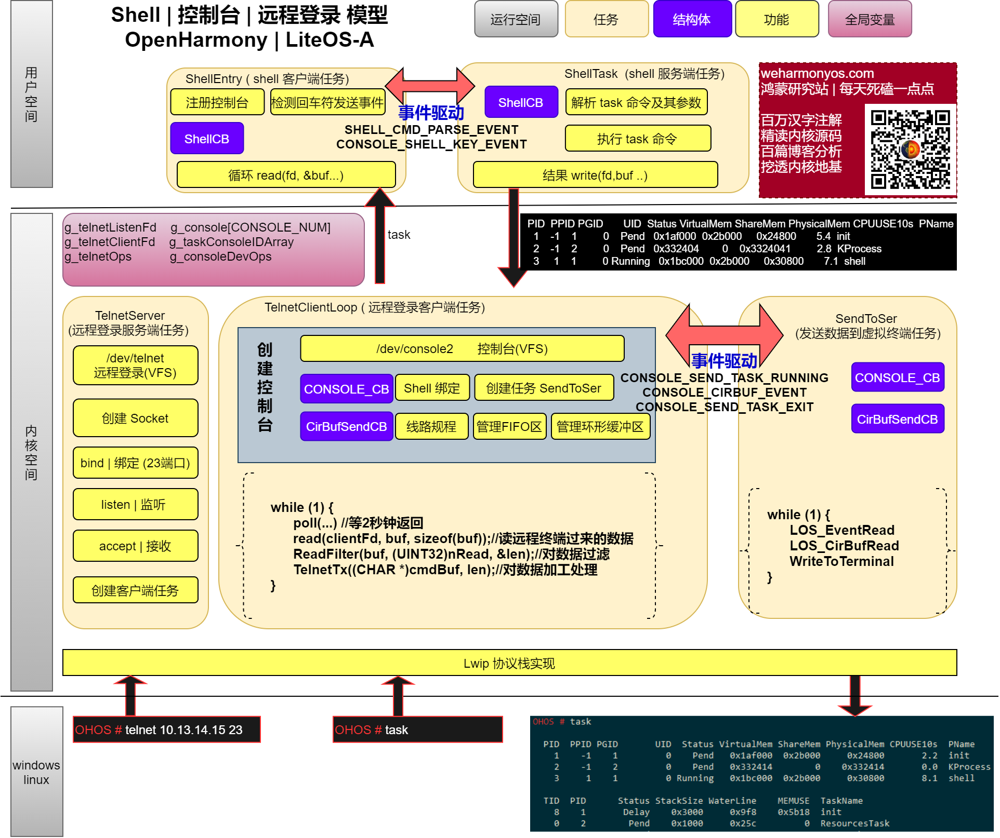

任务管理相关篇为: 

* [v21.07 鸿蒙内核源码分析(任务控制块) | 内核最重要的概念](/blog/21.md)
* [v22.05 鸿蒙内核源码分析(并发并行) | 如何搞清楚它俩区分](/blog/22.md)
* [v23.03 鸿蒙内核源码分析(就绪队列) | 美好的事物永远值得等待](/blog/23.md)
* [v24.08 鸿蒙内核源码分析(调度机制) | 公平是相对的](/blog/24.md)
* [v25.05 鸿蒙内核源码分析(任务管理) | 如何管理任务池](/blog/25.md)
* [v26.03 鸿蒙内核源码分析(用栈方式) | 谁来提供程序运行场地](/blog/26.md)
* [v27.02 鸿蒙内核源码分析(软件定时器) | 内核最高级任务竟是它](/blog/27.md)
* [v28.01 鸿蒙内核源码分析(控制台) | 一个让很多人模糊的概念](/blog/28.md)
* [v29.01 鸿蒙内核源码分析(远程登录) | 内核如何接待远方的客人](/blog/29.md)
* [v30.01 鸿蒙内核源码分析(协议栈) | 正在制作中 ... ](/blog/30.md)


### 什么是远程登录？

* 每个人都有上门做客的经历，抖音也一直在教我们做人，做客不要空手去，总得带点东西，而对中国人你就不能送**钟**，不能送**梨**，最好也别送**鞋**，因他们与 **终 离 邪** 谐音，犯忌讳。 这是人情世故，叫礼仪，是中华文明圈的共识，是相互交流信任的基础。

* 那互联网圈有没有这种共识呢？ 当然有，互联网世界的人情世故就是协议， 种种协议映射到人类社会来说就是种种礼仪，协议有`TCP`，`HTTP`，`SSH`，`Telnet`等等，就如同礼仪分商业礼仪，外交礼仪，校园礼仪，家庭礼仪等等。 孔圣人不也说 **不学礼，无以立** 应该就是这个道理， 登门拜访的礼仪可类比远程登录协议`Telnet`。 来了就跟自己家一样， 我家的东西就是你家的，随便用，甭客气。

`Telnet`协议的具体内容可以查看以下文档。

|协议|时间|英文版|中文版|标题|
|-|-|-|-|-|
|Telnet|1983|[rfc854](https://www.rfc-editor.org/rfc/rfc854.html)|[rfc854](https://docs.huihoo.com/rfc/RFC854.txt) |TELNET PROTOCOL SPECIFICATION(远程登录协议规范)|
|Telnet|1983|[rfc855](https://www.rfc-editor.org/rfc/rfc855.html)|[rfc855](https://docs.huihoo.com/rfc/RFC855.txt)|TELNET OPTION SPECIFICATIONS(远程登录选项规范)|

`Telnet`协议细节不是本篇讨论的重点，后续会有专门的 **Lwip协议栈** 系列博客说清楚。本篇要说清楚的是内核如何接待远方的客人。

### Shell | 控制台 | 远程登录模型

对远程登录来有客户端和服务端的说法，跟别人来你家你是主人和你去别人家你是客人一样，身份不同，职责不同，主人要做的事明显要更多，本篇只说鸿蒙对`telnet`服务端的实现，说清楚它是如何接待外面来的客人。至于图中提到的客户端任务是指主人为每个客人专门提供了一个对接人的意思。**下图**为看完三部分源码后整理的模型图



**模型解释**

* 通过本地的`shell`命令`telnet on`启动远程登录模块，由此创建Telnet的服务任务`TelnetServer`
* `TelnetServer`任务，创建`socket`监听`23`端口，接受来自远程终端的 `telnet xx.xx.xx.xx 23`请求
* 收到请求后创建一个`TelnetClientLoop`用于接待客户的任务，对接详细的客户需求。
* 在接待客户期间创建一个远程登录类型的控制台，来处理和转发远程客户的请求给`shell`进程最终执行远程命令。
* `shell`处理完成后通过专门的任务`SendToSer`回写远程终端，控制台部分详细看 系列篇的(控制台篇)

### 鸿蒙是如何实现的？

#### 1. 启动 Telnet

```c
//SHELLCMD_ENTRY(telnet_shellcmd， CMD_TYPE_EX， "telnet"， 1， (CmdCallBackFunc)TelnetCmd);/// 以静态方式注册shell 命令
/// 本命令用于启动或关闭telnet server服务 
INT32 TelnetCmd(UINT32 argc, const CHAR **argv)
{
    if (strcmp(argv[0], "on") == 0) { // 输入 telnet on
        /* telnet on: try to start telnet server task */
        TelnetdTaskInit(); //启动远程登录 服务端任务
        return 0;
    }
    if (strcmp(argv[0], "off") == 0) {// 输入 telnet off
        /* telnet off: try to stop clients, then stop server task */
        TelnetdTaskDeinit();//关闭所有的客户端,并关闭服务端任务
        return 0;
    }
    return 0;
}
```

#### 2. 创建Telnet服务端任务

```c
STATIC VOID TelnetdTaskInit(VOID)
{
    UINT32 ret;
    TSK_INIT_PARAM_S initParam = {0};
    initParam.pfnTaskEntry = (TSK_ENTRY_FUNC)TelnetdMain; // telnet任务入口函数
    initParam.uwStackSize = TELNET_TASK_STACK_SIZE; // 8K
    initParam.pcName = "TelnetServer"; //任务名称
    initParam.usTaskPrio = TELNET_TASK_PRIORITY; //优先级 9,和 shell 的优先级一样
    initParam.uwResved = LOS_TASK_STATUS_DETACHED; //独立模式
    if (atomic_read(&g_telnetTaskId) != 0) {//只支持一个 telnet 服务任务
        PRINT_ERR("telnet server is already running!\n");
        return;
    }
    ret = LOS_TaskCreate((UINT32 *)&g_telnetTaskId, &initParam);//创建远程登录服务端任务并发起调度
}
```

#### 3. Telnet服务端任务入口函数

```c
//远程登录操作命令
STATIC const struct file_operations_vfs g_telnetOps = {
    TelnetOpen,
    TelnetClose,
    TelnetRead,
    TelnetWrite,
    NULL,
    TelnetIoctl,
    NULL,
#ifndef CONFIG_DISABLE_POLL
    TelnetPoll,
#endif
    NULL,
};
STATIC INT32 TelnetdMain(VOID)
{
    sock = TelnetdInit(TELNETD_PORT);//1.初始化创建 socket ,socket的本质就是打开了一个虚拟文件
    TelnetLock();
    ret = TelnetedRegister();//2.注册驱动程序 /dev/telnet ,g_telnetOps g_telnetDev
    TelnetUnlock();
    TelnetdAcceptLoop(sock);//3.等待连接,处理远程终端过来的命令 例如#task 命令
    return 0;
}
```

#### 4. 循环等待远程终端的连接请求

```c
STATIC VOID TelnetdAcceptLoop(INT32 listenFd)
{
    while (g_telnetListenFd >= 0) {//必须启动监听
        TelnetUnlock();
        (VOID)memset_s(&inTelnetAddr, sizeof(inTelnetAddr), 0, sizeof(inTelnetAddr));
        clientFd = accept(listenFd, (struct sockaddr *)&inTelnetAddr, (socklen_t *)&len);//接收数据
        if (TelnetdAcceptClient(clientFd, &inTelnetAddr) == 0) {//
            /*
             * Sleep sometime before next loop: mostly we already have one connection here,
             * and the next connection will be declined. So don't waste our cpu.
             | 在下一个循环来临之前休息片刻,因为鸿蒙只支持一个远程登录,此时已经有一个链接,
             在TelnetdAcceptClient中创建线程不会立即调度, 休息下任务会挂起,重新调度
             */
            LOS_Msleep(TELNET_ACCEPT_INTERVAL);//以休息的方式发起调度. 直接申请调度也未尝不可吧 @note_thinking 
        } else {
            return;
        }
        TelnetLock();
    }
    TelnetUnlock();
}
```

#### 5. 远方的客人到来,安排专人接待

鸿蒙目前只支持接待一位远方的客人，`g_telnetClientFd`是个全局变量，创建专门任务接待客人。

```c
STATIC INT32 TelnetdAcceptClient(INT32 clientFd, const struct sockaddr_in *inTelnetAddr)
{
    g_telnetClientFd = clientFd;
 //创建一个线程处理客户端的请求
    if (pthread_create(&tmp, &useAttr, TelnetClientLoop, (VOID *)(UINTPTR)clientFd) != 0) {
        PRINT_ERR("Failed to create client handle task\n");
        g_telnetClientFd = -1;
        goto ERROUT_UNLOCK;
    }
}
```

#### 6. 接待员做好接待工作

因接待工作很重要，这边把所有代码贴出来，并加上了大量的注释，目的只有一个，让咱客人爽。

```c
STATIC VOID *TelnetClientLoop(VOID *arg)
{
    struct pollfd pollFd;
    INT32 ret;
    INT32 nRead;
    UINT32 len;
    UINT8 buf[TELNET_CLIENT_READ_BUF_SIZE];
    UINT8 *cmdBuf = NULL;
    INT32 clientFd = (INT32)(UINTPTR)arg;
    (VOID)prctl(PR_SET_NAME, "TelnetClientLoop", 0, 0, 0);
    TelnetLock();
    if (TelnetClientPrepare(clientFd) != 0) {//做好准备工作
        TelnetUnlock();
        (VOID)close(clientFd);
        return NULL;
    }
    TelnetUnlock();
    while (1) {//死循环接受远程输入的数据
        pollFd.fd = clientFd;
        pollFd.events = POLLIN | POLLRDHUP;//监听读数据和挂起事件
        pollFd.revents = 0;
  /*
  POLLIN 普通或优先级带数据可读
  POLLRDNORM 普通数据可读
  POLLRDBAND 优先级带数据可读
  POLLPRI 高优先级数据可读
  POLLOUT 普通数据可写
  POLLWRNORM 普通数据可写
  POLLWRBAND 优先级带数据可写
  POLLERR 发生错误
  POLLHUP 发生挂起
  POLLNVAL 描述字不是一个打开的文件
  poll本质上和select没有区别，它将用户传入的数组拷贝到内核空间，然后查询每个fd对应的设备状态，
  如果设备就绪则在设备等待队列中加入一项并继续遍历，如果遍历完所有fd后没有发现就绪设备，则挂起当前进程，
  直到设备就绪或者主动超时，被唤醒后它又要再次遍历fd。
 　　这个过程经历了多次无谓的遍历。
 　　poll还有一个特点是“水平触发”，如果报告了fd后，没有被处理，那么下次poll时会再次报告该fd。
 　　poll与select的不同，通过一个pollfd数组向内核传递需要关注的事件，故没有描述符个数的限制，
   pollfd中的events字段和revents分别用于标示关注的事件和发生的事件，故pollfd数组只需要被初始化一次
 　　poll的实现机制与select类似，其对应内核中的sys_poll，只不过poll向内核传递pollfd数组，
   然后对pollfd中的每个描述符进行poll，相比处理fdset来说，poll效率更高。poll返回后，
   需要对pollfd中的每个元素检查其revents值，来得指事件是否发生。
   优点
   1）poll() 不要求开发者计算最大文件描述符加一的大小。
   2）poll() 在应付大数目的文件描述符的时候速度更快，相比于select。
   3）它没有最大连接数的限制，原因是它是基于链表来存储的。
   缺点
   1）大量的fd的数组被整体复制于用户态和内核地址空间之间，而不管这样的复制是不是有意义。
   2）与select一样，poll返回后，需要轮询pollfd来获取就绪的描述符
  */
        ret = poll(&pollFd, 1, TELNET_CLIENT_POLL_TIMEOUT);//等2秒钟返回
        if (ret < 0) {//失败时，poll()返回-1
            break;
   /* ret < 0 各值
   　　EBADF　　  一个或多个结构体中指定的文件描述符无效。
   　　EFAULTfds　　 指针指向的地址超出进程的地址空间。
   　　EINTR　　　　  请求的事件之前产生一个信号，调用可以重新发起。
   　　EINVALnfds　　参数超出PLIMIT_NOFILE值。
   　　ENOMEM　　    可用内存不足，无法完成请求

   */
        }
        if (ret == 0) {//如果在超时前没有任何事件发生，poll()返回0
            continue;
        }
        /* connection reset， maybe keepalive failed or reset by peer | 连接重置，可能keepalive失败或被peer重置*/
        if ((UINT16)pollFd.revents & (POLLERR | POLLHUP | POLLRDHUP)) {
            break;
        }
        if ((UINT16)pollFd.revents & POLLIN) {//数据事件
            nRead = read(clientFd, buf, sizeof(buf));//读远程终端过来的数据
            if (nRead <= 0) {
                /* telnet client shutdown */
                break;
            }
            cmdBuf = ReadFilter(buf, (UINT32)nRead, &len);//对数据过滤
            if (len > 0) {
                (VOID)TelnetTx((CHAR *)cmdBuf, len);//对数据加工处理
            }
        }
    }
    TelnetLock();
    TelnetClientClose();
    (VOID)close(clientFd);
    clientFd = -1;
    g_telnetClientFd = -1;
    TelnetUnlock();
    return NULL;
}
```

### 最后结语

理解远程登录的实现建议结合 `shell编辑篇` ，`shell执行篇` ，`控制台篇` 三篇来理解，实际上它们是上中下三层。


