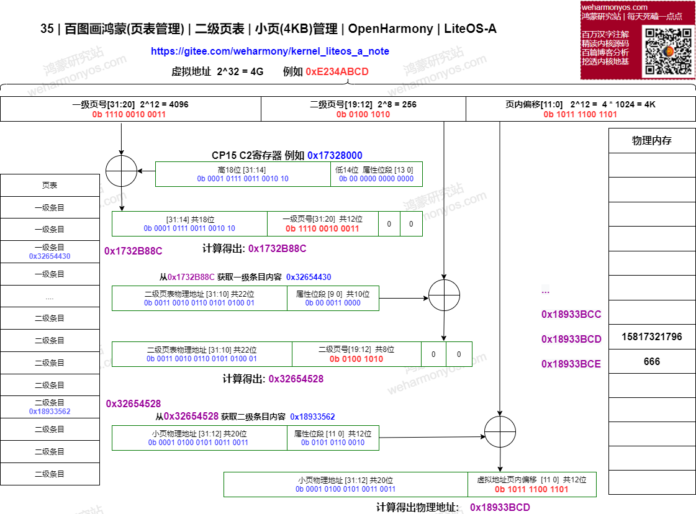

内存管理相关篇为: 

* [v31.02 鸿蒙内核源码分析(内存规则) | 内存管理到底在管什么](/blog/31.md)
* [v32.04 鸿蒙内核源码分析(物理内存) | 真实的可不一定精彩](/blog/32.md)
* [v33.04 鸿蒙内核源码分析(内存概念) | RAM & ROM & Flash](/blog/33.md)
* [v34.03 鸿蒙内核源码分析(虚实映射) | 映射是伟大的发明](/blog/34.md)
* [v35.02 鸿蒙内核源码分析(页表管理) | 映射关系保存在哪](/blog/35.md)
* [v36.03 鸿蒙内核源码分析(静态分配) | 很简单的一位小朋友](/blog/36.md)
* [v37.01 鸿蒙内核源码分析(TLFS算法) | 图表解读TLFS原理 ](/blog/37.md)
* [v38.01 鸿蒙内核源码分析(内存池管理) | 如何高效切割合并内存块 ](/blog/38.md)
* [v39.04 鸿蒙内核源码分析(原子操作) | 谁在守护指令执行的完整性](/blog/39.md)
* [v40.01 鸿蒙内核源码分析(圆整对齐) | 正在制作中 ... ](/blog/40.md)


### 什么是页表

在前几篇中会反复提到 **页表**，其作用是记录虚拟地址和物理地址的映射关系的。它也需要内存空间存放内容，便于查询，本篇说页表的使用流程和实现过程。

* 鸿蒙有三种虚拟空间(`LosVmSpace`)：
  * 内核空间(`g_kVmSpace`)：数量一个，内核也是程序，需要有容身之所，需要通过外部工具先烧录至`flash`指定位置，再启动加载至内存固定位置开始运行，存放内核数据代码的这部分空间称之为内核空间，其包括中断向量表(`vectors`)，代码区(`.text`)，只读数据区(`.rodata`)，可读写数据区(`.data`)，未初始化的全局变量(`.bbs`)和页表区，这部分内容可查看系列篇之 **(开机启动篇)**
  * 内核分配空间(`g_vMallocSpace`)： 数量一个，内核启动后，运行期间需要不断的申请和释放内存，这些内存从哪里来呢 ? 由内核分配空间提供，注意此处是动态以内存池的方式分配没错，但不能简单的理解为堆空间，因为内核态栈空间(`stack`)，堆空间(`heap`)，映射区(`map`)都是由它提供，它们没有明显的地址边界，你无法只从地址判断运行逻辑，这部分详细内容可查看系列篇之 **(内存池管理)**
  * 用户空间 ：数量多个，是应用程序运行的空间，在这个空间中 **栈区**，**堆区**，**映射区** ，**代码区**，**数据区** 会有明显的边界，**栈区**在高地址位，向下生长，**堆区**在低地址位，向上生长，**数据区**在更低的地址位，**代码区**在更更低的地址位。详细看下图

**页表**是记录这三种虚拟空间地址映射关系的 ，而内核空间与内核分配空间的虚拟地址不会重叠所以可设计成共用一张页表，存储在内核空间中，而所有用户空间的虚拟地址范围是一致的，必须独立记录映射关系，统一存储在内核空间的页表区，当用户进程切换时便提供这份页表给`MMU`，`MMU`将对这份页表增删改查。所谓的 **缺页中断** 就是在这份页表中没有查到虚拟地址映射的物理地址，处理缺页中断是将内容调入物理内存并更新页表的过程。再比如**打开某个文件** 背后需要做 **文件映射** ，为这个文件单独开辟一个线性区，将文件内容以页为单位加载到物理内存页帧中，由页表保存线性区地址和物理地址的映射关系。

### 内核页表 | g_firstPageTable

此处会涉及到编译器的知识，`__attribute__`这个关键词是`GNU`编译器中的编译属性，`__attribute__((section("section_name")))`，含义是将作用的函数或数据放入指定名为`section_name`对应的段中。再说的简单点是编译器帮我们在数据区的指定的位置开了一个全局变量名叫`section_name`
代码见于 [los_arch_mmu.c](...)

```c
#define MMU_DESCRIPTOR_L1_SMALL_ENTRY_NUMBERS                   0x4000U //16K
__attribute__((aligned(MMU_DESCRIPTOR_L1_SMALL_ENTRY_NUMBERS))) \
    __attribute__((section(".bss.prebss.translation_table"))) UINT8 \
    g_firstPageTable[MMU_DESCRIPTOR_L1_SMALL_ENTRY_NUMBERS];
#ifdef LOSCFG_KERNEL_SMP
__attribute__((aligned(MMU_DESCRIPTOR_L1_SMALL_ENTRY_NUMBERS))) \
    __attribute__((section(".bss.prebss.translation_table"))) UINT8 \
    g_tempPageTable[MMU_DESCRIPTOR_L1_SMALL_ENTRY_NUMBERS];
UINT8 *g_mmuJumpPageTable = g_tempPageTable;
#else
extern CHAR __mmu_ttlb_begin; /* defined in .ld script | 内核临时页表在系统使能mmu到使用虚拟地址运行这段期间使用,其虚拟地址保存在g_mmuJumpPageTable这个指针中*/
UINT8 *g_mmuJumpPageTable = (UINT8 *)&__mmu_ttlb_begin; /* temp page table, this is only used when system power up | 临时页表,用于系统启动阶段*/
#endif
```

* `UINT8`分配了`16K` 等于分配了`4`个物理页，一个物理页的单元大小是按`8`位算的`4K`。能存储`2^10 = 1024`个`UINT32`数据，虚拟地址的长度为`UINT32`。
* 为什么要这么做呢 ? 切换进程就需要提供页表的位置，用户进程的页表是在内核创建用户进程的时候就提供好了，就已经知道了具体位置，那内核的页表呢 ? 它同样也需要在内核运行之前就提供好具体位置，注意，此处说的是页面的位置，而非页表内容。我们写的普通代码使用的全局变量并不能设定其在数据区的具体地址，你是做不到让程序指定一个变量的地址必须是地址`(0x2345)`对不对 ? 所以只能由编译器来指定内核页表的具体地址。

* 抛个问题，从代码中知道内核还有一个临时页表`g_tempPageTable`，为何要有临时内核页表呢 ?

### 用户页表

```c
/// 创建用户进程空间
LosVmSpace *OsCreateUserVmSpace(VOID)
{
    BOOL retVal = FALSE;
    LosVmSpace *space = LOS_MemAlloc(m_aucSysMem0, sizeof(LosVmSpace));//在内核空间申请用户进程空间
    if (space == NULL) {
        return NULL;
    }
 //此处为何直接申请物理页帧存放用户进程的页表,大概是因为所有页表都被存放在内核空间(g_kVmSpace)而非内核分配空间(g_vMallocSpace)
    VADDR_T *ttb = LOS_PhysPagesAllocContiguous(1);//分配一个物理页用于存放虚实映射关系表, 即:L1表
    if (ttb == NULL) {//若连页表都没有,剩下的也别玩了.
        (VOID)LOS_MemFree(m_aucSysMem0, space);
        return NULL;
    }
    (VOID)memset_s(ttb, PAGE_SIZE, 0, PAGE_SIZE);//4K空间置0
    retVal = OsUserVmSpaceInit(space, ttb);//初始化用户空间,mmu
    LosVmPage *vmPage = OsVmVaddrToPage(ttb);//找到所在物理页框
    if ((retVal == FALSE) || (vmPage == NULL)) {
        (VOID)LOS_MemFree(m_aucSysMem0, space);
        LOS_PhysPagesFreeContiguous(ttb, 1);
        return NULL;
    }
    LOS_ListAdd(&space->archMmu.ptList, &(vmPage->node));//页表链表,先挂上L1,后续还会挂上 N个L2表
    return space;
}
```

**解读**

* 用户空间的页表由内核空间提供，因为页表大小和物理页框对应，默认都是`4K`，所以直接申请物理页，页表的作用是存储虚拟地址和物理地址映射关系的，但它自身也是需要映射的，又该如何记录这种关系呢 ? 鸿蒙使用了一个很巧妙的办法 **偏移法** 。`KERNEL_ASPACE_BASE`为内核空间的起始地址，`SYS_MEM_BASE`为物理内存的起始地址

  ```c
    #define KERNEL_VADDR_BASE       0x40000000
    #define KERNEL_VMM_BASE         U32_C(KERNEL_VADDR_BASE) ///< 速度快,使用cache
    #define KERNEL_ASPACE_BASE      KERNEL_VMM_BASE ///< 内核空间基地址
    #define SYS_MEM_BASE            DDR_MEM_ADDR ///< 物理内存基地址
    ///分配连续的物理页
    VOID *LOS_PhysPagesAllocContiguous(size_t nPages)
    {
        LosVmPage *page = NULL;
        if (nPages == 0) {
            return NULL;
        }
        //鸿蒙 nPages 不能大于 2^8 次方,即256个页,1M内存,仅限于内核态,用户态不限制分配大小.
        page = OsVmPhysPagesGet(nPages);//通过伙伴算法获取物理上连续的页
        if (page == NULL) {
            return NULL;
        }
        return OsVmPageToVaddr(page);//通过物理页找虚拟地址
    }
    VOID *OsVmPageToVaddr(LosVmPage *page)//
    {
        VADDR_T vaddr;
        vaddr = KERNEL_ASPACE_BASE + page->physAddr - SYS_MEM_BASE;//page->physAddr - SYS_MEM_BASE 得到物理地址的偏移量
        //因在整个虚拟内存中内核空间和用户空间是通过地址隔离的，如此很巧妙的就把该物理页映射到了内核空间
        //内核空间的vmPage是不会被置换的，因为是常驻内存，内核空间初始化mmu时就映射好了L1表
        return (VOID *)(UINTPTR)vaddr;
    }
  ```

  **vaddr = KERNEL_ASPACE_BASE + page->physAddr - SYS_MEM_BASE;** 表示申请的物理地址在物理空间的偏移量等于映射的虚拟地址在内核空间的偏移量，不需要存储映射关系，这简直就是神来之笔，拍案叫绝。但也由此可知 每个进程的页表(`L1`,`L2`)在逻辑地址层面不在一起，因为物理地址是不可能在一起的。
  
### MMU页表

`MMU`地址映射是连续的物理地址映射到连续的虚拟地址，切成一定的块大小映射，鸿蒙内核`MMU`一级条目分成 **段(1MB)** ， **页** 两种：

```c
#define MMU_DESCRIPTOR_L1_TYPE_PAGE_TABLE                       (0x1 << 0) ///< 一级条目类型按页分
#define MMU_DESCRIPTOR_L1_TYPE_SECTION                          (0x2 << 0) ///< 一级条目类型按段分
```

二级条目分成 **大页(64KB)** ， **小页(4KB)** ， **极小页(1KB)** 三种：

```c
#define MMU_DESCRIPTOR_L2_TYPE_LARGE_PAGE                       (0x1 << 0) ///< 二级条目类型按大页分
#define MMU_DESCRIPTOR_L2_TYPE_SMALL_PAGE                       (0x2 << 0) ///< 二级条目类型按小页分
#define MMU_DESCRIPTOR_L2_TYPE_SMALL_PAGE_XN                    (0x3 << 0) ///< 二级条目类型按极小页分
```

下图绘制了 **小页(4KB)** 获取物理地址内容的全过程 ，将步骤和数据放在一块理解


**过程解读**

* 第一步：`CPU` 提供虚拟地址 **0xE234ABCD**
* 第二步：计算L1地址，从 `CP15`的`C2`寄存器取出高`18`位用于高位，将虚拟地址高`12`用于中位，低二位补`0`， 得出L1地址：**0x1732B88C**
* 第三步：从L1地址：**0x1732B88C** 中取出内容L1内容：**0x34564430** 用于计算L2地址
* 第四步：计算L2地址，从 **0x34564430** 取出高`22`位用于高位，将虚拟地址中`8`用于中位，低二位补`0`， 得出L2地址：**0x32654528**
* 第五步：从L2地址：**0x32654528** 中取出内容 L2内容：**0x18933562** 用于计算物理地址
* 第六步：计算物理地址，从 **0x32654528** 取出高`20`位用于高位，将虚拟地址低`12`用于低位， 得出最后的物理地址：**0x18933BCD**
* 第七步：从物理地址 **0x18933BCD** 获取数据内容 **15817321796** 即虚拟地址**0xE234ABCD**获取的最终数据
关于`CP15`协处理部分请翻看系列篇的 **(协处理器篇)**


  

