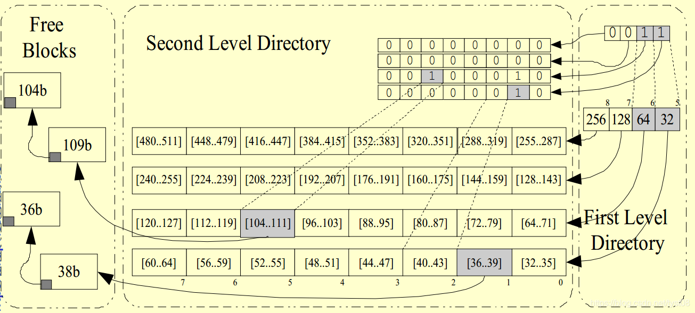

内存管理相关篇为: 

* [v31.02 鸿蒙内核源码分析(内存规则) | 内存管理到底在管什么](/blog/31.md)
* [v32.04 鸿蒙内核源码分析(物理内存) | 真实的可不一定精彩](/blog/32.md)
* [v33.04 鸿蒙内核源码分析(内存概念) | RAM & ROM & Flash](/blog/33.md)
* [v34.03 鸿蒙内核源码分析(虚实映射) | 映射是伟大的发明](/blog/34.md)
* [v35.02 鸿蒙内核源码分析(页表管理) | 映射关系保存在哪](/blog/35.md)
* [v36.03 鸿蒙内核源码分析(静态分配) | 很简单的一位小朋友](/blog/36.md)
* [v37.01 鸿蒙内核源码分析(TLFS算法) | 图表解读TLFS原理 ](/blog/37.md)
* [v38.01 鸿蒙内核源码分析(内存池管理) | 如何高效切割合并内存块 ](/blog/38.md)
* [v39.04 鸿蒙内核源码分析(原子操作) | 谁在守护指令执行的完整性](/blog/39.md)
* [v40.01 鸿蒙内核源码分析(圆整对齐) | 正在制作中 ... ](/blog/40.md)

### 动态分配

本篇开始说一个耳朵听起老茧的概念 **动态分配**，将分成上下两篇，本篇为上篇，看完能快速理解下篇鸿蒙内核源码对动态内存的具体实现。

* **鸿蒙内核源码分析(TLFS算法)** 结合图表从理论视角说清楚 **TLFS** 算法
* **鸿蒙内核源码分析(内存池管理)** 结合源码说清楚鸿蒙内核动态内存池实现过程，个人认为这部分代码很精彩，简洁高效，尤其对空闲节点和已使用节点的实现令人称奇。
  
### TLFS 原理

**TLSF(Two-Level Segregate Fit)** 是一种用于实时操作系统的内存分配算法，用两级结构对空闲块按大小进行划分，采用两级链表/索引的方式来加快查找。[详细可查看 >> TLSF 论文](http://www.gii.upv.es/tlsf/files/ecrts04_tlsf.pdf) 。

把上图看懂基本能明白 **TLFS** 的原理，请尝试自己先理解一遍再看本篇。

**解读**

* 为方便理解 ，将上图做成(**表一**)，中间过程请查看图表变化
  
  |步骤|操作|一级位图 (FL_bitmap)|二级位图 (SL_bitmaps[])|空闲链表(大小-虚拟地址)|
  |-|-|-|-|-|
  |第一步|**初始阶段**|0011| 00000000 00000000 00**1**00000 000000**1**0|  109b(0x5625) --> 104b(0x6838)   38b(0x3457) --> 36b(0xed31)  |

* 右边为第一级链表 `First List` (简称`fl`)。将空闲内存块的大小根据`2`的幂进行分类，如（32、64、128、...）， 这跟伙伴算法很类似，伙伴算法是物理内存的分配算法，这样做的好处是防止外部碎片化，是否空闲用位图标识 **FL_bitmap | 一维数组**，`0011`代表 `[32-64]、[64-128]`这个区间有内存可以申请，例如： **malloc(37)** 时，查到在区间`[32-64]`中，为 `1`代表本次可能可以申请到内存，但具体行不行得进入第二级查看。
* 中间为第二级链表 `Second List` (简称`sl`)。第二层链表在第一层的基础上，按照一定的间隔，线性分段，图中将其分成 `8`等份，对于`[32-64]`来说 `1/8`为`4`，对于`[64 - 128]`来说 `1/8`为`8`，可以确定的是等份也是`2`的倍数，同样是否空闲用位图标识**SL_bitmaps[] | 二维数组** ，每个bit代表是否空闲，图中代表 `[36 - 39]`有内存可供分配，再查看其空闲链表发现真正可供分配的空间有两块，`38 和 36`，自然将 `38` 给  **malloc(37)** 返回，此时空闲链表中还剩`36`节点 ，所以 一二级位图数据不会有任何的变化。
* 左边为空闲链表块，上面挂`fl`，`sl`都为`1`时的空闲内存块，块大小为区间范围值，图中有两个空闲块 `38b --> 36b`，`109b --> 104b`，在实际运行过程往往出现同样大小的内存块例如`38b --> 36b--> 36b`

### 申请过程

用二次申请说明详细过程

* **malloc(37)** ，发现值在区间`[32-64]`并对应`fl`的位图为`1`，说明`sl`中肯定会有一个`1`，但并不能保证能申请到。得细看第二步`sl`发现区间`[36 - 39]`的位图为`1`，说明空闲链表中肯定会有一块内存，，但也不能保证大小适合`37`。再看最后一步，发现有两块内存`38b --> 36b`，只有`38b`符合，于是 **malloc(37)** 的结果是获得了一块大小`38b`的内存块，相差的一个 `1b`称为内部碎片，这种碎片无法避免。将(**表一**)更新为(**表二**)

  |步骤|操作|一级位图 (FL_bitmap)|二级位图 (SL_bitmaps[])|空闲链表(大小-虚拟地址)|
  |-|-|-|-|-|
  |第一步|**初始阶段**|0011| 00000000 00000000 00**1**00000 000000**1**0|  109b(0x5625) --> 104b(0x6838)   38b(0x3457) --> 36b(0xed31)  |
  |第二步|**malloc(37)** **返回地址0x3457**|0011| 00000000 00000000 00**1**00000 000000**1**0| 109b(0x5625) --> 104b(0x6838)   36b(0xed31)  |

* **malloc(50)**，同样落在`[32-64]`查看`fl`的位图为`1`，查看第二步`sl`只有`[36 - 39]`的位图为`1`，而 **50 > 39**，不能满足所以没必要看第三步，得返回第一步往上走发现`[64-128]`的`fl`的位图为`1`，**50 < 64** 说明 **malloc(50)** 这次肯定能申请到内存了，查看`[64-128]`对应的`sl`发现`[104-111]`的位图为`1`，到第三步发现有`109b --> 104b`两块，选择其中更小`104b`的块切割成`50`，`54`两小块，此时要对`54`处理挂入空闲链表，`54`处于`fl = [32-64]`， `sl = [52-55]`区间，地址为: **0x6838+50=0x686A** 。所以将`[52-55]`区间位图置为`1`，并挂入空闲链表。将(**表二**)更新为(**表三**)

  |步骤|操作|一级位图 (FL_bitmap)|二级位图 (SL_bitmaps[])|空闲链表(大小-虚拟地址)|
  |-|-|-|-|-|
  |第一步|**初始阶段**|0011| 00000000 00000000 00**1**00000 000000**1**0|  109b(0x5625) --> 104b(0x6838)   38b(0x3457) --> 36b(0xed31)  |
  |第二步|**malloc(37)** **返回地址0x3457**|0011| 00000000 00000000 00**1**00000 000000**1**0| 109b(0x5625) --> 104b(0x6838)   36b(0xed31)  |
  |第三步|**malloc(50)** **返回地址0x6838**|0011| 00000000 00000000 00**1**00000 00**1**000**1**0| 109b(0x5625)   54b(0x686A)    36b(0xed31)  |

  注意此时`[32-64]`的二级位图变成了 00**1**000**1**0 有两个`1`

### 释放过程

同样用二次释放说明详细过程

* **free(0x3457)** 从地址可知正是上面的 **malloc(37)**的内存，与分配切割相对应的是释放有合并的步骤，但**malloc(37)**虽然申请是`37`，但其实内核记录的内存块大小是`38`，所以会找寻地址为 **0x3457 + 38 = 0x348F** 的地址是否也处于空闲，如果是则合并，由**表三**可知 并没有 **0x348F**的空闲块将，而`38`位于`fl = [32-64]`，`sl = [36-39]`区间，所以挂回该空闲链表等待后续再分配使用，由此(**表三**)更新为(**表四**)

  |步骤|操作|一级位图 (FL_bitmap)|二级位图 (SL_bitmaps[])|空闲链表(大小-虚拟地址)|
  |-|-|-|-|-|
  |第一步|**初始阶段**|0011| 00000000 00000000 00**1**00000 000000**1**0|  109b(0x5625) --> 104b(0x6838)   38b(0x3457) --> 36b(0xed31)  |
  |第二步|**malloc(37)** **返回地址0x3457**|0011| 00000000 00000000 00**1**00000 000000**1**0| 109b(0x5625) --> 104b(0x6838)   36b(0xed31)  |
  |第三步|**malloc(50)** **返回地址0x6838**|0011| 00000000 00000000 00**1**00000 00**1**000**1**0| 109b(0x5625)   54b(0x686A)    36b(0xed31)  |
  |第四步|**free(0x3457)**|0011| 00000000 00000000 00**1**00000 00**1**000**1**0|109b(0x5625)  54b(0x686A)     38b(0x3457) --> 36b(0xed31)  |

* **free(0x5610)** 这里假设内核记录该内存块大小为 **0x15**，归还的同时会找寻**0x5610 + 0x15 = 0x5625** 是否有空闲块，发现`sl = [104-111]`有一块`109b`空闲块，两块合成一块大小为 **109 + 0x15 = 109 + 21 = 130**，位于`fl = [128-255]`，`sl = [128-143]`区间，由此(**表四**)再更新为(**表五**)  

  |步骤|操作|一级位图 (FL_bitmap)|二级位图 (SL_bitmaps[])|空闲链表(大小-虚拟地址)|
  |-|-|-|-|-|
  |第一步|**初始阶段**|0011| 00000000 00000000 00**1**00000 000000**1**0|  109b(0x5625) --> 104b(0x6838)   38b(0x3457) --> 36b(0xed31)  |
  |第二步|**malloc(37)** **返回地址0x3457**|0011| 00000000 00000000 00**1**00000 000000**1**0| 109b(0x5625) --> 104b(0x6838)   36b(0xed31)  |
  |第三步|**malloc(50)** **返回地址0x6838**|0011| 00000000 00000000 00**1**00000 00**1**000**1**0| 109b(0x5625)   54b(0x686A)    36b(0xed31)  |
  |第四步|**free(0x3457)**|0011| 00000000 00000000 00**1**00000 00**1**000**1**0|109b(0x5625)  54b(0x686A)     38b(0x3457) --> 36b(0xed31)  |
  |第五步|**free(0x5610)**|0101| 00000000 0000000**1** 00000000 00**1**000**1**0|  130b(0x5610)   54b(0x686A)   38b(0x3457) --> 36b(0xed31)   |

### 总结

**TLSF(Two-Level Segregate Fit)** 有两大优点：

* 实时性，执行速度快，只需查询位图就能知道结果，最多查询两次一级位图，时间复杂度为O(1)。
* 碎片少，浪费少，利用率高，因采用2次幂的方式，切割和合并非常的方便，很少出现外部碎片。

真正的鸿蒙内存动态分配实现过程比这些要复杂些，但有了本文算法基础做铺垫看源码实现会容易很多。

  

