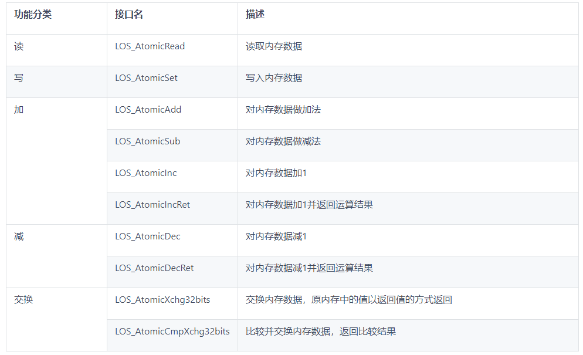

内存管理相关篇为: 

* [v31.02 鸿蒙内核源码分析(内存规则) | 内存管理到底在管什么](/blog/31.md)
* [v32.04 鸿蒙内核源码分析(物理内存) | 真实的可不一定精彩](/blog/32.md)
* [v33.04 鸿蒙内核源码分析(内存概念) | RAM & ROM & Flash](/blog/33.md)
* [v34.03 鸿蒙内核源码分析(虚实映射) | 映射是伟大的发明](/blog/34.md)
* [v35.02 鸿蒙内核源码分析(页表管理) | 映射关系保存在哪](/blog/35.md)
* [v36.03 鸿蒙内核源码分析(静态分配) | 很简单的一位小朋友](/blog/36.md)
* [v37.01 鸿蒙内核源码分析(TLFS算法) | 图表解读TLFS原理 ](/blog/37.md)
* [v38.01 鸿蒙内核源码分析(内存池管理) | 如何高效切割合并内存块 ](/blog/38.md)
* [v39.04 鸿蒙内核源码分析(原子操作) | 谁在守护指令执行的完整性](/blog/39.md)
* [v40.01 鸿蒙内核源码分析(圆整对齐) | 正在制作中 ... ](/blog/40.md)


### 本篇说清楚原子操作

读本篇之前建议先读 v08.xx 鸿蒙内核源码分析(总目录)  系列篇.

### 基本概念

在支持多任务的操作系统中,修改一块内存区域的数据需要"读取-修改-写入"三个步骤.然而同一内存区域的数据可能同时被多个任务访问,如果在修改数据的过程中被其他任务打断,就会造成该操作的执行结果无法预知.

使用开关中断的方法固然可以保证多任务执行结果符合预期,但这种方法显然会影响系统性能.

`ARMv6`架构引入了`LDREX`和`STREX`指令,以支持对共享存储器更缜密的非阻塞同步.由此实现的原子操作能确保对同一数据的"读取-修改-写入"操作在它的执行期间不会被打断,即操作的原子性.

有多个任务对同一个内存数据进行加减或交换操作时,使用原子操作保证结果的可预知性.

看过 v08.xx 鸿蒙内核源码分析(总目录)  自旋锁篇的应该对LDREX和STREX指令不陌生的,自旋锁的本质就是对某个变量的原子操作,而且一定要通过汇编代码实现,也就是说`LDREX`和`STREX`指令保证了原子操作的底层实现.
回顾下自旋锁申请和释放锁的汇编代码.

### **ArchSpinLock 申请锁代码**

```assembly
    FUNCTION(ArchSpinLock)  @死守,非要拿到锁
        mov     r1, #1      @r1=1
    1:                      @循环的作用,因SEV是广播事件.不一定lock->rawLock的值已经改变了
        ldrex   r2, [r0]    @r0 = &lock->rawLock, 即 r2 = lock->rawLock
        cmp     r2, #0      @r2和0比较
        wfene               @不相等时,说明资源被占用,CPU核进入睡眠状态
        strexeq r2, r1, [r0]@此时CPU被重新唤醒,尝试令lock->rawLock=1,成功写入则r2=0
        cmpeq   r2, #0      @再来比较r2是否等于0,如果相等则获取到了锁
        bne     1b          @如果不相等,继续进入循环
        dmb                 @用DMB指令来隔离,以保证缓冲中的数据已经落实到RAM中
        bx      lr          @此时是一定拿到锁了,跳回调用ArchSpinLock函数
```

### **ArchSpinUnlock 释放锁代码**

```assembly
    FUNCTION(ArchSpinUnlock)    @释放锁
        mov     r1, #0          @r1=0               
        dmb                     @数据存储隔离,以保证缓冲中的数据已经落实到RAM中
        str     r1, [r0]        @令lock->rawLock = 0
        dsb                     @数据同步隔离
        sev                     @给各CPU广播事件,唤醒沉睡的CPU们
        bx      lr              @跳回调用ArchSpinLock函数
```

### **运作机制**

鸿蒙通过对`ARMv6`架构中的`LDREX`和`STREX`进行封装,向用户提供了一套原子操作接口.

* LDREX Rx, [Ry]
    读取内存中的值,并标记对该段内存为独占访问:
  * 读取寄存器Ry指向的4字节内存数据,保存到Rx寄存器中.
  * 对Ry指向的内存区域添加独占访问标记.
* STREX Rf, Rx, [Ry]
    检查内存是否有独占访问标记,如果有则更新内存值并清空标记,否则不更新内存:
  * 有独占访问标记
    * 将寄存器Rx中的值更新到寄存器Ry指向的内存.
    * 标志寄存器Rf置为0.
  * 没有独占访问标记
    * 不更新内存.
    * 标志寄存器Rf置为1.
* 判断标志寄存器
    标志寄存器为0时,退出循环,原子操作结束.
    标志寄存器为1时,继续循环,重新进行原子操作.

### **功能列表**

原子数据包含两种类型Atomic(有符号32位数)与 Atomic64(有符号64位数).原子操作模块为用户提供下面几种功能,接口详细信息可以查看源码.



此处讲述 `LOS_AtomicAdd` , `LOS_AtomicSub`,`LOS_AtomicRead`,`LOS_AtomicSet`
理解了函数的汇编代码是理解的原子操作的关键.

### **LOS_AtomicAdd**

```c
//对内存数据做加法
STATIC INLINE INT32 LOS_AtomicAdd(Atomic *v, INT32 addVal) 
{
    INT32 val;
    UINT32 status;
    do {
        __asm__ __volatile__("ldrex   %1, [%2]\n"
                             "add   %1, %1, %3\n" 
                             "strex   %0, %1, [%2]"
                             : "=&r"(status), "=&r"(val)
                             : "r"(v), "r"(addVal)
                             : "cc");
    } while (__builtin_expect(status != 0, 0));
    return val;
}
```

**这是一段C语言内嵌汇编,逐一解读**

* 先将  `status` `val`  `v` `addVal`的值交由通用寄存器 `R0~R3`接管.
* `%2` 代表了入参 `v` , `[%2]` 代表的是参数 `v` 指向地址的值,也就是 `*v` ,函数要独占的就是它;
* `%0 ~ %3` 对应 `status` `val`  `v` `addVal`
* `ldrex   %1, [%2]` 表示 `val = *v` ;
* `add %1, %1, %3` 表示 `val = val + addVal` ;
* `strex   %0, %1, [%2]` 表示  `*v = val` ;
* status 表示是否更新成功,成功了置0,不成功则为 1
* `__builtin_expect` 是结束循环的判断语句,将最有可能执行的分支告诉编译器.这个指令的写法为:
```c
__builtin_expect(EXP, N)
```
​    意思是:`EXP==N` 的概率很大.综合理解`__builtin_expect(status != 0, 0)`,说的是 `status = 0` 的可能性很大,不成功就会重新来一遍,直到 `strex` 更新成 `(status == 0)` 为止;
* `"=&r"(val)` 被修饰的操作符作为输出,即将寄存器的值回给 `val` ,`val` 为函数的返回值;
* `"cc"` 向编译器声明以上信息.

### **LOS_AtomicSub**

```c
//对内存数据做减法
STATIC INLINE INT32 LOS_AtomicSub(Atomic *v, INT32 subVal) 
{
    INT32 val;
    UINT32 status;
    do {
        __asm__ __volatile__("ldrex   %1, [%2]\n"
                             "sub   %1, %1, %3\n"
                             "strex   %0, %1, [%2]"
                             : "=&r"(status), "=&r"(val)
                             : "r"(v), "r"(subVal)
                             : "cc");
    } while (__builtin_expect(status != 0, 0));
    return val;
}
```

**解读**

* 同 `LOS_AtomicAdd`解读

### **volatile**

这里要重点说下`volatile`,`volatile` 提醒编译器它后面所定义的变量随时都有可能改变,因此编译后的程序每次需要存储或读取这个变量的时候,**都要直接从变量地址中读取数据**.如果没有`volatile`关键字,则编译器可能优化读取和存储,可能暂时使用寄存器中的值,如果这个变量由别的程序更新了的话,将出现不一致的现象.

```c
//读取内存数据
STATIC INLINE INT32 LOS_AtomicRead(const Atomic *v) 
{
    return *(volatile INT32 *)v;
}
//写入内存数据
STATIC INLINE VOID LOS_AtomicSet(Atomic *v, INT32 setVal) 
{
    *(volatile INT32 *)v = setVal;
}
```

### **编程实例**

调用原子操作相关接口,观察结果:

1.创建两个任务

* 任务一用LOS_AtomicAdd对全局变量加100次.
* 任务二用LOS_AtomicSub对全局变量减100次.

2.子任务结束后在主任务中打印全局变量的值.

```c
#include "los_hwi.h"
#include "los_atomic.h"
#include "los_task.h"

UINT32 g_testTaskId01;
UINT32 g_testTaskId02;
Atomic g_sum;
Atomic g_count;

UINT32 Example_Atomic01(VOID)
{
    int i = 0;
    for(i = 0; i < 100; ++i) {
        LOS_AtomicAdd(&g_sum,1);
    }
    LOS_AtomicAdd(&g_count,1);
    return LOS_OK;
}

UINT32 Example_Atomic02(VOID)
{
    int i = 0;
    for(i = 0; i < 100; ++i) {
        LOS_AtomicSub(&g_sum,1);
    }
    LOS_AtomicAdd(&g_count,1);
    return LOS_OK;
}

UINT32 Example_TaskEntry(VOID)
{
    TSK_INIT_PARAM_S stTask1={0};
    stTask1.pfnTaskEntry = (TSK_ENTRY_FUNC)Example_Atomic01;
    stTask1.pcName       = "TestAtomicTsk1";
    stTask1.uwStackSize  = LOSCFG_BASE_CORE_TSK_DEFAULT_STACK_SIZE;
    stTask1.usTaskPrio   = 4;
    stTask1.uwResved     = LOS_TASK_STATUS_DETACHED;
    TSK_INIT_PARAM_S stTask2={0};
    stTask2.pfnTaskEntry = (TSK_ENTRY_FUNC)Example_Atomic02;
    stTask2.pcName       = "TestAtomicTsk2";
    stTask2.uwStackSize  = LOSCFG_BASE_CORE_TSK_DEFAULT_STACK_SIZE;
    stTask2.usTaskPrio   = 4;
    stTask2.uwResved     = LOS_TASK_STATUS_DETACHED;
    LOS_TaskLock();
    LOS_TaskCreate(&g_testTaskId01, &stTask1);
    LOS_TaskCreate(&g_testTaskId02, &stTask2);
    LOS_TaskUnlock();
    while(LOS_AtomicRead(&g_count) != 2);
    dprintf("g_sum = %d\n", g_sum);
    return LOS_OK;
}
```

### **结果验证**

```c
g_sum = 0
```


  

