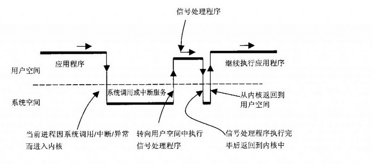

通讯机制相关篇为: 

* [v41.04 鸿蒙内核源码分析(通讯总览) | 内核跟人一样都喜欢八卦](/blog/41.md)
* [v42.08 鸿蒙内核源码分析(自旋锁) | 死等丈夫归来的贞洁烈女](/blog/42.md)
* [v43.05 鸿蒙内核源码分析(互斥锁) | 有你没她 相安无事](/blog/43.md)
* [v44.02 鸿蒙内核源码分析(快锁使用) | 用户态负责快锁逻辑](/blog/44.md)
* [v45.02 鸿蒙内核源码分析(快锁实现) | 内核态负责快锁调度](/blog/45.md)
* [v46.01 鸿蒙内核源码分析(读写锁) | 内核如何实现多读单写](/blog/46.md)
* [v47.05 鸿蒙内核源码分析(信号量) | 谁在解决任务间的同步](/blog/47.md)
* [v48.07 鸿蒙内核源码分析(事件机制) | 多对多任务如何同步](/blog/48.md)
* [v49.05 鸿蒙内核源码分析(信号生产) | 年过半百 活力十足](/blog/49.md)
* [v50.03 鸿蒙内核源码分析(信号消费) | 谁让CPU连续四次换栈运行](/blog/50.md)
* [v51.03 鸿蒙内核源码分析(消息队列) | 进程间如何异步传递大数据](/blog/51.md)
* [v52.02 鸿蒙内核源码分析(消息封装) | 剖析LiteIpc(上)进程通讯内容](/blog/52.md)
* [v53.01 鸿蒙内核源码分析(消息映射) | 剖析LiteIpc(下)进程通讯机制](/blog/53.md)
* [v54.01 鸿蒙内核源码分析(共享内存) | 进程间最快通讯方式](/blog/54.md)


### 通讯需求

鸿蒙内核默认支持 `64`个进程和`128`个任务，由进程池和任务池统一管理。内核设计尽量不去打扰它们，让各自过好各自的小日子，但大家毕竟在一口锅里吃饭，再宅的宅男也要出门办事，出了门磕磕碰碰就在所难免了，有了纠纷就需要解决，社区问题可以找居委会刘大妈，家庭问题可以找德高望重的七舅姥爷，社会问题可以报警，法律问题可以打官司仲裁。总之天塌不下来，需求决定了解决方案，不存在只有需求没有解决方案的情况，至少不会长期存在，想想是不是这个道理。

### 通信方式

**(1).数据传输：** 一个进程需要将它的数据发送给另一个进程，发送的数据量在一个字节到KB字节之间。(liteipc消息队列默认1K)

**(2).共享数据:** 多个进程想要操作共享数据，一个进程对共享数据的修改，别的进程应该立刻看到。

**(3).通知事件：** 一个进程需要向另一个或一组进程发送消息，通知它（它们）发生了某种事件（如进程终止时要通知父进程）。

### **进程间九种通讯方式**

### 1.管道pipe([fs_syscall.c](https://gitee.com/weharmony/kernel_liteos_a_note/tree/master/syscall/fs_syscall.c))

管道是一种最基本的IPC机制，作用于有血缘关系的进程之间，完成数据传递。
调用pipe系统函数即可创建一个管道。有如下特质：

1. 其本质是一个伪文件(实为内核缓冲区)

2. 由两个文件描述符引用，一个表示读端，一个表示写端。

3. 规定数据从管道的写端流入管道，从读端流出。

管道的原理: 管道实为内核使用环形队列机制，借助内核缓冲区(4k)实现。
管道的局限性：
① 数据自己读不能自己写。
② 数据一旦被读走，便不在管道中存在，不可反复读取。
③ 由于管道采用半双工通信方式。因此，数据只能在一个方向上流动。
④ 只能在有公共祖先的进程间使用管道。
常见的通信方式有，单工通信、半双工通信、全双工通信。

这部分后系列篇文件相关篇中会重点讲，敬请关注。 详细看 **SysPipe** 函数。

### 2.信号([los_signal.c](https://gitee.com/weharmony/kernel_liteos_a_note/tree/master/kernel/base/ipc/los_signal.c))

信号思想来自Unix，在发展了50年之后，许多方面都没有发生太大的变化。信号可以由内核产生，也可以由用户进程产生，并由内核传送给特定的进程或线程(组)，若这个进程注册/安装了自己的信号处理程序，则内核会调用这个函数去处理信号，否则则执行默认的函数或者忽略。信号分为两大类：可靠信号与不可靠信号，前32种信号为不可靠信号，后32种为可靠信号。长这样:

```c
#define SIGHUP    1 //终端挂起或者控制进程终止
#define SIGINT    2 //键盘中断（如break键被按下）
#define SIGQUIT   3 //键盘的退出键被按下
#define SIGILL    4 //非法指令
#define SIGTRAP   5 //跟踪陷阱（trace trap），启动进程，跟踪代码的执行
#define SIGABRT   6 //由abort(3)发出的退出指令
#define SIGIOT    SIGABRT 
#define SIGBUS    7 //总线错误 
#define SIGFPE    8 //浮点异常
#define SIGKILL   9  //常用的命令 kill 9 13 
#define SIGUSR1   10 //用户自定义信号1 
```

信号为系统提供了一种进程间异步通讯的方式，一个进程不必通过任何操作来等待信号的到达。事实上，进程也不可能知道信号到底什么时候到达。一般来说，只需用户进程提供信号处理函数，内核会想方设法调用信号处理函数，处理过程如图所示:



个人把这种异步通讯过程理解为生产者(安装和发送信号)和消费者(捕捉和处理信号)两个部分，分姊妹两篇已完成

* v48.xx (信号生产篇) | 年过半百，依然活力十足
* v49.xx (信号消费篇) | 谁让CPU连续四次换栈运行

### 3.消息队列([los_queue.c](https://gitee.com/weharmony/kernel_liteos_a_note/tree/master/kernel/base/ipc/los_queue.c))

**基本概念**

队列又称消息队列，是一种常用于任务间通信的数据结构。队列接收来自任务或中断的
不固定长度消息，并根据不同的接口确定传递的消息是否存放在队列空间中。

任务能够从队列里面读取消息，当队列中的消息为空时，挂起读取任务；当队列中有新消息时，
挂起的读取任务被唤醒并处理新消息。任务也能够往队列里写入消息，当队列已经写满消息时，
挂起写入任务；当队列中有空闲消息节点时，挂起的写入任务被唤醒并写入消息。如果将
读队列和写队列的超时时间设置为0，则不会挂起任务，接口会直接返回，这就是非阻塞模式。

消息队列提供了异步处理机制，允许将一个消息放入队列，但不立即处理。同时队列还有缓冲消息的作用。

**队列特性**

消息以先进先出的方式排队，支持异步读写。
读队列和写队列都支持超时机制。
每读取一条消息，就会将该消息节点设置为空闲。
发送消息类型由通信双方约定，可以允许不同长度（不超过队列的消息节点大小）的消息。
一个任务能够从任意一个消息队列接收和发送消息。
多个任务能够从同一个消息队列接收和发送消息。
创建队列时所需的队列空间，默认支持接口内系统自行动态申请内存的方式，同时也支持将用户分配的队列空间作为接口入参传入的方式。

详细可前往查看:

* [v33.xx (消息队列篇) | 进程间如何异步解耦传递大数据 ？](https://my.oschina.net/weharmony/blog/4952961)
  
### 4.共享内存([shm.c](https://gitee.com/weharmony/kernel_liteos_a_note/tree/master/kernel/base/vm/shm.c))

共享内存是进程间通信中最简单的方式之一。共享内存允许两个或更多进程访问同一块物理内存，每个进程都要单独对这块物理内存进行映射。当一个进程改变了这块地址中的内容的时候，该物理页框将被标记为脏页，如此其它进程都会知道内容发生了更改。

这部分后系列篇内存相关篇中会重点讲，内存部分虽已写过几篇，但是没讲透，要重新再梳理。

### 5.信号量([los_sem.c](https://gitee.com/weharmony/kernel_liteos_a_note/tree/master/kernel/base/ipc/los_sem.c))

**基本概念**

信号量（Semaphore）是一种实现任务间通信的机制，可以实现任务间同步或共享资源的互斥访问。
一个信号量的数据结构中，通常有一个计数值，用于对有效资源数的计数，表示剩下的可被使用的共享资源数。

对信号量有个形象的比喻 停车场的停车位， 进停车场前看下屏幕上实时显示剩余车位，0表示不能进，只有大于0才能进入，进入后自动减1，出口处也加了监测，出去后剩余车位增加1个。

**使用场景**

在多任务系统中，信号量是一种非常灵活的同步方式，可以运用在多种场合中，实现锁、同步、资源计数等功能，
也能方便的用于任务与任务，中断与任务的同步中。常用于协助一组相互竞争的任务访问共享资源。

详细可前往查看:

* v29.xx (信号量篇) | 信号量解决任务同步问题

### 6.互斥锁 ([los_mux.c](https://gitee.com/weharmony/kernel_liteos_a_note/tree/master/kernel/base/ipc/los_mux.c))

**基本概念**

互斥锁又称互斥型信号量，是一种特殊的二值性信号量，用于实现对临界资源的独占式处理。
另外，互斥锁可以解决信号量存在的优先级翻转问题。
任意时刻互斥锁只有两种状态，开锁或闭锁。当任务持有时，这个任务获得该互斥锁的所有权，
互斥锁处于闭锁状态。当该任务释放锁后，任务失去该互斥锁的所有权，互斥锁处于开锁状态。
当一个任务持有互斥锁时，其他任务不能再对该互斥锁进行开锁或持有。

详细可前往查看:

* v27.xx (互斥锁篇) | 互斥锁比自旋锁可丰满许多
* v26.xx (自旋锁篇) | 真的好想为自旋锁立贞节牌坊!

### 7.快锁 ([los_futex.c](https://gitee.com/weharmony/kernel_liteos_a_note/tree/master/kernel/base/ipc/base/los_futex.c))

futex 是Fast Userspace muTexes的缩写(快速用户空间互斥体)，是一种用户态和内核态混合的同步机制。首先，同步的进程间通过mmap共享一段内存，futex变量就位于这段共享的内存中且操作是原子的，当进程尝试进入互斥区或者退出互斥区的时候，先去查看共享内存中的futex变量，如果没有竞争发生，则只修改futex，而不用再执行系统调用了。当通过访问futex变量告诉进程有竞争发生，则还是得执行系统调用去完成相应的处理(wait 或者 wake up)。

注解版同步到官方最新源码后，发现快锁的部分改动很大，这部分要重新注解，敬请留意。

### 8.事件 ([los_event.c](https://gitee.com/weharmony/kernel_liteos_a_note/tree/master/kernel/base/ipc/los_event.c))

**基本概念**
事件（Event）是一种任务间通信的机制，可用于任务间的同步。

多任务环境下，任务之间往往需要同步操作，一个等待即是一个同步。事件可以提供一对多、多对多的同步操作。
一对多同步模型：一个任务等待多个事件的触发。可以是任意一个事件发生时唤醒任务处理事件，也可以是几个事件都发生后才唤醒任务处理事件。
多对多同步模型：多个任务等待多个事件的触发。

**事件特点**

任务通过创建事件控制块来触发事件或等待事件。
事件间相互独立，内部实现为一个32位无符号整型，每一位标识一种事件类型。第25位不可用，因此最多可支持31种事件类型。
事件仅用于任务间的同步，不提供数据传输功能。
多次向事件控制块写入同一事件类型，在被清零前等效于只写入一次。
多个任务可以对同一事件进行读写操作。
支持事件读写超时机制。

事件可应用于多种任务同步场景，在某些同步场景下可替代信号量。

**使用场景**

队列用于任务间通信，可以实现消息的异步处理。同时消息的发送方和接收方不需要彼此联系，两者间是解耦的。

详细可前往查看:

* v30.xx (事件控制篇) | 任务间多对多的同步方案

### 9.文件消息队列 ([hm_liteipc.c](https://gitee.com/weharmony/kernel_liteos_a_note/tree/master/kernel/extended/liteipc/hm_liteipc.c))

基于文件实现的消息队列，特点是队列中消息数量多(256个)，传递消息内容大(可到1K)

```c
#define IPC_MSG_DATA_SZ_MAX 1024 //最大的消息内容 1K ，posix最大消息内容 64个字节
#define IPC_MSG_OBJECT_NUM_MAX 256 //最大的消息数量256 ，posix最大消息数量 16个
```

文件消息队列隐约感觉鸿蒙的分布式通讯，跨屏之类的功能是靠它实现的，分布式的代码还没研究，尚不清楚，如果有了解的请告知。后续要重点研究下跨应用通讯的技术实现。


  

