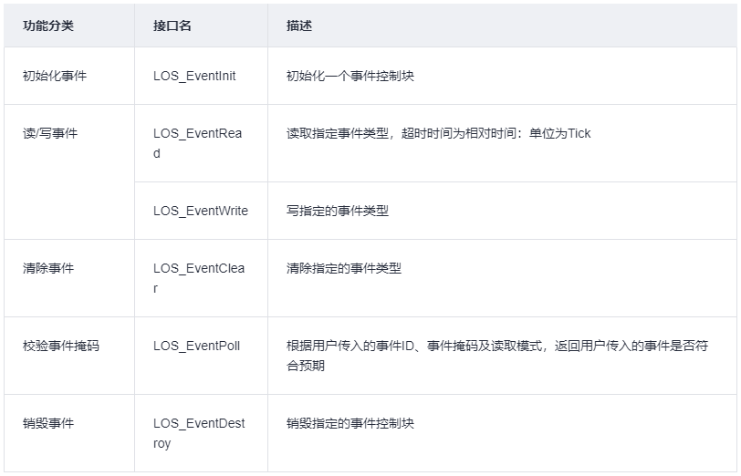
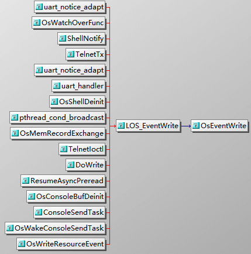
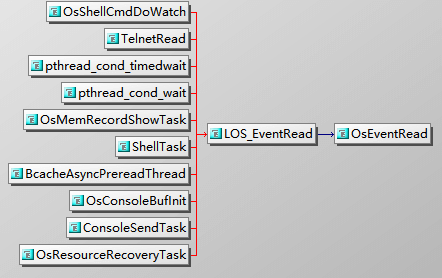

通讯机制相关篇为: 

* [v41.04 鸿蒙内核源码分析(通讯总览) | 内核跟人一样都喜欢八卦](/blog/41.md)
* [v42.08 鸿蒙内核源码分析(自旋锁) | 死等丈夫归来的贞洁烈女](/blog/42.md)
* [v43.05 鸿蒙内核源码分析(互斥锁) | 有你没她 相安无事](/blog/43.md)
* [v44.02 鸿蒙内核源码分析(快锁使用) | 用户态负责快锁逻辑](/blog/44.md)
* [v45.02 鸿蒙内核源码分析(快锁实现) | 内核态负责快锁调度](/blog/45.md)
* [v46.01 鸿蒙内核源码分析(读写锁) | 内核如何实现多读单写](/blog/46.md)
* [v47.05 鸿蒙内核源码分析(信号量) | 谁在解决任务间的同步](/blog/47.md)
* [v48.07 鸿蒙内核源码分析(事件机制) | 多对多任务如何同步](/blog/48.md)
* [v49.05 鸿蒙内核源码分析(信号生产) | 年过半百 活力十足](/blog/49.md)
* [v50.03 鸿蒙内核源码分析(信号消费) | 谁让CPU连续四次换栈运行](/blog/50.md)
* [v51.03 鸿蒙内核源码分析(消息队列) | 进程间如何异步传递大数据](/blog/51.md)
* [v52.02 鸿蒙内核源码分析(消息封装) | 剖析LiteIpc(上)进程通讯内容](/blog/52.md)
* [v53.01 鸿蒙内核源码分析(消息映射) | 剖析LiteIpc(下)进程通讯机制](/blog/53.md)
* [v54.01 鸿蒙内核源码分析(共享内存) | 进程间最快通讯方式](/blog/54.md)


### 本篇说清楚事件(Event)

读本篇之前建议先读 v08.xx 鸿蒙内核源码分析(总目录)  其他篇.

### **官方概述**

先看官方对事件的描述.

事件(Event)是一种任务间通信的机制,可用于任务间的同步.

多任务环境下,任务之间往往需要同步操作,一个等待即是一个同步.事件可以提供一对多,多对多的同步操作.

+ 一对多同步模型:一个任务等待多个事件的触发.可以是任意一个事件发生时唤醒任务处理事件,也可以是几个事件都发生后才唤醒任务处理事件.
  
+ 多对多同步模型:多个任务等待多个事件的触发.

鸿蒙提供的事件具有如下特点:

+ 任务通过创建事件控制块来触发事件或等待事件.
+ 事件间相互独立,内部实现为一个32位无符号整型,每一位标识一种事件类型.第25位不可用,因此最多可支持31种事件类型.
+ 事件仅用于任务间的同步,不提供数据传输功能.
+ 多次向事件控制块写入同一事件类型,在被清零前等效于只写入一次.
+ 多个任务可以对同一事件进行读写操作.
+ 支持事件读写超时机制.

### **再看事件图**


注意图中提到了三个概念 **`事件控制块`** **`事件`** **`任务`**
接下来结合代码来理解事件模块的实现.

### **事件控制块长什么样？**

```c
typedef struct tagEvent {
    //标识发生的事件类型位,事件ID,每一位标识一种事件类型
    UINT32 uwEventID;        /**< Event mask in the event control block,
                                  indicating the event that has been logically processed. */
    //读取事件任务链表
    LOS_DL_LIST stEventList; /**< Event control block linked list */
} EVENT_CB_S, *PEVENT_CB_S;
```

简单是简单,就两个变量,如下:
`uwEventID`:用于标识该任务发生的事件类型,其中每一位表示一种事件类型(0表示该事件类型未发生,1表示该事件类型已经发生),一共31种事件类型,第25位系统保留.

`stEventList`,这又是一个双向链表, 双向链表是内核最重要的结构体, 可前往 [v08.xx 鸿蒙内核源码分析(总目录)](https://my.oschina.net/weharmony) 查看双向链表篇.
`LOS_DL_LIST`像狗皮膏药一样牢牢的寄生在宿主结构体上`stEventList`上挂的是所有等待这个事件的任务.

### **事件控制块<>事件<>任务 三者关系**

一定要搞明白这三者的关系,否则搞不懂事件模块是如何运作的.

+ 任务是事件的生产者,通过 `LOS_EventWrite`,向外部广播发生了XX事件,并唤醒此前已在事件控制块中登记过的要等待XX事件发生的XX任务.

+ 事件控制块`EVENT_CB_S` 是记录者,只干两件事件:
  
  1.`uwEventID`按位记录哪些事件发生了,它只是记录,怎么消费它不管的.

  2.`stEventList`记录哪些任务在等待事件,但任务究竟在等待哪些事件它也是不记录的

+ 任务也是消费者,通过 `LOS_EventRead`消费,只有任务自己清楚要以什么样的方式,消费什么样的事件.
    先回顾下任务结构体 `LosTaskCB` 对事件部分的描述如下:

    ```c
    typedef struct {
        //...去掉不相关的部分
        VOID            *taskEvent;  //和任务发生关系的事件控制块
        UINT32          eventMask;   //对哪些事件进行屏蔽
        UINT32          eventMode;   //事件三种模式(LOS_WAITMODE_AND,LOS_WAITMODE_OR,LOS_WAITMODE_CLR)
    } LosTaskCB;    
    ```

    `taskEvent` 指向的就是 `EVENT_CB_S`

    `eventMask` 屏蔽掉 事件控制块 中的哪些事件

    `eventMode` 已什么样的方式去消费事件,三种读取模式

    ```c
    #define LOS_WAITMODE_AND                    4U  
    #define LOS_WAITMODE_OR                     2U  
    #define LOS_WAITMODE_CLR                    1U 
    ```

  + 所有事件(`LOS_WAITMODE_AND`):逻辑与,基于接口传入的事件类型掩码`eventMask`,只有这些事件都已经发生才能读取成功,否则该任务将阻塞等待或者返回错误码.

  + 任一事件(`LOS_WAITMODE_OR`):逻辑或,基于接口传入的事件类型掩码`eventMask`,只要这些事件中有任一种事件发生就可以读取成功,否则该任务将阻塞等待或者返回错误码.

  + 清除事件(`LOS_WAITMODE_CLR`):这是一种附加读取模式,需要与所有事件模式或任一事件模式结合使用(`LOS_WAITMODE_AND | LOS_WAITMODE_CLR`或 `LOS_WAITMODE_OR | LOS_WAITMODE_CLR`).在这种模式下,当设置的所有事件模式或任一事件模式读取成功后,会自动清除事件控制块中对应的事件类型位.

+ 一个事件控制块`EVENT_CB_S`中的事件可以来自多个任务,多个任务也可以同时消费事件控制块中的事件,并且这些任务之间可以没有任何关系!

### **函数列表**

事件可应用于多种任务同步场景,在某些同步场景下可替代信号量.



其中读懂 `OsEventWrite` 和 `OsEventRead` 就明白了事件模块.

### **事件初始化 -> LOS_EventInit**

```c
//初始化一个事件控制块
LITE_OS_SEC_TEXT_INIT UINT32 LOS_EventInit(PEVENT_CB_S eventCB)
{
    UINT32 intSave;
    intSave = LOS_IntLock();//锁中断
    eventCB->uwEventID = 0; //其中每一位表示一种事件类型(0表示该事件类型未发生,1表示该事件类型已经发生)
    LOS_ListInit(&eventCB->stEventList);//事件链表初始化
    LOS_IntRestore(intSave);//恢复中断
    return LOS_OK;
}
```

**代码解读:**

+ 事件是共享资源,所以操作期间不能产生中断.
+ 初始化两个记录者 `uwEventID` `stEventList`

### **事件生产过程 -> OsEventWrite**



```c
LITE_OS_SEC_TEXT VOID OsEventWriteUnsafe(PEVENT_CB_S eventCB, UINT32 events, BOOL once, UINT8 *exitFlag)
{
    LosTaskCB *resumedTask = NULL;
    LosTaskCB *nextTask = NULL;
    BOOL schedFlag = FALSE;

    eventCB->uwEventID |= events;//对应位贴上标签
    if (!LOS_ListEmpty(&eventCB->stEventList)) {//等待事件链表判断,处理等待事件的任务
        for (resumedTask = LOS_DL_LIST_ENTRY((&eventCB->stEventList)->pstNext, LosTaskCB, pendList);
             &resumedTask->pendList != &eventCB->stEventList;) {//循环获取任务链表
            nextTask = LOS_DL_LIST_ENTRY(resumedTask->pendList.pstNext, LosTaskCB, pendList);//获取任务实体
            if (OsEventResume(resumedTask, eventCB, events)) {//是否恢复任务
                schedFlag = TRUE;//任务已加至就绪队列,申请发生一次调度
            }
            if (once == TRUE) {//是否只处理一次任务
                break;//退出循环
            }
            resumedTask = nextTask;//检查链表中下一个任务
        }
    }

    if ((exitFlag != NULL) && (schedFlag == TRUE)) {//是否让外面调度
        *exitFlag = 1;
    }
}
//写入事件
LITE_OS_SEC_TEXT STATIC UINT32 OsEventWrite(PEVENT_CB_S eventCB, UINT32 events, BOOL once)
{
    UINT32 intSave;
    UINT8 exitFlag = 0;

    SCHEDULER_LOCK(intSave); //禁止调度
    OsEventWriteUnsafe(eventCB, events, once, &exitFlag);//写入事件
    SCHEDULER_UNLOCK(intSave); //允许调度

    if (exitFlag == 1) { //需要发生调度
        LOS_MpSchedule(OS_MP_CPU_ALL);//通知所有CPU调度
        LOS_Schedule();//执行调度
    }
    return LOS_OK;
}
```

**代码解读:**

1. 给对应位贴上事件标签,`eventCB->uwEventID |= events;` 注意uwEventID是按位管理的.每个位代表一个事件是否写入,例如 `uwEventID = 00010010` 代表产生了 1,4 事件

2. 循环从`stEventList`链表中取出等待这个事件的任务判断是否唤醒任务. `OsEventResume` 的实现如下:

```c
//事件恢复,判断是否唤醒任务
LITE_OS_SEC_TEXT STATIC UINT8 OsEventResume(LosTaskCB *resumedTask, const PEVENT_CB_S eventCB, UINT32 events)
{
    UINT8 exitFlag = 0;//是否唤醒
    // 逻辑或 -- 关注的事件有任意一件发生
    // 逻辑与 -- 关注的事件都发生
    if (((resumedTask->eventMode & LOS_WAITMODE_OR) && ((resumedTask->eventMask & events) != 0)) ||
        ((resumedTask->eventMode & LOS_WAITMODE_AND) &&
        ((resumedTask->eventMask & eventCB->uwEventID) == resumedTask->eventMask))) {//逻辑与 和 逻辑或 的处理
        exitFlag = 1; 

        resumedTask->taskEvent = NULL;
        OsTaskWake(resumedTask);//唤醒任务,加入就绪队列
    }

    return exitFlag;
}
```

3.唤醒任务`OsTaskWake`只是将任务重新加入就绪队列,需要立即申请一次调度 `LOS_Schedule` .

### **事件消费过程 -> OsEventRead**



```c
LITE_OS_SEC_TEXT STATIC UINT32 OsEventRead(PEVENT_CB_S eventCB, UINT32 eventMask, UINT32 mode, UINT32 timeout,
                                           BOOL once)
{
    UINT32 ret;
    UINT32 intSave;
    SCHEDULER_LOCK(intSave);
    ret = OsEventReadImp(eventCB, eventMask, mode, timeout, once);//读事件实现函数
    SCHEDULER_UNLOCK(intSave);
    return ret;
}

//读取指定事件类型的实现函数,超时时间为相对时间:单位为Tick
LITE_OS_SEC_TEXT STATIC UINT32 OsEventReadImp(PEVENT_CB_S eventCB, UINT32 eventMask, UINT32 mode,
                                              UINT32 timeout, BOOL once)
{
    UINT32 ret = 0;
    LosTaskCB *runTask = OsCurrTaskGet();
    runTask->eventMask = eventMask;
    runTask->eventMode = mode;
    runTask->taskEvent = eventCB;//事件控制块
    ret = OsTaskWait(&eventCB->stEventList, timeout, TRUE);//任务进入等待状态,挂入阻塞链表
    if (ret == LOS_ERRNO_TSK_TIMEOUT) {//如果返回超时
        runTask->taskEvent = NULL;
        return LOS_ERRNO_EVENT_READ_TIMEOUT;
    }
    ret = OsEventPoll(&eventCB->uwEventID, eventMask, mode);//检测事件是否符合预期
    return ret;
}
```

**代码解读:**
+ 事件控制块是给任务使用的, 任务给出读取一个事件的条件
  1. `eventMask` 告诉系统屏蔽掉这些事件,对屏蔽的事件不感冒.
  2. `eventMode` 已什么样的方式去消费事件,是必须都满足给的条件,还是只满足一个就响应.
  3. 条件给完后,自己进入等待状态 `OsTaskWait`,等待多久 `timeout`决定,任务自己说了算.
  4. `OsEventPoll`检测事件是否符合预期,啥意思？看下它的代码就知道了

```c
//根据用户传入的事件值,事件掩码及校验模式,返回用户传入的事件是否符合预期
LITE_OS_SEC_TEXT UINT32 OsEventPoll(UINT32 *eventID, UINT32 eventMask, UINT32 mode)
{
	UINT32 ret = 0;//事件是否发生了
	LOS_ASSERT(OsIntLocked());//断言不允许中断了
	LOS_ASSERT(LOS_SpinHeld(&g_taskSpin));//任务自旋锁

	if (mode & LOS_WAITMODE_OR) {//如果模式是读取掩码中任意事件
		if ((*eventID & eventMask) != 0) {
			ret = *eventID & eventMask; //发生了
		}
	} else {//等待全部事件发生
		if ((eventMask != 0) && (eventMask == (*eventID & eventMask))) {//必须满足全部事件发生
			ret = *eventID & eventMask; //发生了
		}
	}

	if (ret && (mode & LOS_WAITMODE_CLR)) {//是否清除事件
		*eventID = *eventID & ~ret; 
	}

	return ret; 
}
```

### **编程实例**

本实例实现如下流程.

示例中,任务Example_TaskEntry创建一个任务Example_Event,Example_Event读事件阻塞,Example_TaskEntry向该任务写事件.可以通过示例日志中打印的先后顺序理解事件操作时伴随的任务切换.

+ 在任务Example_TaskEntry创建任务Example_Event,其中任务Example_Event优先级高于Example_TaskEntry.
+ 在任务Example_Event中读事件 `0x00000001`,阻塞,发生任务切换,执行任务Example_TaskEntry.
+ 在任务Example_TaskEntry向任务Example_Event写事件 `0x00000001` ,发生任务切换,执行任务Example_Event.
+ Example_Event得以执行,直到任务结束.
+ Example_TaskEntry得以执行,直到任务结束.

```c
#include "los_event.h"
#include "los_task.h"
#include "securec.h"

/* 任务ID */
UINT32 g_testTaskId;

/* 事件控制结构体 */
EVENT_CB_S g_exampleEvent;

/* 等待的事件类型 */
#define EVENT_WAIT 0x00000001

/* 用例任务入口函数 */
VOID Example_Event(VOID)
{
    UINT32 ret;
    UINT32 event;

    /* 超时等待方式读事件,超时时间为100 ticks, 若100 ticks后未读取到指定事件,读事件超时,任务直接唤醒 */
    printf("Example_Event wait event 0x%x \n", EVENT_WAIT);

    event = LOS_EventRead(&g_exampleEvent, EVENT_WAIT, LOS_WAITMODE_AND, 100);
    if (event == EVENT_WAIT) {
        printf("Example_Event,read event :0x%x\n", event);
    } else {
        printf("Example_Event,read event timeout\n");
    }
}

UINT32 Example_TaskEntry(VOID)
{
    UINT32 ret;
    TSK_INIT_PARAM_S task1;

    /* 事件初始化 */
    ret = LOS_EventInit(&g_exampleEvent);
    if (ret != LOS_OK) {
        printf("init event failed .\n");
        return -1;
    }

    /* 创建任务 */
    (VOID)memset_s(&task1, sizeof(TSK_INIT_PARAM_S), 0, sizeof(TSK_INIT_PARAM_S));
    task1.pfnTaskEntry = (TSK_ENTRY_FUNC)Example_Event;
    task1.pcName       = "EventTsk1";
    task1.uwStackSize  = OS_TSK_DEFAULT_STACK_SIZE;
    task1.usTaskPrio   = 5;
    ret = LOS_TaskCreate(&g_testTaskId, &task1);
    if (ret != LOS_OK) {
        printf("task create failed .\n");
        return LOS_NOK;
    }

    /* 写g_testTaskId 等待事件 */
    printf("Example_TaskEntry write event .\n");

    ret = LOS_EventWrite(&g_exampleEvent, EVENT_WAIT);
    if (ret != LOS_OK) {
        printf("event write failed .\n");
        return LOS_NOK;
    }

    /* 清标志位 */
    printf("EventMask:%d\n", g_exampleEvent.uwEventID);
    LOS_EventClear(&g_exampleEvent, ~g_exampleEvent.uwEventID);
    printf("EventMask:%d\n", g_exampleEvent.uwEventID);

    /* 删除任务 */
    ret = LOS_TaskDelete(g_testTaskId);
    if (ret != LOS_OK) {
        printf("task delete failed .\n");
        return LOS_NOK;
    }
    return LOS_OK;
}
```

### **运行结果**

```c
Example_Event wait event 0x1 
Example_TaskEntry write event .
Example_Event,read event :0x1
EventMask:1
EventMask:0
```


