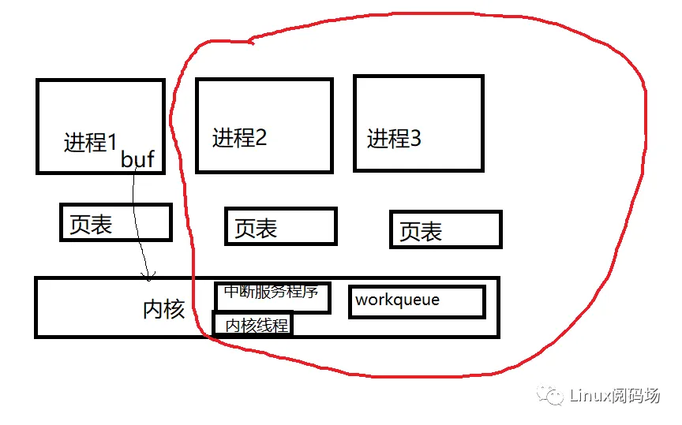
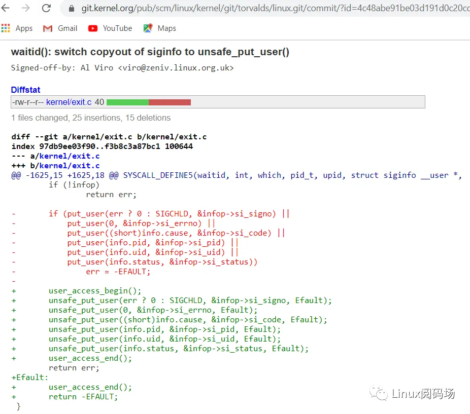
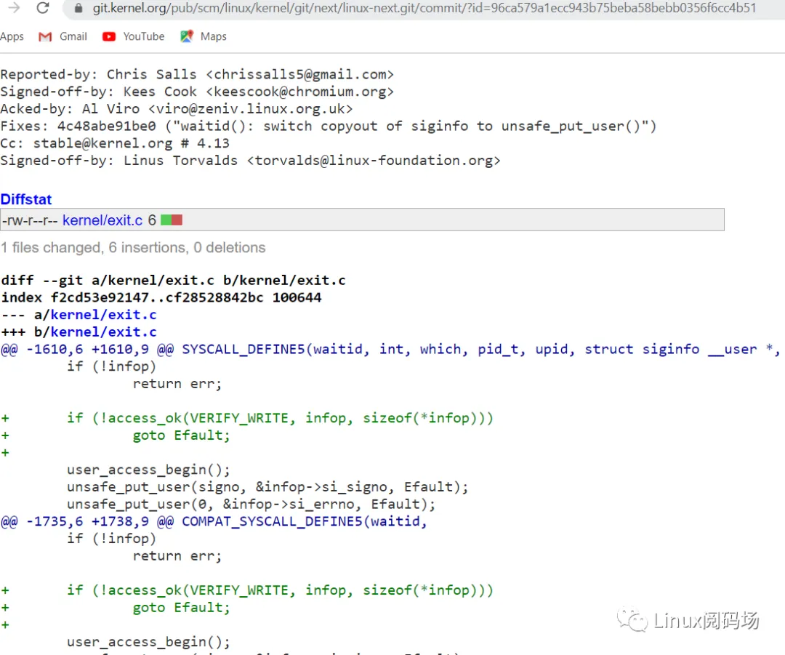
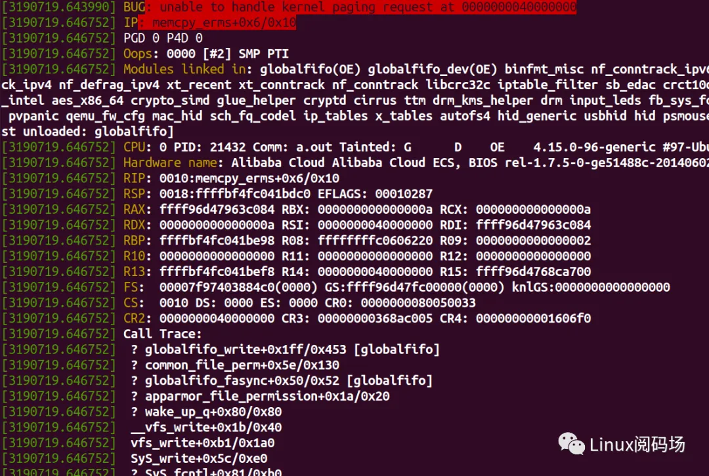
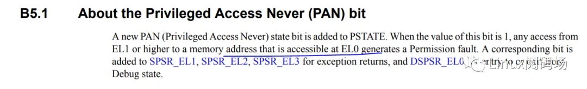
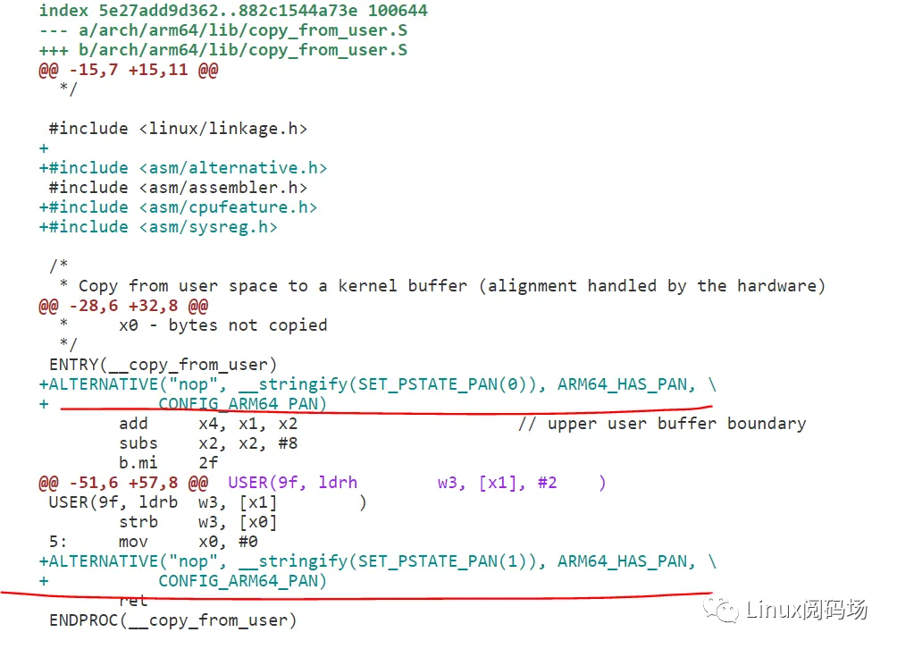

网上很多人提问为什么一定要copy_from_user,也有人解答.比如百度一下:


但是这里面很多的解答没有回答到点子上,不能真正回答这个问题.我决定写篇文章正式回答一下这个问题,消除读者的各种疑虑.


这个问题,我认为需要从2个层面回答

- 第一个层次是为什么要拷贝,可不可以不拷贝？
- 第二个层次是为什么要用copy_from_user而不是直接memcpy


**为什么要拷贝**

拷贝这个事情是必须的,这个事情甚至都跟Linux都没有什么关系.比如Linux有个kobject结构体,kobject结构体里面有个name指针:


```c
struct kobject {
  const char    *name;
  struct list_head  entry;
  struct kobject    *parent;
  struct kset    *kset;
  struct kobj_type  *ktype;
  struct kernfs_node  *sd; /* sysfs directory entry */
  struct kref    kref;
...
};
```

但我们设置一个设备的名字的时候,其实就是设置device的kobject的name:

```c
int dev_set_name(struct device *dev, const char *fmt, ...)
{
  va_list vargs;
  int err;

  va_start(vargs, fmt);
  err = kobject_set_name_vargs(&dev->kobj, fmt, vargs);
  va_end(vargs);
  return err;
}
```

驱动里面经常要设置name,比如:


```c
 dev_set_name(&chan->dev->device, "dma%dchan%d",
         device->dev_id, chan->chan_id);
```

但是Linux没有傻到直接把name的指针这样赋值:

```c
struct device {
  struct kobject kobj;
  ...
};
 
dev_set_name(struct device *dev, char *name)
{
  dev->kobj.name = name_param; //假想的烂代码
}
```

如果它这样做了的话,那么它就完蛋了,因为驱动里面完全可以这样设置name:


```c
driver_func()
{
  char name[100];
  ....
  dev_set_name(dev, name);
}
```

传给dev_set_name()的根本是个stack区域的临时变量,是一个匆匆过客.而device的name对于这个device来讲,必须长期存在.所以你看内核真实的代码,是给kobject的name重新申请一份内存,然后把dev_set_name()传给它的name拷贝进来:


```c
int kobject_set_name_vargs(struct kobject *kobj, const char *fmt,
          va_list vargs)
{
  const char *s;
  ..
  s = kvasprintf_const(GFP_KERNEL, fmt, vargs);
  ...
  if (strchr(s, '/')) {
    char *t;

    t = kstrdup(s, GFP_KERNEL);
    kfree_const(s);
    if (!t)
      return -ENOMEM;
    strreplace(t, '/', '!');
    s = t;
  }
  kfree_const(kobj->name);
  kobj->name = s;

  return 0;
}
```

这个问题在用户空间和内核空间的交界点上是完全存在的.假设内核里面某个驱动的xxx_write()是这么写的:

```c
struct globalmem_dev {
        struct cdev cdev;
        unsigned char *mem;
        struct mutex mutex;
};

static ssize_t globalmem_write(struct file *filp, const char __user * buf,
                               size_t size, loff_t * ppos)
{
        struct globalmem_dev *dev = filp->private_data;

        dev->mem = buf; //假想的烂代码

        return ret;
}
```

这样的代码绝对是要完蛋的,因为dev->mem这个内核态的指针完全有可能被内核态的中断服务程序,被workqueue的callback函数,被内核线程,或者被用户空间的另外一个进程通过globalmem_read()去读,但是它却指向一个某个进程用户空间的buffer.

在内核里面直接使用用户态传过来的const char __user * buf指针,是灾难性的,因为buf的虚拟地址,只在这个进程空间是有效的,跨进程是无效的.但是调度一直在发生,中断是存在的,workqueue是存在的,内核线程是存在的,其他进程是存在的,原先的用户进程的buffer地址,切了个进程之后就不知道是个什么鬼！**换个进程,页表都特码变了,你这个buf地址还能找着人？**进程1的buf地址,在下面的红框里面,什么都不是！



所以内核的正确做法是,把buf拷贝到一个跨中断,跨进程,跨workqueue,跨内核线程的**长期有效**的内存里面:

```c
struct globalmem_dev {
        struct cdev cdev;
        unsigned char mem[GLOBALMEM_SIZE];//长期有效
        struct mutex mutex;
};

static ssize_t globalmem_write(struct file *filp, const char __user * buf,
                               size_t size, loff_t * ppos)
{
        unsigned long p = *ppos;
        unsigned int count = size;
        int ret = 0;
        struct globalmem_dev *dev = filp->private_data;
        ....

        if (copy_from_user(dev->mem + p, buf, count))//拷贝！！
                ret = -EFAULT;
        else {
                *ppos += count;
                ret = count;
        ...
}
```

记住,对于内核而言,用户态此刻传入的指针只是一个匆匆过客,只是个灿烂烟花,只是个昙花一现,瞬间即逝！它甚至都没有许诺你天长地久,随时可能劈腿！

**所以,如果一定要给个需要拷贝的理由,原因就是防止劈腿！别给我扯些有的没的.**


必须拷贝的第二个理由,可能与安全有关.比如用户态做类似pwritev, preadv这样的调用:

```c
ssize_t preadv(int fd, const struct iovec *iov, int iovcnt, off_t offset);
ssize_t pwritev(int fd, const struct iovec *iov, int iovcnt, off_t offset);
```

用户传给内核一个iov的数组,数组每个成员描述一个buffer的基地址和长度:

```c
struct iovec
{
  void __user *iov_base;  /* BSD uses caddr_t (1003.1g requires void *) */
  __kernel_size_t iov_len; /* Must be size_t (1003.1g) */
};
```

用户传过来的是一个iovec的数组,里面有每个iov的len和base(base也是指向用户态的buffer的),传进内核的时候,内核会对iovec的地址进行check,保证它确实每个buffer都在用户空间,并且会把整个iovec数组拷贝到内核空间:

```c
ssize_t import_iovec(int type, const struct iovec __user * uvector,
     unsigned nr_segs, unsigned fast_segs,
     struct iovec **iov, struct iov_iter *i)
{
  ssize_t n;
  struct iovec *p;
  n = rw_copy_check_uvector(type, uvector, nr_segs, fast_segs,
          *iov, &p);
  ...
  iov_iter_init(i, type, p, nr_segs, n);
  *iov = p == *iov ? NULL : p;
  return n;
}
```

这个过程是有严格的安全考量的,整个iov数组会被copy_from_user(),而数组里面的每个buf都要被access_ok的检查:

```c

ssize_t rw_copy_check_uvector(int type, const struct iovec __user * uvector,
            unsigned long nr_segs, unsigned long fast_segs,
            struct iovec *fast_pointer,
            struct iovec **ret_pointer)
{
  ...
  if (copy_from_user(iov, uvector, nr_segs*sizeof(*uvector))) {
    ret = -EFAULT;
    goto out;
  }

  ...
  ret = 0;
  for (seg = 0; seg < nr_segs; seg++) {
    void __user *buf = iov[seg].iov_base;
    ssize_t len = (ssize_t)iov[seg].iov_len;

    ...
    if (type >= 0
        && unlikely(!access_ok(buf, len))) {
      ret = -EFAULT;
      goto out;
    }
    ...
  }
out:
  *ret_pointer = iov;
  return ret;
}
```

**access_ok(buf, len)是确保从buf开始的len长的区间,一定是位于用户空间的,应用程序不能传入一个内核空间的地址来传给系统调用,这样用户可以通过系统调用,让内核写坏内核本身,造成一系列内核安全漏洞.**

假设内核不把整个iov数组通过如下代码拷贝进内核:


```c
copy_from_user(iov, uvector, nr_segs*sizeof(*uvector))
```

而是直接访问用户态的iov,那个这个access_ok就完全失去价值了,因为,用户完全可以在你做access_ok检查的时候,传给你的是用户态buffer,之后把iov_base的内容改成指向一个内核态的buffer去.

所以,从这个理由上来讲,最开始的拷贝也是必须的.但是这个理由远远没有最开始那个随时劈腿的理由充分！


**为什么不直接用memcpy？**

这个问题主要涉及到2个层面,一个是copy_from_user()有自带的access_ok检查,如果用户传进来的buffer不属于用户空间而是内核空间,根本不会拷贝;二是copy_from_user()有自带的page fault后exception修复机制.


先看第一个问题,如果代码直接用memcpy():

```c
static ssize_t globalmem_write(struct file *filp, const char __user * buf,
                               size_t size, loff_t * ppos)
{     
        struct globalmem_dev *dev = filp->private_data;
        ....

        memcpy(dev->mem + p, buf, count))

        return ret;
}
```

memcpy是没有这个检查的,哪怕用户传入进来的这个buf,指向的是内核态的地址,这个拷贝也是要做的.试想,用户做系统调用的时候,随便可以把内核的指针传进来,那用户不是可以随便为所欲为？比如内核的这个commit,引起了著名的安全漏洞:

# CVE-2017-5123



就是因为,作者把有access_ok的put_user改为了没有access_ok的unsafe_put_user.这样,用户如果把某个进程的uid地址传给内核,内核unsafe_put_user的时候,不是完全可以把它的uid改为0？

所以,你看到内核修复这个CVE的时候,是对这些地址进行了一个access_ok的:




下面我们看第二个问题,page fault的修复机制.假设用户程序随便 **胡乱传个用户态的地址给内核**:


```c
void main(void)
{
        int fd;

        fd = open("/dev/globalfifo", O_RDWR, S_IRUSR | S_IWUSR);
        if (fd != -1) {
                int ret = write(fd, 0x40000000, 10);//假想的代码
                if (ret < 0)
                        perror("write error\n");
        }
}
```

0x40000000这个地址是用户态的,所以access_ok是没有问题的.**但是这个地址,根本什么有效的数据,heap,stack都不是.我特码就是瞎写的.**

如果内核驱动用memcpy会发生什么呢？我们会看到一段内核Oops:



用户进程也会被kill掉:


```shell
# ./a.out Killed
```

当然如果你设置了/proc/sys/kernel/panic_on_oops为1的话,内核就不是Opps这么简单了,而是直接panic了.


但是如果内核用的是copy_from_user呢？内核是不会Oops的,用户态应用程序也是不会死的,它只是收到了bad address的错误:


```shell
# ./a.out write error: Bad address
```

**内核只是友好地提示你用户闯进来的buffer地址0x40000000是个错误的地址,这个系统调用的参数是不对的,这显然更加符合系统调用的本质**.

内核针对copy_from_user,有exception fixup机制,而memcpy()是没有的.详细的exception修复机制见:

https://www.kernel.org/doc/Documentation/x86/exception-tables.txt


**PAN**

如果我们想研究地更深,硬件和软件协同做了一个更加安全的机制,这个机制叫做PAN (Privileged Access Never) .它可以把内核对用户空间的buffer访问限制在特定的代码区间里面.PAN可以阻止kernel直接访问用户,它要求访问之前,必须在硬件上开启访问权限.根据ARM的spec文档

https://static.docs.arm.com/ddi0557/ab/DDI0557A_b_armv8_1_supplement.pdf

描述:



所以,内核每次访问用户之前,需要修改PSATE寄存器开启访问权限,完事后应该再次修改PSTATE,关闭内核对用户的访问权限.

根据补丁:

https://patchwork.kernel.org/patch/6808781/



copy_from_user这样的代码,是有这个开启和关闭的过程的.

所以,一旦你开启了内核的PAN支持,你是不能在一个随随便便的位置访问用户空间的buffer的.

# (END)