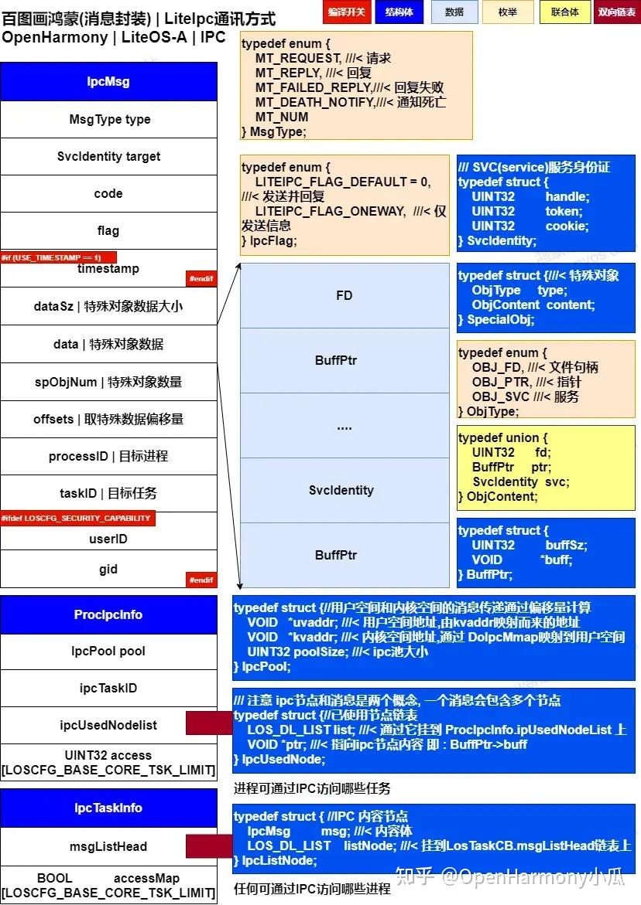

通讯机制相关篇为: 

* [v41.04 鸿蒙内核源码分析(通讯总览) | 内核跟人一样都喜欢八卦](/blog/41.md)
* [v42.08 鸿蒙内核源码分析(自旋锁) | 死等丈夫归来的贞洁烈女](/blog/42.md)
* [v43.05 鸿蒙内核源码分析(互斥锁) | 有你没她 相安无事](/blog/43.md)
* [v44.02 鸿蒙内核源码分析(快锁使用) | 用户态负责快锁逻辑](/blog/44.md)
* [v45.02 鸿蒙内核源码分析(快锁实现) | 内核态负责快锁调度](/blog/45.md)
* [v46.01 鸿蒙内核源码分析(读写锁) | 内核如何实现多读单写](/blog/46.md)
* [v47.05 鸿蒙内核源码分析(信号量) | 谁在解决任务间的同步](/blog/47.md)
* [v48.07 鸿蒙内核源码分析(事件机制) | 多对多任务如何同步](/blog/48.md)
* [v49.05 鸿蒙内核源码分析(信号生产) | 年过半百 活力十足](/blog/49.md)
* [v50.03 鸿蒙内核源码分析(信号消费) | 谁让CPU连续四次换栈运行](/blog/50.md)
* [v51.03 鸿蒙内核源码分析(消息队列) | 进程间如何异步传递大数据](/blog/51.md)
* [v52.02 鸿蒙内核源码分析(消息封装) | 剖析LiteIpc(上)进程通讯内容](/blog/52.md)
* [v53.01 鸿蒙内核源码分析(消息映射) | 剖析LiteIpc(下)进程通讯机制](/blog/53.md)
* [v54.01 鸿蒙内核源码分析(共享内存) | 进程间最快通讯方式](/blog/54.md)


### 基本概念

`LiteIPC`是`OpenHarmony LiteOS-A`内核提供的一种新型`IPC`(Inter-Process Communication,即进程间通信)机制,为轻量级进程间通信组件,为面向服务的系统服务框架提供进程间通信能力,分为内核实现和用户态实现两部分,其中内核实现完成进程间消息收发,IPC内存管理,超时通知和死亡通知等功能;用户态提供序列化和反序列化能力,并完成`IPC`回调消息和死亡消息的分发.

我们主要讲解内核态实现部分,本想一篇说完,但发现它远比想象中的复杂和重要,所以分两篇说,通讯内容和通讯机制.下篇可翻看 **鸿蒙内核源码分析(消息映射篇) | 剖析LiteIpc(下)进程通讯机制** ,通讯的内容就是消息,围绕着消息展开的结构体多达`10`几个,捋不清它们之间的关系肯定是搞不懂通讯的机制,所以咱们得先搞清楚关系再说流程.下图是笔者读完`LiteIPC`模块后绘制的消息封装图,可以说`LiteIPC`是内核涉及结构体最多的模块,请消化理解,本篇将围绕它展开.



系列篇多次提过,内核的每个模块都至少围绕着一个重要结构体展开,抓住了它顺瓜摸藤就能把细节抹的清清楚楚,于`LiteIPC`,这个结构体就是`IpcMsg` .

### 运行机制

```c
typedef struct {//IPC 消息结构体
    MsgType        type;        /**< cmd type, decide the data structure below | 命令类型,决定下面的数据结构*/
    SvcIdentity    target;     /**< serviceHandle or targetTaskId, depending on type | 因命令类型不同而异*/
    UINT32         code;       /**< service function code | 服务功能代码*/
    UINT32         flag;      ///< 标签
#if (USE_TIMESTAMP == 1)
    UINT64         timestamp; ///< 时间戳,用于验证
#endif
    UINT32         dataSz;  /**< size of data | 消息内容大小*/
    VOID           *data;  ///< 消息的内容,真正要传递的消息,这个数据内容是指spObjNum个数据的内容,定位就靠offsets
    UINT32         spObjNum; ///< 对象数量, 例如 spObjNum = 3时,offsets = [0,35,79],代表从data中读取 0 - 35给第一个对象,依次类推
    VOID           *offsets; ///< 偏移量,注意这里有多少个spObjNum就会有多少个偏移量,详见 CopyDataFromUser 来理解
    UINT32         processID;  /**< filled by kernel, processId of sender/reciever | 由内核提供,发送/接收消息的进程ID*/
    UINT32         taskID;     /**< filled by kernel, taskId of sender/reciever | 由内核提供,发送/接收消息的任务ID*/
#ifdef LOSCFG_SECURITY_CAPABILITY 
    UINT32         userID;  ///< 用户ID
    UINT32         gid;   ///< 组ID
#endif
} IpcMsg;
```

**解读**

* 第一个`type`,通讯的本质就是你来我往,异常当然也要考虑

```c
typedef enum { 
    MT_REQUEST, ///< 请求
    MT_REPLY, ///< 回复
    MT_FAILED_REPLY,///< 回复失败
    MT_DEATH_NOTIFY,///< 通知死亡
    MT_NUM
} MsgType;
```

* 第二个`target`,`LiteIPC`中有两个主要概念,一个是`ServiceManager`,另一个是`Service`.整个系统只能有一个`ServiceManager`,而`Service`可以有多个.`ServiceManager`有两个主要功能:一是负责`Service`的注册和注销,二是负责管理`Service`的访问权限(只有有权限的任务`Task`可以向对应的`Service`发送`IPC`消息).首先将需要接收`IPC`消息的任务通过`ServiceManager`注册成为一个`Service`,然后通过`ServiceManager`为该`Service`任务配置访问权限,即指定哪些任务可以向该`Service`任务发送`IPC`消息.`LiteIPC`的核心思想就是在内核态为每个`Service`任务维护一个`IPC`消息队列,该消息队列通过`LiteIPC`设备文件向上层用户态程序分别提供代表收取`IPC`消息的读操作和代表发送`IPC`消息的写操作.

```c
/// SVC(service)服务身份证 
typedef struct {
    UINT32         handle;  //service 服务ID, 范围[0,最大任务ID]
    UINT32         token; //由应用层带入
    UINT32         cookie; //由应用层带入
} SvcIdentity;
```

* `code`,`timestamp`由应用层设定,用于确保回复正确有效,详见`CheckRecievedMsg`
* `dataSz`,`data`,`spObjNum`,`offsets`这四个需连在一起理解,是重中之重.其实消息又分成三种类型(对象)

```c
typedef enum {
    OBJ_FD,  ///< 文件句柄
    OBJ_PTR, ///< 指针
    OBJ_SVC  ///< 服务,用于设置权限
} ObjType;
typedef union {
    UINT32      fd;  ///< 文件描述符
    BuffPtr     ptr; ///< 缓存的开始地址,即:指针,消息从用户空间来时,要将内容拷贝到内核空间
    SvcIdentity  svc; ///< 服务,用于设置访问权限
} ObjContent;
typedef struct { // IpcMsg->data 包含三种子消息,也要将它们读到内核空间
    ObjType     type; ///< 类型
    ObjContent  content;///< 内容
} SpecialObj;
```

  这三种对象都打包在`data`中,总长度是`dataSz`,`spObjNum`表示个数,`offsets`是个整型数组,标记了对应第几个对象在`data`中的位置,这样就很容易从`data`读到对象的数据.
  `UINT32 fd`类型对象通讯的实现是通过两个进程间共享同一个`fd`来实现通讯,具体实现函数为`HandleFd`.

```c
/// 按句柄方式处理, 参数 processID 往往不是当前进程
LITE_OS_SEC_TEXT STATIC UINT32 HandleFd(UINT32 processID, SpecialObj *obj, BOOL isRollback)
{
    int ret;
    if (isRollback == FALSE) { // 不回滚
        ret = CopyFdToProc(obj->content.fd, processID);//目的是将两个不同进程fd都指向同一个系统fd,共享FD的感觉
        if (ret < 0) {//返回 processID 的 新 fd
            return ret;
        }
        obj->content.fd = ret; // 记录 processID 的新FD, 可用于回滚
    } else {// 回滚时关闭进程FD
        ret = CloseProcFd(obj->content.fd, processID);
        if (ret < 0) {
            return ret;
        }
    }
```

`SvcIdentity svc`用于设置进程<->任务之间彼此访问权限,具体实现函数为`HandleSvc`.

```c
/// 按服务的方式处理,此处推断 Svc 应该是 service 的简写 @note_thinking
LITE_OS_SEC_TEXT STATIC UINT32 HandleSvc(UINT32 dstTid, const SpecialObj *obj, BOOL isRollback)
{
    UINT32 taskID = 0;
    if (isRollback == FALSE) {
        if (IsTaskAlive(obj->content.svc.handle) == FALSE) {
            PRINT_ERR("Liteipc HandleSvc wrong svctid\n");
            return -EINVAL;
        }
        if (HasServiceAccess(obj->content.svc.handle) == FALSE) {
            PRINT_ERR("Liteipc %s, %d\n", __FUNCTION__, __LINE__);
            return -EACCES;
        }
        if (GetTid(obj->content.svc.handle, &taskID) == 0) {//获取参数消息服务ID所属任务
            if (taskID == OS_PCB_FROM_PID(OS_TCB_FROM_TID(taskID)->processID)->ipcInfo->ipcTaskID) {//如果任务ID一样,即任务ID为ServiceManager
                AddServiceAccess(dstTid, obj->content.svc.handle);
            }
        }
    }
    return LOS_OK;
}
```

  `BuffPtr ptr` 是通过指针传值,具体实现函数为`HandlePtr`,对应结构体为`BuffPtr`.

```c
typedef struct {
    UINT32         buffSz;  ///< 大小
    VOID           *buff; ///< 内容 内核需要将内容从用户空间拷贝到内核空间的动作 
} BuffPtr;
/// 按指针方式处理
LITE_OS_SEC_TEXT STATIC UINT32 HandlePtr(UINT32 processID, SpecialObj *obj, BOOL isRollback)
{
    VOID *buf = NULL;
    UINT32 ret;
    if ((obj->content.ptr.buff == NULL) || (obj->content.ptr.buffSz == 0)) {
        return -EINVAL;
    }
    if (isRollback == FALSE) {
        if (LOS_IsUserAddress((vaddr_t)(UINTPTR)(obj->content.ptr.buff)) == FALSE) { // 判断是否为用户空间地址
            PRINT_ERR("Liteipc Bad ptr address\n"); //不在用户空间时
            return -EINVAL;
        }
        buf = LiteIpcNodeAlloc(processID, obj->content.ptr.buffSz);//在内核空间分配内存接受来自用户空间的数据
        if (buf == NULL) {
            PRINT_ERR("Liteipc DealPtr alloc mem failed\n");
            return -EINVAL;
        }
        ret = copy_from_user(buf, obj->content.ptr.buff, obj->content.ptr.buffSz);//从用户空间拷贝数据到内核空间
        if (ret != LOS_OK) {
            LiteIpcNodeFree(processID, buf);
            return ret;
        }//这里要说明下 obj->content.ptr.buff的变化,虽然都是用户空间的地址,但第二次已经意义变了,虽然数据一样,但指向的是申请经过拷贝后的内核空间
        obj->content.ptr.buff = (VOID *)GetIpcUserAddr(processID, (INTPTR)buf);//获取进程 processID的用户空间地址,如此用户空间操作buf其实操作的是内核空间
        EnableIpcNodeFreeByUser(processID, (VOID *)buf);//创建一个IPC节点,挂到可使用链表上,供读取
    } else {
        (VOID)LiteIpcNodeFree(processID, (VOID *)GetIpcKernelAddr(processID, (INTPTR)obj->content.ptr.buff));//在内核空间释放IPC节点
    }
    return LOS_OK;
}
```

* `processID`和`taskID`则由内核填充,应用层是感知不到进程和任务的,暴露给它是服务ID,`SvcIdentity.handle`,上层使用时只需向服务发送/读取消息,而服务是由内核创建,绑定在任务和进程上.所以只要有服务ID就能查询到对应的进程和任务ID.
* `userID`和`gid`涉及用户和组安全模块,请查看系列相关篇.

### 进程和任务

再说两个结构体 `ProcIpcInfo`,`IpcTaskInfo`.
`LiteIPC`实现的是进程间的通讯,所以在进程控制块中肯定有它的位置存在,即:`ProcIpcInfo`.

```c
typedef struct {
    IpcPool pool;    ///< ipc内存池,IPC操作所有涉及内核空间分配的内存均有此池提供
    UINT32 ipcTaskID;   ///< 指定能ServiceManager的任务ID
    LOS_DL_LIST ipcUsedNodelist;///< 已使用节点链表,上面挂 IpcUsedNode 节点, 申请IpcUsedNode的内存来自内核堆空间
    UINT32 access[LOSCFG_BASE_CORE_TSK_LIMIT]; ///< 允许进程通过IPC访问哪些任务
} ProcIpcInfo;
```

而进程只是管家,真正让内核忙飞的是任务,在任务控制块中也应有`LiteIPC`一席之地,即:`IpcTaskInfo`.

```c
typedef struct {
    LOS_DL_LIST     msgListHead;///< 上面挂的是一个个的 ipc节点 上面挂 IpcListNode,申请IpcListNode的内存来自进程IPC内存池
    BOOL            accessMap[LOSCFG_BASE_CORE_TSK_LIMIT]; ///< 此处是不是应该用 LOSCFG_BASE_CORE_PROCESS_LIMIT ? @note_thinking 
        ///< 任务是否可以给其他进程发送IPC消息
} IpcTaskInfo;
```

两个结构体不复杂,把发送/回复的消息挂到对应的链表上,并提供进程<->任务间彼此访问权限功能`access`,`accessMap`,由谁来设置权限呢 ? 上面已经说过了是 `HandleSvc`.

### IPC内存池

还有最后一个结构体`IpcPool`:

```c
typedef struct {//用户空间和内核空间的消息传递通过偏移量计算
    VOID   *uvaddr; ///< 用户空间地址,由kvaddr映射而来的地址,这两个地址的关系一定要搞清楚,否则无法理解IPC的核心思想
    VOID   *kvaddr; ///< 内核空间地址,IPC申请的是内核空间,但是会通过 DoIpcMmap 将这个地址映射到用户空间
    UINT32 poolSize; ///< ipc池大小
} IpcPool;
```

它是`LiteIPC`实现通讯机制的基础,是内核设计很巧妙的地方,实现了在用户态读取内核态数据的功能.请想想它是如何做到的 ?


  

