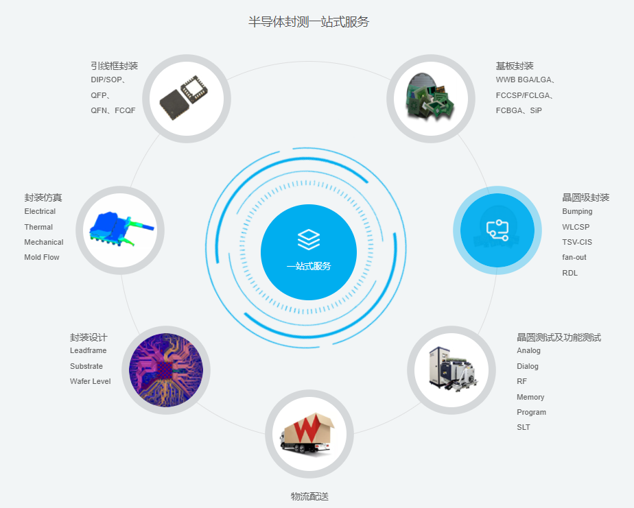

硬件架构相关篇为: 

* [v65.01 鸿蒙内核源码分析(芯片模式) | 回顾芯片行业各位大佬](/blog/65.md)
* [v66.03 鸿蒙内核源码分析(ARM架构) | ARMv7 & Cortex(A|R|M)](/blog/66.md)
* [v67.01 鸿蒙内核源码分析(指令集) | CICS PK RICS](/blog/67.md)
* [v68.01 鸿蒙内核源码分析(协处理器) | CPU的好帮手 ](/blog/68.md)
* [v69.05 鸿蒙内核源码分析(工作模式) | 角色不同 责任不同](/blog/69.md)
* [v70.06 鸿蒙内核源码分析(寄存器) | 世界被它们玩出了花](/blog/70.md)
* [v71.03 鸿蒙内核源码分析(多核管理) | 并发真正的基础](/blog/71.md)
* [v72.05 鸿蒙内核源码分析(中断概念) | 海公公的日常工作](/blog/72.md)
* [v73.04 鸿蒙内核源码分析(中断管理) | 没中断太可怕](/blog/73.md)

### 进口最多的产品

* 我国每年进口最多的商品不是石油而是**芯片**,2021年我国进口集成电路6355亿个,同比增长16.9%,而进口集成电路的金额约4400亿美元(2.8万亿),同比增长25.6%左右.比同年中国进口的石油和大豆加起来都多.每年进口集成电路的金额占中国所有进口金额的16%,也就是说每进口6块钱的商品中,就有1块钱是芯片.而我国芯片的自给率只有26.6%,其中汽车芯片的自给率更是低至5% .

### 整合元件制造商 | IDM 模式

整合元件制造商(IDM,Integrated Device Manufacturer)从IC设计,制造,封装,测试到销售都一手包办,但需要雄厚的运营资本才能支撑此营运模式,最典型的是英特尔.另一方面,三星电子虽然具有晶圆厂,能制造自己设计的芯片,但因为建厂成本太高,它同时提供代工服务.原本为IDM的AMD则在2009年将晶圆制造业务独立为格芯(GlobalFoundries),而转型为无厂半导体公司;

全球主要IDM企业有:

* **[英特尔 (Intel | 美国)](www.intel.com)** :首家推出x86架构中央处理器的公司,总部位于美国加利福尼亚州圣克拉拉.由罗伯特・诺伊斯,高登·摩尔,安迪·葛洛夫,以"集成电子"(Integrated Electronics)之名在1968年7月18日共同创办公司,将高端芯片设计能力与领导业界的制造能力结合在一起.英特尔也有开发主板芯片组,网卡,闪存,绘图芯片,嵌入式处理器,与对通信与运算相关的产品等."Intel Inside"的广告标语与Pentium系列处理器在1990年代间非常成功地打响英特尔的品牌名号.
* **[三星 (Samsung | 韩国)](www.samsung.com)** :三星电子(朝鲜语:삼성전자／三星電子,英语:Samsung Electronics),是三星集团旗下的子公司,韩国最大的消费电子产品及电子组件制造商,亦是全球最大的信息技术公司.目前主要的半导体业务是DRAM,NAND等闪存,微控制器以及影像感测器.近年来为了扩大市场,也进入了微处理器以及晶圆代工.苹果公司iPhone的主要零件:闪存,多层陶瓷电容器,电池和软性电路板均为三星所代工和研发制造的.三星在DRAM领域居产业霸主,让海力士,尔必达,美光等公司的市占率都在三星之下.
* **[SK海力士(SK Hynix | 韩国)](http://www.skhynix.com/)**:SK海力士前身为1983年成立的现代电子产业株式会社,2012年被SK集团收购以后正式更名为SK海力士株式会社.SK海力士致力于生产DRAM,NAND Flash和CIS非存储器为主的半导体产品.作为全球领先的半导体制造商,当前在韩国利川和清州, 中国无锡和重庆设有四个生产基地,并在全球16个国家和地区设立了销售,研发等基地.基于过去三十多年的半导体生产运营经验, SK海力士致力于实现持续的研发与投资,增强技术与成本竞争力,引领全球半导体市场.
* **[美光(Micron | 美国)](www.micron.com)** :美光科技公司(英语:Micron Technology, Inc.,NASDAQ:MU),简称美光科技,是美国一家总部位于爱达荷州波夕的半导体制造公司,于1978年由Ward Parkinson,Joe Parkinson,Dennis Wilson和Doug Pitman创立.其主要业务为生产多种形式的半导体器件,包括动态随机存取存储器,闪存和固态驱动器;其主要产品包括DRAM,NAND快闪存储器,CMOS影像感测器,其它半导体元件和内存模组.美光科技目前旗下品牌包括Crucial(英睿达),Ballistix(铂胜)和2006年购并而来的Lexar(雷克沙).
* **[德州仪器 (TI | 美国)](www.ti.com)**:德州仪器(英语:Texas Instruments, TI)是一家位于美国德克萨斯州达拉斯的跨国公司,以开发,制造,销售半导体和计算器技术闻名于世,主要从事数字信号处理与模拟电路方面的研究,制造和销售.它在25个国家有制造,设计或者销售机构.根据2021年IC Insights统计,德州仪器是世界第九大半导体制造商;曾经是移动电话的第二大芯片供应商,仅次于高通;同时也是在世界范围内的第一大数字信号处理器(DSP)和模拟半导体组件的制造商,其产品还包括计算器,微控制器以及多核处理器.德州仪器居世界半导体公司20强.
* **[恩智浦&飞思卡尔(NXP&Freescale)](www.nxp.com)**:恩智浦半导体(英语:NXP Semiconductors),前身为飞利浦半导体,由荷兰企业飞利浦在1953年创立,公司总部位于荷兰埃因霍温.2006年8月31日,该公司首席执行官万豪敦在柏林向客户和员工宣布公司的新名称.恩智浦半导体目前可以提供半导体,系统和软件解决方案;使用在汽车,手机,智能识别应用,电视,机上盒以及其他电子设备上.
  * 2015年3月3日,恩智浦半导体以现金加股票收购同业飞思卡尔(Freescale)
  * 2018年7月25日,高通宣布放弃收购恩智浦,并向恩智浦支付20亿美元的分手费.
  * 2019年5月29日恩智浦半导体斥资17.6亿美元现金收购美满电子科技的无线连接组合,包括美满电子科技的WiFi连接业务部门,蓝牙技术组合和相关资产.
  * 恩智浦主要致力于 智慧识别,汽车电子,家庭娱乐,多重市场半导体,恩智浦软件市场.
* **[东芝 (Toshiba | 日本)](www.global.toshiba/jp/top.html)**:东芝(日语:株式会社東芝／かぶしきがいしゃとうしば ,英语:Toshiba Corporation)是一家总部位于东京港区的日本跨国企业集团,为电力开发,工业生产,环境保护,商业办公,半导体等领域提供设备制造和解决方案,曾为全球最大的个人电脑,家用电器和医疗设备制造商之一,也是闪存的发明者,其消费电子产品业务已悉数分拆出售,白色家电业务售予中国美的集团,电视机业务售予中国海信集团,个人电脑业务售予台湾鸿海集团子公司夏普,电脑内存业务被剥离为后来的铠侠.业务范围涵盖:
  * 电力:东芝是全球重要的电力开发和传输设备制造商,为火力发电,水力发电,氢能发电等提供技术和解决方案,为变电站提供各种输变电设备.
  * 工业:为电动机,变频器,工业CT设备,高压传动系统,动力电池等工业设备制造商.
  * 环保:为自来水处理系统,污水处理系统提供控制技术.
  * 办公系统:制造各类打印机,复印机,传真机,复合机,触摸互动一体机等办公自动化器材.
  * 电梯:为专业电梯制造商,制造各类乘客电梯,货梯,电动扶梯,观光电梯.
  * 空调:生产家用及商用空调.
  * 电子组件:生产各类半导体器件以及移动硬盘,机械硬盘等存储产品.
* **[英飞凌(Infineon | 德国)](www.infineon.com)**:英飞凌科技股份有限公司(Infineon Technologies,FWB:IFX)总部位于德国慕尼黑,主力提供半导体和系统解决方案,解决在高能效,移动性和安全性方面带来的挑战(而主要业务亦包括为关连公司西门子交通集团生产铁路机车车辆牵引系统内IGBT-VVVF之半导体组件).英飞凌前身是西门子集团旗下子公司西门子半导体(Siemens Semiconductor),于1999年独立,2000年上市.中文名曾被称为亿恒科技,2002年起更至现名.其无线解决方案部门在2010年8月售给英特尔.
* **[意法半导体(ST | 意法)](www.st.com)**:意法半导体(英语:STMicroelectronics)是一家国际性的半导体生产商,总部位于瑞士日内瓦.意法半导体集团在1987年由意大利的Società Generale Semiconduttori (SGS) Microelettronica与法国汤姆逊(Thomson)公司的半导体分部Thomson Semiconducteurs两家半导体公司合并而成,该公司自1998年5月汤姆逊撤股后由SGS-THOMSON更名为意法半导体(STMicroelectronics).与所谓的无厂半导体公司不同,意法半导体拥有并营运自己的半导体晶圆厂.意法半导体由五个产品团队组成,每个团队由数个部门或业务单位组成,每个部门均负责设计,工业化,生产(使用意法半导体的制造工厂)与销售自己的产品,业务透过中央硏发组织与地区的营业部支持.产品部分为:

  * 家用个人通信团队:消费,多媒体,无线及有线产品
  * 存储器产品团队:独立记忆芯片(EEPROM,闪存(NAND与NOR),串行闪存与智能卡)
  * 汽车产品团队:关系汽车产业的芯片(车身,传动系,安全设备等)
  * 微型,功率与模拟团队:模拟与功率集成电路及单片机
  * 电脑周边团队:电脑周边用芯片(硬盘控制器,打印机等)
  * 前端技术与生产:硏究与开发,该公司总体上拥有16个硏究与开发单位及39个设计与应用中心

### 无厂半导体 | Fabless 模式

无厂半导体公司(英语:fabless semiconductor company)是指只从事硬件芯片的电路设计,后再交由晶圆代工厂制造,并负责销售的公司.由于半导体器件制造耗资极高,将集成电路产业的设计和制造两大部分分开,使得无厂半导体公司可以将精力和成本集中在市场研究和电路设计上.而专门从事晶圆代工的公司则可以同时为多家无厂半导体公司制造生产,尽可能提高其生产线的利用率

全球主要IC设计企业有:

* **[高通 (Qualcomm | 美国)]( www.qualcomm.com)**:高通公司(英语:Qualcomm)是位于美国加州圣地亚哥的无线电通信技术研发公司,由加州大学圣地亚哥分校教授厄文·马克·雅各布和安德鲁·维特比创建,于1985年成立.
  * 2017年11月6日,博通有限(Broadcom)计划以60美元现金加10美元股份的配比,合共每股70美元,涉资超过1300亿美元收购高通.
  * 2017年11月13日,高通全体董事一致正式拒绝博通收购提案,该公司董事会一致认为,以高通在行动技术的领导地位,以及未来成长潜力来看,博通的提议明显低估高通的价值.
  * 2018年3月12日,美国总统特朗普发布行政命令,以国家安全为由阻挡这起并购案.特朗普声明表示:"依据可信的证据,我认为博通并购高通可能妨碍美国国家安全."
* **[博通 (Broadcom | 新加坡)](www.broadcom.com)**:博通有限公司(英语:Broadcom Limited,NASDAQ:AVGO),前身为安华高科技(Avago Technologies Limited),美国的无厂半导体公司,其业务内容广泛,在美国圣荷西设立总部.
  * 安华高科技创立于1961年,在2016年1月完成对博通的收购后,改名博通有限公司.安华高科技于1961年成立,原为惠普公司之下的半导体部门.
  * 1999年,HP公司分拆出安捷伦公司.2005年,安捷伦公司将其I/O solutions部门分拆出售.
  * 2015年5月29日,安华高科技公司收购博通公司.2016年完成收购,改名博通有限公司.在2018年总部搬迁至美国.
* **[联发科 (MediaTek | 台湾)](www.mediatek.com)**:联发科技(英语:MediaTek Inc.,有时非正式缩写作MTK),简称联发科,是台湾一家为无线通信,高清电视设计系统芯片的无厂半导体公司.公司成立于1997年,总部位于新竹科学园区,在全球设有25个分公司和办事处,2013年成为全球第四大无晶圆厂IC设计商,2016年成为全球第三大,2020年凭借天玑系列芯片成为全球市场占有率第一大.
* **[英伟达(NVIDIA | 美国)](www.nvidia.com)**:黄仁勋,克里斯·马拉科夫斯基和卡蒂斯·普里姆于1993年4月美国加州创办了NVIDIA .作为一家无晶圆IC半导体设计公司,NVIDIA于自己的实验室研发芯片,但将芯片制造工序分包给晶圆代工场.NVIDIA的产品组合包括绘图处理器,个人电脑平台(主板逻辑核心)芯片组和数字媒体播放器的软件.
* **[AMD (美国)](www.amd.com)**:超微半导体公司(英语:Advanced Micro Devices, Inc.;缩写:AMD,超微,或译"超威"),创立于1969年,是一家专注于微处理器及相关技术设计的跨国公司,总部位于美国加州旧金山湾区硅谷内的森尼韦尔市.最初,超微拥有晶圆厂来制造其设计的芯片,自2009年超微将自家晶圆厂拆分为现今的格芯以后,成为无厂半导体公司,仅负责硬件集成电路设计及产品销售业务.现时,超微的主要产品是中央处理器(包括嵌入式平台),图形处理器,主板芯片组以及电脑存储器.AMD 是目前除了英特尔以外,最大的x86架构微处理器供应商,自收购冶天科技以后,则成为除了英伟达和将发布独立显卡的英特尔以外仅有的独立图形处理器供应商,自此成为一家同时拥有中央处理器和图形处理器技术的半导体公司,也是唯一可与英特尔和英伟达匹敌的厂商.
* **[海思(Hisilicon | 大陆)](www.hisilicon.com)**:海思半导体(英语:Hisilicon),中国大陆芯片设计公司,属于华为集团,于2004年4月创建,总部位于中国大陆广东省深圳,现为中国大陆最大的无晶圆厂芯片设计公司.主要产品为无线通信芯片,包括拥有WCDMA,LTE等功能的手机系统单片机.海思半导体的前身为创建于1991年的华为集成电路设计中心.2020年第一季度,华为海思的智能手机处理器出货量首次在中国大陆市场超过高通,位居第一.
  * 麒麟系列产品:是面向手机,平板电脑等终端设备设计的SoC.如 990系列,9000系列
  
  * 巴龙系列产品(Modem):是终端设备的基带处理器,搭载在华为手机,随身WiFi和CPE等设备上.如 巴龙5G01,巴龙5000
  * 可穿戴设备 SoC :用于真无线耳机,智能眼镜和智能手表等可穿戴设备的SoC.如 麒麟 A1
  * 服务器处理器:基于ARM架构的服务器处理器 SoC.如 鲲鹏916,鲲鹏920
  * 人工智能处理器:基于自研达芬奇架构设计的人工智能处理器.如 昇腾310,昇腾910
* **[苹果(Apple | 美国)](www.apple.com)**:全球市值最高的公司,太有名了.苹果标志的来由多被误解为"图灵自杀时吃了一口的氰化物溶液苹果".这个传闻来源为2001年的英国电影《Enigma》,在该部电影中虚构了前述有关图灵自杀与苹果公司标志关系的情节,被部分公众以及媒体讹传.而苹果标志的设计师在一次采访中亲自证实这个标志与图灵(或者其它的猜测,比如被夏娃咬的那个苹果)无关.乔布斯也曾说"被咬掉一口的设计只是为了让它看起来不像樱桃".
* **[美满电子(Marvell | 美国)](www.marvell.com)**:美满电子科技公司(Marvell Technology Group)是一家美国芯片制造商,专门制造存储,通讯以及消费性电子产品芯片.公司由周秀文(英语:Sehat Sutardja)(Sehat Sutardja)博士,妻戴伟立(Weili Dai),弟周秀武三人共同创立于1995年,总部在美国硅谷,在中国上海设有研发中心,亚太地区包括北京,韩国,台湾这些地方都有技术支持团队,现在的员工大约5000人并在不断扩张中.其是美国纳斯达克的上市公司,市值大约是110亿美元.目前Marvell是全球十大无芯片工厂半导体设计公司.Marvell现在每天要运送超过100万片基于ARM架构的处理器,这不单单包括手机应用处理器,同时也包括通信处理器,存储,WiFi等芯片.
* **[赛灵思(Xilinx | 美国)](https://www.xilinx.com)** 是一家位于美国的可编程逻辑器件生产商.1984年创建于美国加利福尼亚州的硅谷,该公司发明了现场可编程逻辑门阵列,并由此成名.赛灵思还是第一个无晶圆厂半导体公司.赛灵思是FPGA,可编程SoC及ACAP的发明者, 其高度灵活的可编程芯片由一系列先进的软件和工具提供支持,可推动跨行业和多种技术的快速创新 - 从消费电子类到汽车类再到云端.
  * 2020年10月27日,赛灵思正式被AMD收购.
* **[紫光展锐 (unisoc | 大陆)](www.unisoc.com)** :紫光展锐(上海)科技有限公司是我国集成电路设计企业的龙头企业.以生态为核心战略,高举5G和AI两面技术旗帜,以价值,未来,服务为三个指向,为个人与社会的智能化服务.紫光展锐是全球少数全面掌握2G/3G/4G/5G,Wi-Fi,蓝牙,电视调频,卫星通信等全场景通信技术的企业之一,并具备稀缺的大型芯片集成及套片能力.产品包括移动通信中央处理器,基带芯片,AI芯片,射频前端芯片,射频芯片等各类通信,计算及控制芯片.

### 晶圆代工 | Foundry 模式

晶圆代工或晶圆专工(Foundry),是半导体产业的一种商业模式,指接受其他无厂半导体公司(Fabless)委托,专门从事晶圆成品的加工而制造集成电路,并不自行从事产品设计与后端销售的公司.在纯晶圆代工公司出现之前,芯片设计公司只能向整合元件制造厂购买空闲的晶圆产能,产量与生产排程都受到非常大的限制,不利于大规模量产产品.
1987年创立的台积电是第一家专门从事晶圆代工的厂商,此后联电亦转型为专门晶圆代工公司;以及有中芯国际,世界先进,格罗方德等公司接连成立,目前全世界有十余家提供晶圆代工服务的公司.此外即使是垂直整合制造的半导体公司,如三星电子,英特尔等,也有晶圆代工的业务.晶圆代工服务使得专业芯片设计的商业模式也得以实现,推升了芯片设计公司的蓬勃发展.

全球主要晶圆代工企业有:

* **[台积电(TSMC | 台湾)](www.tsmc.com)** :台湾积体电路制造公司(英语:Taiwan Semiconductor Manufacturing),是台湾一家从事晶圆代工的半导体制造厂,总部位于新竹科学园区.1986年,(现中国台湾省)政府为培植半导体产业,由工研院主导与荷兰飞利浦共同签约并成立一家半导体制造公司,交由时任工研院院长的 张忠谋 带着一群以出身工研院为主的工程师一同筹办,张忠谋遂出任台湾积体电路制造股份有限公司董事长兼总裁.
* **[格罗方德(Global Foundries | 美国)](https://gf.com/zh/)**:格罗方德半导体股份有限公司(Global Foundries)是一家总部位于美国加州硅谷桑尼维尔市的半导体晶圆代工厂商, 成立于2009年3月  .格罗方德半导体股份有限公司由AMD拆分而来,与阿联酋阿布扎比先进技术投资公司(ATIC)和穆巴达拉发展公司(Mubadala)联合投资成立的半导体制造企业.
* **[联电(UMC | 台湾)](www.umc.com)** :联华电子股份有限公司,简称联电,英文全名"United Microelectronics Corporation",英文缩写"UMC",(现中国台湾省)政府出资创立于1980年,为台湾国际半导体晶圆专工业界的领导者,提供高品质的晶圆制造服务,专注于逻辑及特殊技术,为跨越电子行业的各项主要应用产品生产芯片.联电完整的制程技术及制造解决方案包括逻辑/混合信号,嵌入式高压解决方案,嵌入式非挥发性内存,RFSOI及BCD.
* **[中芯国际(SMIC | 大陆)](www.smics.com)**:中芯国际集成电路制造有限公司(简称中芯国际,港交所:981,NYSE:SMI)于2000年4月3日在开曼群岛注册成立,总部位于中国大陆上海.公司的创立者之一为曾在台积电任职过的张汝京.是世界领先的集成电路晶圆代工企业之一,也是中国大陆规模最大,技术最先进的集成电路芯片制造企业.中芯国际向全球客户提供0.35微米到14纳米晶圆代工与技术服务,包括逻辑芯片,混合信号/射频收发芯片,耐高压芯片,系统芯片,闪存芯片,EEPROM芯片,图像传感器芯片及LCoS微型显示器芯片,电源管理,微型机电系统等.同时7纳米已经进入到客户风险量产阶段.
* **[力晶科技(Powerchip | 台湾](www.powerchip.com)**:力晶积成电子制造股份有限公司(英语:Powerchip Semiconductor Manufacturing Corporation),简称力积电,PSMC,业务范围涵盖动态随机存取存储器(DRAM),非易失性存储器(Flash)制造及晶圆代工两大类别.总公司位于台湾新竹市新竹科学工业园区,创办人为黄崇仁.
* **[高塔半导体(Tower jazz | 以色列)](www.towerjazz.com)**:高塔半导体有限公司(英语:Tower Semiconductor Ltd.)是以色列的一家半导体专业代工厂,总部在以色列的米格达勒埃梅克.起始于1993年购并了美国国家半导体的150mm芯片制造设备,并在1994年成为上市公司.
* **[世界先进(VIS | 台湾)](https://www.vis.com.tw)** :世界先进积体电路股份有限公司(简称「世界先进」)于1994年12月5日在新竹科学园区设立.自成立以来,公司在制程技术及生产效能上不断精进,并持续提供最具成本效益的完整解决方案及高附加价值的服务予客户,成为「特殊积体电路制造服务」的领导厂商.世界先进目前拥有五座八吋晶圆厂,分别位于台湾与新加坡.2021年平均月产能约24.1万片八吋晶圆.世界先进及子公司共有近6,000名员工,坚持以「客户服务为导向」的经营理念,持续加强对特殊积体电路晶圆代工客户的专业服务.
* **[华虹(大陆)](https://www.huahong.com.cn/)**:华虹集团是中国目前拥有先进芯片制造主流工艺技术的8+12寸芯片制造企业.集团旗下业务包括集成电路研发制造,电子元器件分销,智能化系统应用等板块,其中芯片制造核心业务分布在浦东金桥,张江,康桥和江苏无锡四个基地,目前运营3条8英寸生产线,3条12英寸生产线.量产工艺制程覆盖1微米至28纳米各节点.二十多年来,集团在致力于发展自主可控集成电路产业的征程上取得了多个行业第一和唯一:率先建成了中国大陆第一条8英寸集成电路生产线,建设了本土企业第一条全自动的12英寸生产线;具有唯一一家国家级集成电路研发中心;成为业界第一家,也是唯一一家,连续两年建设并投产运营两条12英寸生产线的企业.

### 封测 | OSAT 模式

这个类比软件开发中的测试岗,相对来说没太多技术含量,所以国内企业占有较多席位.封测(OSAT)主要是封装测试代工厂,系统级封装(System in Package, SiP)为一种集成电路封装的概念,是将一个系统或子系统的全部或大部分电子功能配置在集成型衬底内,而芯片以2D,3D的方式接合到集成型衬底的封装方式.SIP不仅可以组装多个芯片,还可以作为一个专门的处理器,DRAM,闪存与被动组件结合电阻器和电容器,连接器,天线等,全部安装在同一衬底上.这意味着,一个完整的功能单位可以建在一个多芯片封装,因此,需要添加少量的外部组件,使其工作,大概有图中测试内容

全球主要封测代工企业有:

* **[日月光(ASE | 台湾)](https://www.aseglobal.com/ch/)** :日月光是最大的半导体委外封装和测试(OSAT)供应商,占有19％的市场份额. 日月光为全球90％以上的电子公司提供半导体封装和测试服务.创办人张姚宏影为星云法师弟子,日月光名称由星云法师命名:星云大师觉得电和光代表快,代表速度,可以照耀万千人,可以永久,可以大,取名"日月光".同时,星云大师也为日月光下了"日月无私照,光明有佛心"的对联.
* **[安靠(Amkor | 美国)](www.amkor.com)**:艾克爾國際科技(英语:Amkor Technology,Inc.)是一家美国半导体产品封装和测试服务提供商.该公司成立于1969年,自2005年总部从美国宾夕法尼亚州威彻斯特搬迁至亚利桑那州坦佩.截至2017年,艾克爾國際科技在全球拥有约29,300名员工,销售额为41.9亿美元.艾克爾國際科技在中国大陆,日本,韩国,马来西亚,菲律宾,葡萄牙和台湾设有工厂.它为芯片制造商提供封装和测试集成电路(IC)服务.
* **[长电科技(大陆)](https://www.jcetglobal.com/)**:长电科技是全球领先的集成电路制造和技术服务提供商,提供全方位的芯片成品制造一站式服务,包括集成电路的系统集成,设计仿真,技术开发,产品认证,晶圆中测,晶圆级中道封装测试,系统级封装测试,芯片成品测试并可向世界各地的半导体客户提供直运服务.通过高集成度的晶圆级封装(WLP) ,2.5D/3D封装,系统级封装(SiP),高性能倒装芯片封装和先进的引线键合技术,长电科技的产品,服务和技术涵盖了主流集成电路系统应用,包括网络通讯,移动终端,高性能计算,车载电子,大数据存储,人工智能与物联网,工业智造等领域.长电科技在全球拥有23000多名员工,在中国,韩国和新加坡设有六大生产基地和两大研发中心,在逾23个国家和地区设有业务机构,可与全球客户进行紧密的技术合作并提供高效的产业链支持.
* **[矽品(SPIL | 台湾)]()**:
* **[力成科技(台湾)]()**:
* **[华天科技(大陆)](https://www.ht-tech.com/)**:华天科技成立于2003年12月25日,主要从事半导体集成电路,半导体元器件的封装测试业务.作为全球半导体封测知名企业,华天科技为客户提供封装设计,封装仿真,引线框封装,基板封装,晶圆级封装,晶圆测试及功能测试, 物流配送等一站式服务.凭借先进的技术能力,系统级生产和质量把控,已成为半导体封测业务首选品牌.
* **[通富微电(大陆)](https://www.tfme.com/)**:公司成立于1997年10月,通富微电专业从事集成电路封装测试,总部位于江苏南通,拥有崇川总部工厂,南通通富微电子有限公司(南通通富),合肥通富微电子有限公司(合肥通富),厦门通富微电子有限公司(厦门通富),苏州通富超威半导体有限公司(TF-AMD苏州),TF AMD Microelectronics (Penang) Sdn. Bhd.(TF-AMD槟城)六大生产基地.通过自身发展与并购,公司已成为本土半导体跨国集团公司,中国集成电路封装测试领军企业,集团员工总数超1.5万人.
* **[京元电子(台湾)]()**:
* **[南茂科技(新加坡)]()**:
* **[联合科技(台湾)]()**:

### IP核 | ARM 模式

只负责设计电路,不负责芯片设计,不负责制造,销售的公司则称为IP核公司.

* IP核,全称知识产权核(英语:Semiconductor intellectual property core),是在集成电路的可重用设计方法学中,指某一方提供的,形式为逻辑单元,芯片设计的可重用模块.
* IP核通常已经通过了设计验证,设计人员以IP核为基础进行设计,可以缩短设计所需的周期.IP核可以通过协议由一方提供给另一方,或由一方独自占有.IP核的概念源于产品设计的专利证书和源代码的著作权等.设计人员能够以IP核为基础进行专用集成电路或现场可编程逻辑门阵列的逻辑设计,以减少设计周期.
* IP核分为软核,硬核和固核.软核通常是与工艺无关,具有寄存器传输级硬件描述语言描述的设计代码,可以进行后续设计;硬核是前者通过逻辑综合,布局,布线之后的一系列表征文件,具有特定的工艺形式,物理实现方式;固核则通常介于上面两者之间,它已经通过功能验证,时序分析等过程,设计人员可以以逻辑门级网表的形式获取.
* **[ARM(英国)](www.arm.com)**:安谋控股公司(英语:ARM Holdings plc.,写作arm),又称ARM公司,是软银集团旗下的半导体设计与软件公司,全球总部位于英国剑桥,北美总部位于美国圣何塞,亦是一年一度的ARM技术大会(Arm TechCon)举办地.主要的产品是ARM架构处理器及相关外围组件的电路设计方案,产品以知识产权核授权的形式与相应的软件开发工具一起向客户销售.
  * 以设计 **ARM处理器架构** 闻名于世,技术具有性能高,成本低和能耗省的特点,产品已遍及工业控制,消费类电子产品,通信系统,网络系统.ARM自己不制造芯片,而将其技术知识产权(IP核)授权给世界上许多著名的半导体厂,其中包括Intel,IBM,LG半导体,NEC,SONY,飞利浦,Atmel,Broadcom,Cirrus Logic,Freescale,Actions等.
  * 2010年6月中,苹果公司向ARM董事会表示有意以85亿美元的价格收购ARM公司,但遭到ARM董事会的拒绝.称ARM公司作为独立公司更具价值,"买家展开收购的唯一理由是消灭竞争对手."
  * 2016年7月18日,日本软银集团同意以243亿英镑(约309亿美元)全现金方式收购ARM公司.交易于2016年9月5日完成,成为软银集团旗下的全资子公司,同时软银集团表示不干预亦不影响ARM现在及未来的商业计划和决策.
  * 2020年9月14日,NVIDIA宣布出价400亿美元(这项交易包含215亿美元Nvidia股票及120亿美元现金,软银将持有Nvidia最多8.1%流通股.此外,根据合约中的额外对价条款,软银可能还可再获得50亿美元的现金或股票.)从日本软银集团手中收购安谋控股.收购完成后软银将保留安谋控股不到10%的股份.此项交易仍须获得英国,中国,欧盟和美国相关机构的批准,监管审批可能需要长达一年半的时间.然而,尽管NVIDIA一再表示收购完成后ARM仍然保持开源模式和对客户采取中立态度,此收购案却遭到监管机构和大型企业(例:高通,微软,Google等)的一致反对.他们担心一旦收购完成后,将会造成严重的竞争问题,使ARM无法保持中立性.
  * 最终,2022年2月7日,NVIDIA和软银宣布已同意终止双方此前达成的ARM股份交易协议,收购案正式宣告失败,同时软银将推动ARM上市.

### 几点感想

看完之后站长有两点感想

* 芯片产业体量巨大,足以卷入庞大的技术人才诞生更多伟大的产品.韩国这么点人口都能在半导体行业产生像三星这般伟大的公司,所以我们真的是缺人才吗? 我们缺平台,缺载体,缺组织者,缺切入点.
* 鸿蒙生当其时,填补了这些缺口,鸿蒙撬动的是软硬件的上下游技术,以此为载体,形势一片大好.我辈应当努力,合力围拱,奋力追赶,弯道超车.加油 !!!

  

