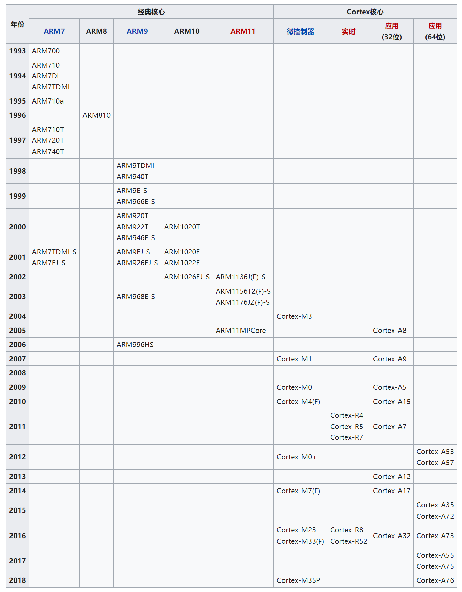
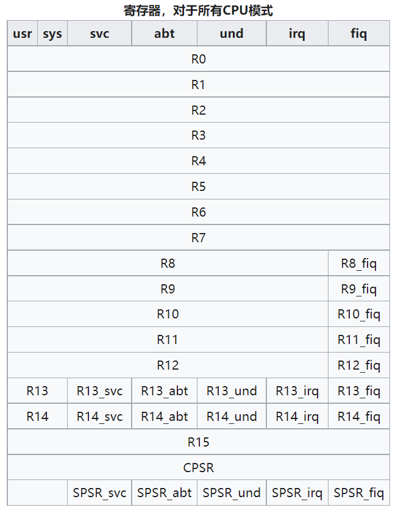

硬件架构相关篇为: 

* [v65.01 鸿蒙内核源码分析(芯片模式) | 回顾芯片行业各位大佬](/blog/65.md)
* [v66.03 鸿蒙内核源码分析(ARM架构) | ARMv7 & Cortex(A|R|M)](/blog/66.md)
* [v67.01 鸿蒙内核源码分析(指令集) | CICS PK RICS](/blog/67.md)
* [v68.01 鸿蒙内核源码分析(协处理器) | CPU的好帮手 ](/blog/68.md)
* [v69.05 鸿蒙内核源码分析(工作模式) | 角色不同 责任不同](/blog/69.md)
* [v70.06 鸿蒙内核源码分析(寄存器) | 世界被它们玩出了花](/blog/70.md)
* [v71.03 鸿蒙内核源码分析(多核管理) | 并发真正的基础](/blog/71.md)
* [v72.05 鸿蒙内核源码分析(中断概念) | 海公公的日常工作](/blog/72.md)
* [v73.04 鸿蒙内核源码分析(中断管理) | 没中断太可怕](/blog/73.md)

### ARM模式

* `ARM`公司本身并不靠自有的设计来制造或出售`CPU`,而是将处理器架构授权给有兴趣的厂家.提供了`ARM`内核的集成硬件叙述,包含完整的软件开发工具(编译器,`debugger`,`SDK`),以及针对内含`ARM CPU`硅芯片的销售权.

* 许多半导体公司持有`ARM`授权:`Atmel`,`Broadcom`,`Cirrus Logic`,`Freescale`(于2004从摩托罗拉公司独立出来),富士通,英特尔(借由和Digital的控诉调停),`IBM`,`NVIDIA`,台湾新唐科技(Nuvoton Technology),英飞凌,任天堂,恩智浦半导体(于2006年从飞利浦独立出来),冲电气,三星电子,苹果,夏普,意法半导体,德州仪器和VLSI等许多这些公司均拥有各个不同形式的`ARM`授权.虽然`ARM`的授权项目由保密合约所涵盖,在知识产权工业,`ARM`是广为人知最昂贵的`CPU`内核之一.单一的客户产品包含一个基本的`ARM`内核可能就需索取一次高达美金`20万`的授权费用.而若是牵涉到大量架构上修改,则费用就可能超过千万美元.

### 处理器时间轴 | Cortex | 2006

从图中可以看出 `ARM`有 **经典(Classic)** 和 **Cortex** 两个核心系列,太老的历史就不去翻了,`Cortex`就是`ARM`公司一个系列处理器的名称.比如英特尔旗下处理器有酷睿,奔腾,赛扬.`ARM`在最初的处理器型号都用数字命名,最后一个是`ARM11`系列,在`ARM11`以后的产品改用`Cortex`命名,时间分割线是 `2006年`前后,并分成`A`,`R`和`M`三类,有意思的是这三个系列也暗合了`ARM`这个名字,为各种不同的市场提供服务.

* **应用类** (`Application`) : 简称 `Cortex-A` 系列,面向尖端的基于虚拟内存的操作系统和用户应用.
* **嵌入式类** (`Real-time`) : 简称 `Cortex-R` 系列,针对实时系统.
* **微处理器类** (`Micro-controller`) : 简称 `Cortex-M` 系列,对微控制器和低成本应用提供优化.
* 鸿蒙内核分成 **轻量型**(基于`LiteOS_M`) 和 **小型**(基于`LiteOS_A`) 说的就是分别基于 `Cortex-A/R` 和 `Cortex-M`的内核实现.

### 指令集时间轴 | RISC | ARMv7

看完处理器时间轴,再看`ARM`**指令集架构**历史,很多人分不清指令集和处理器的区别,指令集是处理器使用的指令编码方式,指令集的命名方式为 `armv`+`version`,目前是 `armv1`～`armv8`,数字越大表示指令集越先进,对于不同的处理器,`arm` 公司设计的处理器采用了不同的指令集.

* 精简指令集计算机(英语:reduced instruction set computer,缩写:**RISC** )或简译为 **精简指令集**,是计算机中央处理器的一种设计模式.特点是指令数目少,每条指令都采用标准字长,执行时间短.`RISC` 处理器每条指令执行一个动作,只需一个周期即可完成,优化了操作执行时间.使用固定长度的指令,所以流水线更容易.并且由于它缺乏复杂的指令解码逻辑,它支持更多的寄存器并且花费更少的时间将值加载和存储到内存中.总结下来这样的好处是非常的省电,对于手持设备来说这是巨大的优势,不用抖音没滑几下就要到处找充电宝,所以这也是在移动互联网时代`ARM`芯片大行其道的最底层原因,通常被认为是当今可用的最高效的 `CPU` 架构技术.目前使用**RISC**的微处理器包括 `DEC Alpha`,`ARC`,`ARM`,`AVR`,`MIPS`,`PA-RISC`,`Power ISA`(包括PowerPC,PowerXCell),`RISC-V`和`SPARC`等.
* 与之对应的是复杂指令集计算机(英文:Complex Instruction Set Computer;缩写:**CISC**)或简译为 **复杂指令集**,是一种微处理器指令集架构,每个指令可执行若干低端操作,诸如从存储器读取,存储,和计算操作,全部集于单一指令之中.特点是指令数目多而复杂,每条指令字长并不相等,电脑必须加以判读,并为此付出了性能的代价.
* 指令集是标准,基于标准可以设计无数的处理器型号.这并不难理解,跟我们手机充电线一样`TYPE-C`是目前大部分安卓手机的标准,但设计充电线的公司可以有很多,`ARM`就是设计充电线的公司. 指令集:处理器 = 1:N (1对多) 关系,指令集向下兼容,指令集的设计原则是 **开闭原则**,对扩展是开放的,但是对于修改是封闭的.但注意 **RISC** 是一套标准,可不是`ARM`公司的私有财产.`ARM`公司在使用这个标准的时候为了方便和效率肯定会在内部对其命名.如下表所示:
  |指令集架构|处理器家族|
  |-|-|
  |ARMv1 |ARM1||
  |ARMv2 |ARM2,ARM3|
  |ARMv3 |ARM6,ARM7|
  |ARMv4 |StrongARM,ARM7TDMI,ARM9TDMI|
  |ARMv5 |ARM7EJ,ARM9E,ARM10E,XScale|
  |ARMv6 |ARM11,ARM Cortex-M|
  |ARMv7 |ARM Cortex-A,ARM Cortex-M,ARM Cortex-R|
  |ARMv8 |Cortex-A35,Cortex-A50系列[18],Cortex-A70系列,Cortex-X1|
  |ARMv9 |Cortex-A510,Cortex-A710,Cortex-X2|
  表中不难发现 **ARMv7** 是个转折点,**Cortex** 三个应用场景产品正是基于它横空出世,鸿蒙内核源码分析系列篇的 ARM文档基础 《ARM体系架构参考手册》背景为 **ARMv7** ,其提供了关于`ARM`处理器架构和指令集,区分接口,所有的ARM处理器的支持(如指令语义)的实现细节等等,可在QQ群中下载名称为:**ARM体系架构参考手册(ARMv7-A/R).pdf** ,关于指令集的介绍具体的翻看系列篇 **(指令集篇)**.
* ARM 架构详细历史

### 八种CPU模式

CPU ARM架构指定了以下的CPU模式.在任何时刻,CPU只可处于某一种模式,但可由于外部事件(中断)或编程方式进行模式切换.具体翻看 **(工作模式篇)** 结合代码详细说明.

* **用户模式** :仅非特权模式.
* **系统模式** :仅无需例外进入的特权模式.仅以执行明确写入CPSR的模式位的指令进入.
* **Supervisor (svc) 模式** :在CPU被重置或者SWI指令被执行时进入的特权模式.
* **Abort 模式** :预读取中断或数据中断异常发生时进入的特权模式.
* **未定义模式** :未定义指令异常发生时进入的特权模式.
* **中断模式** :处理器接受一条IRQ中断时进入的特权模式.
* **快中断模式**: 处理器接受一条IRQ中断时进入的特权模式.
* **Hyp 模式**: armv-7a为cortex-A15处理器提供硬件虚拟化引进的管理模式.

### 寄存器

**图表解读**

* 寄存器 `R0-R7` 对于所有`CPU`模式都是相同的,它们不会被分块.
* `R8-R12`, `R8_fiq-R12_fiq`,其实是不同的寄存器,前缀一样是为了管理和识别方便,在实际代码中当切到**快中断模式**后,使用 `R8` 其实在`CPU`内部用的是 `R8_fiq`寄存器,此处暂且记下,具体在 **(中断切换篇)** 中结合源码详细说明.
* 对于所有的特权`CPU`模式,除了系统`CPU`模式(与用户模式共用)之外,`R13`和`R14`都是分块的.也就是说,每个因为一个异常(exception)而进入的模式,有其自己的`R13`和`R14`.这些寄存器通常分别包含堆栈指针和函数调用的返回地址.
  * `R13` 也被指为 SP(Stack Pointer)
  * `R14` 也被指为 LR(Link Register)
  * `R15` 也被指为 PC(Program Counter)
  由此也能推出这些特权模式有自己独立的运行栈.具体在 **(寄存器篇)** 结合源码详细说明

  

