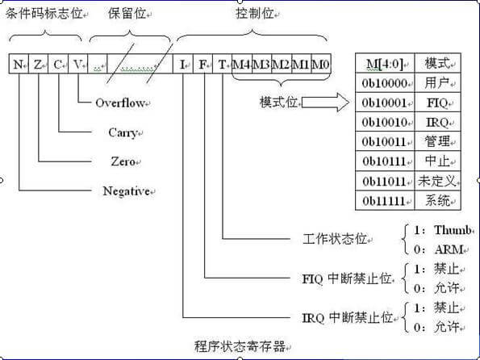

硬件架构相关篇为: 

* [v65.01 鸿蒙内核源码分析(芯片模式) | 回顾芯片行业各位大佬](/blog/65.md)
* [v66.03 鸿蒙内核源码分析(ARM架构) | ARMv7 & Cortex(A|R|M)](/blog/66.md)
* [v67.01 鸿蒙内核源码分析(指令集) | CICS PK RICS](/blog/67.md)
* [v68.01 鸿蒙内核源码分析(协处理器) | CPU的好帮手 ](/blog/68.md)
* [v69.05 鸿蒙内核源码分析(工作模式) | 角色不同 责任不同](/blog/69.md)
* [v70.06 鸿蒙内核源码分析(寄存器) | 世界被它们玩出了花](/blog/70.md)
* [v71.03 鸿蒙内核源码分析(多核管理) | 并发真正的基础](/blog/71.md)
* [v72.05 鸿蒙内核源码分析(中断概念) | 海公公的日常工作](/blog/72.md)
* [v73.04 鸿蒙内核源码分析(中断管理) | 没中断太可怕](/blog/73.md)


本篇需结合 **<< ARM体系架构参考手册(ARMv7-A/R).pdf >>** 阅读。

### 本篇说清楚CPU的工作模式

工作模式(Working mode) 也叫操作模式（Operating mode）又叫处理器模式（Processor mode），是 CPU 运行的重要参数，决定着处理器的工作方式，比如如何裁决特权级别和报告异常等。
系列篇为方便理解，统一叫工作模式，CPU的工作模式。

读本篇之前建议先读 v08.xx 鸿蒙内核源码分析(总目录)  其他篇。

正如一个互联网项目的后台管理系统有权限管理一样，CPU工作是否也有权限(模式)？ 一个成熟的软硬件架构，肯定会有这些设计，只是大部分人不知道，也不需要知道，老百姓就干好老百姓的活就行了，有工作能吃饱饭就知足了，宫的事你管那么多干嘛，你也管不了。

应用程序就只关注应用功能，业务逻辑相关的部分就行了，底层实现对应用层屏蔽的越干净系统设计的就越优良。

但鸿蒙内核源码分析系列篇的定位就是要把整个底层解剖，全部掰开，看看宫里究竟发生了么事。从本篇开始要接触大量的汇编的代码，将鸿蒙内核的每段汇编代码一一说明白。如此才能知道最开始的开始发生了什么，最后的最后又发生了什么。

### 七种模式

本篇需结合 **<< ARM体系架构参考手册(ARMv7-A/R).pdf >>** 阅读。

在ARM体系中，CPU很像有七个老婆的韦小宝，工作在以下七种模式中:


* **用户模式（usr）**：该模式是用户程序的工作模式，它运行在操作系统的用户态，它没有权限去操作其它硬件资源，只能执行处理自己的数据，也不能切换到其它模式下，要想访问硬件资源或切换到其它模式只能通过软中断或产生异常。
  
* **快速中断模式（fiq）**：快速中断模式是相对一般中断模式而言的，用来处理高优先级中断的模式，处理对时间要求比较紧急的中断请求，主要用于高速数据传输及通道处理中。
  
* **普通中断模式（irq）**：一般中断模式也叫普通中断模式，用于处理一般的中断请求，通常在硬件产生中断信号之后自动进入该模式，该模式可以自由访问系统硬件资源。

* **管理模式（svc）**：操作系统保护模式，CPU上电复位和当应用程序执行 SVC 指令调用系统服务时也会进入此模式，操作系统内核的普通代码通常工作在这个模式下。

* **终止模式（abt）**：当数据或指令预取终止时进入该模式，中止模式用于支持虚拟内存或存储器保护，当用户程序访问非法地址，没有权限读取的内存地址时，会进入该模式，

* **系统模式（sys）**：供操作系统使用的高特权用户模式，与用户模式类似，但具有可以直接切换到其他模式等特权，用户模式与系统模式两者使用相同的寄存器，都没有SPSR（Saved Program Statement Register，已保存程序状态寄存器），但系统模式比用户模式有更高的权限，可以访问所有系统资源。

* **未定义模式（und）**：未定义模式用于支持硬件协处理器的软件仿真，CPU在指令的译码阶段不能识别该指令操作时，会进入未定义模式。

除用户模式外，其余6种工作模式都属于特权模式

* 特权模式中除了系统模式以外的其余5种模式称为异常模式
* 大多数程序运行于用户模式
* 进入特权模式是为了处理中断、异常、或者访问被保护的系统资源
* 硬件权限级别：系统模式 > 异常模式 > 用户模式
* 快中断(fiq)与慢中断(irq)区别：快中断处理时禁止中断

每种模式都有自己独立的入口和独立的运行栈空间。 **系列篇之CPU篇** 已介绍过只要提供了入口函数和运行空间，CPU就可以干活了。入口函数解决了指令来源问题，运行空间解决了指令的运行场地问题。
而且在多核情况下，每个CPU核的每种特权模式都有自己独立的栈空间。注意是特权模式下的栈空间，用户模式的栈空间是由用户(应用)程序提供的。

如何让这七种模式能流畅的跑起来呢？ 至少需要以下解决三个基本问题。

* 栈空间是怎么申请的？申请了多大？
* 被切换中的模式代码放在哪里？谁来安排它们放在哪里？
* 模式之间是怎么切换的？状态怎么保存？
  

本篇代码来源于[鸿蒙内核源码之reset_vector_mp.S，点击查看](https://gitee.com/weharmony/kernel_liteos_a_note/tree/master/arch/arm/arm/src/startup/reset_vector_mp.S)
这个汇编文件大概 500多行，非常重要，本篇受限于篇幅只列出一小部分，说清楚以上三个问题。系列其余篇中将详细说明每段汇编代码的作用和实现，可前往查阅。

### 1.异常模式栈空间怎么申请？

鸿蒙是如何给异常模式申请栈空间的

```c
#define CORE_NUM                 LOSCFG_KERNEL_SMP_CORE_NUM //CPU 核数
#ifdef LOSCFG_GDB
#define OS_EXC_UNDEF_STACK_SIZE  512
#define OS_EXC_ABT_STACK_SIZE    512
#else
#define OS_EXC_UNDEF_STACK_SIZE  40
#define OS_EXC_ABT_STACK_SIZE    40
#endif
#define OS_EXC_FIQ_STACK_SIZE    64
#define OS_EXC_IRQ_STACK_SIZE    64
#define OS_EXC_SVC_STACK_SIZE    0x2000 //8K
#define OS_EXC_STACK_SIZE        0x1000 //4K

@六种特权模式申请对应的栈运行空间
__undef_stack:
    .space OS_EXC_UNDEF_STACK_SIZE * CORE_NUM 
__undef_stack_top:

__abt_stack:
    .space OS_EXC_ABT_STACK_SIZE * CORE_NUM
__abt_stack_top:

__irq_stack:
    .space OS_EXC_IRQ_STACK_SIZE * CORE_NUM 
__irq_stack_top:

__fiq_stack:
    .space OS_EXC_FIQ_STACK_SIZE * CORE_NUM
__fiq_stack_top:

__svc_stack:
    .space OS_EXC_SVC_STACK_SIZE * CORE_NUM 
__svc_stack_top:

__exc_stack:
    .space OS_EXC_STACK_SIZE * CORE_NUM
__exc_stack_top:
```

**代码解读**

* 六种异常模式都有自己独立的栈空间
* 每种模式的`OS_EXC_***_STACK_SIZE`栈大小都不一样，最大是管理模式（svc）8K，最小的只有40个字节。 svc模式为什么要这么大呢？
  因为开机代码和系统调用代码的运行都在管理模式，系统调用的函数实现往往较复杂，最大不能超过8K。
  例如:某个系统调用中定义一个8K的局部变量，内核肯定立马闪蹦。因为栈将溢出，处理异常的程序出现了异常，后面就再也没人兜底了，只能是死局。
* 鸿蒙是支持多核处理的，`CORE_NUM`表明，每个CPU核的每种异常模式都有自己的独立栈空间。注意理解这个是理解内核代码的基础。否则会一头雾水。

### 2。异常模式入口地址在哪？

本篇需结合 **<< ARM体系架构参考手册(ARMv7-A/R).pdf >>** 阅读。


这就是一切一切的开始，指定所有异常模式的入口地址表，这就是规定，没得商量的。在低地址情况下。开机代码就是放在 0x00000000的位置， 触发开机键后，硬件将PC寄存器置为0x00000000，开始了万里长征的第一步。在系统运行过程中就这么来回跳。

```c
    b   reset_vector            @开机代码
    b   _osExceptUndefInstrHdl  @异常处理之CPU碰到不认识的指令
    b   _osExceptSwiHdl   @异常处理之:软中断
    b   _osExceptPrefetchAbortHdl @异常处理之:取指异常
    b   _osExceptDataAbortHdl  @异常处理之:数据异常
    b   _osExceptAddrAbortHdl  @异常处理之:地址异常
    b   OsIrqHandler    @异常处理之:硬中断
    b   _osExceptFiqHdl    @异常处理之:快中断
```

以上是各个异常情况下的入口地址，在[reset_vector_mp.S](https://gitee.com/weharmony/kernel_liteos_a_note/tree/master/arch/arm/arm/src/startup/reset_vector_mp.S)中都能找到，经过编译链接后就会变成

```c
    b   0x00000000      @开机代码
    b   0x00000004      @异常处理之CPU碰到不认识的指令
    b   0x00000008  @异常处理之:软中断
    b   0x0000000C     @异常处理之:取指异常
    b   0x00000010  @异常处理之:数据异常
    b   0x00000014  @异常处理之:地址异常
    b   0x00000018  @异常处理之:硬中断
    b   0x0000001C  @异常处理之:快中断
```

不管是主动切换的异常，还是被动切换的异常，都会先跳到对应的入口去处理。每个异常的代码都起始于汇编，处理完了再切回去。举个例子:
某个应用程序调用了系统调用(比如创建定时器)，会经过以下大致过程:

* swi指令将用户模式切换到管理模式（svc）
* 在管理模式中先保存用户模式的现场信息(R0-R15寄存器值入栈)
* 获取系统调用号，知道是调用了哪个系统调用
* 查询系统调用对应的注册函数
* 执行真正的创建定时器函数
* 执行完成后，恢复用户模式的现场信息(R0-R15寄存器值出栈)
* 跳回用户模式继续执行

各异常处理代码很多，不一一列出，本篇只列出开机代码，请尝试读懂鸿蒙内核开机代码，后续讲详细说明每行代码的用处。  

#### 开机代码

```c
    reset_vector:   //开机代码
    /* clear register TPIDRPRW */
    mov     r0， #0     @r0 = 0
    mcr     p15， 0， r0， c13， c0， 4  @c0，c13 = 0， C13为进程标识符
    /* do some early cpu setup: i/d cache disable， mmu disabled */ @禁用MMU， i/d缓存
    mrc     p15， 0， r0， c1， c0， 0   @r0 = c1 ，c1寄存器详细解释见第64页
    bic     r0， #(1<<12)    @位清除指令，清除r0的第11位
    bic     r0， #(1<<2 | 1<<0)  @清除第0和2位 ，禁止 MMU和缓存 0位:MMU enable/disable 2位:Cache enable/disable
    mcr     p15， 0， r0， c1， c0， 0  @c1=r0 

    /* r11: delta of physical address and virtual address */@物理地址和虚拟地址的增量
    adr     r11， pa_va_offset @将基于PC相对偏移的地址pa_va_offset值读取到寄存器R11中
    ldr     r0， [r11]    @将R11的值给r0
    sub     r11， r11， r0   @r11 = r11 - r0 

    mrc     p15， 0， r12， c0， c0， 5              /* r12: get cpuid */ @获取CPUID
    and     r12， r12， #MPIDR_CPUID_MASK @r12经过掩码过滤
    cmp     r12， #0 @当前是否为0号CPU
    bne     secondary_cpu_init @不是0号主CPU则调用secondary_cpu_init

    /* if we need to relocate to proper location or not */
    adr     r4， __exception_handlers            /* r4: base of load address */ @r4获得加载基地址
    ldr     r5， =SYS_MEM_BASE                   /* r5: base of physical address */@r5获得物理基地址
    subs    r12， r4， r5                         /* r12: delta of load address and physical address */ @r12=r4-r5 加载地址和物理地址的增量
    beq     reloc_img_to_bottom_done            /* if we load image at the bottom of physical address */

    /* we need to relocate image at the bottom of physical address */
    ldr     r7， =__exception_handlers           /* r7: base of linked address (or vm address) */
    ldr     r6， =__bss_start                    /* r6: end of linked address (or vm address) */
    sub     r6， r7                              /* r6: delta of linked address (or vm address) */
    add     r6， r4                              /* r6: end of load address */
```

#### 异常的优先级

当同时出现多个异常时，该响应哪一个呢？这涉及到了异常的优先级，顺序如下

* 1.Reset (highest priority).
* 2.data Abort.
* 3.FIQ.
* 4.IRQ.
* 5.Prefetch Abort.
* 6.Undefined Instruction， SWI (lowest priority).

可以看出swi的优先级最低，swi就是软中断，系统调用就是通过它来实现的。

### 3。异常模式怎么切换？

写应用程序经常会用到状态，来记录各种分支逻辑，传递参数。这么多异常模式，相互切换，中间肯定会有很多的状态需要保存。比如:如何能知道当前运行在哪种模式下？怎么查？去哪里查呢？
答案是: CPSR(一个) 和 SPSR(5个)
这些寄存器：

* 保存有关最近执行的ALU操作的信息
* 控制中断的启用和禁用
* 设置处理器操作模式

### CPSR 寄存器


CPSR(current program status register)当前程序的状态寄存器
CPSR有4个8位区域：标志域（F）、状态域（S）、扩展域（X）、控制域（C）
32 位的程序状态寄存器可分为4 个域：

* 1) 位[31：24]为条件标志位域，用f 表示；
* 2) 位[23：16]为状态位域，用s 表示；
* 3) 位[15：8]为扩展位域，用x 表示；
* 4) 位[7：0]为控制位域，用c 表示；

CPSR和其他寄存器不一样，其他寄存器是用来存放数据的，都是整个寄存器具有一个含义。
而CPSR寄存器是按位起作用的，也就是说，它的每一位都有专门的含义，记录特定的信息。

CPSR的低8位（包括I、F、T和M[4：0]）称为控制位，程序无法修改，
除非CPU运行于特权模式下，程序才能修改控制位

N、Z、C、V均为条件码标志位。它们的内容可被算术或逻辑运算的结果所改变，
并且可以决定某条指令是否被执行!意义重大!

* CPSR的第31位是 N，符号标志位。它记录相关指令执行后，其结果是否为负。
 如果为负 N = 1，如果是非负数 N = 0。
* CPSR的第30位是Z，0标志位。它记录相关指令执行后，其结果是否为0。
 如果结果为0。那么Z = 1。如果结果不为0，那么Z = 0。
* CPSR的第29位是C，进位标志位(Carry)。一般情况下，进行无符号数的运算。
    加法运算：当运算结果产生了进位时（无符号数溢出），C=1，否则C=0。
    减法运算（包括CMP）：当运算时产生了借位时（无符号数溢出），C=0，否则C=1。
* CPSR的第28位是V，溢出标志位(Overflow)。在进行有符号数运算的时候，
 如果超过了机器所能标识的范围，称为溢出。

MSR{条件} 程序状态寄存器(CPSR 或SPSR)_<域>，操作数
MSR 指令用于将操作数的内容传送到程序状态寄存器的特定域中
示例如下：

```c
 MSR CPSR，R0   @传送R0 的内容到CPSR
 MSR SPSR，R0   @传送R0 的内容到SPSR
 MSR CPSR_c，R0 @传送R0 的内容到CPSR，但仅仅修改CPSR中的控制位域
```

MRS{条件} 通用寄存器，程序状态寄存器(CPSR 或SPSR)
MRS 指令用于将程序状态寄存器的内容传送到通用寄存器中。该指令一般用在以下两种情况：
        1) 当需要改变程序状态寄存器的内容时，可用MRS 将程序状态寄存器的内容读入通用寄存器，修改后再写回程序状态寄存器。
        2) 当在异常处理或进程切换时，需要保存程序状态寄存器的值，可先用该指令读出程序状态寄存器的值，然后保存。
示例如下：

```c
MRS R0，CPSR   @传送CPSR 的内容到R0
MRS R0，SPSR   @传送SPSR 的内容到R0
               @MRS指令是唯一可以直接读取CPSR和SPSR寄存器的指令
```

### SPSR 寄存器

SPSR（saved program status register）程序状态保存寄存器。五种异常模式下一个状态寄存器SPSR，用于保存CPSR的状态，以便异常返回后恢复异常发生时的工作状态。

* 1、SPSR 为 CPSR 中断时刻的副本，退出中断后，将SPSR中数据恢复到CPSR中。
* 2、用户模式和系统模式下SPSR不可用，所以SPSR寄存器只有5个


  

