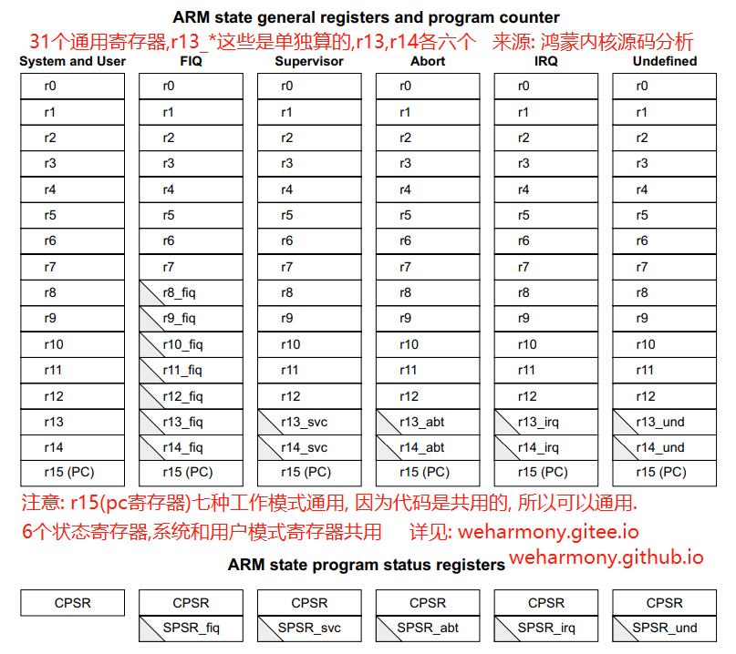

硬件架构相关篇为: 

* [v65.01 鸿蒙内核源码分析(芯片模式) | 回顾芯片行业各位大佬](/blog/65.md)
* [v66.03 鸿蒙内核源码分析(ARM架构) | ARMv7 & Cortex(A|R|M)](/blog/66.md)
* [v67.01 鸿蒙内核源码分析(指令集) | CICS PK RICS](/blog/67.md)
* [v68.01 鸿蒙内核源码分析(协处理器) | CPU的好帮手 ](/blog/68.md)
* [v69.05 鸿蒙内核源码分析(工作模式) | 角色不同 责任不同](/blog/69.md)
* [v70.06 鸿蒙内核源码分析(寄存器) | 世界被它们玩出了花](/blog/70.md)
* [v71.03 鸿蒙内核源码分析(多核管理) | 并发真正的基础](/blog/71.md)
* [v72.05 鸿蒙内核源码分析(中断概念) | 海公公的日常工作](/blog/72.md)
* [v73.04 鸿蒙内核源码分析(中断管理) | 没中断太可怕](/blog/73.md)


### 本篇说清楚寄存器

本篇需结合 **<< ARM体系架构参考手册(ARMv7-A/R).pdf >>** 阅读。

### 寄存器的本质

寄存器从大一的计算机组成原理就开始听到它，感觉很神秘，如梦如雾多年。揭开本质后才发现，寄存器就是一个32位的存储空间，一个int变量而已(其背后的硬件原理是D触发器)，但它的厉害之处在于极高频率的使用，让人不敢相信是怎么做到的，不管再复杂再牛牛的应用程序，电商也好，游戏，直播也罢，到了它这里都变成了有限的十几个寄存器在玩，简直太神奇了。
本篇将清楚说明寄存器的数量和功能，至于它是如何把复杂的上层程序变成了这十几个寄存器来玩？这是编译器的事情，不在讨论范围之内。

在 32 位的 ARM 架构中，核心寄存器（core register）的数量一般有 37 个或者更多，视处理器实现的功能多少而定。所谓核心寄存器就是指 ARM 处理器内核执行常规指令时使用的寄存器，不包括用于浮点计算和 SIMD 技术的特殊寄存器，也可以理解为是 ARM 的核心处理器单元（PE）中的寄存器，不包括外围的协处理器中的寄存器。

ARM7的37个寄存器，具体看图说明:



这些寄存器不能同时显示，处理器指令状态和工作模式指定哪些寄存器可供使用，图中一一对应。

* 其中31个通用32位寄存器，系统和用户模式全程复用寄存器，而其余5中异常(或叫特权)模式从R8_*~ R14_* 的寄存器叫模式专属寄存器。这种特征的寄存器有个专门的称呼，叫 Banked register.Bank 本意是银行和存款的意思，在这里的意思是"有备份的"。
* 注意 r8 和 r8_fiq是两个不同的寄存器，名字前缀是为了好记，管理方便，以示同级概念理解。如此凑成了31个寄存器。
* 其中r13寄存器用于SP寄存器，始终指向栈顶，因为每种工作模式都有独立的运行栈，所以有独立的寄存器去记住各自的栈顶。
* 同理r14寄存器用于LR寄存器，用于保存模式切换时的切换位置，也是独立存在，说明模式间回跳时并不需要重新给r14_*赋值，只需在跳出去的时候保存即可。
* 系统和用户模式共用r13(sp)和r14(lr)寄存器，所以在每个子函数的栈帧中都要保存上一个调用它函数的SP和LR值，自己执行完成后要从栈帧中恢复这两个寄存器的值，否则无法界定回去后从哪里开始，从哪里计算偏移位置。
* r15(pc)寄存器是指向代码段的，所有模式复用的原因是它是共用的，一份代码，你运行与不运行，代码段就在哪里，不增不减。
* 6个状态寄存器，其中CPSR(1个)和SPSR_*(5个)，它们主要用于自运行或发生模式切换后的各种状态保存。
* CPSR:程序状态寄存器(current program status register) (当前程序状态寄存器)，在任何处理器模式下被访问。
* SPSR:程序状态保存寄存器（saved program status register），每一种处理器模式下都有一个状态寄存器SPSR，SPSR用于保存CPSR的状态，以便异常返回后恢复异常发生时的工作状态。当特定 的异常中断发生时，这个寄存器用于存放当前程序状态寄存器的内容。在异常中断退出时，可以用SPSR来恢复CPSR。

### 七种工作模式

关于工作模式在本文末尾对应篇中有详细介绍，可自行前往查看。此处只简单说明下。
本篇需结合 **<< ARM体系架构参考手册(ARMv7-A/R).pdf >>** 阅读。

在ARM体系中，CPU工作在以下七种模式中:


* **用户模式（usr）**：该模式是用户程序的工作模式，它运行在操作系统的用户态，它没有权限去操作其它硬件资源，只能执行处理自己的数据，也不能切换到其它模式下，要想访问硬件资源或切换到其它模式只能通过软中断或产生异常。
  
* **快速中断模式（fiq）**：快速中断模式是相对一般中断模式而言的，用来处理高优先级中断的模式，处理对时间要求比较紧急的中断请求，主要用于高速数据传输及通道处理中。
  
* **普通中断模式（irq）**：一般中断模式也叫普通中断模式，用于处理一般的中断请求，通常在硬件产生中断信号之后自动进入该模式，该模式可以自由访问系统硬件资源。

* **管理模式（svc）**：操作系统保护模式，CPU上电复位和当应用程序执行 SVC 指令调用系统服务时也会进入此模式，操作系统内核的普通代码通常工作在这个模式下。

* **终止模式（abt）**：当数据或指令预取终止时进入该模式，中止模式用于支持虚拟内存或存储器保护，当用户程序访问非法地址，没有权限读取的内存地址时，会进入该模式，

* **系统模式（sys）**：供操作系统使用的高特权用户模式，与用户模式类似，但具有可以直接切换到其他模式等特权，用户模式与系统模式两者使用相同的寄存器，都没有SPSR（Saved Program Statement Register，已保存程序状态寄存器），但系统模式比用户模式有更高的权限，可以访问所有系统资源。

* **未定义模式（und）**：未定义模式用于支持硬件协处理器的软件仿真，CPU在指令的译码阶段不能识别该指令操作时，会进入未定义模式。

除用户模式外，其余6种工作模式都属于特权模式

* 特权模式中除了系统模式以外的其余5种模式称为异常模式
* 大多数程序运行于用户模式
* 进入特权模式是为了处理中断、异常、或者访问被保护的系统资源
* 硬件权限级别：系统模式 > 异常模式 > 用户模式
* 快中断(fiq)与慢中断(irq)区别：快中断处理时禁止中断

每种模式都有自己独立的入口和独立的运行栈空间。 **系列篇之CPU篇** 已介绍过只要提供了入口函数和运行空间，CPU就可以干活了。入口函数解决了指令来源问题，运行空间解决了指令的运行场地问题。
而且在多核情况下，每个CPU核的每种特权模式都有自己独立的栈空间。注意是特权模式下的栈空间，用户模式的栈空间是由用户(应用)程序提供的。

### R0~R7 寄存器

这 8 个寄存器是最普通的，所有模式都可以访问和使用。
尤其是`R0`是寄存器中的王牌，被称为头号寄存器，通用寄存器中它用的最高频，随便翻段汇编代码都能看到它的影子。鸿蒙开机第一跳指令就是 r0 = 0

```c
reset_vector: //鸿蒙开机代码
    /* clear register TPIDRPRW */
    mov     r0， #0     @r0 = 0
    mcr     p15， 0， r0， c13， c0， 4  @c0，c13 = 0， C13为进程标识符 
    /* do some early cpu setup: i/d cache disable， mmu disabled */ @禁用MMU， i/d缓存
    mrc     p15， 0， r0， c1， c0， 0   @r0 = c1 ，c1寄存器详细解释见第64页
    bic     r0， #(1<<12)    @位清除指令，清除r0的第11位
    bic     r0， #(1<<2 | 1<<0)  @清除第0和2位 ，禁止 MMU和缓存 0位:MMU enable/disable 2位:Cache enable/disable
    mcr     p15， 0， r0， c1， c0， 0  @c1=r0 
```

再看拿自旋锁的汇编代码，这些代码都在系列篇中详细讲解过，可前往 v08.xx 鸿蒙内核源码分析(总目录)  自行查看。

```c
FUNCTION(ArchSpinLock) @非要拿到锁
 mov  r1， #1  @r1=1
1:      @循环的作用，因SEV是广播事件。不一定lock->rawLock的值已经改变了
 ldrex r2， [r0] @r0 = &lock->rawLock， 即 r2 = lock->rawLock
 cmp  r2， #0  @r2和0比较
 wfene    @不相等时，说明资源被占用，CPU核进入睡眠状态
 strexeq r2， r1， [r0]@此时CPU被重新唤醒，尝试令lock->rawLock=1，成功写入则r2=0
 cmpeq r2， #0  @再来比较r2是否等于0，如果相等则获取到了锁
 bne  1b   @如果不相等，继续进入循环
 dmb     @用DMB指令来隔离，以保证缓冲中的数据已经落实到RAM中
 bx  lr   @此时是一定拿到锁了，跳回调用ArchSpinLock函数
```

`R0`被潜规则的干了两件事，突出了它的重要性:

* 第一个参数 由R0保管，当然第二个参数就给R1保管
* 函数的返回值统一交给R0保管， 例如 a -> b ，b执行完会把返回值给r0，回到a后，a从r0取值，不管取到什么，它就认为这是b的返回值，默认都只认r0保存了返回值，这就是规定。

具体看一个C函数和它的汇编，在系列篇也已经讲过，可自行翻看。

```c
//++++++++++++ square(c -> 汇编)++++++++++++++++++++++++
int square(int a，int b){
    return a*b;
}
square(int， int):
        sub     sp， sp， #8     @sp减去8，意思为给square分配栈空间，只用2个栈空间完成计算
        str     r0， [sp， #4]   @第一个参数入栈
        str     r1， [sp]       @第二个参数入栈
        ldr     r1， [sp， #4]   @取出第一个参数给r1
        ldr     r2， [sp]       @取出第二个参数给r2
        mul     r0， r1， r2     @执行a*b给R0，返回值的工作一直是交给R0的
        add     sp， sp， #8     @函数执行完了，要释放申请的栈空间
        bx      lr             @子程序返回，等同于mov pc，lr，即跳到调用处
//++++++++++++ fp(c -> 汇编)++++++++++++++++++++++++
int fp(int b)
{
    int a = 1;
    return square(a+b，a+b);
}
fp(int):
        push    {r11， lr}      @r11(fp)/lr入栈，保存调用者main的位置
        mov     r11， sp        @r11用于保存sp值，函数栈开始位置 
        sub     sp， sp， #8     @sp减去8，意思为给fp分配栈空间，只用2个栈空间完成计算
        str     r0， [sp， #4]   @先保存参数值，放在SP+4，此时r0中存放的是参数
        mov     r0， #1         @r0=1
        str     r0， [sp]       @再把1也保存在SP的位置
        ldr     r0， [sp]       @把SP的值给R0
        ldr     r1， [sp， #4]   @把SP+4的值给R1
        add     r1， r0， r1     @执行r1=a+b
        mov     r0， r1         @r0=r1，用r0，r1传参
        bl      square(int， int)@先mov lr， pc 再mov pc square(int， int)   
        mov     sp， r11        @函数执行完了，要释放申请的栈空间 
        pop     {r11， lr}      @弹出r11和lr，lr是专用标签，弹出就自动复制给lr寄存器
        bx      lr             @子程序返回，等同于mov pc，lr，即跳到调用处
```

这段代码同样适用于理解以下的各个寄存器。R0的作用相当于 x86 的 EAX

### R7 寄存器

为啥要单独讲R7寄存器，因为它偶尔作为特殊寄存器在使用。内核对上层应用提供了数百个系统调用功能，当发生系统调用时，在CPU工作模式切换过程中，系统调用号是一直保存在R7寄存器中的，通过系统调用号就能查询到对应的注册函数。具体在 系统调用篇中有详细的过程说明，这里只列出部分代码

```c
//4个参数的系统调用时底层处理
static inline long __syscall4(long n， long a， long b， long c， long d)
{
 register long a7 __asm__("a7") = n; //将系统调用号保存在R7寄存器
 register long a0 __asm__("a0") = a; //R0
 register long a1 __asm__("a1") = b; //R1
 register long a2 __asm__("a2") = c; //R2
 register long a3 __asm__("a3") = d; //R3
 __asm_syscall("r"(a7)， "0"(a0)， "r"(a1)， "r"(a2)， "r"(a3))
}
//切换到SVC模式后，由汇编代码调用由C语言实现的系统调用统一入口
LITE_OS_SEC_TEXT UINT32 *OsArmA32SyscallHandle(UINT32 *regs)
{
    UINT32 ret;
    UINT8 nArgs;
    UINTPTR handle;
    UINT32 cmd = regs[REG_R7];// 从R7寄存器中取出系统调用号
    handle = g_syscallHandle[cmd];//查询系统调用的注册函数 
    //...
}
```

### fp(R11) 寄存器

R11：可以用作通用寄存器，在开启特定编译选项时可以用作帧指针寄存器FP，用来实现栈回溯功能。
  GNU编译器（gcc）默认将R11作为存储变量的通用寄存器，因而默认情况下无法使用FP的栈回溯功能。为支持调用栈解析功能，需要在编译参数中添加   -fno-omit-frame-pointer 选项，提示编译器将R11作为FP使用。

FP寄存器（Frame Point），帧指针寄存器，指向当前函数的父函数的栈帧起始地址。利用该寄存器可以得到父函数的栈帧，从栈帧中获取父函数的FP，就可以得到祖父函数的栈帧，以此类推，可以追溯程序调用栈，得到函数间的调用关系。

在鸿蒙内核R11是当FP寄存器使用。

### SP(R13) 寄存器

SP:栈指针寄存器(stack pointer)，它也是 `banked register`，而且所有模式都有一份，总共有 6 个（有虚拟化支持时再多一个），分别用于用户、`IRQ`、`FIQ`、
未定义、中止和管理员模式。在 ARM 手册，有时用 `SP_usr`、`SP_svc` 这样的写法来表示不同模式下的 SP 寄存器。

SP指向函数栈的栈顶，如此 `fp` 和 `sp` 就划定了函数栈的范围，函数在运行期间除了动态申请的内存要跑出去玩，其余就在这块空间里玩。

在鸿蒙内核R13是当SP寄存器使用。

### LR(R14) 寄存器

又叫 Link Register，简称 `LR`，在主动调用子函数时，`ARM` 处理器会自动将子函数的返回地址放到这个寄存器中。
另外在异常发生的被动阶段，会导致程序正常运行的被打断， 并将控制流转移到相应的异常处理（异常响应），有些异常（`fiq`、`irq`）事件处理后，系统还希望能回 到当初异常发生时被打断的源程序断点处继续完成源程序的执行（异常返回），这就需要一种解决方案， 用于记录源程序的断点位置，以便正确的异常返回。
类似的还有子程序的调用和 返回。在主程序中（通过子程序调用指令）调用子程序时，也需要记录下主程序中的调用点位置，以便将来的子程序的返回。

LR:链接寄存器(linked pointer)，就是用来解决上述问题的，ARM处理器中使用 R14实现对断点和调用点的记录，即R14用作返回连接寄存器（LR），确保回来知道自己从哪个位置中断，以便继续执行。

在鸿蒙内核`R14`是当`LR`寄存器使用。

### PC(R15) 寄存器

简称 PC（Program Counter）。当执行 ARM 指令（每条指令 4 字节），它的值为当前指令的地址加 8，当执行 `Thumb` 指令时，它的值为当前指令的地址加 4，其设计原则是让 `PC` 指向当前指令后面的第二条指令。

PC寄存器涉及到arm的流水线结构设计，具体在后续流水线篇中详细说明，敬请关注。

在鸿蒙内核`R15`是当`PC`寄存器使用。

### CPSR 寄存器


CPSR(current program status register)当前程序的状态寄存器
CPSR有4个8位区域：标志域（F）、状态域（S）、扩展域（X）、控制域（C）
32 位的程序状态寄存器可分为4 个域：

* 1) 位[31：24]为条件标志位域，用f 表示；
* 2) 位[23：16]为状态位域，用s 表示；
* 3) 位[15：8]为扩展位域，用x 表示；
* 4) 位[7：0]为控制位域，用c 表示；

CPSR和其他寄存器不一样，其他寄存器是用来存放数据的，都是整个寄存器具有一个含义。
而CPSR寄存器是按位起作用的，也就是说，它的每一位都有专门的含义，记录特定的信息。

CPSR的低8位（包括I、F、T和M[4：0]）称为控制位，程序无法修改，
除非CPU运行于特权模式下，程序才能修改控制位

N、Z、C、V均为条件码标志位。它们的内容可被算术或逻辑运算的结果所改变，并且可以决定某条指令是否被执行!意义重大!

* CPSR的第31位是 N，符号标志位。它记录相关指令执行后，其结果是否为负。
 如果为负 N = 1，如果是非负数 N = 0。
* CPSR的第30位是Z，0标志位。它记录相关指令执行后，其结果是否为0。
 如果结果为0。那么Z = 1。如果结果不为0，那么Z = 0。
* CPSR的第29位是C，进位标志位(Carry)。一般情况下，进行无符号数的运算。
    加法运算：当运算结果产生了进位时（无符号数溢出），C=1，否则C=0。
    减法运算（包括CMP）：当运算时产生了借位时（无符号数溢出），C=0，否则C=1。
* CPSR的第28位是V，溢出标志位(Overflow)。在进行有符号数运算的时候，
 如果超过了机器所能标识的范围，称为溢出。

MSR{条件} 程序状态寄存器(CPSR 或SPSR)_<域>，操作数
MSR 指令用于将操作数的内容传送到程序状态寄存器的特定域中
示例如下：

```c
 MSR CPSR，R0   @传送R0 的内容到CPSR
 MSR SPSR，R0   @传送R0 的内容到SPSR
 MSR CPSR_c，R0 @传送R0 的内容到CPSR，但仅仅修改CPSR中的控制位域
```

MRS{条件} 通用寄存器，程序状态寄存器(CPSR 或SPSR)
MRS 指令用于将程序状态寄存器的内容传送到通用寄存器中。该指令一般用在以下两种情况：
        1) 当需要改变程序状态寄存器的内容时，可用MRS 将程序状态寄存器的内容读入通用寄存器，修改后再写回程序状态寄存器。
        2) 当在异常处理或进程切换时，需要保存程序状态寄存器的值，可先用该指令读出程序状态寄存器的值，然后保存。
示例如下：

```c
MRS R0，CPSR   @传送CPSR 的内容到R0
MRS R0，SPSR   @传送SPSR 的内容到R0
               @MRS指令是唯一可以直接读取CPSR和SPSR寄存器的指令
```

### SPSR 寄存器

`SPSR`（saved program status register）程序状态保存寄存器。五种异常模式下一个状态寄存器`SPSR`，用于保存`CPSR`的状态，以便异常返回后恢复异常发生时的工作状态。

* 1、SPSR 为 CPSR 中断时刻的副本，退出中断后，将SPSR中数据恢复到CPSR中。
* 2、用户模式和系统模式下SPSR不可用，所以SPSR寄存器只有5个

### 留个问题

从R11 ~ R15 寄存器除了R12都用着专用寄存器，用作为特殊用途，单独独R12夹在中间不上不下的，这又是为什么呢？


  

