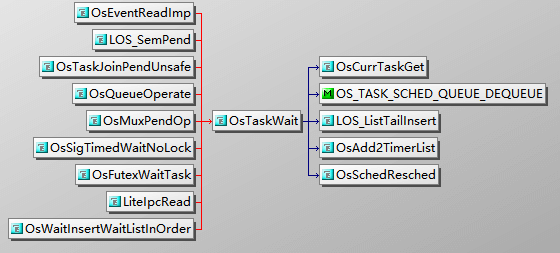

硬件架构相关篇为: 

* [v65.01 鸿蒙内核源码分析(芯片模式) | 回顾芯片行业各位大佬](/blog/65.md)
* [v66.03 鸿蒙内核源码分析(ARM架构) | ARMv7 & Cortex(A|R|M)](/blog/66.md)
* [v67.01 鸿蒙内核源码分析(指令集) | CICS PK RICS](/blog/67.md)
* [v68.01 鸿蒙内核源码分析(协处理器) | CPU的好帮手 ](/blog/68.md)
* [v69.05 鸿蒙内核源码分析(工作模式) | 角色不同 责任不同](/blog/69.md)
* [v70.06 鸿蒙内核源码分析(寄存器) | 世界被它们玩出了花](/blog/70.md)
* [v71.03 鸿蒙内核源码分析(多核管理) | 并发真正的基础](/blog/71.md)
* [v72.05 鸿蒙内核源码分析(中断概念) | 海公公的日常工作](/blog/72.md)
* [v73.04 鸿蒙内核源码分析(中断管理) | 没中断太可怕](/blog/73.md)


### 本篇说清楚CPU

读本篇之前建议先读 v08.xx 鸿蒙内核源码分析(总目录)  进程/线程篇.

* 指令是稳定的,但指令序列是变化的,只有这样计算机才能够实现用计算来解决一切问题这个目标.计算是稳定的,但计算的数据是多变的,多态的,地址是数据,控制信号也是数据.指令集本身也是数据(固定的数据).只有这样才能够让计算机不必修改基础架构却可以适应不断发展变化的技术革命.

* `cpu`是负责执行指令的,谁能给它指令？是线程(也叫任务), 任务是内核的调度单元,调度到哪个任务CPU就去执行哪个任务的指令. 要执行指令就要有个取指令的开始地址. 开始地址就是大家所熟知的main函数.一个程序被加载解析后内核会在ELF中找到main函数的位置,并自动创建一个线程,指定线程的入口地址为main函数的地址,由此开始了取指,译指,执指之路.

* 多线程内核是怎么处理的？ 一样的, 以JAVA举例,对内核来说 new thread中的run() 函数 和 main() 并没有区别. 都是一个线程(任务)的执行入口. 注意在系列篇中反复的说任务就是线程,线程就是任务,它们是一个东西在不同层面上的描述.对应用层说线程,对内核层说任务. 有多少个线程就会有多少个入口,它们统一接受调度算法的调度, 调度算法只认优先级的高低,不会管你是main() 还是 run() 而区别对待.

* 定时器的实现也是通过任务实现的,只不过是个系统任务`OsSwtmrTaskCreate`,优先级最高,和入口地址`OsSwtmrTask`由系统指定.

* 所以理解CPU就要先理解任务,任务是理解内核的主线,把它搞明白了分析内核就轻轻松松,事半功倍了.看似高深的CPU只不过是搂草打兔子.不相信？那就看看内核对CPU是怎么描述的吧.本篇就围绕这个结构体展开说.

### Percpu

percpu变量,顾名思义,就是对于同一个变量,每个cpu都有自己的一份,它可以被用来存放一些cpu独有的数据,比如cpu的id,cpu上正在运行的任务等等.

```c
Percpu g_percpu[LOSCFG_KERNEL_CORE_NUM];//CPU核描述符,描述每个CPU的信息.
typedef struct {//内核对cpu的描述
    //挂等待和延时的任务
    SortLinkAttribute taskSortLink;             /* task sort link */
    //挂定时器
    SortLinkAttribute swtmrSortLink;            /* swtmr sort link */
    //空闲任务ID 见于 OsIdleTaskCreate
    UINT32 idleTaskID;                          /* idle task id */
    //任务锁的数量,当 > 0 的时候,需要重新调度了
    UINT32 taskLockCnt;                         /* task lock flag */ 
    //软时钟超时队列句柄
    UINT32 swtmrHandlerQueue;                   /* software timer timeout queue id */
    //软时钟任务ID
    UINT32 swtmrTaskID;                         /* software timer task id */
    //调度标识 INT_NO_RESCH INT_PEND_RESCH
    UINT32 schedFlag;                           /* pending scheduler flag */ 
#if (LOSCFG_KERNEL_SMP == YES)
    //CPU处于停止或运行的标识
    UINT32 excFlag;                             /* cpu halt or exc flag */ 
#endif
} Percpu;
```

至于 `g_percpu`的值怎么来的,因和编译过程相关,将在后续编译篇中说明.
`Percpu`结构体不复杂,但很重要,一个一个掰开了说.

* `taskSortLink`是干什么用的？ 一个任务在运行过程中,经常会主动或被动停止,而进入等待状态.
  * 主动停止情况, 例如:主动delay300毫秒,这是应用层很常见的操作.
  * 被动停止情况, 例如:申请互斥锁失败,等待某个事件发生.
    发生这些情况时任务将被挂到`taskSortLink`上.这些任务可能来自不同的进程,但都是因为在被这个CPU执行时停下来了,等着再次被它执行.下图很清晰的看出在哪种情况下会被记录在案.

    

```c
UINT32 OsTaskWait(LOS_DL_LIST *list, UINT32 timeout, BOOL needSched)
{
    LosTaskCB *runTask = NULL;
    LOS_DL_LIST *pendObj = NULL;
    runTask = OsCurrTaskGet();//获取当前任务
    OS_TASK_SCHED_QUEUE_DEQUEUE(runTask, OS_PROCESS_STATUS_PEND);//将任务从就绪队列摘除,并变成阻塞状态
    pendObj = &runTask->pendList;
    runTask->taskStatus |= OS_TASK_STATUS_PEND;//给任务贴上阻塞任务标签
    LOS_ListTailInsert(list, pendObj);//将阻塞任务挂到list上,,这步很关键,很重要!
    if (timeout != LOS_WAIT_FOREVER) {//非永远等待的时候
        runTask->taskStatus |= OS_TASK_STATUS_PEND_TIME;//阻塞任务再贴上在一段时间内阻塞的标签
        OsAdd2TimerList(runTask, timeout);//把任务加到定时器链表中
    }
    if (needSched == TRUE) {//是否需要调度
        OsSchedResched();//申请调度,里面直接切换了任务上下文,至此任务不再往下执行了.
        if (runTask->taskStatus & OS_TASK_STATUS_TIMEOUT) {//这条语句是被调度再次选中时执行的,和上面的语句可能隔了很长时间,所以很可能已经超时了
            runTask->taskStatus &= ~OS_TASK_STATUS_TIMEOUT;//如果任务有timeout的标签,那么就去掉那个标签
            return LOS_ERRNO_TSK_TIMEOUT;
        }
    }
    return LOS_OK;
}
LITE_OS_SEC_TEXT STATIC INLINE VOID OsAdd2TimerList(LosTaskCB *taskCB, UINT32 timeOut)
{
    SET_SORTLIST_VALUE(&taskCB->sortList, timeOut);//设置idxRollNum的值为timeOut
    OsAdd2SortLink(&OsPercpuGet()->taskSortLink, &taskCB->sortList);//将任务挂到定时器排序链表上
#if (LOSCFG_KERNEL_SMP == YES)
    //注意:这里的排序不是传统意义上12345的排序,而是根据timeOut的值来决定放到CPU core哪个taskSortLink[0:7]链表上
    taskCB->timerCpu = ArchCurrCpuid();
#endif
}
```

`OsAdd2SortLink`,将任务挂到排序链表上,因等待时间不一样,所以内核会对这些任务按时间长短排序.

* 定时器相关三个变量,在系列篇定时器机制篇中已有对定时器的详细描述,可前往 v31.xx (定时器篇) 查看,就不难理解以下三个的作用了.
  
```c
SortLinkAttribute swtmrSortLink;//CPU要处理的定时器链表
UINT32 swtmrHandlerQueue; //队列中放各个定时器的响应函数
UINT32 swtmrTaskID; // 其实就是 OsSwtmrTaskCreate
```

搞明白定时器的机制只需搞明白: 定时器(`SWTMR_CTRL_S`),定时任务(`swtmrTaskID`),定时器响应函数(`SwtmrHandlerItem`),定时器处理队列`swtmrHandlerQueue` 四者的关系就可以了.
一句话概括:定时任务`swtmrTaskID`是个系统任务,优先级最高,它循环读取队列`swtmrHandlerQueue`中的已到时间的定时器(`SWTMR_CTRL_S`),并执行定时器对应的响应函数`SwtmrHandlerItem`.

* `idleTaskID`空闲任务,注意这又是个任务,每个cpu核都有属于自己的空闲任务,cpu没事干的时候就待在里面.空闲任务长什么样？ `Look!`
  
```c
//创建一个空闲任务
LITE_OS_SEC_TEXT_INIT UINT32 OsIdleTaskCreate(VOID)
{
    UINT32 ret;
    TSK_INIT_PARAM_S taskInitParam;
    Percpu *perCpu = OsPercpuGet();//获取CPU信息
    UINT32 *idleTaskID = &perCpu->idleTaskID;//每个CPU都有一个空闲任务
    (VOID)memset_s((VOID *)(&taskInitParam), sizeof(TSK_INIT_PARAM_S), 0, sizeof(TSK_INIT_PARAM_S));//任务初始参数清0
    taskInitParam.pfnTaskEntry = (TSK_ENTRY_FUNC)OsIdleTask;//入口函数
    taskInitParam.uwStackSize = LOSCFG_BASE_CORE_TSK_IDLE_STACK_SIZE;//任务栈大小 2K
    taskInitParam.pcName = "Idle";//任务名称 叫pcName有点怪怪的,不能换个撒
    taskInitParam.usTaskPrio = OS_TASK_PRIORITY_LOWEST;//默认最低优先级 31
    taskInitParam.uwResved = OS_TASK_FLAG_IDLEFLAG;//默认idle flag
    #if (LOSCFG_KERNEL_SMP == YES)//CPU多核情况
    taskInitParam.usCpuAffiMask = CPUID_TO_AFFI_MASK(ArchCurrCpuid());//每个idle任务只在单独的cpu上运行
    #endif
    ret = LOS_TaskCreate(idleTaskID, &taskInitParam);//创建task并申请调度,
    OS_TCB_FROM_TID(*idleTaskID)->taskStatus |= OS_TASK_FLAG_SYSTEM_TASK;//设置task状态为系统任务,系统任务运行在内核态.
    //这里说下系统任务有哪些？比如: idle,swtmr(软时钟),资源回收等等 
    return ret;
}
LITE_OS_SEC_TEXT WEAK VOID OsIdleTask(VOID)
{
    while (1) {//只有一个死循环
        #ifdef LOSCFG_KERNEL_TICKLESS //低功耗模式开关, idle task 中关闭tick
        if (OsTickIrqFlagGet()) {
            OsTickIrqFlagSet(0);
            OsTicklessStart();
        }
        #endif
        Wfi();//WFI指令:arm core 立即进入low-power standby state,等待中断,进入休眠模式.
    }
}
```

`OsIdleTask`是一个死循环,只有一条汇编指令`Wfi`. 啥意思？
`WFI`(Wait for interrupt):等待中断到来指令. `WFI`一般用于`cpuidle`,`WFI` 指令是在处理器发生中断或类似异常之前不需要做任何事情.具体在 自旋锁篇 中有详细描述,可前往查看.说到死循环,这里多说一句,从宏观尺度上来理解,整个内核就是一个死循环.因为有 软硬中断/异常 使得内核能活跃起来,能跳到不同的地方去执行,执行完了又会沉寂下去,等待新的触发到来.

* `taskLockCnt` 这个简单,记录等锁的任务数量.任务在运行过程中优先级是会不断地变化的, 例如 高优先级的A任务在等某锁,但持有锁的一方B任务优先级低,这时就会调高B的优先级至少到A的等级,提高B被调度算法命中的概率,如此就能快速的释放锁交给A运行. `taskLockCnt`记录被CPU运行过的正在等锁的任务数量.

* `schedFlag` 调度的标签.
  
```c
typedef enum {
    //不需要调度
    INT_NO_RESCH = 0,   /* no needs to schedule */
    //阻止调度
    INT_PEND_RESCH,     /* pending schedule flag */
} SchedFlag;
```
调度并不是每次都能成功的,在某些情况下内核会阻止调度进行.例如:`OS_INT_ACTIVE`硬中断发生的时候.

```c
STATIC INLINE VOID LOS_Schedule(VOID)
{
    if (OS_INT_ACTIVE) {//发生硬件中断,调度被阻塞
        OsPercpuGet()->schedFlag = INT_PEND_RESCH;
        return;
    }
    OsSchedPreempt();//抢占式调度
}
```

* `excFlag`标识CPU的运行状态,只在多核CPU下可见.
  
```c
#if (LOSCFG_KERNEL_SMP == YES)
typedef enum {
    CPU_RUNNING = 0,   ///< cpu is running | CPU正在运行状态
    CPU_HALT,          ///< cpu in the halt | CPU处于暂停状态
    CPU_EXC            ///< cpu in the exc | CPU处于异常状态
} ExcFlag;
#endif
```

以上为内核对CPU描述的全貌,不是很复杂.多CPU的协同工作部分在后续篇中介绍.


  

