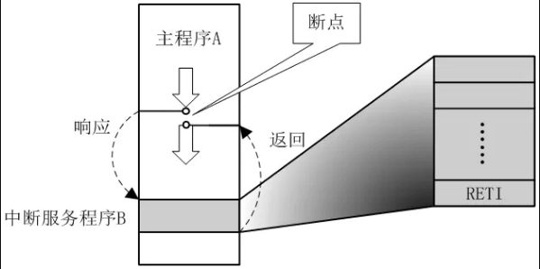
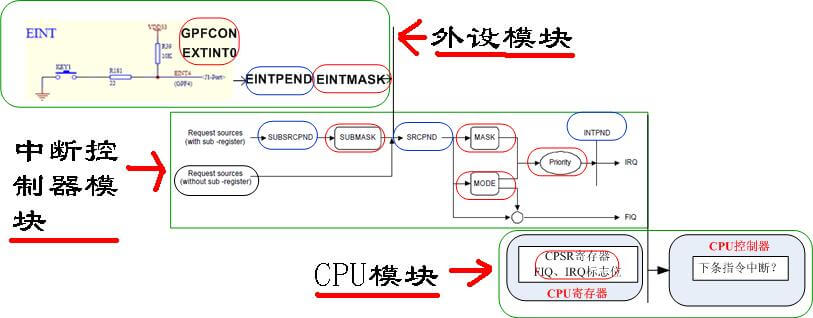
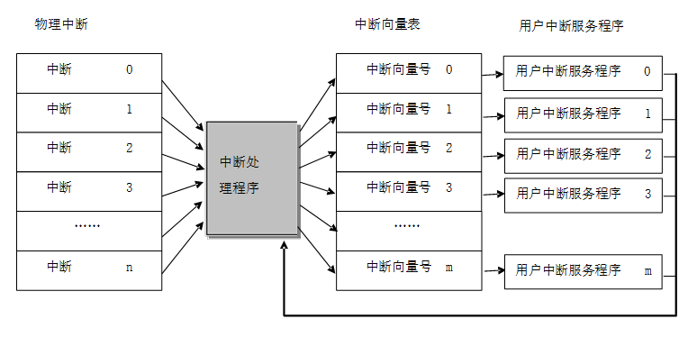
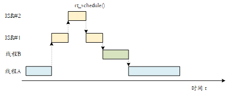

硬件架构相关篇为: 

* [v65.01 鸿蒙内核源码分析(芯片模式) | 回顾芯片行业各位大佬](/blog/65.md)
* [v66.03 鸿蒙内核源码分析(ARM架构) | ARMv7 & Cortex(A|R|M)](/blog/66.md)
* [v67.01 鸿蒙内核源码分析(指令集) | CICS PK RICS](/blog/67.md)
* [v68.01 鸿蒙内核源码分析(协处理器) | CPU的好帮手 ](/blog/68.md)
* [v69.05 鸿蒙内核源码分析(工作模式) | 角色不同 责任不同](/blog/69.md)
* [v70.06 鸿蒙内核源码分析(寄存器) | 世界被它们玩出了花](/blog/70.md)
* [v71.03 鸿蒙内核源码分析(多核管理) | 并发真正的基础](/blog/71.md)
* [v72.05 鸿蒙内核源码分析(中断概念) | 海公公的日常工作](/blog/72.md)
* [v73.04 鸿蒙内核源码分析(中断管理) | 没中断太可怕](/blog/73.md)


关于中断部分系列篇将用三篇详细说明整个过程。

* **中断概念篇(本篇)** 中断概念很多，比如中断控制器，中断源，中断向量，中断共享，中断处理程序等等。本篇做一次整理。先了解透概念才好理解中断过程。本篇的主角是**海公公**，用海公公打比方说明白中断各个概念。
  
* **中断管理篇** 从中断初始化`HalIrqInit`开始，到注册中断的`LOS_HwiCreate`函数，到消费中断函数的 `HalIrqHandler`，剖析鸿蒙内核实现中断的过程，很像设计模式中的观察者模式。 可前往v08。xx 鸿蒙内核源码分析(总目录) 查看。
  
* **中断切换篇** 用自下而上的方式，从中断源头纯汇编代码往上跟踪代码细节。说清楚保存和恢复中断现场`TaskIrqContext`过程。
  
### 中断概念

中断模块的核心是中断控制器，这可是 **皇上(CPU)** 身边的大红人海公公，外部人员找皇上办点事都必须经过它。

### 什么是中断？

* 中断是指程序运行过程中，出现了一个必须由`CPU`立即处理的事务。此时，`CPU`暂时中止当前程序的执行转而处理这个事务，这个过程就叫做中断。如图:


* 外设可以在没有CPU介入的情况下完成一定的工作，但某些情况下也需要CPU为其执行一定的工作。通过中断机制，在外设不需要CPU介入时，CPU可以执行其它任务，而当外设需要CPU时，将通过产生中断信号使CPU立即中断当前任务来响应中断请求。这样可以使CPU避免把大量时间耗费在等待、查询外设状态的操作上，大大提高系统实时性以及执行效率。
  
### 中断相关的硬件介绍

与中断相关的硬件可以划分为三类：设备(找皇上办事的事多了去)、中断控制器(海公公)、CPU(皇上威武，执天下耳)。

* **设备**
  发起中断的源，当设备需要请求CPU时，产生一个中断信号，该信号连接至中断控制器。

* **中断控制器**
    中断控制器是CPU众多外设中的一个，管理外设的外设，外设要使用CPU得先经过它仲裁， 它一方面接收其它外设中断引脚的输入，另一方面它会发出中断信号给CPU。所以可以通过对中断控制器编程来打开和关闭中断源、设置中断源的优先级和触发方式。说的是海公公有权屏蔽大臣们的折子，降低娘娘们被临幸的等级，让你们见不到咱皇上。
    常用的中断控制器有VIC（Vector Interrupt Controller）和GIC（General Interrupt Controller）.在ARM Cortex-M系列中使用的中断控制器是NVIC（Nested Vector Interrupt Controller）.在ARM Cortex-A7中使用的中断控制器是GIC。
* **CPU**
    中断控制器分发的中断源的请求给各个CPU，CPU收到请求便中断当前正在执行的任务，转而执行中断处理程序。
    用二张图说明下三者的关系，能看出咱**海公公**的权利有多大。
    
    

中断控制器文档可前往 [ARM中断控制器 gic_v2.pdf](https://gitee.com/weharmony/docs/tree/master/book) 查看每个寄存器的作用。以下为鸿蒙内核一小部分GIC寄存器的配置。

```c
#ifdef LOSCFG_PLATFORM_BSP_GIC_V2
#define GICC_CTLR                       (GICC_OFFSET + 0x00)            /* CPU Interface Control Register */ //CPU接口控制寄存器
#define GICC_PMR                        (GICC_OFFSET + 0x04)            /* Interrupt Priority Mask Register */ //中断优先级屏蔽寄存器
#define GICC_BPR                        (GICC_OFFSET + 0x08)            /* Binary Point Register */    //二进制点寄存器
#define GICC_IAR                        (GICC_OFFSET + 0x0c)            /* Interrupt Acknowledge Register */ //中断确认寄存器
#define GICC_EOIR                       (GICC_OFFSET + 0x10)            /* End of Interrupt Register */   //中断结尾寄存器
#define GICC_RPR                        (GICC_OFFSET + 0x14)            /* Running Priority Register */   //运行优先寄存器
#define GICC_HPPIR                      (GICC_OFFSET + 0x18)            /* Highest Priority Pending Interrupt Register */ //最高优先级挂起中断寄存器
#endif
```

### 中断源

所谓中断源，即引起中断的事件或原因，或发出中断申请的来源。
可分为外部中断源和内部中断源两大类。

* 外部中断源是指由CPU的外部事件引发的中断。主要包括：
  * 一般中、慢速外设，如键盘、打印机、鼠标等；
  * 数据通道，如磁盘、数据采集装置、网络等；
  * 实时时钟，如定时器定时已到，发中断申请；
  * 故障源，如电源掉电、外设故障、存储器读出出错以及越限报警等事件。
  
* 内部中断源是指由CPU的内部事件（异常）引发的中断，主要包括：
  * 由CPU执行中断指令INT n引起的中断；
  * 由CPU的某些运算错误引起的中断，如除数为0或商数超过了寄存器所能表达的范围、溢出等；
  * 为调试程序设置的中断，如单步中断、断点中断；
  * 由特殊操作引起的异常，如存储器越限、缺页等。
  * 核间中断，比如cpu a 让 cpu b 停止工作，产生调度等等。

这些都是想找咱皇上办事的人。

### 中断类型

把中断源划分为三种中断类型

* PPI：私有外设中断(Private Peripheral Interrupt)，是每个CPU私有的中断。最多支持16个PPI中断，硬件中断号从ID16~ID31。PPI通常会送达到指定的CPU上，应用场景有CPU本地时钟。
    类似于皇上自己的一些私事，不方便说的，比如大明湖畔的夏雨荷来了。

* SGI：软件触发中断(Software Generated Interrupt)通常用于多核间通讯，最多支持16个SGI中断，硬件中断号从ID0~ID15。SGI通常在内核中被用作核间中断(inter-processor interrupts)，信号会送达到系统指定的CPU上。
    主要用于多个皇上(CPU)并存的情况，皇上们直接约一起玩。

* SPI：公用外设中断(Shared Peripheral Interrupt)，最多可以支持988个外设中断，硬件中断号从ID32~ID1019。
    属于外部公事，这种事比较多，比如无法预测的吴三桂同志突然造反了，黄河决堤了等等，所以排号也多，除了前面两种其他的都属于这类的。

### 中断请求

“紧急事件”需向CPU提出申请（发一个电脉冲信号），要求CPU暂停当前执行的任务，转而处理该“紧急事件”，这一申请过程称为中断请求，这个申请必须经过中断控制器仲裁。

找皇上办事的人先写报告走流程，要求都要经过咱海公公处过滤。

### 中断触发

中断源向中断控制器发送中断信号(电平触发或边沿触发)，中断控制器对中断进行仲裁，确定优先级，将中断信号送给CPU。中断源产生中断信号的时候，会将中断触发器置“1”，表明该中断源产生了中断，要求CPU去响应该中断。

相当于办事的折子，折子统一到了海公公这处理，编号。

### 中断优先级

为使系统能够及时响应并处理所有中断，系统根据中断时间的重要性和紧迫程度，将中断源分为若干个级别，称作中断优先级。

海公公给折子分好优先级。如花娘娘优先级最高，西施娘娘给的银子少优先级最低。

### 中断处理程序

当外设产生中断请求后，CPU暂停当前的任务，转而响应中断申请，即执行中断处理程序。产生中断的每个设备都有相应的中断处理程序。

海公公把折子交给了咱皇上，皇上一一处理所有折子。

### 中断向量表

* 中断号 :每个中断请求信号都会有特定的标志，使得计算机能够判断是哪个设备提出的中断请求，这个标志就是中断号。
* 中断向量 :中断服务程序的入口地址。
* 中断向量表是存储中断向量的存储区，中断向量与中断号对应，中断向量在中断向量表中按照中断号顺序存储。
    中断向量表是所有中断处理程序的入口，如下图所示中断处理过程：把一个函数（用户中断服务程序）同一个虚拟中断向量表中的中断向量联系在一起。当中断向量对应中断发生的时候，被挂接的用户中断服务程序就会被调用执行。

    

所有中断都采用中断向量表的方式进行处理，即当一个中断触发时，处理器将直接判定是哪个中断源，然后直接跳转到相应的固定位置进行处理，每个中断服务程序必须排列在一起放在统一的地址上。中断向量表一般由一个数组定义或在起始代码中给出。

皇上把折子一对一的仔细处理，找到给对应折子办事的人。

### 用户中断服务程序(ISR)

在用户中断服务程序（ISR）中，分为两种情况:

* 第一种情况是不进行线程切换，这种情况下会进行任务中断上下文`TaskIrqContext`切换，用户中断服务程序和中断后续程序运行完毕后退出中断模式，返回被中断的线程。
* 另一种情况是，在中断处理过程中需要进行线程切换，这种切换还会进行任务上下文`TaskContext`的切换。

具体下面办事的人把事办完。  

### 中断嵌套

在允许中断嵌套的情况下，在执行中断服务程序的过程中，如果出现高优先级的中断，当前中断服务程序的执行将被打断，以执行高优先级中断的中断服务程序，当高优先级中断的处理完成后，被打断的中断服务程序才又得到继续执行，如果需要进行线程调度，线程的上下文切换将在所有中断处理程序都运行结束时才发生，如下图所示。


先把西施娘娘的事停了，现如花娘娘杀到，优先级高，老奴安排皇上先办如花娘娘，再接着办西施娘娘。奴才担心皇上这身子骨吃不吃得消。​

### 中断共享

当外设较少时，可以实现一个外设对应一个中断号，但为了支持更多的硬件设备，可以让多个设备共享一个中断号，共享同一个中断号的中断处理程序形成一个链表。当外部设备产生中断申请时，系统会遍历执行中断号对应的中断处理程序链表直到找到对应设备的中断处理程序。在遍历执行过程中，各中断处理程序可以通过检测设备ID，判断是否是这个中断处理程序对应的设备产生的中断。

简单一句话就是:共用一个折子，分别办多件事。

### 核间中断

属于SGI中断类型，对于多核系统，中断控制器允许一个CPU的硬件线程去中断其他CPU的硬件线程，这种方式被称为核间中断。核间中断的实现基础是多CPU内存共享，采用核间中断可以减少某个CPU负荷过大，有效提升系统效率。

```c
typedef enum {//鸿蒙核间中断
    LOS_MP_IPI_WAKEUP， //唤醒CPU
    LOS_MP_IPI_SCHEDULE，//调度CPU
    LOS_MP_IPI_HALT， //停止CPU
} MP_IPI_TYPE;
```

可以看出CPU之间可以相互唤醒，调度，停止。

核间中断有点特殊，出现于多个皇上(CPU)的情况。 皇上之间可以相互使唤，停止工作。比如:A皇上通过海公公让B皇上休息。

### 功能API

| 功能分类 | 接口名 |描述  |
|  ----   | ---- | ---- |
|创建和删除中断|LOS_HwiCreate   |中断创建，注册中断号、中断触发模式、中断优先级、中断处理程序。中断被触发时，handleIrq会调用该中断处理程序|
|             |LOS_HwiDelete    |删除中断|
|打开和关闭中断|LOS_IntUnLock   |打开当前处理器所有中断响应|
|             |LOS_IntLock      |关闭当前处理器所有中断响应|
|             |LOS_IntRestore   |恢复到使用LOS_IntLock关闭所有中断之前的状态|
|使能和屏蔽中断|LOS_HwiDisable  |中断屏蔽（通过设置寄存器，禁止CPU响应该中断）|
|             |LOS_HwiEnable    |中断使能（通过设置寄存器，允许CPU响应该中断）|
|设置中断优先级|LOS_HwiSetPriority|设置中断优先级|
|触发中断     |LOS_HwiTrigger   |触发中断（通过写中断控制器的相关寄存器模拟外部中断）|
|清除寄存器状态|LOS_HwiClear    |清除中断号对应的中断寄存器的状态位，此接口依赖中断控制器版本，非必需|
|核间中断     |LOS_HwiSendIpi   |向指定核发送核间中断，此接口依赖中断控制器版本和cpu架构，该函数仅在SMP模式下支持|
|设置中断亲和性|LOS_HwiSetAffinity|设置中断的亲和性，即设置中断在固定核响应（该函数仅在SMP模式下支持）|


  

