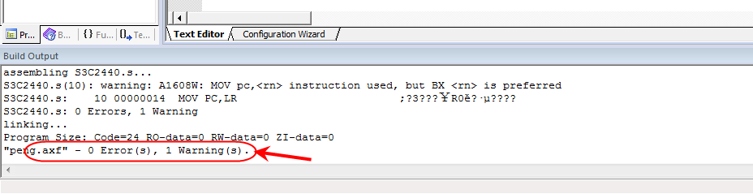

关于ARM的一些基本概念，大家可以参考我之前的文章：《0.到底什么是Cortex、ARMv8、arm架构、ARM指令集、soc？一文帮你梳理基础概念【科普】》

# 0. 如何学习arm？

ARM的知识点很多很杂，很多同学都遇到过类似的问题，单个的汇编指令一看就懂，但是结合uboot代码后，却一段都看不下去，网上搜资料，一大堆，屡不清楚条理，什么原因呢？

主要是各个知识点之间关系千丝万缕，融汇成一个整体，要想看懂类似于uboot这样的汇编代码，除了了解汇编指令，还要要了解整个SOC的架构，了解各个控制器的使用原理以及各个寄存器的使用方法，代码编译原理等等。如果不按照一定顺序学习，肯定会走很多的弯路。

一口君为了方便众多初学者方便入门，过滤掉一些枯燥的理论知识，一切以实用为主出发，下面会从环境安装开始，一步步教大家如何学习arm，最终能够学会分析uboot代码。

首先我们从安装环境开始吧。

# 一、KEIL、MDK、uVision、ARM之间的关系

## **1、KEIL**

1) 既是公司名称 ， 同时也是KEIL公司所有的开发工具。

2) 2005年被ARM收购。

## **2、uVision**

1) KEIL公司开发的集成开发环境（IDE）。

2) 共有4个版本：uVision2、uVision3、uVision4、uVision5。


## **3、MDK**

1) 英文全称：Microcontroller Development Kit。

2) MDK-ARM = KEIL MDK = RealView MDK = KEIL For ARM，统一用 MDK-ARM 称呼。


MDK-ARM 为基于Cortex-M、Cortex-R4、ARM7、ARM9处理器设备提供了一个完整的开发环境。MDK-ARM专为微控制器应用而设计，不仅易学易用，而且功能强大，能够满足大多数苛刻的嵌入式应用。

MDK-ARM有四个可用版本，分别是MDK-Lite、MDK-Basic、MDK-Standard、MDK-Professional。所有版本均提供一个完善的C / C++开发环境，其中MDK-Professional还包含大量的中间库。

# 二. 安装

我们采用的安装包是Keil MDK-ARM 4.14版本，包括ARM的编译器和uVision 4集成开发环境。

该环境具有良好的模拟ARM指令环境，非常适合大家学习ARM指令。


mdk

右边点击mdk414.exe -->以管理员身份运行


选择安装目录，尽量不要有中文目录：


输入任意的name、e-mail:


点击Finish即可：

最终在桌面上会有以下图标：

# 三、创建第一个工程


选择CPU->Samsung->S3C2440A 因为ARM指令集大部分的指令并没有太多差别，所以我们选择S3C2440A。

datasheet 下载，后台回复【**exynos**】 


点击是，进入以下界面：


代码区域的代码是KEIL提供的基于处理器S3C2440A的一些测试代码，我们暂时先不关心这些代码，直接删除该文件的所有代码，拷贝如下代码【注意缩进】：

```assembly
 AREA Example,CODE,READONLY    ;声明代码段Example
 ENTRY ;程序入口
Start              ; 程序中的标号，本质上是内存单元（的地址）的别名
 MOV R0,#0     ;设置实参,将传递给子程序的实参存放在r0和r1内
 MOV R1,#10
 BL ADD_SUM    ;调用子程序ADD_SUM 
 B OVER        ;跳转到OVER标号处 进入结尾
ADD_SUM
 ADD R0,R0,R1  ;实现两数相加
 MOV PC,LR     ;子程序返回 R0内为返回的结果
OVER
 END
```

## **编译**

点击下图的两个按钮都可以实现代码编译：


build

编译成功后，软件下方会有 **0 Error(s)**字样。



# 四、debug代码

为方便讲解代码，我们后面调试全部进入debug界面，可以点击下面图标或者用快捷键**ctrl+F5**：


点击确定即可


进入以下界面：


调整界面布局，点击每个标签页面的标题栏拖拽，鼠标放到对应的边框三角形位置即可吸附上去：


调整界面如下：


1. 程序左侧的黄色箭头，表示程序指令执行的位置；
2. 左边的R0-R15等等，是ARM在不同模式下的寄存器列表；
3. 右边是汇编指令对应的内存地址和机器码
4. 单步执行F10，进入某个函数执行F11

这个代码的含义，我们就暂时先不补详细说明，留待后面详细讲解。相信有汇编基础的同学对这个代码应该比较熟悉。

环境安装完毕，下面我们就可以开始ARM的理论学习了。