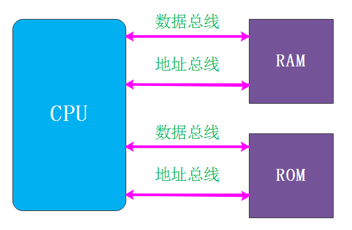

# **一、计算机架构**

在了解计算机架构之前，我们先来认识几位对计算机的发明做出关键共享的几位大佬。

## **1. 巴贝奇**

机械计算机之父，英国贵族，曾孤军奋战下造出的第一台差分机，运算精度达到了6位小数，后来又设计了20位精度的差分机，其设计理念已经达到了机械设计登峰造极的境界。

1985～1991年，伦敦科学博物馆为了纪念巴贝奇诞辰200周年，根据其1849年的设计，用纯19世纪的技术成功造出了差分机2号。

巴贝奇堪称上个世纪最强大脑，他的大脑现保存在英国科学博物馆。

程序员的祖师奶奶Ada正是在和巴贝奇共同工作时提出了程序循环分支等等我们现在都习以为常的编程理念。

## **2. 图灵**

被称为计算机科学之父，人工智能之父。1931年图灵进入剑桥大学国王学院，毕业后到美国普林斯顿大学攻读博士学位，第二次世界大战爆发后回到剑桥，后曾协助军方破解德国的著名密码系统Enigma，帮助盟军取得了二战的胜利。图灵对于人工智能的发展有诸多贡献，提出了一种用于判定机器是否具有智能的试验方法，即图灵试验，至今，每年都有试验的比赛。

图灵在战时服务的机构于1943年研制成功的CO-LOSSUS(巨人)机，这台机器的设计采用了图灵提出的某些概念。它用了1500个电子管，采用了光电管阅读器；利用穿孔纸带输入；并采用了电子管双稳态线路，执行计数、二进制算术及布尔代数逻辑运算，巨人机共生产了10台，用它们出色地完成了密码破译工作。

强烈推荐这部根据图灵生平改编的电影《模仿游戏》，一起感受下这个绝世天才不平凡的一生。

## **3. 冯诺依曼-《计算机与人脑》**

计算机架构主要有两种：哈佛架构、冯诺依曼架构。现代计算机，大部分都是基于冯诺依曼体系结构。

我个人认为冯诺依曼应该是上个世纪**「最聪明的人，没有之一」**。

他的个人成就在此就不说了，大家可以自行搜索，很多成就，一口君连名字都看不懂，只有博弈论还勉强知道是啥意思。

本文只讨论大神对计算机的贡献【其实计算机并不是大神的最厉害的成就，而且他也并没有花太多时间精力在计算机的研究上】。

1955年10月，诺伊曼，被查出患有癌症。而他几乎是在他生命的最后时刻，于临终的病榻上撰写了关于人的神经系统与计算机关系的讲稿。1958年，他的讲稿以《计算机与人脑》为题出版。

诺依曼从数学的角度，主要是从逻辑和统计数学的角度，讨论了神经系统的刺激——反应和记忆等问题，提出神经系统具有数字部分和模拟部分两方面的特征，探讨了神经系统的控制及逻辑结构。

## **4. 冯诺依曼架构**

冯诺依曼的核心是：**「存储程序，顺序执行」**，规定计算机必须具有如下功能：

1. 把需要的程序和数据送至计算机中；
2. 必须具有长期记忆程序、数据、中间结果及最终运算结果的能力；
3. 能够完成各种算术、逻辑运算和数据传送等数据加工处理的能力；
4. 能够根据需要控制程序走向，并能根据指令控制机器的各部件协调操作；
5. 能够按照要求将处理结果输出给用户

## **5. 哈佛架构**

冯诺依曼结构和哈佛结构是有区别的。

冯诺依曼结构是程序存储区和数据存储器都是可以放到内存中，统一编码的，而哈弗结构是分开编址的。

## **6. 哪些处理器是哈佛架构、冯诺依曼架构？**

**「哈佛架构」**

MCU（单片机）几乎都是用哈佛结构，譬如广泛使用的51单片机、典型的STM32单片机（核心是ARM Cortex-M系列的）都是哈佛结构。

**「冯诺依曼架构」**

PC和服务器芯片（譬如Intel AMD），ARM Cortex-A系列嵌入式芯片（譬如核心是ARM Cortex-A9的三星exynos-4412，譬如华为的麒麟970等手机芯片）等都是冯诺依曼结构。这些系统都需要大量内存，所以工作内存都是DRAM，因为他们更适合使用冯诺依曼系统。

**「混合结构」**

实际上现代的CPU（准确说叫SoC）基本都不是纯粹的哈佛结构或冯诺依曼机构，而都是混合结构的。

比如三星exynos 4412，使用ARM的Cortex-A9核心。基于exynos 4412开发板上都配备了1024MB的DDR SDRAM，和8GB的EMMC。

正常工作时所有的程序和数据都从EMMC中加载到DDR中，也就是说不管你是指令还是数据，存储都是在EMMC中，运行时都在DDR中，再通过cache和寄存器送给CPU去加工处理。这就是典型的冯诺依曼系统。

但是，exynos 4412内部仍然有一定容量的64KB irom和64KB iram，这些irom和iram是用于SoC引导和启动的，芯片上电后首先会执行内部irom中固化的代码，其实执行这些代码时4412就好像一个MCU一样，irom就是他的flash，iram就是他的SRAM，这又是典型的哈佛结构。

这就是混合式结构设计，而非纯粹设计。之所以采用混合式设计其实就是为了各取所长而已。

不管白猫黑猫，解决问题就是好猫。

# **二、计算机组成**

计算机系统=硬件系统+软件系统 硬件是计算机系统的物质基础，软件是计算机系统的灵魂。硬件和软件是相辅相成的，不可分割的整体。

## **1).输入设备**

输入设备的任务是把人们编好的程序和原始数据送到计算机中去，并且将它们转换成计算机内部所能识别和接受的信息方式。常用的有键盘、鼠标、扫描仪等。

## **2).输出设备**

输出设备的任务是将计算机的处理结果以人或其他设备所能接受的形式送出计算机。常用的有显示器、打印机、绘图仪等。

## **3).存储器、CPU**

见第三节

## **4). 计算机的总线结构**

将各大基本部件，按某种方式连接起来就构成了计算机的硬件系统。

系统总线包含有三种不同功能的总线，即数据总线DB（Data Bus）、地址总线AB（Address Bus）和控制总线CB（Control Bus）。

数据总线DB 用于传送数据信息。数据总线的位数是微型计算机的一个重要指标，通常与微处理的字长相一致。例如Intel 8086微处理器字长16位，其数据总线宽度也是16位。

地址总线AB 专门用来传送地址的。地址总线的位数决定了CPU可直接寻址的内存空间大小，比如8位微机的地址总线为16位，则其最大可寻址空间为216＝64KB，16位微型机的地址总线为20位，其可寻址空间为220＝1MB。控制总线CB 用来传送控制信号和时序信号。控制信号中，有的是微处理器送往存储器和I／O接口电路的，如读／写信号，片选信号、中断响应信号等；也有是其它部件反馈给CPU的，比如：中断申请信号、复位信号、总线请求信号、限备就绪信号等。控制总线的具体情况取决于CPU。

# **三、 CPU工作原理**

CPU内部主要包括运算器和控制器。

## **1) 存储器**

存储器是用来存放程序和数据的部件，它是一个记忆装置，也是计算机能够实现“存储程序控制”的基础。

包括：Cache、主存储器、辅助存储器。

**「高速缓冲存储器（Cache）」**CPU可以直接访问，用来存放当前正在执行的程序中的活跃部分，以便快速地向CPU提供指令和数据。

**「主存储器」**可由CPU直接访问，用来存放当前正在执行的程序和数据。

**「辅助存储器」**设置在主机外部，CPU不能直接访问，用来存放暂时不参与运行的程序和数据，需要时再传送到主存。

## **2) 运算器**

运算器的核心是算术逻辑运算部件ALU，还包括若干个寄存器（如累加寄存器、暂存器等）。

ALU可以执行算术运算(包括加减乘数等基本运算及其附加运算)和逻辑运算(包括移位、逻辑测试或两个值比较)。相对控制单元而言，运算器接受控制单元的命令而进行动作，即运算单元所进行的全部操作都是由控制单元发出的控制信号来指挥的，所以它是执行部件。

## **3)  控制器**

控制单元是整个CPU的指挥控制中心，由程序计数器PC（Program Counter）, 指令寄存器IR(Instruction Register)、指令译码器ID(Instruction Decoder)和操作控制器OC(Operation Controller)等组成，对协调整个电脑有序工作极为重要。

它根据用户预先编好的程序，依次从存储器中取出各条指令，放在指令寄存器IR中，通过指令译码(分析)确定应该进行什么操作，然后通过操作控制器OC，按确定的时序，向相应的部件发出微操作控制信号。操作控制器OC中主要包括节拍脉冲发生器、控制矩阵、时钟脉冲发生器、复位电路和启停电路等控制逻辑。

## **4) CPU的运行原理总结**

控制单元在时序脉冲的作用下，将指令计数器里所指向的指令地址(这个地址是在内存里的)送到地址总线上去，然后CPU将这个地址里的指令读到指令寄存器进行译码。

对于执行指令过程中所需要用到的数据，会将数据地址也送到地址总线，然后CPU把数据读到CPU的内部存储单元(就是内部寄存器)暂存起来，最后命令运算单元对数据进行处理加工。

周而复始，一直这样执行下去。

## **5) 指令执行过程**

一条指令的执行通常包括以下4个步骤:

1、取指令：CPU的控制器从内存读取一条指令并放入指令寄存器。2、指令译码：指令寄存器中的指令经过译码，决定该指令应进行何种操作(就是指令里的操作码)、操作数在哪里(操作数的地址)。3、 执行指令，分两个阶段“取操作数”和“进行运算”。4、 修改指令计数器，决定下一条指令的地址。

## **6) ARM技术特征**

ARM的成功，一方面得益于它独特的公司运作模式，另一方面，当然来自于ARM处理器自身的优良性能。作为一种先进的RISC处理器，ARM处理器有如下特点。

1. 体积小、低功耗、低成本、高性能。
2. 支持Thumb(16位）/ARM(32位）双指令集，能很好地兼容8位/16位器件。
3. 大量使用寄存器，指令执行速度更快。
4. 大多数数据操作都在寄存器中完成。
5. 寻址方式灵活简单，执行效率高。
6. 指令长度固定。此处有必要讲解一下RISC微处理器的概念及其与CISC微处理器的区别。

## **7) ARM体系架构的发展**

体系架构的定义：体系架构定义了指令集（ISA)和基于这一体系架构下处理器的编程模型。基于同种体系架构可以有多种处理器，每个处理器性能不同，所面向的应用不同，每个处理器的实现都要遵循这一体系结构。ARM体系架构为嵌入系统发展商提供很高的系统性能，同时保持优异的功耗和效率。

ARM体系架构为满足ARM合作者及设计领域的一般需求正稳步发展。目前，ARM体系架构共定义了8个版本，从版本1到版本8,ARM体系的指令集功能不断扩大，不同系列的ARM处理器，性能差别很大，应用范围和对象也不尽相同，但是，如果是相同的ARM体系架构，那么基于它们的应用软件是兼容的。

下面我们简单介绍下 V7/V8架构。

### v7架构

ARMv7架构是在ARMv6架构的基础上诞生的。该架构采用了Thumb-2技术，它是在ARM的Thumb代码压缩技术的基础上发展起来的，并且保持了对现存ARM解决方案的完整的代码兼容性。Thumb-2技术比纯32位代码少使用31%的内存，减小了系统开销，同时能够提供比已有的基于Thumb技术的解决方案高出38%的性能。ARMV7架构还采用了NEON技术，将DSP和媒体处理能力提高了近4倍。并支持改良的浮点运算，满足下一代3D图形、游戏物理应用及传统嵌入式控制应用的需求。

### v8架构

ARMv8架构是在32位ARM架构上进行开发的，将被首先用于对扩展虚拟地址和64位数据处理技术有更高要求的产品领域，如企业应用、高档消费电子产品。ARMv8架构包含两个执行状态：AArch64和AArch32。AArch64执行状态针对64位处理技术，引入了一个全新指令集A64,可以存取大虚拟地址空间；而AArch32执行状态将支持现有的ARM指令集。目前的ARMv7架构的主要特性都将在ARMv8架构中得以保留或进一步拓展，如TrustZone技术、虚拟化技术及NEON advanced SIMD技术等。

## **8) ARM 微处理器架构**

ARM内核采用RISC体系架构。ARM体系架构的主要特征如下。

1. 采用大量的寄存器，它们都可以用于多种用途。
2. 采用Load/Store体系架构。
3. 每条指令都条件执行。
4. 采用多寄存器的Load/Store指令。
5. 能够在单时钟周期执行的单条指令内完成一项普通的移位操作和一项普通的ALU操作。
6. 通过协处理器指令集来扩展ARM指令集，包括在编程模式中增加了新的寄存器和数据类型。
7. 如果把Thumb指令集也当做ARM体系架构的一部分，那么在Thumb体系架构中还可以高密度16位压缩形式表示指令集。

## **9) ARM指令**

ARM指令是RISC（Reduced Instruction Set Computing），即精简执令运算集，RISC把着眼点放在如何使计算机的结构更加简单和如何使计算机的处理速度更加快速上。RISC选取了使用频率最高的简单指令，抛弃复杂指令，固定指令长度，减少指令格式和寻址方式，不用或少用微码控制。这些特点使得RISC非常适合嵌入式处理器。

RISC可以实现以相对少的晶体管设计出极快的微处理器。通过研究发现，只有大约20%的指令是最常用的，把处理器能执行的指令数目减少到最低限度，对它们的执行过行优化，就可以极大地提高处理的工作速度。

一般来说，RISC处理器比同等的CISC（Complex Instruction Set Computer，复杂指令集计算机）处理器要快50%-75%，同时RISC处理器更容易设计和纠错。

一般指令格式如下：

**「操作码：」**操作码就是汇编语言里的mov,add,jmp等符号码；

**「操作数地址：」**用于说明该指令需要的操作数所在的地方，是在内存里还是在CPU的内部寄存器里。

实际上的机器指令格式远比这个复杂，下图是常用的ARM指令格式：

关于这些机器指令格式，后面我们会挑选其中几个分析，对于我们大部分读者来说，没有必要花太多精力去研究这些机器指令，只需要大概了解即可。

关于CPU我们从宏观上把握到这个程度就OK了，后面我们会逐步进入后续阶段的学习，介绍ARM寄存器模式、异常、寻址、汇编指令，以及C代码中嵌入的汇编语言的写法。

# **四、SOC**

SOC:　系统芯片是一个将计算机或其他电子系统集成单一芯片的集成电路。系统芯片可以处理数字信号、模拟信号、混合信号甚至更高频率的信号。

从狭义角度讲,它是信息系统核心的芯片集成,是将系统关键部件集成在一块芯片上; 从广义角度讲, SoC是一个微小型系统,如果说中央处理器(CPU)是大脑,那么SoC就是包括大脑、心脏、眼睛和手的系统。

## **1. ARM base Soc**

嵌入式系统中常常要使用系统芯片。系统芯片的集成规模很大，一般达到几百万门到几千万门。SOC相对比较灵活，它可以将arm架构的处理器与一些专用的外围芯片集成到一起，组成一个系统。

下图是一个典型的基于ARM架构的SOC架构图。

一个典型的基于ARM的Soc架构通常包含以下几个主要部件：

1. ARM Processor core   处理器核
2. Clocks and Reset Controller  时钟和复位电路
3. Interrupt Controller  中断控制器
4. ARM Propherals  外部设备
5. GPIO
6. DMA Port
7. External Memory Interface 外部内存接口
8. On chip RAM 偏上RAM
9. AHB、APB总线

其实现有的ARM处理器如Hisi-3507、exynos-4412等处理器都是一个SOC系统，尤其是应用处理器它集成了许多外围的器件，为执行更复杂的任务、更复杂的应用提供了强大的支持。

该架构是我们理解汇编指令和编写裸机程序的基石。

当我们拿到一个新的SOC的datasheet，首先就要根据这个架构，来查看SOC的**「RAM空间、时钟频率、包括哪些外部设备的控制器，各个外设控制器的操作原理，各个外设对GPIO的引脚复用情况、各个控制器的SFR地址、中断控制器是如何管理众多中断源的等等」**。

## **2. 三星 Exynos 4412**

2012年初，三星正式推出了自家的首款四核移动处理器Exynos4412。

下面三星的exynos 4412的SOC。

如上图所示，exynos 4412主要包括以下模块：

1. 4（quad）个Cortex-A9处理器
2. 1MB的 L2 Cache
3. Interrupt Controller 中断控制器，管理所有的中断源
4. Interrupt Combiner 中断控制器，管理soc内的一些中断源
5. NEON ARM 架构处理器扩展结构，旨在通过加速多媒体(video/audio)编解码，用户界面，2D/3D图形及游戏来提高人对多媒体的体验
6. DRAM、Internal RAM、NAND Flash、SROM Controller 各种存储设备的控制器
7. SDIO、USB、I2C、UART、SPI等总线
8. RTC、Watchdog Timer
9. Audio Subsystem 声音子系统
10. IIS(Integrate Interface of Sound)接口 ，集成语音接口
11. Power Management电源管理
12. Multimedia Block 多媒体模块

这款新Exynos四核处理器，拥有32nm HKMG(高K金属栅极技术）制程，支持双通道LPDDR21066。三星公司已将这颗图形处理器主频由此前的266MHz提升至400MHz,新闻稿指出其会比现有的双核机型整体性能提升60%,图像处理能力提升50%。

三星智能手机Galaxy S III手机就采用了Exynos4412处理器。

学习ARM就必须深刻了解soc架构，官方提供的datasheet是我们学习ARM、编写驱动程序的基石，该手册内容比较多，我们并不需要每一章都掌握，用到哪个地方，我们就去学习即可。