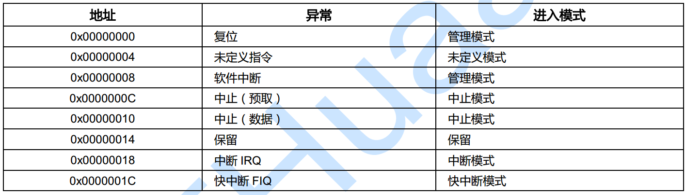
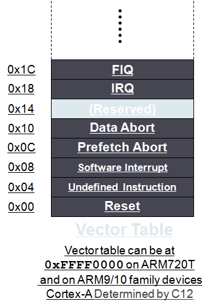
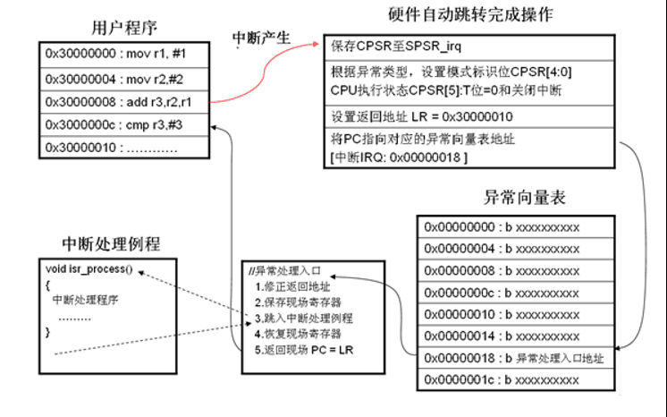
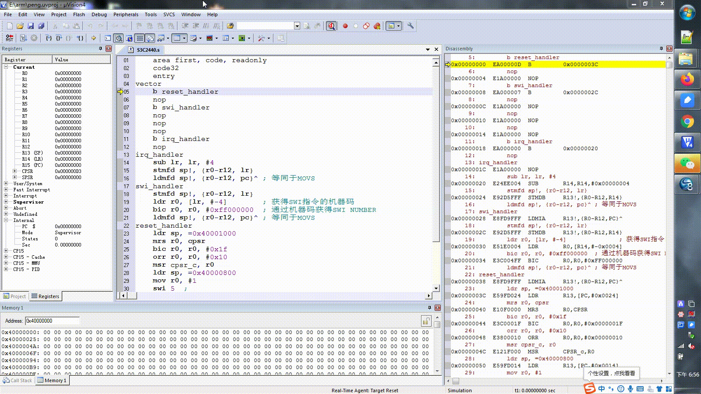
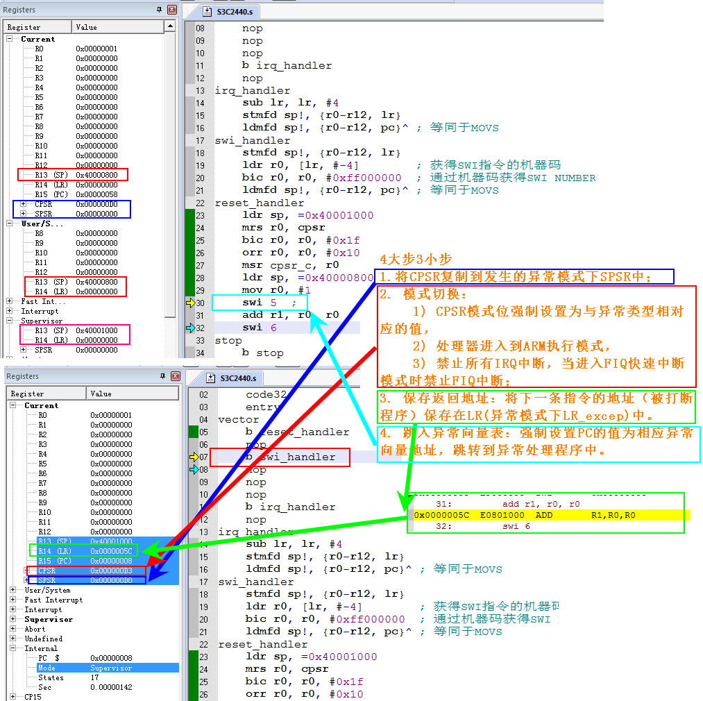
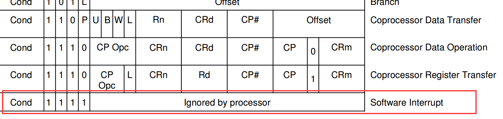
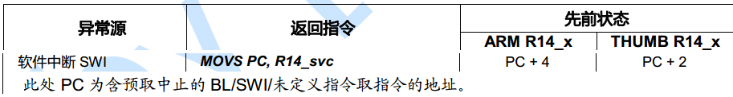
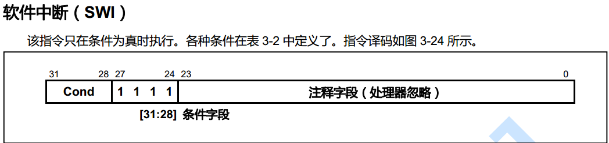

文章来自https://www.cnblogs.com/yikoulinux/p/14129533.html
# 一、异常（Exception）

异常是理解CPU运转最重要的一个知识点，几乎每种处理器都支持特定异常处理，中断是异常中的一种。
有时候我们衡量一个操作系统的时候实时性就是看os最短响应中断时间以及单位时间内响应中断次数。

# 二、异常源

在ARM体系结构中，存在7种异常处理。当异常发生时，处理器会把PC设置为一个特定的存储器地址。这一地址放在被称为向量表（vector table）的特定地址范围内，向量表的入口是一些跳转指令，跳转到专门处理某个异常或中断的子程序。

## 1. 异常源分类

要进入异常模式，一定要有异常源，ARM规定有7种异常源：

| 异常源   | 描述                                                         |
| -------- | :----------------------------------------------------------- |
| Reset    | 上电时执行                                                   |
| Undef    | 当流水线中的某个非法指令到达执行状态时执行                   |
| SWI      | 当一个软中断指令被执行完的时候执行                           |
| Prefetch | 当一个指令被从内存中预取时，由于某种原因而失败，如果它能到达执行状态这个异常才会产生 |
| Data     | 如果一个预取指令试图存取一个非法的内存单元，这时异常产生     |
| IRQ      | 通常的中断                                                   |
| FIQ      | 快速中断                                                     |

1. reset复位异常

当CPU刚上电时或按下reset重启键之后进入该异常，该异常在管理模式下处理。

2. irq/fiq一般/快速中断请求

CPU和外部设备是分别独立的硬件执行单元，CPU对全部设备进行管理和资源调度处理，CPU要想知道外部设备的运行状态，要么CPU定时的去查看外部设备特定寄存器，要么让外部设备在出现需要CPU干涉处理时“打断”CPU，让它来处理外部设备的请求，毫无疑问第二种方式更合理，可以让CPU“专心”去工作，这里的“打断”操作就叫做中断请求，根据请求的紧急情况，中断请求分一般中断和快速中断，快速中断具有最高中断优先级和最小的中断延迟，通常用于处理高速数据传输及通道的中数据恢复处理，如DMA等，绝大部分外设使用一般中断请求。

3. 预取指令中止异常

该异常发生在CPU流水线取指阶段，如果目标指令地址是非法地址进入该异常，该异常在中止异常模式下处理。

4. 未定义指令异常

该异常发生在流水线技术里的译码阶段，如果当前指令不能被识别为有效指令，产生未定义指令异常，该异常在未定义异常模式下处理。

5. 软件中断指令（swi）异常

该异常是应用程序自己调用时产生的，用于用户程序申请访问硬件资源时，例如：printf()打印函数，要将用户数据打印到显示器上，用户程序要想实现打印必须申请使用显示器，而用户程序又没有外设硬件的使用权，只能通过使用软件中断指令切换到内核态，通过操作系统内核代码来访问外设硬件，内核态是工作在特权模式下，操作系统在特权模式下完成将用户数据打印到显示器上。这样做的目的无非是为了保护操作系统的安全和硬件资源的合理使用，该异常在管理模式下处理。

6. 数据中止访问异常
   该异常发生在要访问数据地址不存在或者为非法地址时，该异常在中止异常模式下处理。

## 2. ARM的异常优先级

```shell
Reset→
Data abort→
FIQ→
IRQ→
Prefetch abort→
Undefined instruction/SWI
```

## 3. FIQ 比 IRQ快的原因

1. fiq 比 irq 的优先级高
2. FIQ 向量位于向量表的最末端，异常处理不需要跳转
3. FIQ 比 IRQ 多5个私有的寄存器（r8-r12），在中断操作时，压栈出栈操作的少。

# 三、异常发生的硬件操作

异常发生后，ARM核的操作步骤可以总结为4大步3小步。

## 1. 4大步3小步

1. 保存执行状态：将CPSR复制到发生的异常模式下SPSR中；
2. 模式切换：

- CPSR模式位强制设置为与异常类型相对应的值，
- 处理器进入到ARM执行模式，
- 禁止所有IRQ中断，当进入FIQ快速中断模式时禁止FIQ中断；

3. 保存返回地址：将下一条指令的地址（被打断程序）保存在LR(异常模式下LR_excep)中。
4. 跳入异常向量表：强制设置PC的值为相应异常向量地址，跳转到异常处理程序中。

## 2. 步骤详解

1. 保存执行状态

当前程序的执行状态是保存在CPSR里面的，异常发生时，要保存当前的CPSR里的执行状态到异常模式里的SPSR里，将来异常返回时，恢复回CPSR，恢复执行状态。

2. 模式切换

硬件自动根据当前的异常类型，将异常码写入CPSR里的M[4:0]模式位，这样CPU就进入了对应异常模式下。不管是在ARM状态下还是在THUMB状态下发生异常，都会自动切换到ARM状态下进行异常的处理，这是由硬件自动完成的，将CPSR[5] 设置为 0。同时，CPU会关闭中断IRQ（设置CPSR 寄存器I位），防止中断进入，如果当前是快速中断FIQ异常，关闭快速中断（设置CPSR寄存器F位）。

3. 保存返回地址

当前程序被异常打断，切换到异常处理程序里，异常处理完之后，返回当前被打断模式继续执行，因此必须要保存当前执行指令的下一条指令的地址到LR_excep(异常模式下LR，并不存在LR_excep寄存器，为方便读者理解加上_excep，以下道理相同)，由于异常模式不同以及ARM内核采用流水线技术，异常处理程序里要根据异常模式计算返回地址。

4. 跳入异常向量表

**该操作是CPU硬件自动完成的**，当异常发生时，CPU强制将PC的值修改为一个固定内存地址，这个固定地址叫做异常向量。

# 四、异常向量表

异常向量表是一段特定内存地址空间，每种ARM异常对应一个字长空间（4Bytes），正好是一条32位指令长度，当异常发生时，CPU强制将PC的值设置为当前异常对应的固定内存地址。

## 1. 异常向量表：



**跳入异常向量表操作是异常发生时，硬件自动完成的**，剩下的异常处理任务完全交给了程序员。由上表可知，**异常向量是一个固定的内存地址，我们可以通过向该地址处写一条跳转指令，让它跳向我们自己定义的异常处理程序的入口，就可以完成异常处理了。**



正是由于异常向量表的存在，才让硬件异常处理和程序员自定义处理程序有机联系起来。异常向量表里0x00000000地址处是reset复位异常，之所以它为0地址，是因为CPU在上电时自动从0地址处加载指令，由此可见将复位异常安装在此地址处也是前后接合起来设计的，不得不感叹CPU设计师的伟大，其后面分别是其余7种异常向量，每种异常向量都占有四个字节，正好是一条指令的大小，最后一个异常是快速中断异常，将其安装在此也有它的意义，在0x0000001C地址处可以直接存放快速中断的处理程序，不用设置跳转指令，这样可以节省一个时钟周期，加快快速中断处理时间。

存储器映射地址0x00000000是为向量表保留的。在有些处理器中，向量表可以选择定位在高地址0xFFFF0000处【可以通过协处理器指令配置】，当今操作系统为了控制内存访问权限，通常会开启虚拟内存，开启了虚拟内存之后，内存的开始空间通常为内核进程空间，和页表空间，异常向量表不能再安装在0地址处了。

比如Cortex-A8系统中支持通过设置CP15的C12寄存器将异常向量表的首地址放置在任意地址。

## 2. 安装异常向量表

我们可以通过简单的使用下面的指令来安装异常向量表：

```assembly
b reset   ;跳入reset处理程序
b HandleUndef  ;跳入未定义处理程序
b HandSWI     ;跳入软中断处理程序
b HandPrefetchAbt   ;跳入预取指令处理程序
b HandDataAbt    ;跳入数据访问中止处理程序
b HandNoUsed  ;跳入未使用程序
b HandleIRQ    ;跳入中断处理程序
b HandleFIQ    ;跳入快速中断处理程序
```

通常安装完异常向量表，跳到我们自己定义的处理程序入口，这时我们还没有保存被打断程序的现场，因此在异常处理程序的入口里先要保存打断程序现场。

## 3. 保存执行现场

异常处理程序最开始，要保存被打断程序的执行现场，程序的执行现场无非就是保存当前操作寄存器里的数据，可以通过下面的栈操作指令实现保存现场：

```assembly
STMFD  SP_excep!,  {R0 – R12,  LR_excep}
```

注：LR_abt，SP_excep分别为对应异常模式下LR和SP，为方便读者理解加上_abt

需要注意的是，在跳转到异常处理程序入口时，已经切换到对应异常模式下了，因此这里的SP是异常模式下的SP_excep了，所以被打断程序现场（寄存器数据）是保存在异常模式下的栈里，上述指令将R0~R12全部都保存到了异常模式栈，最后将修改完的被打断程序返回地址入栈保存，之所以保存该返回地址就是将来可以通过类似：MOV PC, LR的指令，返回用户程序继续执行。

异常发生后，要针对异常类型进行处理，因此，每种异常都有自己的异常处理程序，中断异常处理过程通过下节的系统中断处理来进行分析。

# 五、异常处理的返回

异常处理完成之后，返回被打断程序继续执行，具体操作如下：

1. 恢复被打断程序运行时寄存器数据
2. 恢复程序运行时状态CPSR
3. 通过进入异常时保存的返回地址，返回到被打断程序继续执行

## 1. 异常返回地址

一条指令的执行分为：取指，译码，执行三个主要阶段， CPU由于使用流水线技术，造成当前执行指令的地址应该是PC – 8（32位机一条指令四个字节），那么执行指令的下条指令应该是PC – 4。在异常发生时，CPU自动会将将PC – 4 的值保存到LR里，但是该值是否正确还要看异常类型才能决定。

各模式的返回地址说明如下：

1. 一般/快速中断请求：

快速中断请求和一般中断请求返回处理是一样的。通常处理器执行完当前指令后，查询FIQ/IRQ中断引脚，并查看是否允许FIQ/IRQ中断，如果某个中断引脚有效，并且系统允许该中断产生，处理器将产生FIQ/IRQ异常中断，当FIQ/IRQ异常中断产生时，程序计数器pc的值已经更新，它指向当前指令后面第3条指令（对于ARM指令，它指向当前指令地址加12字节的位置；对于Thumb指令，它指向当前指令地址加6字节的位置），当FIQ/IRQ异常中断产生时，处理器将值（pc-4）保存到FIQ/IRQ异常模式下的寄存器lr_irq/lr_irq中，它指向当前指令之后的第2条指令，因此正确返回地址可以通过下面指令算出：

```assembly
SUBS    PC，LR_irq，#4  ; 一般中断
SUBS    PC，LR_fiq，#4  ; 快速中断
```

注：LR_irq/LR_fiq分别为一般中断和快速中断异常模式下LR，并不存在LR_xxx寄存器，为方便读者理解加上_xxx，下同。

2. 预取指中止异常：

在指令预取时，如果目标地址是非法的，该指令被标记成有问题的指令，这时，流水线上该指令之前的指令继续执行，当执行到该被标记成有问题的指令时，处理器产生指令预取中止异常中断。发生指令预取异常中断时，程序要返回到该有问题的指令处，重新读取并执行该指令，因此指令预取中止异常中断应该返回到产生该指令预取中止异常中断的指令处，而不是当前指令的下一条指令。

指令预取中止异常中断由当前执行的指令在ALU里执行时产生，当指令预取中止异常中断发生时，程序计数器pc的值还未更新，它指向当前指令后面第2条指令（对于ARM指令，它指向当前指令地址加8字节的位置；对于Thumb指令，它指向当前指令地址加4字节的位置）。此时处理器将值（pc-4）保存到lr_abt中，它指向当前指令的下一条指令，所以返回操作可以通过下面指令实现：

```assembly
SUBS  PC，LR_abt，#4
```

3. 未定义指令异常:

未定义指令异常中断由当前执行的指令在ALU里执行时产生，当未定义指令异常中断产生时，程序计数器pc的值还未更新，它指向当前指令后面第2条指令（对于ARM指令，它指向当前指令地址加8字节的位置；对于Thumb指令，它指向当前指令地址加4字节的位置），当未定义指令异常中断发生时，处理器将值（pc-4）保存到lr_und中，此时（pc-4）指向当前指令的下一条指令，所以从未定义指令异常中断返回可以通过如下指令来实现：

```assembly
MOV  PC,  LR_und
```

4. 软中断指令（SWI）异常:

SWI异常中断和未定义异常中断指令一样，也是由当前执行的指令在ALU里执行时产生，当SWI指令执行时，pc的值还未更新，它指向当前指令后面第2条指令（对于ARM指令，它指向当前指令地址加8字节的位置；对于Thumb指令，它指向当前指令地址加4字节的位置），当未定义指令异常中断发生时，处理器将值（pc-4）保存到lr_svc中，此时（pc-4）指向当前指令的下一条指令，所以从SWI异常中断处理返回的实现方法与从未定义指令异常中断处理返回一样：

```assembly
MOV  PC,  LR_svc
```

5. 数据中止异常：

发生数据访问异常中断时，程序要返回到该有问题的指令处，重新访问该数据，因此数据访问异常中断应该返回到产生该数据访问中止异常中断的指令处，而不是当前指令的下一条指令。
数据访问异常中断由当前执行的指令在ALU里执行时产生，当数据访问异常中断发生时，程序计数器pc的值已经更新，它指向当前指令后面第3条指令（对于ARM指令，它指向当前指令地址加12字节的位置；对于Thumb指令，它指向当前指令地址加6字节的位置）。此时处理器将值（pc-4）保存到lr_abt中，它指向当前指令后面第2条指令，所以返回操作可以通过下面指令实现：

```assembly
SUBS  PC,  LR_abt,  #8
```

上述每一种异常发生时，其返回地址都要根据具体异常类型进行重新修复返回地址，**再次强调下，被打断程序的返回地址保存在对应异常模式下的LR_excep里**。

## 2. 模式恢复

异常发生后，进入异常处理程序时，将用户程序寄存器R0~R12里的数据保存在了异常模式下栈里面，异常处理完返回时，要将栈里保存的的数据再恢复回原先R0~R12里。

毫无疑问在异常处理过程中必须要保证异常处理入口和出口时栈指针SP_excep要一样，否则恢复到R0~R12里的数据不正确，返回被打断程序时执行现场不一致，出现问题，虽然将执行现场恢复了，但是此时还是在异常模式下，CPSR里的状态是异常模式下状态。

因此要恢复SPSR_excep里的保存状态到CPSR里，SPSR_excep是被打断程序执行时的状态，在恢复SPSR_excep到CPSR的同时，CPU的模式和状态从异常模式切换回了被打断程序执行时的模式和状态。

此刻程序现场恢复了，状态也恢复了，但PC里的值仍然指向异常模式下的地址空间，我们要让CPU继续执行被打断程序，因此要再手动改变PC的值为进入异常时的返回地址，该地址在异常处理入口时已经计算好，直接将PC = LR_excep即可。

上述操作可以一步一步实现，但是通常我们可以通过一条指令实现上述全部操作：

```assembly
LDMFD  SP_excp!,  {r0-r12,  pc}^
```

注：SP_excep为对应异常模式下SP，^符号表示恢复SPSR_excep到CPSR。

# 六、异常与模式关系

1. reset异常进入SVC模式
2. fiq快速中断请求异常进入快中断模式，支持高速数传输及通道处理（FIQ异常响应时进入此模式）
3. irq中断请求异常进入中断模式，用于通用中断处理，（IRQ异常响应时进入此模式）
4. prefetch预取指中止，数据中止异常进入中止模式，用于支持虚拟内存和/或存储器保护
5. undef未定义指令异常进入未定义模式，支持硬件协处理器的软件仿真（未定义指令异常响应时进入此模式）
6. swi软件中断，复位异常进入管理模式，操作系统保护代码（系统复位和软件中断响应时进入此模式）

# 七、irq中断异常

## 1.中断的概念

什么是中断，我们从一个生活的例子引入。我们正在家中看书，突然电话铃响了，你放下书本，去接电话，和来电话的人交谈，然后放下电话，回来继续看你的书。这就是生活中的"中断"的现象，也就是正常的工作过程被外部的事件打断了。

在处理器中，所谓中断，是一个过程，即CPU在正常执行程序的过程中，遇到外部/内部的紧急事件需要处理，暂时中断（中止）当前程序的执行，而转去为事件服务，待服务完毕，再返回到暂停处（断点）继续执行原来的程序。为事件服务的程序称为中断服务程序或中断处理程序。

严格地说，上面的描述是针对硬件事件引起的中断而言的。用软件方法也可以引起中断，即事先在程序中安排特殊的指令，CPU执行到该类指令时，转去执行相应的一段预先安排好的程序，然后再返回来执行原来的程序，这可称为软中断。把软中断考虑进去，可给中断再下一个定义：中断是一个过程，是CPU在执行当前程序的过程中因硬件或软件的原因插入了另一段程序运行的过程。因硬件原因引起的中断过程的出现是不可预测的，即随机的，而软中断是事先安排的。

## 2. 中断处理流程

中断异常发生时，整个处理流程：



如上图所示：

1. 执行执行到0x30000008时产生中断
2. cpu执行4大步3小步

```c
1) 保存CPSR到SPSR_irq
2) 根据异常类型，设置模式标识位CPSR[4:0],CPU执行状态CPSR[5]：T位=0和关闭中断
3) 设置返回地址LR=0x30000010
4) 将PC指向对应的异常向量表地址[中断IRQ：0x00000018]
```
3. 进入到异常向量表后执行 b 指令，跳转到异常处理函数
4. 异常处理函数需要执行以下操作

```c
1) 修正返回地址 SUBS    PC，LR_irq，#4 ，即0x3000000C
2) 保存现场寄存器
3) 跳入中断处理函数isr_proccess(),执行中断处理程序
4) 恢复现场寄存器
5) 返回现场PC=LR
```

5. 程序又回到0x3000000C位置，继续执行

关于中断更详细的讲解，会在后续文章中详细讲解，请关注 [一口Linux]。

# 八、swi异常

## SWI指令

SWI指令的格式为：

```assembly
SWI{条件} 24位的立即数
```

SWI指令用于产生软件中断，以便用户程序能调用操作系统的系统例程。操作系统在SWI的异常处理程序中提供相应的系统服务，指令中24位的立即数指定用户程序调用系统例程的类型，相关参数通过通用寄存器传递，当指令中24位的立即数被忽略时，用户程序调用系统例程的类型由通用寄存器R0的内容决定，同时，参数通过其他通用寄存器传递。

举例：

```assembly
SWI 	0x02    		；该指令调用操作系统编号位02的系统例程。
```

## BKPT指令

BKPT指令的格式为：
BKPT 16位的立即数
BKPT指令产生软件断点中断，可用于程序的调试。

## 举例

以下是一个包含异常向量表的代码，程序值填写了reset异常和swi异常的入口，其他入口地址可以用空指令nop填充在这个位置。

```assembly
	area first, code, readonly
	code32
	entry
; 定义的异常向量表
vector
	b reset_handler  ; 跳转到 reset_handler
	nop	
	b swi_handler	 ; SWI 指令异常跳转的地址
	nop	
	nop	
	nop	
	nop
	nop	
swi_handler
	; swi handler code 
	; 异常处理首先要压栈保存处理器现场
	mrs r0, cpsr
	bic r0, r0, #0x1f
	orr r0, r0, #0x10
	msr cpsr_c, r0
		
	;ldr r0, [lr, #-4]	; 获得SWI指令的机器码，lr前面那个指令是swi指令，下标在该指令中
	;bic r0, r0, #0xff000000  ; 通过机器码获得SWI NUMBER	
	movs pc, lr    	; lr > pc 且 spsr -> cpsr返回 SVC -> USER
reset_handler
	; 初始化 SVC 模式堆栈
	ldr sp, =0x40001000
	; 修改当前的模式从SVC模式改变为USER模式
	mrs r0, cpsr
	bic r0, r0, #0x1f
	orr r0, r0, #0x10
	msr cpsr_c, r0
    ; 初始化 USER 模式堆栈
	ldr sp, =0x40000800
	mov r0, #1    
	; USER SWI
	swi 5  ; open  APP USER 这条语句由用户程序自己出发异常   
	       ; 观察并记录对比指令执行前后的 PC LR CPSR SPSR SP的变化	
	       ;并思考异常产生后处理器硬件自动发生了那些变化
	add r1, r0, r0
stop
	b stop
	end
```

运行过程如下所示：



主要是注意观察swi执行前和执行后，模式的变化，大家可以按照4大步3小步来分析。



## 如何同时跳转并切换模式？

从swi异常返回时，我们需要执行两个动作：

1. 将spsr拷贝会cpsr，
2. pc = lr 跳转回原来的位置

这两个动作都必须要执行，但是如果分步执行的话，spsr拷贝回去后，当前模式就变回了usr模式，那么对应的lr的值就变成了lr_usr,此时的值0x0【之前没有执行过bl指令】，那怎么跳转会去呢？
我们可以用以下命令

```assembly
movs pc, lr
```

此命令同时执行两个动作：

```assembly
pc = lr 
cpsr = spsr 返回 SVC -> USER
```

从而实现了同时跳转并切换模式。
如果入口已经使用ldm压栈可以用一下指令回复：

```assembly
LDMFD  SP_excp!,  {r0-r12,  pc}^
```

参见第五章。

## 如何获取软中断号？

1. 要获取swi指令的中断号，我们只能从swi的机器码中得到对应的值，



1. 而要想得到swi这条指令的内容，就要先找到这条指令的地址，
   而lr的值是swi这条指令的下一条指令的地址，所以我们可以通过以下代码得到软中断号。

```assembly
ldr r0, [lr, #-4]	; 获得SWI指令的机器码，lr前面那个指令是swi指令，下标在该指令中
bic r0, r0, #0xff000000  ; 通过机器码获得SWI NUMBER	
```

## 系统调用与swi

### 系统调用

linux的应用程序有很多的系统调用，比如open，read，socket等实际上会触发swi异常，触发系统调用sys_open,sys_read等，内核根据swi的值来执行具体的操作。

每个系统调用都有自己惟一的编号，系统调用函数的标识符在以下文件定义：

```assembly
linux/arch/arm/kernel/calls.S
```

内容如下：

```assembly
/* 0 */		CALL(sys_restart_syscall)
		CALL(sys_exit)
		CALL(sys_fork)
		CALL(sys_read)
		CALL(sys_write)
		…………
/* 375 */	CALL(sys_setns)
		CALL(sys_process_vm_readv)
		CALL(sys_process_vm_writev)
		CALL(sys_kcmp)
		CALL(sys_finit_module)
#ifndef syscalls_counted
.equ syscalls_padding, ((NR_syscalls + 3) & ~3) - NR_syscalls
#define syscalls_counted
#endif
.rept syscalls_padding
		CALL(sys_ni_syscall)
.endr
```

### SWI代码片段分析

搜索下vector_swi，找到入口函数

```assembly
arch\arm\kernel\entry-common.S
    .align  5
ENTRY(vector_swi)
    @ 保存现场
    
    sub sp, sp, #S_FRAME_SIZE
    stmia   sp, {r0 - r12}          @ Calling r0 - r12
    add r8, sp, #S_PC
    stmdb   r8, {sp, lr}^           @ Calling sp, lr
    mrs r8, spsr            @ called from non-FIQ mode, so ok.
    str lr, [sp, #S_PC]         @ Save calling PC
    str r8, [sp, #S_PSR]        @ Save CPSR
    str r0, [sp, #S_OLD_R0]     @ Save OLD_R0
    zero_fp
 
    @ 获得swi的指令地址，确保是swi指令
    ldr scno, [lr, #-4]         @ get SWI instruction
    A710(   and ip, scno, #0x0f000000       @ check for SWI     )
    A710(   teq ip, #0x0f000000                     )
    A710(   bne .Larm710bug                     )
    
    @ tbl等于数组表基地址
    get_thread_info tsk
    adr tbl, sys_call_table     @ load syscall table pointer
    ldr ip, [tsk, #TI_FLAGS]        @ check for syscall tracing
 
    @清除高8位
    bic scno, scno, #0xff000000     @ mask off SWI op-code
    @ #define __NR_SYSCALL_BASE 0x900000  这里swi的值实际上是0x900000 0x900001 ...所以要清除这个高位的9
    eor scno, scno, #__NR_SYSCALL_BASE  @ check OS number
 
    @根据索引号，去tbl 这个数组中调用函数
    @ tbl:数组表基地址,  scno:要调用的sys_write()的索引值     lsl #2:左移2位,一个函数指针占据4个字节
    cmp scno, #NR_syscalls      @ check upper syscall limit
    adr lr, ret_fast_syscall        @ return address
    ldrcc   pc, [tbl, scno, lsl #2]     @ call sys_* routine
```

1. 这里首先获得swi这条指令的内容，swi指令位于lr-4,原因如下图



2. 然后分析确保是swi指令，也就是

```assembly
and ip, scno, #0x0f000000
```



3. 获得全局的一个存有系统调用函数的数组的地址
4. 通过swi的值去找到这个数组的索引，执行函数