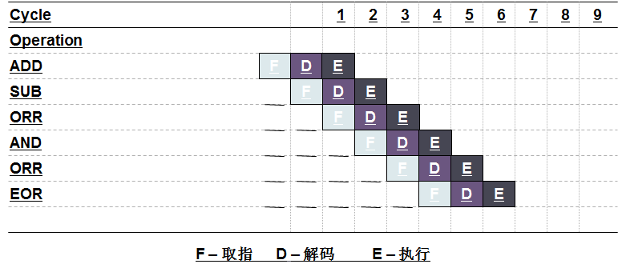

有了计算机硬件架构的原理，下面我就可以学习ARM模式、寄存器、流水线等基础知识。

# **一、ARM技术特征**

ARM的成功，一方面得益于它独特的公司运作模式，另一方面，当然来自于ARM处理器自身的优良性能。作为一种先进的RISC处理器，ARM处理器有如下特点。

1. 体积小、低功耗、低成本、高性能。
2. 支持Thumb(16位）/ARM(32位）双指令集，能很好地兼容8位/16位器件。
3. 大量使用寄存器，指令执行速度更快。
4. 大多数数据操作都在寄存器中完成。
5. 寻址方式灵活简单，执行效率高。
6. 指令长度固定。

# **二、ARM的基本数据类型**

ARM采用的是32位架构，ARM的基本数据类型有以下3种。

1. Byte:字节，8bit。
2. Halfword:半字，16bit(半字必须与2字节边界对齐）。
3. Word:字，32bit(字必须与4字节边界对齐）。存储器可以看做是序号为0~2^32^-1的线性字节阵列。每一个字节都有唯一的地址。

注意：

1. ARM系统结构v4以上版本支持以上3种数据类型，v4以前版本仅支持字节和字。
2. 当将这些数据类型中的任意一种声明成unsigned类型时，n位数据值表示范围为0~2^n^-1的非负数，通常使用二进制格式。
3. 当将这些数据类型的任意一种声明成signed类型时，n位数据值表示范围为-2^n-1^~2^n-1^-1的整数，使用二进制的补码格式。
4. 所有数据类型指令的操作数都是字类型的，如“ADD r1,r0,#0x1”中的操作数“0x1”就是以字类型数据处理的。
5. Load/Store 数据传输指令可以从存储器存取传输数据，这些数据可以是字节、半字、字。加载时自动进行字节或半字的零扩展或符号扩展。对应的指令分别为LDR/BSTRB(字节操作）、LDRH/STRH(半字操作）、LDR/STR(字操作）。
6. ARM指令编译后是4个字节（与字边界对齐）；Thumb指令编译后是2个字节（与半字边界对齐）。

# **三、ARM处理器工作模式**

Cortex系列之前的ARM处理器工作模式一共有7种。

## 1. 工作模式

Cortex系列的ARM处理器工作模式有8种，多了1个monitor模式，如下图所示：


ARM之所以设计出这么多种模式出来，就是为了**「应对CPU在运行时各种突发事件」**，比如要支持正常的应用程序的运行，在运行任何一个时间点又可能发生很多异常事件，比如：关机、收到网卡信息、除数为0、访问非法内存、解析到了非法指令等等，不光要能处理这些异常还要能够从异常中再返回到原来的程序继续执行。

1. 用户模式：用户模式是用户程序的工作模式，它运行在操作系统的用户态，它没有权限去操作其它硬件资源，只能执行处理自己的数据，也不能切换到其它模式下，要想访问硬件资源或切换到其它模式只能通过软中断或产生异常。
2. 系统模式：系统模式是特权模式，不受用户模式的限制。用户模式和系统模式共用一套寄存器，操作系统在该模式下可以方便的访问用户模式的寄存器，而且操作系统的一些特权任务可以使用这个模式访问一些受控的资源。
3. 一般中断模式：一般中断模式也叫普通中断模式，用于处理一般的中断请求，通常在硬件产生中断信号之后自动进入该模式，该模式为特权模式，可以自由访问系统硬件资源。
4. 快速中断模式：快速中断模式是相对一般中断模式而言的，它是用来处理对时间要求比较紧急的中断请求，主要用于高速数据传输及通道处理中。
5. 管理模式：管理模式是**「CPU上电后默认模式」**，因此在该模式下主要用来做系统的初始化，软中断处理也在该模式下，当用户模式下的用户程序请求使用硬件资源时通过软件中断进入该模式。
6. 终止模式：中止模式用于支持虚拟内存或存储器保护，当用户程序访问非法地址，没有权限读取的内存地址时，会进入该模式，linux下编程时经常出现的segment fault通常都是在该模式下抛出返回的。
7. 未定义模式：未定义模式用于支持硬件协处理器的软件仿真，CPU在指令的译码阶段不能识别该指令操作时，会进入未定义模式。
8. Monitor：是为了安全而扩展出的用于执行安全监控代码的模式；也是一种特权模式

除用户模式以外，其余的所有6种模式称之为非用户模式，或特权模式（Privileged Modes）；其中除去用户模式和系统模式以外的5种又称为异常模式（ExceptionModes），常用于处理中断或异常，以及需要访问受保护的系统资源等情况。

## 2. 模式切换

ARM微处理器的运行模式可以通过软件改变，也可以通过外部中断或异常处理改变。应用程序运行在用户模式下，当处理器运行在用户模式下时，某些被保护的系统资源是不能被访问的。

## 3. 异常（Exception）

指由处理器执行指令导致原来运行程序的中止，异常与指令运行相关，是CPU执行程序产生的，是同步的，可分为精确异常和非精确异常。异常处理遵守严格的程序顺序，不能嵌套，只有当第一个异常处理完并返回后才能处理后续的异常。

### 4. 异常源

要进入异常模式，一定要有异常源，ARM规定有7种异常源：

| 异常源   | 描述                                                         |
| :------- | :----------------------------------------------------------- |
| Reset    | 上电时执行                                                   |
| Undef    | 当流水线中的某个非法指令到达执行状态时执行                   |
| SWI      | 当一个软中断指令被执行完的时候执行                           |
| Prefetch | 当一个指令被从内存中预取时，由于某种原因而失败，如果它能到达执行状态这个异常才会产生 |
| Data     | 如果一个预取指令试图存取一个非法的内存单元，这时异常产生     |
| IRQ      | 通常的中断                                                   |
| FIQ      | 快速中断                                                     |

### 5. 异常源与模式关系

1. 重启异常进入管理模式；
2. 快速中断请求异常进入快中断模式，支持高速数传输及通道处理（FIQ异常响应时进入此模式）；
3. 中断请求异常进入中断模式，用于通用中断处理，（IRQ异常响应时进入此模式）；
4. 预取指中止，数据中止异常进入中止模式，用于支持虚拟内存和/或存储器保护；
5. 未定义指令异常进入未定义模式，支持硬件协处理器的软件仿真（未定义指令异常响应时进入此模式） ；
6. 软件中断，复位异常进入管理模式，操作系统保护代码（系统复位和软件中断响应时进入此模式） ；

异常发生之后，CPU必须要立刻做出响应，关于异常后面会详细讲解。

# **四、ARM寄存器**

Cortex A系列ARM处理器共有40个32位寄存器,其中33个为通用寄存器,7个为状态寄存器。usr模式和sys模式共用同一组寄存器。
通用寄存器包括R0~R15,可以分为3类:

1. 未分组寄存器R0~R7
2. 分组寄存器R8~R14、R13(SP) 、R14(LR)
3. 程序计数器PC(R15)、R8_fiq-R12_fir为快中断独有

## 1. 未分组寄存器R0~R7

在所有运行模式下,未分组寄存器都指向同一个物理寄存器,它们未被系统用作特殊的用途.因此在中断或异常处理进行运行模式转换时,由于不同的处理器运行模式均使用相同的物理寄存器,所以可能造成寄存器中数据的破坏。

## 2. 分组寄存器R8~R14

对于分组寄存器,它们每一次所访问的物理寄存器都与当前处理器的运行模式有关。

对于R8~R12来说,每个寄存器对应2个不同的物理寄存器,当使用FIQ(快速中断模式)时,访问寄存器 R8_fiq~R12_fiq;当使用除FIQ模式以外的其他模式时,访问寄存器R8_usr~R12_usr。

对于R13,R14来说,每个寄存器对应7个不同的物理寄存器,其中一个是用户模式与系统模式共用,另外6个物理寄存器对应其他6种不同的运行模式,并采用以下记号来区分不同的物理寄存器:

```
 R13_mode    R14_mode
```

其中mode可为:**「usr,fiq,irq,svc,abt,und，mon」**。

## 3. 寄存器R13（sp）

在ARM指令中常用作**「堆栈指针」**,用户也可使用其他的寄存器作为堆栈指针,而在Thumb指令集中,某些指令强制性的要求使用R13作为堆栈指针。

寄存器R13在ARM指令中常用作堆栈指针，但这只是一种习惯用法，用户也可使用其他的寄存器作为堆栈指针。而在Thumb指令集中，某些指令强制性的要求使用R13作为堆栈指针。

由于处理器的每种运行模式均有自己独立的物理寄存器R13，在用户应用程序的初始化部分，一般都要初始化每种模式下的R13，使其指向该运行模式的栈空间。这样，当程序的运行进入异常模式时，可以将需要保护的寄存器放入R13所指向的堆栈，而当程序从异常模式返回时，则从对应的堆栈中恢复，采用这种方式可以保证异常发生后程序的正常执行。

## 4.  R14（LR）链接寄存器(Link Register)

当执行子程序调用指令(BL)时,R14可得到R15(程序计数器PC)的备份。

在每一种运行模式下，都可用R14保存子程序的返回地址，当用BL或BLX指令调用子程序时，将PC的当前值复制给R14，执行完子程序后，又将R14的值复制回PC，即可完成子程序的调用返回。以上的描述可用指令完成。

### 从子程序返回：

**「方法1：」**

```
  MOV PC, LR
或者
  BX LR
```

**「方法2：」**在子程序入口处使用以下指令将R14存入堆栈：

```
  STMFD SP！,{,LR}
```

对应的，使用以下指令可以完成子程序返回：

```
  LDMFD SP！,{,PC}
```

## 5. R15(PC)程序状态寄存器

寄存器R15用作程序计数器(PC),在ARM状态下,位[1:0]为0,位[31:2]用于保存PC,在Thumb状态下,位[0]为0,位[31:1]用于保存PC。

比如如果pc的值是0x40008001,那么在寻址的时候其实会查找地址0x40008000，低2位会自动忽略掉。**「个中原因，请读者自己思考?」**

由于ARM体系结构采用了多级流水线技术，对于ARM指令集而言，PC总是指向当前指令的下两条指令的地址,即PC的值为当前指令的地址值加8个字节。

```
 即：PC值=当前程序执行位置+8
```

【流水线技术参考第七章】

## 6. CPSR、SPSR

**「CPSR」**(Current Program Status Register，当前程序状态寄存器)，CPSR可在任何运行模式下被访问，它包括条件标志位、中断禁止位、当前处理器模式标志位，以及其他一些相关的控制和状态位。

每一种运行模式下又都有一个专用的物理状态寄存器，称为**「SPSR」**(Saved Program Status Register，备份的程序状态寄存器)，当异常发生时，SPSR用于保存CPSR的当前值，从异常退出时则可由SPSR来恢复CPSR。

由于用户模式和系统模式不属于异常模式，它们没有SPSR，当在这两种模式下访问SPSR，结果是未知的。

寄存器CPSR格式如下：


1. 条件码标志(condition code flags)**「N,Z,C,V」**均为条件码标志位,它们的内容可被算术或逻辑运算的结果所改变,并且可以决定某条指令是否被执行。在ARM状态下,绝大多数的指令都是有条件执行的,在Thumb状态下,仅有分支指令是有条件执行的。

**「N  (Number)」**: 当用两个补码表示的带符号数进行运算时,N=1表示运行结果为负,N=0表示运行结果为正或零

**「Z  :(Zero)」**: Z=1表示运算结果为零,Z=0表示运行结果非零

**「C」** : 可以有4种方法设置C的值：

- (Come)加法运算(包括CMP):当运算结果产生了进位时C=1,否则C=0
- 减法运算(包括CMP):当运算产生了借位,C=0否则C=1
- 对于包含移位操作的非加/减运算指令 ,C为移出值的最后一位
- 对于其他的非加/减运算指令C的值通常不改变

**「V」** :
(oVerflow)对于加/减法运算指令,当操作数和运算结果为二进制的补码表示的带符号位溢出时,V=1表示符号位溢出;对于其他的非加/减运算指令V的值通常不改变

**「Q」**：在ARM V5及以上版本的E系列处理器中，用Q标志位指示增强的DSP运算指令是否发生了溢出。在其它版本的处理器中，Q标志位无定义

**「J：」**
仅ARM  v5TE-J架构支持 , T=0;J = 1  处理器处于Jazelle状态,也可以和其他位组合.

**「E位：」**大小端控制位

**「A位：」**A=1 禁止不精确的数据异常

**「T  :」**T = 0;J=0; 处理器处于 ARM 状态 T = 1;J=0 处理器处于 Thumb 状态 T = 1;J=1 处理器处于 ThumbEE 状态

1. 控制位 CPSR的低8位(包括I,F,T和M[4:0])称为控制位,当发生异常时这些位可以被改变,如果处理器运行特权模式,这些位也可以由程序修改。

**「中断禁止位I,F」**【重要】 I=1 禁止IRQ中断 F=1 禁止FIQ中断

比如我们要想在程序中实现禁止中断，那么就需要将CPSR[7]置1。

1. 运行模式位[4-0]

| bite    | 模式          | ARM模式可访问的寄存器                   |
| :------ | :------------ | :-------------------------------------- |
| 0b10000 | 用户模式user  | PC,CPSR,R0~R14                          |
| 0b10001 | FIQ模式       | PC,CPSR,SPSR_fiq,R14_fiq~R8_fiq,R0~R7   |
| 0b10010 | IRQ模式       | PC,CPSR,SPSR_irq,R14_irq~R13_irq,R0~R12 |
| 0b10011 | 管理模式      | PC,CPSR,SPSR_svc,R14_svc~R13_svc,R0~R12 |
| 0b10111 | 中止模式Abort | PC,CPSR,SPSR_abt,R14_abt~R13_abt,R0~R12 |
| 0b11011 | 未定义模式    | C,CPSR,SPSR_und,R14_und~R13_und,R0~R12  |
| 0b11111 | 系统模式      | PC,CPSR,R0~R14                          |

注意观察这5个bit的特点，最高位都是1，低4位的值则各不相同，这个很重要，要想搞清楚uboot、linux的源码，尤其是异常操作的代码，必须要知道这几个bit的值。

# **五、协处理器**


ARM体系结构允许通过增加协处理器来扩展指令集。最常用的协处理器是用于控制片上功能的系统协处理器。

例如，控制Cache和存储管理单元MMU的CP15协处理器、设置异常向量表地址的mcr指令。

ARM支持16个协处理器，在程序执行过程中，每个协处理器忽略属于ARM处理器和其他协处理器指令，当一个协处理器硬件不能执行属于她的协处理器指令时，就会产生一个未定义的异常中断，在异常中断处理程序中，可以通过软件模拟该硬件的操作，比如，如果系统不包含向量浮点运算器，则可以选择浮点运算软件模拟包来支持向量浮点运算。

ARM协处理器指令包括如下三类：

1. 用于ARM处理器初始化ARM协处理器的数据操作
2. 用于ARM处理器的寄存器和ARM协处理器的寄存器间的数据传送操作
3. 用于在ARM协处理器的寄存器和内存单元之间传送数据

这些指令包括如下5条:

1. CDP协处理器数据操作指令
2. LDC协处理器数据读入指令
3. STC协处理器数据写入指令
4. MCR ARM寄存器到协处理器寄存器的数据传送指令
5. MRC 协处理器寄存器到ARM寄存器的数据传送指令

关于协处理器指令，我们只需要知道几个常用的即可，后面文章会提到。

# **六、Jazelle**


Jazelle杰则来 或者说Java字节码状态是为了运行Java虚拟机而添加的一种状态。

ARM的Jazelle技术在硬件上提供了对Java字节码的支持，大大提高了系统的性能。

由于ARM 架构是32-bits，16-bits = “halfword” ， “word” = 32-bits。

Java 字节码 8-bits 独立架构的指令集。Jazelle 用硬件执行大多数的字节码（另一些使用高度优化了的ARM 代码）。这是由于折衷了硬件复杂度（功耗 & 硅片面积）和速度。

# **七、指令流水线**

流水线技术通过多个功能部件并行工作来缩短程序执行时间，提高处理器核的效率和吞吐率，从而成为微处理器设计中最为重要的技术之一。

## 1. 3级流水线

到ARM7为止的ARM处理器使用简单的3级流水线，它包括下列流水线级。（1）取指令 从寄存器装载一条指令。（2）译码（decode） 识别被执行的指令，并为下一个周期准备数据通路的控制信号。在这一级，指令占有译码逻辑，不占用数据通路。（3）执行 处理指令并将结果写回寄存器。


当处理器执行简单的数据处理指令时，流水线使得平均每个时钟周期能完成1条指令。但一条指令需要3个时钟周期来完成，因此有3个时钟周期的延时，但吞吐率是每个周期一条指令。

对于3级流水线，PC寄存器里的值并不是正在执行的指令的地址，而是预取指令的地址，这个知识点很重要，后面我们会详细的举例来证明。

处理器要满足高性能的要求，为了满足这个要求，需要重新考虑处理器的组织结构。提高性能的方法主要有两种方法：

1. 提高时钟频率。时钟频率的提高，必然引起指令执行周期的缩短，所以要求简化流水线每一级的逻辑，流水线的级数都要增加。
2. 减少每条指令的平均指令周期数CPI。这就要求重新考虑3级流水线ARM中多余1个流水线周期的实现方法，以便使其占有较少的周期，或者减少因指令相关造成的流水线停顿，也可以将两者结合起来。

较高性能的ARM核使用了5级流水线，而且具有分开的指令和数据存储器。在Cortex-A8中有一条13级的流水线，但是ARM公司没有对其中的技术公开任何相关的细节。

从经典ARM系列到现在Cortex系列，ARM处理器的结构在向复杂的阶段发展，但没改变的是CPU的取址指令和地址关系，**「不管是几级流水线，都可以按照最初的3级流水线的操作特性来判断其当前的PC位置」**。

## 2. 流水线举例

为方便理解，下面我们以3级流水线为例，

### 1）最佳流水线



这是一个理想的实例，所有的指令都在寄存器中执行，且处理器完全不必离开芯片本身。每个周期，都有一条指令被执行，流水线的容量得到了充分的发挥。指令周期数 (CPI) = 1

### 2）LDR流水线


该例中，用6周期执行了4条指令 指令周期数 (CPI) = 1.5

与最佳流水线不同，装载(LDR) 操作将数据移进片内导致了指令/数据总线被占用，因此随后紧跟了内部的写周期（ writeback）以完成将数据写回寄存器。

1. 数据总线在周期1, 2, 3 被使用，周期6是取指，周期4用于数据装载，而周期5是一个内部周期用来完成载入的数据写回到寄存器中。
2. 周期3为执行周期：产生地址
3. 周器4为数据周期：从存储器中取数据（数据只有在周期4的末尾出现在内核中）
4. 周期5写回周期：通过数据通道中的B总线和ALU将数据写回到寄存器bank 中
5. 周期6的执行被推迟了，直到周期5写回完成（使用ALU ）。同样内部周期是不需要等待状体的，但读写存储器时可能需要。

### 3）分支流水线

BL指令用于实现指令流的跳转，并存储返回地址到寄存器R14（LR）中。


1. 分支指令在其第一周期计算分支的目的地，同时在现行PC处完成一次指令预取，流水线被阻断。这种预取在任何情况下都要做的，因为当判决地址产生时已来不及停止预取。
2. 第二个周期在分支的目标地址完成取指，而返回地址则存于R14如果link位已设置。
3. 第三周期完成目标地址+4的取指，重新填满流水线，并且如果跳转是带链接的还要修改R14（减去4）以便简单地返回。
4. 分支需要三个时钟周期来执行BL，随后会涉及调整阶段。

### 4）中断流水线


**「IRQ 中断的反应时间最小=7周期」**

1. 周期1: 内核被告知有中断 IRQ在现行指令执行完之前不会被响应（ MUL and LDM/STM 指令会有长的延迟） 解码阶段：中断被解码（中断已使能，设置了相应标志位… ）。如果中断被使能和服务，正常的指令将不会被解码。
2. 周期 2: 此时总是进入ARM状态. 执行中断 ( 获取IR向量的地址), 保存 CPSR 于 SPSR, 改变CPSR模式为 IRQ 模式并禁止进一步的 IRQ 中断输入。
3. 周期 3: 保存 PC (0x800C) 于 r14_irq, 从IRQ异常处理向量处取指
4. 周期 4: 解码向量表中的指令; 调整r14irq 为0x8008
5. 周期 4和 5: 无有用的指令取指， 由于周期 6的跳转
6. 周期 6: 取异常处理子程序的第一条指令; 从子程序返回:  `SUBS pc,lr,#4`

这将恢复工作模式并从响应中断前的下一条指令处取指，如果有多个中断，需堆栈保存返回地址。注意最大的FIQ响应延迟为 29个周期(而非Thumb状态的28周期!)。