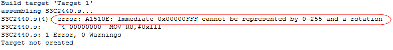
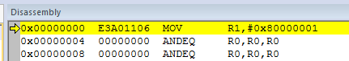
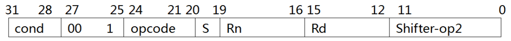
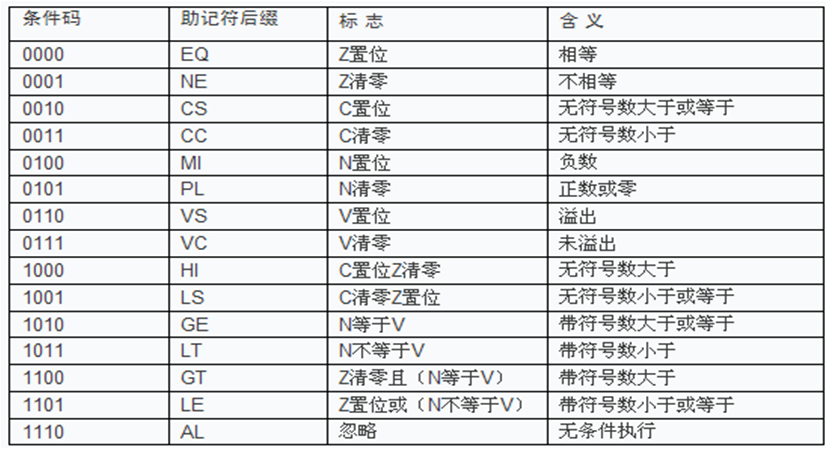
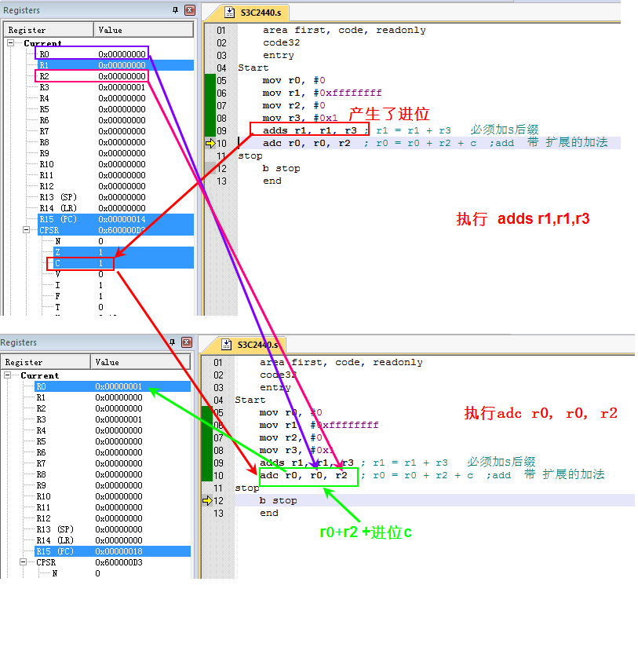
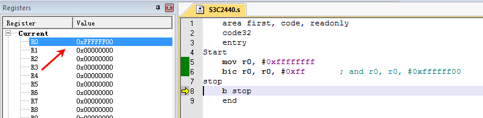
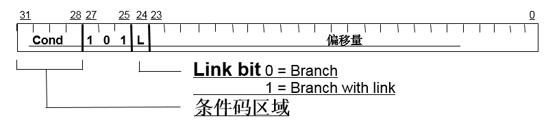
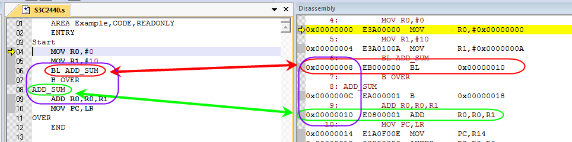

学习ARM，就必须要学习ARM指令，ARM指令是CPU提供给我们的接口，是我们打开CPU这个潘多拉魔盒的钥匙。

ARM指令有很多，为了让大家能快速上手，一口君整理了一些对我们最有帮助的指令。keil软件的操作，可以参考第一章。

让我们开始吧！

# 0.指令分类

1. 数据处理指令 数据处理指令可分为数据传送指令、算术逻辑运算指令和比较指令等。
2. 数据传送指令用于在寄存器和存储器之间进行数据的双向传输。
3. 算术逻辑运算指令完成常用的算术与逻辑的运算，该类指令不但将运算结果保存在目的寄存器中，同时更新CPSR中的相应条件标志位。

# 一、MOV指令

## 1、MOV

语法：

```assembly
MOV{条件}{S}   目的寄存器，源操作数
```

功能：MOV指令完成从另一个寄存器、被移位的寄存器或将一个立即数加载到目的寄存器。其中S选项决定指令的操作是否影响CPSR中条件标志位的值，当没有S时指令不更新CPSR中条件标志位的值。

指令示例：

```assembly
MOV r0, #0x1 ;将立即数0x1传送到寄存器R0
MOV R1，R0  ;将寄存器R0的值传送到寄存器R1
MOV PC，R14   ;将寄存器R14的值传送到PC，常用于子程序返回
MOV R1，R0，LSL ＃3  ;将寄存器R0的值左移3位后传送到R1
```

【注：不区分大小写】

思考，为什么以下赋值出错？

```assembly
 MOV R0,#0xfff 
```



要想搞懂这个问题，我们需要了解什么是立即数。

## 2. 什么是立即数？

立即数是由 0-255之间的数据循环右移偶数位生成。

判断规则如下：

1. 把数据转换成二进制形式，从低位到高位写成4位1组的形式，最高位一组不够4位的，在最高位前面补0。
2. 数1的个数，如果大于8个肯定不是立即数，如果小于等于8进行下面步骤。
3. 如果数据中间有连续的大于等于24个0,循环左移2的倍数，使高位全为0。
4. 找到最高位的1，去掉前面最大偶数个0。
5. 找到最低位的1，去掉后面最大偶数个0。
6. 数剩下的位数，如果小于等于8位，那么这个数就是立即数，反之就不是立即数。

而例子中的数是0xfff,我们来看下他的二进制:

```assembly
0000 0000 0000 0000 0000 1111 1111 1111 
```

按照上述规则，我们最终操作结果如下：

```assembly
1111 1111 1111 
```

可以看到剩余的位数大于8个，所以该数不是立即数。为什么立即数会有这么个限定？我们需要从MOV这条指令的机器码来说起。

## 3. MOV机器码

让我们执行下面代码：

```assembly
 AREA Example,CODE,READONLY    ;声明代码段Example
 ENTRY ;程序入口
Start 
//测试代码，添加在以下位置即可，后面不再贴完整代码                                 
 mov r1,#0x80000001   
OVER
 END
```

然后点击debug按钮，查看对应的机器码：

机器指令

得到mov r1,#0x80000001指令的机器码是**E3A01106**

我们来分析这个机器码。

MOV机器指令格式

用ARM指令助记符表示为：

```
<opcode> {<cond>} {S} <Rd>, <Rn>, <shift_op2>
```

每个域的含义如下：

### 1) {<cond>}：条件码域

指令允许执行的条件编码。花括号表示此项可缺省。

ARM指令的一个重要特点是可以条件执行，每条ARM指令的条件码域包含4位条件码，共16种。几乎所有指令均根据CPSR中条件码的状态和指令条件码域的设置有条件的执行。当指令执行条件满足时，指令被执行，否则被忽略。指令条件码及其助记符后缀表示参见下表。



每种条件码可用两个字符表示，这两个字符可以作为后缀添加在指令助记符的后面和指令同时使用。

例如：跳转指令B可以加上后缀EQ变为BEQ，表示“相等则跳转”，即当CPSR中的Z标志置位时发生跳转。

### 2) <opcode>：操作码域

指令编码的助记符；

### 3) {S} ：条件码设置域

这是一个可选项，当在指令中设置{S}域时，指令执行的结果将会影响程序状态寄存器CPSR中相应的状态标志。例如：

```
  ADD R0，R1，R2；R1与R2的和存放到R0寄存器中，不影响状态寄存器
  ADDS R0，R1，R2； 执行加法的同时影响状态寄存器
```

指令中比较特殊的是**CMP指令，它不需要加S后缀就默认地根据计算结构更改程序状态寄存器**。

### 4) <Rd>：目的操作数

ARM指令中的目的操作数总是一个寄存器。如果与第一操作数寄存器相同，也必须要指明，不能缺省。

### 5) <Rn>：第一操作数

ARM指令中的第一操作数也必须是个寄存器。

### 6) <shift_op2>：第二操作数

在第二操作数中可以是寄存器、内存存储单元或者立即数。

如果是立即数：

```
bit:[11-8]表示操作数向左移动的位数/2,
bit:[7-0]表示最终的操作数
```

根据MOV指令格式，我们分析各个位域的值：

| bite      | 含义                |
| :-------- | :------------------ |
| 1110      | Cond忽略            |
| 00  1     |                     |
| 1101      | opcode              |
| 0         | s 命令不含S         |
| 0000      | rn，没有源寄存器为0 |
| 0001      | rd  目的结存器R0    |
| 0001      | shifter             |
| 0000 0110 | 操作数              |

立即数0x80000001二进制为：

```assembly
1000 0000 0000 0000 0000 0000 0000 0001
```

循环左移**2**位后得到以下结果：

```assembly
00 0000 0000 0000 0000 0000 0000 0001 10
```

所以shifter的值为2/2=1，操作数的值为0000 0110。

# 二、移位操作

ARM微处理器支持数据的移位操作，移位操作在ARM指令集中不作为单独的指令使用，它只能作为指令格式中是一个字段，在汇编语言中表示为指令中的选项。移位操作包括如下6种类型，ASL和LSL是等价的，可以自由互换：

## 1) LSL（或ASL）逻辑（算术）左移

寻址格式：

```assembly
通用寄存器，LSL（或ASL） 操作数   
```

完成对通用寄存器中的内容进行逻辑（或算术）的左移操作，按操作数所指定的数量向左移位，**低位用零来填充**。其中，操作数可以是通用寄存器，也可以是立即数（0～31）。如：

```assembly
MOV    R0, R1, LSL#2  ；将R1中的内容左移两位后传送到R0中。
```

## 2) LSR逻辑右移

寻址格式：

```assembly
通用寄存器，LSR 操作数 
```

完成对通用寄存器中的内容进行右移的操作，按操作数所指定的数量向右移位，**左端用零来填充**。其中，操作数可以是通用寄存器，也可以是立即数（0～31）。如：

```assembly
MOV    R0, R1, LSR #2  ；将R1中的内容右移两位后传送到R0中，左端用零来填充。
```

## 3) ASR算术右移

寻址格式：

```assembly
通用寄存器，ASR 操作数     
```

完成对通用寄存器中的内容进行右移的操作，按操作数所指定的数量向右移位，**左端用第31位的值来填充**。其中，操作数可以是通用寄存器，也可以是立即数（0～31）。如：

```assembly
MOV    R0, R1, ASR #2  ；将R1中的内容右移两位后传送到R0中，左端用第31位的值来填充。
```

## 4) ROR循环右移

寻址格式：

```assembly
通用寄存器，ROR 操作数      
```

完成对通用寄存器中的内容进行循环右移的操作，按操作数所指定的数量向右循环移位，**左端用右端移出的位来填充**。其中，操作数可以是通用寄存器，也可以是立即数（0～31）。显然，当进行32位的循环右移操作时，通用寄存器中的值不改变。如：

```assembly
MOV    R0, R1, ROR #2  ；将R1中的内容循环右移两位后传送到R0中。
```

## 5) RRX带扩展的循环右移

寻址格式：

```assembly
通用寄存器，RRX 操作数      
```

完成对通用寄存器中的内容进行带扩展的循环右移的操作，按操作数所指定的数量向右循环移位，**左端用进位标志位C来填充**。其中，操作数可以是通用寄存器，也可以是立即数（0～31）。如：

```assembly
MOV    R0, R1, RRX #2  ；将R1中的内容进行带扩展的循环右移两位后传送到R0中。
```

## 举例

```assembly
; 第二操作数 寄存器移位操作， 5种移位方式， 9种语法
 ;逻辑左移
 mov r0, #0x1
 mov r1, r0, lsl #1    ; 移位位数1-31肯定合法
 
 mov r0, #0x2
 mov r1, r0, lsr #1    ; 逻辑右移

 mov r0, #0xffffffff
 mov r1, r0, asr #1    ; 算术右移符号位不变， 次高位补符号位

 mov r0, #0x7fffffff
 mov r1, r0, asr #1

    mov r0, #0x7fffffff
 mov r1, r0, ror #1 ; 循环右移

    mov r0, #0xffffffff
 mov r1, r0, rrx ; 唯一不需要指定循环位数的移位方式
 ;带扩展的循环右移
 ;C标志位进入最高位，最低位进入C 标志位

 ; 移位值可以是另一个寄存器的值低5bit， 写法如下 
 mov r2, #1
 mov r0, #0x1
 mov r1, r0, lsl r2    ; 移位位数1-31肯定合法

 mov r0, #0xffffffff
 mov r1, r0, asr r2    ; 算术右移符号位不变， 次高位补符号位

 mov r0, #0x7fffffff
 mov r1, r0, asr r2

    mov r0, #0x7fffffff
 mov r1, r0, ror r2 ; 循环右移
```

上述结果不再截图，读者可以自行拷贝到keil中进行debug，查看寄存器中值以及符号位的变化。

# 三、CMP比较指令

语法

```assembly
CMP{条件} 操作数1，操作数2
```

CMP指令用于把一个寄存器的内容和另一个寄存器的内容或立即数进行比较，同时更新CPSR中条件标志位的值。该指令进行一次减法运算，**但不存储结果，只更改条件标志位**。cmp是做一次减法，并不保存结果，仅仅用来产生一个逻辑，体现在改变cpsr相应的condition位。

标志位表示的是操作数1与操作数2的关系(大、小、相等)， 指令示例：

```assembly
CMP R1，R0   ；将寄存器R1的值与寄存器R0的值相减，并根据结果设置CPSR的标志位
CMP R1，#100 ；将寄存器R1的值与立即数100相减，并根据结果设置CPSR的标志位
```

# 四、TST条件指令

语法

```assembly
TST{条件}  操作数1，操作数2
```

TST指令用于把一个寄存器的内容和另一个寄存器的内容或立即数进行按位的与运算，并根据运算结果更新CPSR中条件标志位的值。操作数1是要测试的数据，而操作数2是一个位掩码，根据测试结果设置相应标志位。当位与结果为0时，EQ位被设置。 指令示例

```assembly
   TST   R1，＃％1  ；用于测试在寄存器R1中是否设置了最低位（％表示二进制数）。
```

## 比较指令和条件执行举例

例1：找出三个寄存器中数据最大的数

```assembly
 mov r0, #3
 mov r1, #4
 mov r2, #5
 cmp r1,r0
 movgt r0,r1
 cmp r2,r0
 movgt r0,r2
```

例2：求两个数的差的绝对值

```assembly
  mov r0,#9
  mov r1,#15
  cmp r0,r1
  beq stop
  subgt r0,r0,r1
  sublt r1,r1,r0
```

带条件码的指令执行请参考本篇表格《指令的条件码》

# 五、数据的处理指令

## ADD

```assembly
ADD{条件}{S} 目的寄存器，操作数1，操作数2
```

ADD指令用于把两个操作数相加，并将结果存放到目的寄存器中。操作数1应是一个寄存器，操作数2可以是一个寄存器，被移位的寄存器，或一个立即数。指令示例：

```assembly
ADD  R0，R1，R2           ；R0 = R1 + R2
ADD  R0，R1，#256            ；R0 = R1 + 256
ADD  R0，R2，R3，LSL#1      ；R0 = R2 + (R3 << 1)
```

## ADC

注意这个指令不是射手。。。。

除了正常做加法运算之外，还要加上CPSR中的C条件标志位，如果要影响CPSR中对应位，加后缀S。

## SUB

SUB指令的格式为：

```assembly
  SUB{条件}{S} 目的寄存器，操作数1，操作数2
```

SUB指令用于把操作数1减去操作数2，并将结果存放到目的寄存器中。操作数1应是一个寄存器，操作数2可以是一个寄存器，被移位的寄存器，或一个立即数。该指令可用于有符号数或无符号数的减法运算。

如：

```assembly
SUB  R0，R1，R2          ；R0 = R1 - R2
SUB  R0，R1，#256        ；R0 = R1 - 256
SUB  R0，R2，R3，LSL#1   ；R0 = R2 - (R3 << 1)
 
```

## SBC

除了正常做加法运算之外，还要再减去CPSR中C条件标志位的反码 根据执行结果设置CPSR对应的标志位 AND指令的格式为：

```assembly
AND{条件}{S} 目的寄存器，操作数1，操作数2
```

AND指令用于在两个操作数上进行逻辑与运算，并把结果放置到目的寄存器中。操作数1应是一个寄存器，操作数2可以是一个寄存器，被移位的寄存器，或一个立即数。该指令常用于屏蔽操作数1的某些位。如：

```assembly
AND  R0，R0，＃3           ； 该指令保持R0的0、1位，其余位清零。
```

## ORR

ORR指令的格式为：

```assembly
  ORR{条件}{S} 目的寄存器，操作数1，操作数2
```

ORR指令用于在两个操作数上进行逻辑或运算，并把结果放置到目的寄存器中。操作数1应是一个寄存器，操作数2可以是一个寄存器，被移位的寄存器，或一个立即数。该指令常用于设置操作数1的某些位。如：

```assembly
ORR  R0，R0，＃3           ； 该指令设置R0的0、1位，其余位保持不变。
```

## BIC

这是一个非常实用的指令，在实际寄存器操作经常要将某些位清零，但是又不想影响其他位的值，就可以使用该命令。

BIC指令的格式为：

```assembly
  BIC{条件}{S} 目的寄存器，操作数1，操作数2
```

BIC指令用于清除操作数1的某些位，并把结果放置到目的寄存器中。

操作数1应是一个寄存器，操作数2可以是一个寄存器，被移位的寄存器，或一个立即数。操作数2为32位的掩码，如果在掩码中设置了某一位，则清除这一位。未设置的掩码位保持不变。

如：

```assembly
BIC  R0，R0，＃％1011    ； 该指令清除 R0 中的位 0、1、和 3，其余的位保持不变。
```

## 数据处理指令举例

1. 加法运算

```assembly
 mov r0, #1
 mov r1, #2
  
 add r2, r0, r1 ; r2 = r0 + r1
 add r2, r0, #4
 add r2, r0, r1, lsl #2 ;  r2 = r0 ＋R1＜＜２； （R0 ＋ R1*4）
```

2. adc，64位加法运算的实现

```assembly
 ; 2. adc  64位加法 r0, r1 =  r0, r1 + r2, r3 
 mov r0, #0
 mov r1, #0xffffffff
   mov r2, #0
 mov r3, #0x1 
 adds r1, r1, r3 ; r1 = r1 + r3  必须加S后缀
 adc r0, r0, r2 ; r0 = r0 + r2 + c ;add  带 扩展的加法
```



可以对比下add和adds，没有加s的话是不会影响条件位的。

3. 减法

```assembly
; 3. sub  rd = rn - op2 
mov r0, #1
sub r0, r0, #1 ; r0 = r0 - 1
```

4. 64位减法

```assembly
; 4. sbc  64位减法 r0, r1 =  r0, r1 - r2, r3 
    ; cpsr c 对于加法运算 C = 1 则代表有进位， C = 0 无进位
 ;   对于减法运算 C = 1 则代表无借位， C = 0 有借位
  mov r0, #0
 mov r1, #0x0
   mov r2, #0
 mov r3, #0x1
 subs r1, r1, r3 
 sbc r0, r0, r2   ;sbc  带扩展的减法   
```

5. 位清除

```assembly
 ; 5. bic   位清除 
 mov r0, #0xffffffff
 bic r0, r0, #0xff       ; and r0, r0, #0xffffff00 
```

执行结果




# 六、跳转指令

跳转指令用于实现程序流程的跳转，在ARM程序中有两种方法可以实现程序流程的跳转：

1. 使用专门的跳转指令;
2. 直接向程序计数器PC写入跳转地址值，通过向程序计数器PC写入跳转地址值，可以实现在4GB的地址空间中的任意跳转，在跳转之前结合使用。

使用以下指令，可以保存将来的返回地址值，从而实现在4GB连续的线性地址空间的子程序调用。

```assembly
  MOV LR,PC
```

ARM指令集中的跳转指令可以完成从当前指令**向前或向后的32MB的地址空间**的跳转，包括以下4条指令：

```assembly
B        跳转指令
BL       带返回的跳转指令
BLX      带返回和状态切换的跳转指令thumb指令
BX       带状态切换的跳转指令thumb指令
```

## 1. B 指令

指令的格式为：

```assembly
  B{条件}  目标地址
```

B指令是最简单的跳转指令。一旦遇到一个 B 指令，ARM 处理器将立即跳转到给定的目标地址，从那里继续执行。

```assembly
   B label     程序无条件跳转到标号label处执行
   CMP R1 ，#0
   BEQ label      当CPSR寄存器中的Z条件码置位时，程序跳转到标号Label处执行。
```

## 2. BL 指令

BL 指令的格式为：

```assembly
   BL{条件}  目标地址
```

BL是另一个跳转指令，但跳转之前，会在寄存器R14中保存PC当前值，因此，可以通过将R14 的内容重新加载到PC中，来返回到跳转指令之后的那个指令处执行。该指令是实现子程序调用的一个基本但常用的手段。

```assembly
  BL label     当程序无条件跳转到标号Label处执行时，同时将当前的PC值保存到R14中
```

子函数要返回执行以下指令即可：

```assembly
  MOV PC,LR
```

## 3. BL指令机器码

语法：

```assembly
Branch :  B{<cond>} label
Branch with Link : BL{<cond>} subroutine_label
```

BL机器码格式如下：



各域含义:

| 域     | 含义           |
| :----- | :------------- |
| cond   | 条件码         |
| 101    | 操作码         |
| L      | 命令是否包含L  |
| offset | 指令跳转偏移量 |

其中offset是24个bite，最高位包含一个符号位，1个单位表示偏移一条指令，所以可以寻址±2^23^条指令，即±8M条指令。

而一条指令是4个字节，所以最大寻址空间为**±32MB的地址空间**。

我们来看下以下代码：

```assembly
 AREA Example,CODE,READONLY  
 ENTRY ;程序入口
Start            
 MOV R0,#0     
 MOV R1,#10
 BL ADD_SUM   
 B OVER        
ADD_SUM
 ADD R0,R0,R1 
 MOV PC,LR    
OVER
 END
```


由上图所示：

1. 第6行代码BL ADD_SUM 会跳转到第8行，即第9行的代码
2. 第6行的指令的机器码是EB000000

根据BL的机器码我们可以得到offset的值是0x000000,也就是说该指令跳转本身，而根据我们的分析第6行代码，应该是向前跳转2条指令，按道理offset是应该是2，为什么是0呢？

因为是3级流水线，所以pc存储指令地址与正在处理指令地址之间相差8个字节，pc的地址是预取指令地址，而不是正在执行的指令的地址。

## 4. 如何访问全部32-bit地址空间？

可以手动设置LR寄存器，然后装载到PC中。

```assembly
MOV lr, pc
LDR pc, =dest
```

在编译项目过程中，ARM连接器（linker）会自动为长跳转（超过32Mb范围）。

ldr下一章会详细详细讲解。

## 举例

子函数多重嵌套调用，如何从子函数返回？

```assembly
  area first, code, readonly
  code32
  entry
main
  ; bl 指令, 子函数调用
  mov r0,#1
  bl child_func  
  mov r0,#2
stop 
    b stop 
child_func
 mov r1,r0
 mov r2,lr
 mov r0, #3 //<===  pc
 bl child_func_2
 mov r0,#4
 mov r0,r1
 mov lr,r2
 mov pc, lr
child_func_2 ;叶子函数
 mov r3,r0
 mov r4,lr  ; 保存直接父函数用到的所有寄存器
 mov r0, #5
 mov r0,r3
 mov lr,r4 ;返回到直接父函数之前，把它用到的所有寄存器内容恢复
 mov pc, lr
 end
```

由上述例子所示，每调用一级子函数，我们都把返回地址存入到未分组寄存器中，但是未分组寄存器毕竟是有限的，像Linux内核函数的调用层次往往很深，通用寄存器根本不够用，要想保存返回地址，就需要对数据进行压栈，那我们就要为每个模式的栈设置空间，那如何设置栈空间呢？下一篇我们继续讨论。