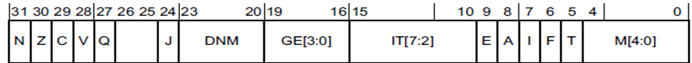
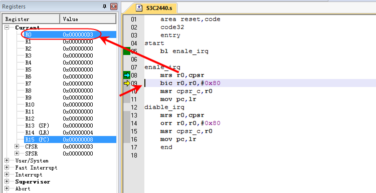

# **一、程序状态寄存器访问指令**

ARM微处理器支持程序状态寄存器访问指令，用于在程序状态寄存器和通用寄存器之间传送数据。

## MRS

```assembly
MRS{条件} 通用寄存器，程序状态寄存器（CPSR或SPSR）
```

MRS指令用于将程序状态寄存器的内容传送到通用寄存器中。该指令一般用在以下几种情况：

1. 当需要改变程序状态寄存器的内容时，可用MRS将程序状态寄存器的内容读入通用寄存器，修改后再写回程序状态寄存器。
2. 当在异常处理或进程切换时，需要保存程序状态寄存器的值，可先用该指令读出程序状态寄存器的值，然后保存。如：

```assembly
MRS R0，CPSR   ；传送CPSR的内容到R0
MRS R0，SPSR   ；传送SPSR的内容到R0
```

## MSR

```assembly
MSR{条件} 程序状态寄存器（CPSR或SPSR）_<域>，操作数
```

MSR指令用于将操作数的内容传送到程序状态寄存器的特定域中。其中，操作数可以为通用寄存器或立即数。<域>用于设置程序状态寄存器中需要操作的位，32位的程序状态寄存器可分为4个域：

```assembly
位[31：24]为条件标志位域，用f表示；
位[23：16]为状态位域，用s表示；
位[15：8]为扩展位域，用x表示；
位[7：0]为控制位域，用c表示；
```

该指令通常用于恢复或改变程序状态寄存器的内容，在使用时，一般要在MSR指令中指明将要操作的域。如：

```assembly
MSR CPSR，R0   ；传送R0的内容到CPSR
MSR SPSR，R0   ；传送R0的内容到SPSR
MSR CPSR_c，R0  ；传送R0的内容到SPSR，但仅仅修改CPSR中的控制位域
```

## 应用举例

1. 使能中断

要是能中断，必须将寄存器CPSR的bit[7]设置为0

要将寄存器CPSR的bit[7]设置为0，但是不能影响其他位，所以必须先用msr读取出cpsr的值到通用寄存器Rn（n取值0~8)，然后修改bit[7]设置为0，再将该寄存器的值设置到CPSR中。

代码如下：

```assembly
 area reset,code
 code32
 entry
start
 bl enale_irq
enale_irq
 mrs r0,cpsr
 bic r0,r0,#0x80
 msr cpsr_c,r0
 mov pc,lr
```

执行结果：

1. 第8行【其实第8行还没有执行】：


- 当前模式时SVC ，因为开机商店属于reset异常，而该异常会自动进入svc模式
- CPSR的值是0X000000D3

2. 9行



- mrs r0,cpsr 将cpsr的内容读取到寄存器r0中
- R0的值为0X000000D3

3. 10行


- bic r0,r0,#0x80 将r0的第7个bit位置设置为0（从低往高数，0开始计数）
- 寄存器R0的值变成0x00000053

4. 11行


- msr cpsr_c,r0 将构造好的值写回CPSR，
- 此时CPSR的I 位已经为0从而实现了中断使能

2. 禁止中断 同理，我们要关闭中断，只需要将CPSR的I位设置为1即可。

```assembly
 area reset,code
 code32
 entry
start
 bl diable_irq
diable_irq
 mrs r0,cpsr
 orr r0,r0,#0x80
 msr cpsr_c,r0
 mov pc,lr
 end
```

3. 设置各模式的栈地址 要想初始化各个模式的栈地址，必须首先切换到对应的模式，然后再将栈地址设置到寄存器sp即可。

代码：

```assembly
 area reset,code
 code32
 entry
start
  bl stack_init
stack_init                      ; 栈指针初始化函数
;    @undefine_stack                                       
    msr cpsr_c,#0xdb             ; 切换到未定义异常
    ldr sp,=0x34000000      ; 栈指针为内存最高地址，栈为倒生的栈
                             ; 栈空间的最后1M 0x34000000~0x33f00000
;    @abort_stack                                                      
    msr cpsr_c,#0xd7                ; 切换到终止异常模式
    ldr        sp,=0x33f00000       ; 栈空间为1M，0x33f00000~0x33e00000
 ;   @irq_stack                                                
    msr      cpsr_c,#0xd2            ; 切换到中断模式
    ldr        sp,=0x33e00000        ; 栈空间为1M，0x33e00000~0x33d00000
 ;   @ sys_stack                                               
    msr  cpsr_c,#0xdf              ; 切换到系统模式
    ldr  sp,=0x33d00000           ; 栈空间为1M，0x33d00000~0x33c00000
    msr  cpsr_c,#0xd3           ; 切换回管理模式
    mov pc,lr 
 end
```

**「结果分析：」**我们只分析undef栈的初始化。

1. 8行


- 模式切换前，当前模式时svc模式,CPSR的值是0x000000D3
- 注意看下SVC和undef模式的SP值都是0

2. 9行


- msr cpsr_c ,# 0xdb 直接对CPSR进行赋值，将当前模式设置为undef模式
- Current模式看到的LR寄存器值变成了0，因为模式切换成了undef模式，该模式下有自己的LR、SP寄存器
- SVC模式的私有寄存器SP和LR没有改变

3. 12行


- ldr sp，=0x34000000 将常数装载到寄存器sp中，（=表示这是一条伪指令）
- 注意观察，SVC模式的sp没有变化，undef模式的SP被设置为 0x34000000

其他模式的栈初始化以此类推。

# **二、寻址方式**

处理器根据指令中给出的地址信息来寻找物理地址的方式。

在讲解寻址方式之前，我们首先来看下LDR、STR指令。

## 1. 加载存储指令

ARM微处理器支持加载/存储指令用于在寄存器和存储器之间传送数据，加载指令用于将存储器中的数据传送到寄存器，存储指令则完成相反的操作。

我们之前讲的寻址方式都是直接对立即数或者寄存器寻址，如果我们想访问外部存储器的某个内存地址或者一些外设的控制器寄存器该如何操作呢？

那就需要进行寄存器间接寻址。如下图所示，访问外存需要通过AHB、APB总线，所以往往需要几个指令周期才能实现1个数据的读写。


### LDR指令

LDR指令的格式为：

```assembly
LDR{条件} 目的寄存器，<存储器地址>
LDR指令用于从存储器中将一个32位的字数据传送到目的寄存器中。
```

1） 用于从存储器中读取32位的字数据到通用寄存器，然后对数据进行处理。2） 当程序计数器PC作为目的寄存器时，指令从存储器中读取的字数据被当作目的地址，从而可以实现程序流程的跳转。如：

```assembly
LDR  R0，[R1]             ；将存储器地址为R1的字数据读入寄存器R0。
LDR  R0，[R1，R2]        ；将存储器地址为R1+R2的字数据读入寄存器R0。
LDR  R0，[R1，＃8]        ；将存储器地址为R1+8的字数据读入寄存器R0。
LDR  R0，[R1，R2] ！       ；将存储器地址为R1+R2的字数据读入寄存器R0，并将
                                    ；新地址R1＋R2写入R1。
LDR  R0，[R1，＃8] ！       ；将存储器地址为R1+8的字数据读入寄存器R0，并将新
                                    ；地址R1＋8写入R1。
LDR  R0，[R1]，R2        ；将存储器地址为R1的字数据读入寄存器R0，并将新地
                                    ；址R1＋R2写入R1。
LDR  R0，[R1，R2，LSL＃2]！     ；将存储器地址为R1＋R2×4的字数据读入寄存器R0，
                                    ；并将新地址R1＋R2×4写入R1。
LDR  R0，[R1]，R2，LSL＃2  ；将存储器地址为R1的字数据读入寄存器R0，并将新地
                                    ；址R1＋R2×4写入R1。
```

### STR指令

STR指令的格式为：STR{条件} 源寄存器，<存储器地址> STR指令用于从源寄存器中将一个32位的字数据传送到存储器中。该指令在程序设计中比较常用，且寻址方式灵活多样，使用方式可参考指令LDR。如：

```assembly
STR R0，[R1]，＃8 ；将R0中的字数据写入以R1为地址的存储器中，并将新地址R1＋8写入R1。
STR R0，[R1，＃8] ；将R0中的字数据写入以R1＋8为地址的存储器中。
```

LDR/STR指令都可以加B、H、SB、SH的后缀，分别表示加载/存储字节、半字、带符号的字节、带符号的半字。如LDRB指令表示从存储器加载一个字节进寄存器。当使用这些后缀时，要注意所使用的存储器要支持访问的数据宽度。

### LDRB指令

LDRB指令的格式为：

```assembly
LDR{条件}B 目的寄存器，<存储器地址>
```

LDRB指令用于从存储器中将一个8位的字节数据传送到目的寄存器中，同时将寄存器的高24位清零。该指令通常用于从存储器中读取8位的字节数据到通用寄存器，然后对数据进行处理。

**「指令示例：」**

```assembly
LDRB   R0，[R1]   ；将存储器地址为R1的字节数据读入寄存器R0，并将R0的高24位清零。
LDRB   R0，[R1，＃8]；将存储器地址为R1＋8的字节数据读入寄存器R0，并将R0的高24位清零。
```

### LDRH指令

LDRH指令的格式为：

```assembly
LDR{条件}H 目的寄存器，<存储器地址>
```

LDRH指令用于从存储器中将一个16位的半字数据传送到目的寄存器中，同时将寄存器的高16位清零。该指令通常用于从存储器中读取16位的半字数据到通用寄存器，然后对数据进行处理。

**「指令示例：」**

```assembly
LDRH   R0，[R1]  ；将存储器地址为R1的半字数据读入寄存器R0，并将R0的高16位清零。
LDRH  R0，[R1，R2]；将存储器地址为R1＋R2的半字数据读入寄存器R0，并将R0的高16位清零。 
```

### 举例

#### 1） STR r0,[r1,#12]


如上图所示：

1. 寄存器r0中的值是0x5,r1中的值是0x200
2. 将r1的值加上#12，得到地址0x20c
3. 将r0寄存器里的值发送给该地址对应的内存，即向地址0x20c中赋值0x5

#### 2） STR r0,[r1],#12


如上图所示：

1. 寄存器r0的值是0x5,r1中的值是0x200
2. 将r0寄存器里的值发送给该r1中的值对应的内存，即向地址0x200中赋值0x5
3. 将r1的值加上#12并赋值给r1，r1的值就变成了0x20c

**「扩展：」**比如有以下c代码

```assembly
int *ptr;
x = *ptr++;
```

经过编译器编译，可以将这两行代码编译为一条单指令：

```assembly
LDR r0, [r1], #4
```

## 2. 立即寻址

立即寻址也叫立即数寻址，这是一种特殊的寻址方式，操作数本身就在指令中给出，只要取出指令也就取到了操作数。这个操作数被称为立即数，对应的寻址方式也就叫做立即寻址。例如以下指令：

```assembly
Add r0,r0,#1                ;R0=R0+1
```

在以上两条指令中，第二个源操作数即为立即数，要求以“＃”为前缀，对于以十六进制表示的立即数，还要求在“＃”后加上“0x”或“&”。

## 3. 寄存器寻址

利用寄存器中的数值作为操作数，这种寻址方式是各类微处理器经常采用的一种方式，也是一种执行效率较高的寻址方式。

```assembly
Add R0 , R1,R2         ;R0=R1+R2
```

该指令的执行效果是将寄存器R1和R2的内容相加，其结果存放在寄存器R0中。

## 4. 寄存器间接寻址

以寄存器中的值作为操作数的地址，而操作数本身存放在存储器中。例如以下指令：

```assembly
Add R0,R1,[R2]     ; R0=R1+[R2]
LDR R0,[R1]        ; R0=[R1]
```

在第一条指令中，以寄存器R2的值作为操作数的地址，在存储器中取得一个操作数后与R1相加，结果存入寄存器R0中。第二条指令将以R1的值为地址的存储器中的数据传送到R0中。

## 5. 基址变址寻址

将寄存器（该寄存器一般称作基址寄存器）的内容与指令中给出的地址偏移量相加，从而得到一个操作数的有效地址：

```assembly
LDR R0，[R1，#4]       ;R0=[R1+4]
LDR R0，[R1，#4] !      ;R0=[R1+4]、R1=R1+4
LDR R0，[R1]，#4       ;R0=[R1]    、R1=R1+4
LDR R0，[R1，R2]       ;R0=[R1+R2]
```

## 6. 多寄存器寻址

采用多寄存器寻址方式，一条指令可以完成多个寄存器值的传送。这寻址方式可以用一条指令完成传送最多16个通用寄存器的值。以下指令：

```assembly
LDMIA  R0，{R1，R2，R3，R4}       ;R1=[R0]    R2=[R0+4]    R3=[R0+8]  R4=[R0+12]
```

该指令的后缀IA表示在每次执行完加载/存储操作后，R0按字长度增加，因此，指令可将连续存储单元的值传送到R1～R4。

## 7. 相对寻址

与基址变址寻址方式相类似，相对寻址以程序计数器PC的当前值为基地址，指令中的地址标号作为偏移量，将两者相加之后得到操作数的有效地址。以下程序段完成子程序的调用和返回，跳转指令BL采用了相对寻址方式：

```assembly
BL NEXT     ;跳转到子程序NEXT处执行
……
NEXT
……
MOV PC,LR   ；从子程序返回
```

## 8. 堆栈寻址、批量加载/存储指令

堆栈是一种数据结构，按先进后出（First In Last Out，FILO）的方式工作，使用一个称作堆栈指针的专用寄存器指示当前的操作位置，堆栈指针总是指向栈顶。

批量数据加载/存储指令可以一次在一片连续的存储器单元和多个寄存器之间传送数据。常用的加载存储指令如下：

```assembly
LDM批量数据加载指令
STM批量数据存储指令
```

LDM（或STM）指令的格式为：

```assembly
LDM（或STM）{条件}{类型} 基址寄存器{！}，寄存器列表{∧}
```

LDM（或STM）指令用于从由基址寄存器所指示的一片连续存储器到寄存器列表所指示的多个寄存器之间传送数据，该指令的常见用途是将多个寄存器的内容入栈或出栈。其中，{类型}为以下几种情况：

```assembly
    IA 每次传送后地址加1；
    IB 每次传送前地址加1；
    DA 每次传送后地址减1；
    DB 每次传送前地址减1；
    FD 满递减堆栈；              向低地址方向生长
    ED 空递减堆栈；
    FA 满递增堆栈；              向高地址方向生长
 EA 空递增堆栈；
【满堆栈】：堆栈指针SP指向最后压入堆栈的有效数据项
【空堆栈】：堆栈指针指向下一个要放入数据的空位置
```

**「【特别注意】」**

```assembly
{！}为可选后缀，若选用该后缀，则当数据传送完毕之后，将最后的地址写入基址寄存器，否则基址寄存器的内容不改变。

基址寄存器不允许为R15，寄存器列表可以为R0～R15的任意组合。

{∧}为可选后缀，当指令为LDM且寄存器列表中包含R15，选用该后缀时表示：除了正常的数据传送之外，还将SPSR复制到CPSR。同时，该后缀还表示传入或传出的是用户模式下的寄存器，而不是当前模式下的寄存器。
```

如：

```assembly
STMFD  R13!，{R0，R4-R12，LR}  ；将寄存器列表中的寄存器（R0，R4到R12，LR）存入堆栈，向低地址方向生长。
LDMFD  R13!，{R0，R4-R12，PC}  ；将堆栈内容恢复到寄存器（R0，R4到R12，LR）。
```

【注意】 要压栈的寄存器顺序可以乱序，但是实际压栈和出栈仍然会将寄存器顺序调整后再操作。

## 9. 举例

#### 例1 数组求和

编写一个ARM汇编程序，累加一个“数组”的所有元素，碰上0时停止。结果放入 r4。

**「实在步骤如下：」**1） 在源文件末尾按如下方式声明“数组”：

```assembly
array:
 .word 0x11
 .word 0x22
 .word 0
```

2） 用r0指向“数组”的入口

```assembly
LDR r0,=array 
```

3） 使用LDR r1,[r0],#4从“数组”中装载数据 4） 累加并放入r4 5） 循环，直到r1为0 6） 停止，进入死循环

代码：

```assembly
 area first, code, readonly                                
 code32
 entry
start
 ldr r0,=array
; adr r0,array   ；ADR为小范围的地址读取伪指令
loop
 ldr r1,[r0],#4
 cmp r1,#0
 addne r4,r4,r1
 bne loop
stop
 b stop
 ; DCD 伪操作  数据缓冲池技术   
 ; dcd  机器码
array
 dcd 0x11
 dcd 0x22
 dcd 0
```

我们看一下最终执行代码在内存中的机器码对比图

由上图可知：

1. ldr r0,=array，编译器会计算出array标号的地址0x0018,注意该值是偏移当前指令所在内存位置的偏移量，所以该指令最终被翻译成

```assembly
ldr r0,[pc,#0x001c]
```

为什么是0x001c而不是0x0018呢？刚上电时此时pc的值是-4，因为下一条要执行的指令的0x0000这个地址的指令

2. 数组元素的3个值依次存放在0x0018、0x001c、0x001c这3个地址中
3. ldr r1,[r0],#4每次取出r0指向的内存的值并写入到r1，同时将r0值自加4
4. bne loop 的loop被编译器计算为地址0x0004

#### 例2 内存数据读写

将某个整型值写入到内存0x40000000 中然后再将其读出。

代码：

```assembly
  area first, code, readonly
 code32
 entry
start
    mov r0, #0x10000003
 mov r1, #0x40000000  ; SAMSUNG 2410 , 2410 = > sram 0x40000000  0x3fffff00
 str r0, [r1]             ;内存单元的地址r1寄存器的内容指示
 ldr r2,[r1]
stop 
 b stop  
 end
```

做这个实验之前需要做以下设置。IRAM地址为0x40000000，size设置0x1000，就是我们测试用的IRAM地址范围是0x40000000-0x40001000

注意，该内存地址不是随意设置的，查看S3C2440A用户手册【因为我们模拟的是S3C2440A这个soc】，从下图可以清楚看到ram地址空间。

**「数据写入内存：」**


**「从内存读取数据：」**


#### 例3 数据压栈退栈

先将栈地址设置为将要压栈的数据存入寄存器r1-r5中，然后

```assembly
    area first, code, readonly                               
 code32
 entry
Start
   ；mov r0, #0x40000000
 ldr sp, =0x40001000  ;注意地址

 mov r1, #0x11
 mov r2, #0x22
 mov r3, #0x33
 mov r5, #0x55
 ; 压栈
 stmfd sp!, {r1-r3, r5}
 ;stmia r0!, {r1-r3, r5} ; 加感叹号是自动修改基地址
    mov r1, #0 
 mov r2, #0
 mov r3, #0
 mov r5, #0

 ldmfd sp!, {r1-r3, r5}
 ;ldmdb r0!, {r2,r1,r3, r5} ; 寄存列表书写顺序无所谓， 低地址内容对应低编号寄存器 
stop 
 b stop 
 end
```

在压栈前，内存0x40001000地址全为0。sp的值为0x40001000。

执行命令ldmfd sp!, {r1-r3, r5}压栈后，因为我们是满递减堆栈，并且SP后又！，所以内存0x40000ff0地址开始的数据是0x11、0x22、0x33、0x44，sp的值修改为为0x40000ff0。以下是压栈后内存的数据：

#### 例4 函数嵌套调用

当有多级函数嵌套，函数返回值我们不可能都存储在通用寄存器中，必须利用ldm将程序跳转前的寄存器值以及函数的返回地址压栈。

```assembly
  area first, code, readonly                   
 code32
 entry
start
 ldr sp, =0x40002000
 mov r1, #0x11
 mov r2, #0x22
 mov r3, #0x33
 mov r5, #0x55
 bl child_func1        ； 【先写跳转到 child_func1，再写跳转到child_func】 
 add  r0, r1,r2
stop 
 b stop 
; 非叶子函数 
child_func
 stmfd sp!, {r1-r3,r5，lr} ;;;在子函数里首先将所有寄存器值压栈保存，
                    ;;防止在子函数里篡改原本在主函数里运算需要的值,
                    ;;通常需要把r0-r12全都保存，为了安全和程序通用性应该这么做
 mov r1, #10       ;;在这里子函数想怎么做自己的事情就可以做自己的事情
    bl child_func1
 ldmfd sp!, {r1-r3,r5,lr};;;;; 放在主函数bl之后的第一句行吗？
 mov pc, lr
child_func1
  stmfd sp!, {r1-r3,r5};;;不论嵌套多少层子函数，都是先压栈，
   mov r1, #11
 ldmfd sp!, {r1-r3,r5};;对应的，在返回到自己的父函数之前将自己出栈
 mov pc, lr
 end
```

读者可以自己debug，查看内存的内容变化

# **四、ldrex 和 strex**

## 1. LDREX

LDREX可从内存加载数据。

如果物理地址有共享TLB属性，则**「LDREX会将该物理地址标记为由当前处理器独占访问」**，并且会**「清除该处理器对其他任何物理地址的任何独占访问标记」**。

否则，会标记：执行处理器已经标记了一个物理地址，但访问尚未完毕。

## 2. STREX

STREX可在一定条件下向内存存储数据。

条件具体如下：

如果物理地址没有共享TLB属性，且执行处理器有一个已标记但尚未访问完毕的物理地址，那么将会进行存储，清除该标记，并在Rd中返回值0。

如果物理地址没有共享TLB属性，且执行处理器也没有已标记但尚未访问完毕的物理地址，那么将不会进行存储，而会在Rd中返回值1。

如果物理地址有共享TLB属性，且已被标记为由执行处理器独占访问，那么将进行存储，清除该标记，并在Rd中返回值0。

如果物理地址有共享TLB属性，但没有标记为由执行处理器独占访问，那么不会进行存储，且会在Rd中返回值1。

## 3. 语法

```assembly
LDREX{cond} Rt, [Rn {, #offset}]
STREX{cond} Rd, Rt, [Rn {, #offset}]
LDREXB{cond} Rt, [Rn]        字节加载
STREXB{cond} Rd, Rt, [Rn]      字节存储
LDREXH{cond} Rt, [Rn]        半字加载
STREXH{cond} Rd, Rt, [Rn]      半字存储
LDREXD{cond} Rt, Rt2, [Rn]      双字加载
STREXD{cond} Rd, Rt, Rt2, [Rn]    双字存储
```

其中：

```assembly
cond
 是一个可选的条件代码（请参阅条件执行）。
Rd
 是存放返回状态的目标寄存器。
Rt
 是要加载或存储的寄存器。
Rt2
 为进行双字加载或存储时要用到的第二个寄存器。
Rn
 是内存地址所基于的寄存器。
offset
 为应用于 Rn 中的值的可选偏移量。offset 只可用于 Thumb-2 指令中。如果省略 offset，则认为偏移量为 0。
```

## 实现原子操作

利用 LDREX 和 STREX 可在多个处理器和共享内存系统之前实现进程间通信。

#### 原理

将对一个内存地址的原子操作拆分成两个步骤,一起完成对内存的原子操作。可以理解为执行LDREX Rd [Rs]指令会标记对[Rs]这个内存地址的访问是独占状态（exclusive state）。而执行STREX R0 Rd [Rs]指令会让先前处于独占状态的内存地址[Rs]转变为正常状态，并且设置R0为0。若执行STREX R0 Rd [Rs]指令时，内存地址[Rs]是正常状态，则指令的存储动作会失败，并且R0置为1。

在 linux 中原子操作对应的数据结构为 atomic_t，定义如下：

```assembly
typedef struct {
 int counter;
} atomic_t;
```

本质上就是一个整型变量。

比如我们要对原子变量实行加操作，使用独占指令完成累加操作。

```assembly
 #if __LINUX_ARM_ARCH__ >= 6 －－－－（1）
static inline void atomic_add(int i, atomic_t *v)
{
    unsigned long tmp;
    int result;
// 使用独占指令读取，然后执行加操作，独占写失败时就重新执行 
    prefetchw(&v->counter); －－－－（2）
    __asm__ __volatile__(
        "@ atomic_add\n" －－－－（3）
  "1:    ldrex    %0, [%3]\n" －－－－（4）
  "    add    %0, %0, %4\n" －－－－（5）
  "    strex    %1, %0, [%3]\n" －－－－（6）
  "    teq    %1, #0\n" －－－－（7）
  "    bne    1b"
    : "=&r" (result), "=&r" (tmp), "+Qo" (v->counter) －－－对应％0，％1，％2
    : "r" (&v->counter), "Ir" (i) －－－－对应％3，％4
    : "cc");
}
#else
#ifdef CONFIG_SMP 
```

原理：

（1）ARMv6之前的CPU并不支持SMP，之后的ARM架构都是支持SMP的（例如我们熟悉的ARMv7-A）。因此，对于ARM处理，其原子操作分成了两个阵营，一个是支持SMP的ARMv6之后的CPU，另外一个就是ARMv6之前的，只有单核架构的CPU。对于UP，原子操作就是通过关闭CPU中断来完成的。

（2）这里的代码和preloading cache相关。在strex指令之前将要操作的memory内容加载到cache中可以显著提高性能。

（3）其中％3就是input operand list中的”r” (&v->counter)，r是限制符（constraint），用来告诉编译器gcc，你看着办吧，你帮我选择一个通用寄存器保存该操作数吧。

％0 对应output openrand list中的”=&r” (result)， = 表示该操作数是write only的， & 表示该操作数是一个earlyclobber operand，

编译器在处理嵌入式汇编的时候，倾向使用尽可能少的寄存器，如果output operand没有&修饰的话，汇编指令中的input和output操作数会使用同样一个寄存器。因此，&确保了％3和％0使用不同的寄存器。

（5）完成步骤（4）后，％0这个output操作数已经被赋值为atomic_t变量的old value，这里的操作是要给old value加上i。

这里％4对应”Ir” (i)，这里“I”这个限制符对应ARM平台，表示这是一个有特定限制的立即数，该数必须是0～255之间的一个整数通过rotation的操作得到的一个32bit的立即数。

这是和ARM的data-processing instructions如何解析立即数有关的。每个指令32个bit，其中12个bit被用来表示立即数，其中8个bit是真正的数据，4个bit用来表示如何rotation。

（6）这一步将修改后的new value保存在atomic_t变量中。是否能够正确的操作的状态标记保存在％1操作数中，也就是”=&r” (tmp)。

（7）检查memory update的操作是否正确完成，如果OK，皆大欢喜，如果发生了问题（有其他的内核路径插入），那么需要跳转到lable 1那里，从新进行一次read-modify-write的操作。