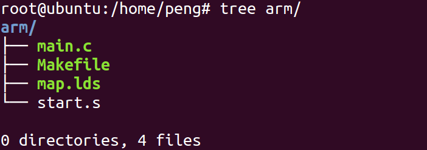

**一、MDK和GNU伪指令区别**

我们在学习汇编代码的时候经过会看到以下两种风格的代码：

gnu代码开头是：

```assembly
.global _start
_start:      @汇编入口
 ldr sp,=0x41000000
.end         @汇编程序结束
```

MDK代码开头是：

```assembly
 AREA Example,CODE,READONLY    ;声明代码段Example
 ENTRY ;程序入口
Start             
 MOV R0,#0     
OVER
 END
```

这两种风格的代码是要使用不同的编译器，我们之前的实例代码都是MDK风格的。

那么多对于我们初学者来说要学习哪种风格呢？答案是肯定的，学习GNU风格的汇编代码，因为做Linux驱动开发必须掌握的linux内核、uboot，而这两个软件就是GNU风格的。

为了大家不要把过多精力浪费在暂时没用的知识上，下面我们只讲GNU风格汇编。

# 二、GNU汇编书写格式：

## 1. 代码行中的注释符号:

‘@’ 整行注释符号: ‘#’ 语句分离符号:
直接操作数前缀: ‘#’ 或 ‘$’

## 2. 全局标号：

标号只能由a～z，A～Z，0～9，“.”，_等（由点、字母、数字、下划线等组成，除局部标号外，不能以数字开头）字符组成，标号的后面加“：”。

```shell
段内标号的地址值在汇编时确定；
段外标号的地址值在连接时确定。
```

## 3. 局部标号:

局部标号主要在局部范围内使用而且局部标号可以重复出现。它由两部组成开头是一个0-99直接的数字局部标号 后面加“:”

```shell
F：指示编译器只向前搜索，代码行数增加的方向 / 代码的下一句
B：指示编译器只向后搜索，代码行数减小的方向
```

注意局部标号的跳转，就近原则**「举例：」**

```shell
文件位置
arch/arm/kernel/entry-armv.S
```


# 三、伪操作：

## 1. 符号定义伪指令

| 标号    | 含义                                                         |
| :------ | :----------------------------------------------------------- |
| .global | 使得符号对连接器可见，变为对整个工程可用的全局变量           |
| _start  | 汇编程序的缺省入口是_ start标号,用户也可以在连接脚本文件中用ENTRY标志指明其它入口点. |
| .local  | 表示符号对外部不可见，只对本文件可见                         |

## 2. 数据定义（Data Definition）伪操作

数据定义伪操作一般用于为特定的数据分配存储单元，同时可完成已分配存储单元的初始化。常见的数据定义伪操作有如下几种：

| 标号                  | 含义                                                         |
| :-------------------- | :----------------------------------------------------------- |
| .byte                 | 单字节定义        0x12,‘a’,23   【必须偶数个】               |
| .short                | 定义2字节数据     0x1234,65535                               |
| .long /.word          | 定义4字节数据      0x12345678                                |
| .quad                 | 定义8字节    .quad   0x1234567812345678                      |
| .float                | 定义浮点数    .float   0f3.2                                 |
| .string/.asciz/.ascii | 定义字符串    .ascii  “abcd\0”,   注意：.ascii  伪操作定义的字符串需要每行添加结尾字符 '\0'，其他不需要 |
| .space/.skip          | 用于分配一块连续的存储区域并初始化为指定的值，如果后面的填充值省略不写则在后面填充为0; |
| .rept                 | 重复执行接下来的指令，以.rept开始，以.endr结束               |

【举例】

.word

```assembly
val:   .word  0x11223344
mov r1,#val  ;将值0x11223344设置到寄存器r1中
```

.space

```assembly
   label: .space size,expr     ;expr可以是4字节以内的浮点数 
   a:  space 8, 0x1
```

.rept

```assembly
 .rept cnt   ;cnt是重复次数
 .endr
```

注意：

1. 变量的定义放在，stop后，.end前
2. 标号是地址的助记符，标号不占存储空间。位置在end前就可以，相对随意。

## 3. if选择

语法结构

```assembly
.if  logical-expressing 
  ……                                   
.else
  ……
.endif    
```

类似c语言里的条件编译 。

【举例】

```assembly
.if  val2==1
 mov r1,#val2
.endif
```

## 4. macro宏定义

.macro，.endm 宏定义类似c语言里的宏函数 。

macro伪操作可以将一段代码定义为一个整体，称为宏指令。然后就可以在程序中通过宏指令多次调用该段代码。

语法格式：

```assembly
   .macro    {$label} 名字{$parameter{,$parameter}…}
    ……..code
   .endm
```

其中，$标号在宏指令被展开时，标号会被替换为用户定义的符号。

宏操作可以使用一个或多个参数，当宏操作被展开时，这些参数被相应的值替换。

**「注意」**：先定义后使用

举例：

**「【例1】：没有参数的宏实现子函数返回」**

```assembly
 .macro MOV_PC_LR
    MOV PC,LR
 .endm
```
调用方式如下：
```assembly
    MOV_PC_LR
```

**「【例2】：带参数宏实现子函数返回」**

```assembly
 .macro MOV_PC_LR ,param
    mov r1,\param
    MOV PC,LR
 .endm
```

调用方法如下:

```assembly
MOV_PC_LR  #12
```

# 四、杂项伪操作

| 标号     | 含义                                                         |
| :------- | :----------------------------------------------------------- |
| .global/ | 用来声明一个全局的符号                                       |
| .arm     | 定义一下代码使用ARM指令集编译                                |
| .thumb   | 定义一下代码使用Thumb指令集编译                              |
| .section | .section   expr   定义一个段。expr可以使.text  .data.  .bss  |
| .text    | .text {subsection}   将定义符开始的代码编译到代码段          |
| .data    | .data {subsection}   将定义符开始的代码编译到数据段,初始化数据段 |
| .bss     | .bss {subsection}   将变量存放到.bss段,未初始化数据段        |
| .align   | .align{alignment}{,fill}{,max}  通过用零或指定的数据进行填充来使当前位置与指定边界对齐 |
|          | .align  4   --- 16字节对齐 2的4次方                          |
|          | .align  (4)  --- 4字节对齐                                   |
| .org     | .org offset{,expr}   指定从当前地址加上offset开始存放代码，并且从当前地址到当前地址加上offset之间的内存单元，用零或指定的数据进行填充 |
| .extern  | 用于声明一个外部符号，用于兼容性其他汇编                     |
| .code 32 | 同.arm                                                       |
| .code 16 | 同.thumb                                                     |
| .weak    | 用于声明一个弱符号，如果这个符号没有定义，编译就忽略，而不会报错 |
| .end     | 文件结束                                                     |
| .include | .include “filename” 包含指定的头文件, 可以把一个汇编常量定义放在头文件中 |
| .equ     | 格式：.equ   symbol,   expression把某一个符号(symbol)定义成某一个值(expression).该指令并不分配空间，类似于c语言的 #define |
| .set     | 给一个全局变量或局部变量赋值，和.equ的功能一样               |

举例：.set

```assembly
.set start, 0x40
mov r1, #start      ;r1里面是0x40
```

举例 .equ

```assembly
.equ   start,  0x40                                      
mov r1, #start      ;r1里面是0x40     
#define  PI  3.1415
```

等价于

```assembly
.equ   PI, 31415
```

# 五、GNU伪指令

关键点：伪指令在编译时会转化为对应的ARM指令

1. ADR伪指令 ：该指令把标签所在的地址加载到寄存器中。ADR伪指令为小范围地址读取伪指令，使用的相对偏移范围：当地址值是字节对齐 (8位) 时，取值范围为-255～255，当地址值是字对齐 (32位) 时，取值范围为-1020～1020。语法格式:

```assembly
   ADR{cond}   register,label
 ADR      R0,  lable
```

2. ADRL伪指令：将中等范围地址读取到寄存器中

ADRL伪指令为中等范围地址读取伪指令。使用相对偏移范围：当地址值是字节对齐时，取值范围为-64～64KB；当地址值是字对齐时，取值范围为-256～256KB

语法格式：

```assembly
ADRL{cond}   register,label
ADRL        R0，lable
```

3. LDR伪指令: LDR伪指令装载一个32位的常数和一个地址到寄存器。语法格式：

```assembly
LDR{cond}  register,=[expr|label-expr]
LDR    R0，=0XFFFF0000      ；mov r1,#0x12   对比一下
```

注意：（1）ldr伪指令和ldr指令区分 下面是ldr伪指令：

```assembly
ldr r1,=val  @ r1 = val   是伪指令，将val标号地址赋给r1    
【与MDK不一样，MDK只支持ldr r1,=val】
```

下面是ldr指令：

```assembly
ldr r2,val   @ r1 = *val    是arm指令,将标号val地址里的内容给r2
val: .word 0x11223344
```

（2）如何利用ldr伪指令实现长跳转

```assembly
  ldr  pc，=32位地址
```

（3）编码中解决非立即数的问题 用arm伪指令ldr

```assembly
ldr r0,=0x999   ；0x999  不是立即数，
```

# 六、GNU汇编的编译

## 1. 不含lds文件的编译

假设我们有以下代码，包括1个main.c文件，1个start.s文件：start.s

```assembly
.global _start
_start:      @汇编入口
 ldr sp,=0x41000000
 b main
.global mystrcopy
.text
mystrcopy: //参数dest->r0,src->r2
  LDRB r2, [r1], #1
  STRB r2, [r0], #1
  CMP r2, #0 //判断是不是字符串尾
  BNE mystrcopy
  MOV pc, lr
stop:
 b stop   @死循环，防止跑飞 等价于while(1)
.end         @汇编程序结束
```

main.c

```c
extern void mystrcopy(char *d,const char *s);
int main(void)
{
 const char *src ="yikoulinux";
 char dest[20]={};
 mystrcopy(dest,src);//调用汇编实现的mystrcopy函数
 while(1);
    return 0;
}
```

Makefile编写方法如下：

```makefile
TARGET=start   
TARGETC=main
all:
  arm-none-linux-gnueabi-gcc -O0 -g -c -o $(TARGETC).o  $(TARGETC).c
   arm-none-linux-gnueabi-gcc -O0 -g -c -o $(TARGET).o $(TARGET).s
   #arm-none-linux-gnueabi-gcc -O0 -g -S -o $(TARGETC).s  $(TARGETC).c  
   arm-none-linux-gnueabi-ld $(TARGETC).o $(TARGET).o -Ttext 0x40008000 -o $(TARGET).elf
   arm-none-linux-gnueabi-objcopy   -O binary -S  $(TARGET).elf  $(TARGET).bin
clean:
  rm -rf *.o *.elf *.dis *.bin
```

Makefile含义如下：

1. 定义环境变量TARGET=start，start为汇编文件的文件名
2. 定义环境变量TARGETC=main，main为c语言文件
3. 目标：all，4~8行是该指令的指令语句
4. 将main.c编译生成main.o,$(TARGETC)会被替换成main
5. 将start.s编译生成start.o,$(TARGET)会被替换成start
6. 4-5也可以用该行1条指令实现
7. 通过ld命令将main.o、start.o链接生成start.elf,-Ttext 0x40008000表示设置代码段起始地址为0x40008000
8. 通过objcopy将start.elf转换成start.bin文件，-O binary (或--out-target=binary) 输出为原始的二进制文件,-S (或 --strip-all)输出文件中不要重定位信息和符号信息，缩小了文件尺寸，
9. clean目标
10. clean目标的执行语句，删除编译产生的临时文件

【补充】

1. gcc的代码优化级别，在 makefile 文件中的编译命令 4级  O0 -- O3  数字越大，优化程度越高。O3最大优化
2. volatile作用 volatile修饰的变量，编译器不再进行优化，每次都真正访问内存地址空间。

## 2. 依赖lds文件编译

实际的工程文件，段复杂程度远比我们这个要复杂的多，尤其Linux内核有几万个文件，段的分布及其复杂，所以这就需要我们借助lds文件来定义内存的分布。



main.c和start.s和上一节一致。

map.lds

```makefile
OUTPUT_FORMAT("elf32-littlearm", "elf32-littlearm", "elf32-littlearm")
/*OUTPUT_FORMAT("elf32-arm", "elf32-arm", "elf32-arm")*/
OUTPUT_ARCH(arm)
ENTRY(_start)
SECTIONS
{
 . = 0x40008000;
 . = ALIGN(4);
 .text      :
 {
  .start.o(.text)
  *(.text)
 }
 . = ALIGN(4);
    .rodata : 
 { *(.rodata) }
    . = ALIGN(4);
    .data : 
 { *(.data) }
    . = ALIGN(4);
    .bss :
     { *(.bss) }
}
```

解释一下上述的例子:

1. OUTPUT_FORMAT("elf32-littlearm", "elf32-littlearm", "elf32-littlearm") 指定输出object档案预设的binary 文件格式。可以使用objdump -i列出支持的binary 文件格式；
2. OUTPUT_ARCH(arm) 指定输出的平台为arm，可以透过objdump -i查询支持平台；
3. ENTRY(_start) ：将符号_start的值设置成入口地址；
4. . = 0x40008000: 把定位器符号置为0x40008000(若不指定, 则该符号的初始值为0)；
5. .text : { .start.o(.text) *(.text) } :前者表示将start.o放到text段的第一个位置，后者表示将所有(*符号代表任意输入文件)输入文件的.text section合并成一个.text section；
6. .rodata : { *(.data) } : 将所有输入文件的.rodata section合并成一个.rodata section；
7. .data : { *(.data) } : 将所有输入文件的.data section合并成一个.data section；
8. .bss : { *(.bss) } : 将所有输入文件的.bss section合并成一个.bss section；该段通常存放全局未初始化变量
9. . = ALIGN(4);表示下面的段4字节对齐

连接器每读完一个section描述后, 将定位器符号的值**增加**该section的大小。

来看下，Makefile应该如何写：

```makefile
# CORTEX-A9 PERI DRIVER CODE
# VERSION 1.0
# ATHUOR 一口Linux
# MODIFY DATE
# 2020.11.17  Makefile
#=================================================#
CROSS_COMPILE = arm-none-linux-gnueabi-
NAME =start
CFLAGS=-mfloat-abi=softfp -mfpu=vfpv3 -mabi=apcs-gnu -fno-builtin  -fno-builtin-function -g -O0 -c                                   
LD = $(CROSS_COMPILE)ld
CC = $(CROSS_COMPILE)gcc
OBJCOPY = $(CROSS_COMPILE)objcopy
OBJDUMP = $(CROSS_COMPILE)objdump
OBJS=start.o  main.o
#================================================#
all:  $(OBJS)
 $(LD)  $(OBJS) -T map.lds -o $(NAME).elf
 $(OBJCOPY)  -O binary  $(NAME).elf $(NAME).bin 
 $(OBJDUMP) -D $(NAME).elf > $(NAME).dis 
%.o: %.S 
 $(CC) $(CFLAGS) -c -o  $@ $<
%.o: %.s 
 $(CC) $(CFLAGS) -c -o  $@ $<
%.o: %.c
 $(CC) $(CFLAGS) -c -o  $@ $<
clean:
 rm -rf $(OBJS) *.elf *.bin *.dis *.o
```

编译结果如下：


最终生成start.bin,改文件可以烧录到开发板测试，因为本例没有直观现象，后续文章我们加入其它功能再测试。

【注意】

1. 其中交叉编译工具链**「arm-none-linux-gnueabi-」** 要根据自己实际的平台来选择，本例是基于三星的exynos-4412工具链实现的。

2. 地址0x40008000也不是随便选择的，


读者可以根据自己手里的开发板对应的soc手册查找该地址。

### linux内核的异常向量表

linux内核的内存分布也是依赖lds文件定义的，linux内核的编译我们暂不讨论，编译好之后会再以下位置生成对应的lds文件:

```
arch/arm/kernel/vmlinux.lds
```

我们看下该文件的部分内容：


1. OUTPUT_ARCH(arm)制定对应的处理器；
2. ENTRY(stext)表示程序的入口是stext。

同时我们也可以看到linux内存的划分更加的复杂，后续我们讨论linux内核，再继续分析该文件。

## 3. elf文件和bin文件区别：

### 1） ELF

ELF文件格式是一个开放标准，各种UNIX系统的可执行文件都采用ELF格式，它有三种不同的类型：

- 可重定位的目标文件（Relocatable，或者Object File）
- 可执行文件（Executable）
- 共享库（Shared Object，或者Shared Library）

ELF格式提供了两种不同的视角，链接器把ELF文件看成是Section的集合，而加载器把ELF文件看成是Segment的集合。

### 2） bin

BIN文件是直接的二进制文件，内部没有地址标记。bin文件内部数据按照代码段或者数据段的物理空间地址来排列。一般用编程器烧写时从00开始，而如果下载运行，则下载到编译时的地址即可。

在Linux OS上，为了运行可执行文件，他们是遵循ELF格式的，通常gcc -o test test.c，生成的test文件就是ELF格式的，这样就可以运行了，执行elf文件，则内核会使用加载器来解析elf文件并执行。

在Embedded中，如果上电开始运行，没有OS系统，如果将ELF格式的文件烧写进去，包含一些ELF文件的符号表字符表之类的section，运行碰到这些，就会导致失败，如果用objcopy生成纯粹的二进制文件，去除掉符号表之类的section，只将代码段数据段保留下来，程序就可以一步一步运行。

elf文件里面包含了符号表等。BIN文件是将elf文件中的代码段，数据段，还有一些自定义的段抽取出来做成的一个内存的镜像。

并且elf文件中代码段数据段的位置并不是它实际的物理位置。他实际物理位置是在表中标记出来的。