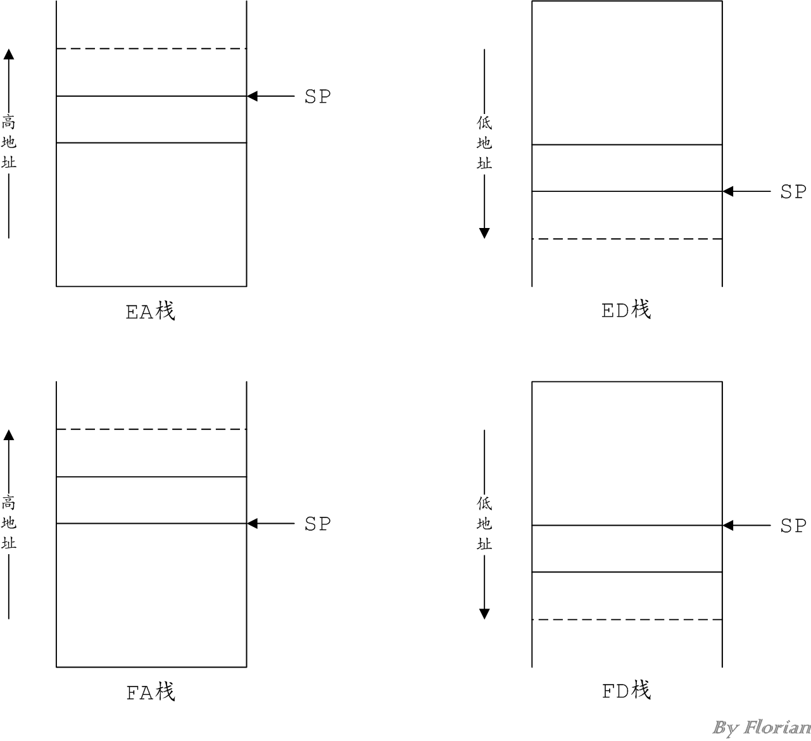

# [ARM的栈指令](https://www.cnblogs.com/fanzhidongyzby/p/5250116.html)

ARM的指令系统中关于栈指令的内容比较容易引起迷惑，这是因为准确描述一个栈的特点需要两个参数：

> - **栈地址的增长方向**：ARM将向高地址增长的栈称为**递增栈**（Descendent Stack），将向低地址增长的栈称为**递减栈**（Acendant Stack）
> - **栈指针的指向位置**：ARM将栈指针指向栈顶元素位置的栈称为**满栈**（Full Stack），讲栈指针指向即将入栈的元素位置的栈称为**空栈**（Empty Stack）

## 1. 栈类型

根据栈地址增长方向雨栈指针指向位置的不同，自然可以将栈分为四类：

|      | 递增栈 | 递减栈 |
| :--: | :----: | :----: |
| 空栈 |  EA栈  |  ED栈  |
| 满栈 |  FA栈  |  FD栈  |

图1描述了四种不同类型的栈，其中虚线部分表示即将入栈的元素。


图1 栈类型

## 2. 栈指令

栈的操作指令无非两种：入栈和出栈，由于ARM描述了四种不同类型的栈，因此对应的栈指令一共有8条。

|      | 入栈  | 出栈  |
| :--: | :---: | :---: |
| EA栈 | STMEA | LDMEA |
| ED栈 | STMED | LDMED |
| FA栈 | STMFA | LDMFA |
| FD栈 | STMFD | LDMFD |

这些指令具有相似的前缀：

> - **STM**：（STore Multiple data）表示存储数据，即**入栈**。
> - **LDM**：（LoaD Multiple data）表示加载数据，即**出栈**。

一般情况下，可以将栈操作指令分解为两步微指令：数据存取和栈指针移动。这两步操作的先后顺序和栈指针的移动方式由栈的类型决定。

|       | 第一步 | 第二步 | 等价指令 |
| :---: | :----: | :----: | :------: |
| STMEA | 写[SP] | SP增加 |  STMIA   |
| LDMEA | SP减少 | 读[SP] |  LDMDB   |
| STMED | 写[SP] | SP减少 |  STMDA   |
| LDMED | SP增加 | 读[SP] |  LDMIB   |
| STMFA | SP增加 | 写[SP] |  STMIB   |
| LDMFA | 读[SP] | SP减少 |  LDMDA   |
| STMFD | SP减少 | 写[SP] |  STMDB   |
| LDMFD | 读[SP] | SP增加 |  LDMIA   |

ARM中存在一组缓冲区操作指令和栈指令是一一对应的，他们完成相同的功能。这些指令含义的区别来源于对存取操作的缓冲区指针地址增长方向，以及存取操作和缓冲区指针移动的先后顺序决定的。这个和前面描述的栈类型的分类原则十分相似。

|                          | 指针递增（Increase） | 指针递减（Decrease） |
| :----------------------: | :------------------: | :------------------: |
| 存取前移动指针（Before） |          IB          |          DB          |
| 存取后移动指针（After）  |          IA          |          DA          |

## 3. 使用举例

虽然ARM的栈类型和相关的操作指令比较繁琐，但是实际上最常用的还是和x86指令集相同的栈类型：栈向低地址方向增长，且栈指针指向栈顶元素的位置，即ARM的FD栈。因此最常见的ARM栈指令操作是STMFD和LDMFD。

|      | x86  |     ARM     |
| :--: | :--: | :---------: |
| 入栈 | PUSH | STMFD/STMDB |
| 出栈 | POP  | LDMFD/LDMIA |

例如入栈指令：

```assembly
STMFD SP,{R0-R3}
```

实际的微指令操作为：

```assembly
[SP-4]	<=	R3
[SP-8]	<=	R2
[SP-12]	<=	R1
[SP-16]	<=	R0
```

在ARM的指令系统中，**递减栈入栈操作的参数入栈顺序是从右到左依次入栈**，而参数的出栈顺序则是从左到右的逆操作。对于递增栈，相应的操作则全部取反。
例如出栈指令：

```assembly
LDMFD SP,{R4-R7}
```

实际的微指令操作为：

```assembly
[SP]    =>	R4
[SP+4]	=>	R5
[SP+8]	=>	R6
[SP+12]	=>	R7
```

上述的入栈和出栈指令其实仅仅对栈做了存取操作，**并未真正改变SP指针的值**。正常情况下，我们希望对栈操作后能自动修改栈指针SP的值，使用如下指令可以达到该目的。

```assembly
STMFD SP!,{R0-R3}
```

对应的微指令操作为：

```x86asm
[SP-4]	<=	R3
[SP-8]	<=	R2
[SP-12]	<=	R1
[SP-16]	<=	R0
SP      ＝  SP - 16
```

同样的：

```assembly
LDMFD SP!,{R4-R7}
```

对应的微指令操作为：

```assembly
[SP]    =>	R4
[SP+4]	=>	R5
[SP+8]	=>	R6
[SP+12]	=>	R7
SP      ＝  SP + 16
```

希望通过本文对你理解ARM的栈指令有所帮助。