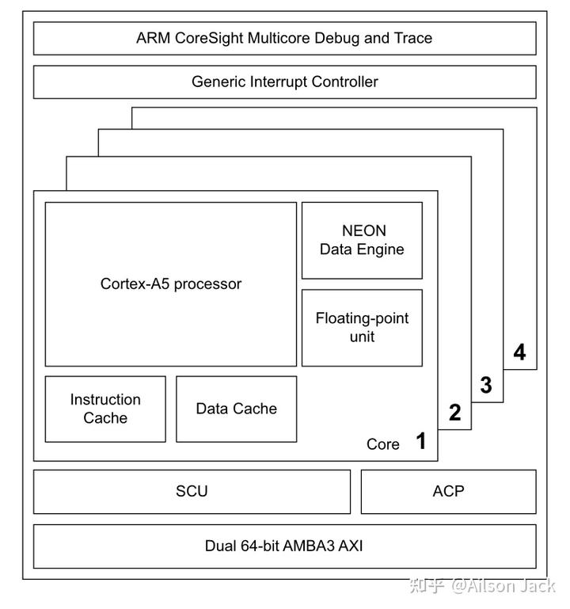

作者:Ailson Jack
链接:https://zhuanlan.zhihu.com/p/661397075
来源:知乎
著作权归作者所有.商业转载请联系作者获得授权,非商业转载请注明出处.

## **ARM公司与芯片** 

ARM公司是一家知识产权(IP)供应商,它与一般的半导体公司最大的不同就是它不制造芯片并且不向终端用户出售芯片,而是通过转让设计方案,由合作伙伴生产出各具特色的芯片.ARM公司利用这种双赢的伙伴关系迅速成为了全球性RISC微处理器标准的缔造者.这种模式也给用户带来了巨大的好处,因为用户只需要掌握一种ARM内核结构及其开发手段,就能够使用多家公司相同ARM内核的芯片.

ARM处理器在性能,成本与功耗之间的平衡,是ARM处理器的亮点.在智能家居,物联网,平板电脑,多媒体数字,汽车电子,医疗电子等领域ARM处理器具有统治地位.

## **指令集,架构与处理器** 

ARM体系结构是一种硬件规范,主要用来约定指令集,芯片内部体系结构(如MMU,Cache)等.

指令集是处理器使用的指令编码方式,ARM指令集的命名方式为`ARMv+version`,目前是ARMv1～ARMv9,数字越大表示指令集越先进.

下面列举一些指令集应用到具体处理器的例子.

ARMv4和ARMv4T指令集主要在ARM7TDMI,ARM920T和StrongARM这些处理器中使用.

ARMv5指令集主要在ARM926EJ-S,ARM946E-S和XScale这些处理器中使用.

ARMv6指令集主要在ARM1136J-S,ARM1176JZ-S和ARM1156T2-S这些处理器中使用.

ARMv6-M指令集主要在Cortex-M0和Cortex-M1这些处理器中使用.

ARMv7-A指令集主要在Cortex-A5,Cortex-A7,Cortex-A8,Cortex-A9,Cortex-A12和Cortex-A15这些处理器中使用.

ARMv7-R指令集主要在Cortex-R4,Cortex-R5和Cortex-R7这些处理器中使用.

ARMv7-M指令集主要在Cortex-M3和Cortex-M4这些处理器中使用.

架构主要是指某一个处理器所使用的具体指令集.在大部分场合,架构等于指令集.比如说i.MX 6ULL处理器是基于ARMv7-A架构的,也就是说i.MX 6ULL处理器使用的是ARMv7-A指令集.

## **基于ARMv7-A的处理器内部结构** 

ARMv7-A采用的是32位结构,因此其核心寄存器也是32位宽.

基于ARMv7-A实现的处理器内部结构描述如下:

处理器核心:有单核和多核之分,对称多核应用比较广泛,通常每个核心会包含L1 I-Cache,L1 D-Cache,可选的浮点单元,可选的NEON,MMU等.

中断控制器:GIC.

系统总线:处理器核心通过系统总线与外设控制器进行数据交互.

时钟系统;

电源管理系统;

复位系统;

调试系统.

基于ARMv7-A指令集实现的Cortex-A5处理器的结构示意图如下所示:

ARMv7-A的概述就先介绍这些吧,请关注ARMv7-A后续的内容.

如果这篇文章对你有帮助,记得点赞和关注博主就行了.

欢迎关注博主,阅读博主其他的博文.