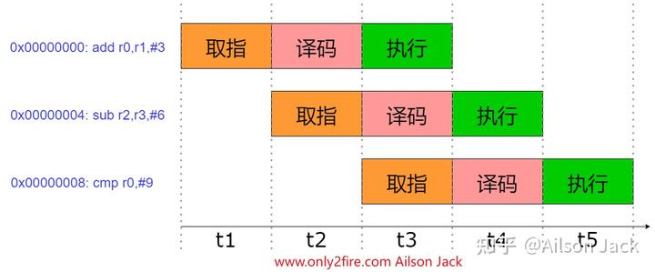

作者:Ailson Jack
链接:https://zhuanlan.zhihu.com/p/661454933
来源:知乎
著作权归作者所有.商业转载请联系作者获得授权,非商业转载请注明出处.

世界上有很多种体系结构的处理器,比较知名的处理器体系结构有:ARM,x86,RISC-V,mips,LoongArch,PowerPC等.不论是哪一种架构的处理器,其处理器核心都会自带一定数量的寄存器,这些寄存器在处理器核心的运行过程中发挥着基础而又重要的作用.

ARM体系结构是一种基于指令加载和存储的体系结构.在这种体系结构下,所有的数据处理都需要在通用寄存器中完成,而不能直接在内存中完成.因此,这种体系结构的处理器核心处理数据的过程为:首先把待处理数据从内存加载到通用寄存器,然后进行处理,最后把结果写入内存中.

## **通用寄存器** 

ARM架构提供了16个32位通用寄存器(R0-R15)用于软件使用.其中R0-R12是普通寄存器,R13,R14和R15在程序的运行过程中通常用作固定的用途.

R13:又叫堆栈指针寄存器(Stack pointer)SP,SP通常用于保存堆栈地址,在使用入栈和出栈指令时,SP中的堆栈地址会自动的更新.堆栈主要用于保存局部变量,保存函数间调用的关键寄存器.对于根本不需要进行堆栈操作的程序,SP可以当做普通寄存器来存储数据.

R14:又叫链接寄存器(Link register)LR,LR主要用于存放函数的返回地址,即当函数返回时,知道自己该回到哪儿去继续运行.通常链接寄存器是和BL/BLX/CALL指令搭配使用,这几个指令被调用后,默认会自动将当前调用指令的下一条指令地址保存到LR寄存器当中.

R15:又叫程序计数器(Program Counter)PC,PC主要用于存放CPU取指的地址.ARMv7架构同时支持ARM指令集和Thumb指令集.在ARM指令集中,当CPU正在执行A指令时,PC的值为当前指令A地址+8;在Thumb指令集中,由于Thumb指令集为16位,当CPU正在执行A指令时,PC的值为当前指令A地址+4.但是当手动向PC赋值时,CPU就会跳转到赋值所代表的地址处去运行.**记住PC存放的是取指地址,不是当前CPU运行地址.**

备注:在ARM状态下,PC指向的地址bit[1:0]总是为0,因此PC指向的地址都是4字节对齐.ARMv7架构的处理器支持混合编码即同时支持ARM指令集和Thumb指令集,因此为了区分Thumb指令集和ARM指令集,ARM将PC指向地址的bit[0]位作为标志位.如果PC指向的地址bit[0]位为1,表示当前是Thumb指令集;如果PC指向的地址bit[0]位为0,表示当前是ARM指令集.

## **三级流水线** 

为了增加处理器指令流的速度,ARM使用了多级流水线技术.多级流水线技术是一种将指令的执行分解成多个步骤,并让不同指令的各步骤重叠的一种准并行处理实现技术.经典的三级流水线结构将指令的执行分成取指,译码和执行这三个阶段.

可以将指令的执行过程看成工厂加工产品的过程,当没有采用流水线时只有一个工人A,工人A先对指令取指,然后对指令译码,最后执行指令,然后再次对指令取指周而复始.工人A在同一个时间只能干一件事,指令的执行也就只有等工人A对指令完成取指和译码之后才能进行.工厂老板一看,这产品的生产效率太低,就又请了工人B和工人C,现在工人A只负责取指,工人B只负责译码,工人C只负责执行,这样三条流水线同时工作,每时每刻都有指令在被取指,译码和执行,产品的生产效率大大的提高了.三级流水线示意图如下图所示:

上图是ARM指令集的三级流水线结构,每条指令的地址间隔为4字节,当CPU在t3时间段开始执行`add r0,r1,#3`指令时,PC的值为0x00000008,即PC此时指向`cmp r0,#9`指令处.**记住PC存放的是取指地址,不是当前CPU运行地址.**结合上图对于Thumb指令集的PC值分析也是比较简单的.

采用多级流水线技术后,并没有加速单条指令的执行,每条指令的步骤并没有减少,只是多条指令的不同操作步骤同时执行,因而从总体上看加快了指令流速度,缩短了程序执行时间.

如果这篇文章对你有帮助,记得点赞和关注博主就行了.

欢迎关注博主,阅读博主其他的博文.