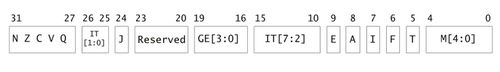
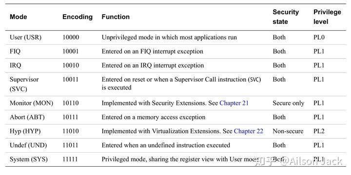
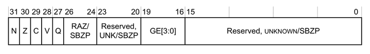

作者：Ailson Jack
链接：https://zhuanlan.zhihu.com/p/662100232
来源：知乎
著作权归作者所有。商业转载请联系作者获得授权，非商业转载请注明出处。


程序状态寄存器的作用就是反映处理器的状态信息。在程序运行期间我们可以通过查看程序状态寄存器的状态位来进行程序的分支跳转处理，或者我们可以设置程序状态寄存器的模式位来改变处理器的运行模式，或者我们可以设置程序状态寄存器的中断屏蔽位来屏蔽中断。

在任何时刻，我们可以访问处理器的16个寄存器（R0~R15）和当前程序状态寄存器（Current Program Status Register，CPSR）。用户模式下的程序访问的程序状态寄存器叫做APSR（Application Program Status Register），APSR是CPSR在用户模式下的别名，因为在用户模式下CPSR的部分域是不能操作的，因此CPSR的部分域被屏蔽后就是APSR。

## **CPSR寄存器组成** 

在所有模式下均可以访问到CPSR，只是在用户模式下CPSR的部分域是不能操作的，当前程序状态寄存器（CPSR）的位组成如下图所示：



各个位域的说明如下：

| 位    | 标志    | 说明                                                         |
| ----- | ------- | ------------------------------------------------------------ |
| 31    | N       | 当运算结果为负且运算指令要求更新寄存器时，该位会被置位。     |
| 30    | Z       | 当运算结果为0且运算指令要求更新寄存器时，该位会被置位。      |
| 29    | C       | 当运算结果产生进位且指令要求更新寄存器时，该位会被置位。     |
| 28    | V       | 当运算结果产生符号位溢出且指令要求更新寄存器时，该位会被置位。 |
| 27    | Q       | cumulative saturation。                                      |
| 26:25 | IT[1:0] | IT位，由IT[7:2]和IT[1:0]组成，Thumb指令集中IT指令的If-Then执行状态。 |
| 24    | J       | 指示ARM是否处于Jazelle状态。                                 |
| 19:16 | GE[3:0] | 被一些SIMD（Single Instruction Multiple Data）指令使用。     |
| 15:10 | IT[7:2] | 见IT[1:0]的描述。                                            |
| 9     | E       | 指示处理器的大小端模式，同时可以通过设置该位来修改处理器的大小端模式，1表示大端模式，0表示小端模式。 |
| 8     | A       | 是否屏蔽异步终止，该位为1时表示屏蔽异步终止，为0时表示打开异步终止。 |
| 7     | I       | 是否屏蔽IRQ，该位为1时表示屏蔽IRQ，为0时表示打开IRQ。        |
| 6     | F       | 是否屏蔽FIQ，该位为1时表示屏蔽FIQ，为0时表示打开FIQ。        |
| 5     | T       | 指示ARM是否处于Thumb状态。J和T标志共同决定处理器使用的指令集。J=0，T=0：ARM指令集；J=0，T=1：Thumb指令集；J=1，T=0：Jazelle指令集；J=1，T=1：ThumbEE指令集。 |
| 4:0   | M[4:0]  | 指示处理器的模式，同时可以通过设置该位域来修改处理器的模式。 |

处理器各个模式的编码如下图所示：



## **APSR寄存器组成** 

在用户模式下，用户程序能够操作的CPSR寄存器位域是有限制的，对CPSR寄存器的部分位域屏蔽之后就是APSR了，应用程序状态寄存器（APSR）的位组成如下图所示：



从上图可以看出，APSR只能访问N，Z，C，V，Q和GE[3:0]这些标志位，这些标志位的含义和CPSR中对应标志位的含义一样。

## **SPSR** 

备份程序状态寄存器（Saved Program Status Register，SPSR）主要用于存储前一个执行模式的CPSR。FIQ、IRQ、ABT、SVC和UND模式，都有他们自己模式下专用的SPSR。在处理器发生中断或者异常时，处理器会自动的从一个模式A进入到另一个模式B，模式A的CPSR/APSR将会自动保存到模式B的SPSR中，这样模式B中的处理程序能够通过访问SPSR寄存器得到模式A下CPSR寄存器的信息。

## **程序状态寄存器操作指令** 

### **CPS指令**

可以通过`CPS`（Change Processor State）指令来修改处理器模式。`CPS`指令也可以用来使能或者禁止异常。

`CPS`指令的语法如下所示：

```assembly
CPS #mode
CPSIE iflags{, #mode}
CPSID iflags{, #mode}
```

`mode`是处理器的模式编码，比如在从其他模式下切换到SYS模式，使用下述代码即可：

```assembly
# 切换到SYS模式
CPS #0x1f
```

`IE`使能中断或者终止。

`ID`禁止中断或者终止。

`iflags`由下面的一种或者几种组成：

- `a`：表示异步终止（asynchronous abort）；
- `i`：表示中断（IRQ）；
- `f`：表示快中断（FIQ）；

下述代码是`CPS`指令的一些简单用法：

```assembly
# 使能中断
CPSIE I

# 禁止中断
CPSID I

# 使能异步终止和快中断
CPSIE AF

# 禁止异步终止和快中断
CPSID AF

# 使能中断并切换到SYS模式
CPSIE I, #0x1f
```

### **MRS与MSR指令**

`MRS`和`MSR`指令可用于读写程序状态寄存器CPSR，APSR和SPSR。

在ARM处理器中，只有`MRS`指令可以从程序状态寄存器CPSR，APSR和SPSR中读出数据到通用寄存器中。`MRS`指令操作程序状态寄存器的语法如下：

```assembly
MRS{cond} Rd, psr
```

`cond`为条件码。

`Rd`为目标寄存器，`Rd`不允许为R15。

`psr`为程序状态寄存器CPSR，APSR或者SPSR。

`MRS`指令的示例代码如下所示：

```assembly
# 将CPSR寄存器的值读取到R0中
MRS R0, CPSR

# 将SPSR寄存器的值读取到R1中
MRS R1, SPSR

# 将APSR寄存器的值读取到R2中
MRS R2, APSR
```

`MSR`指令可以用来写程序状态寄存器CPSR，APSR和SPSR的全部或者部分域。`MSR`指令操作程序状态寄存器的语法如下：

```assembly
MSR{cond} psr, #constant
MSR{cond} psr, Rm
MSR{cond} psr_fields, #constant
MSR{cond} psr_fields, Rm
```

`cond`为条件码。

`psr`为程序状态寄存器CPSR或者SPSR。

`constant`是一个8位立即数。ARM文档对于`constant`的介绍如下：

>  constant is an 8-bit pattern rotated by an even number of bits within a 32-bit word. (Not available in Thumb.)

`Rm`是源寄存器。

`fields`由下面的一个或者多个组合而成：

- `c`：xPSR[7:0]，控制位域；
- `x`：xPSR[15:8]，扩展位域；
- `s`：xPSR[23:16]，状态位域；
- `f`：xPSR[31:24]，标志位域；

`MSR`指令的示例代码如下所示：

```assembly
# 切换到SYS模式
MRS R0, CPSR
ORR R0, R0, #0x1f
MSR CPSR, R0

# 切换到SYS模式
MSR CPSR_c, #0xDF
```

**只有在除用户模式外的其他模式下才能够修改状态寄存器**。

如果这篇文章对你有帮助，记得点赞和关注博主就行了。

欢迎关注博主，阅读博主其他的博文。