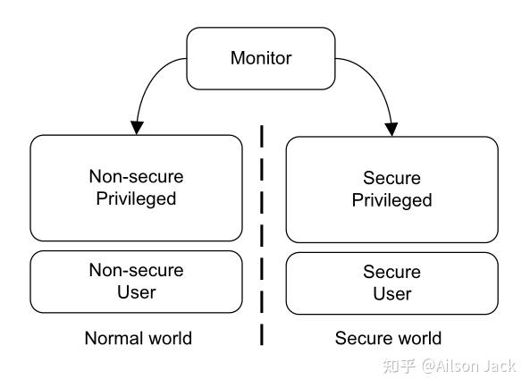
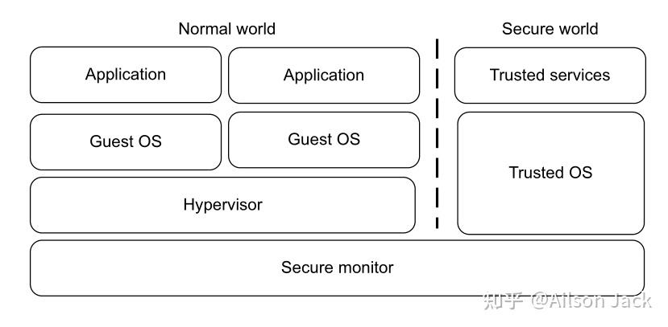
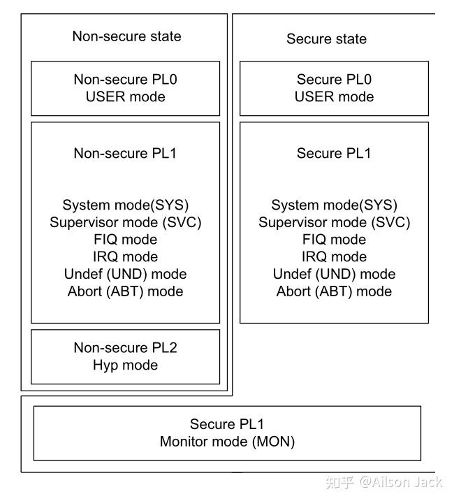
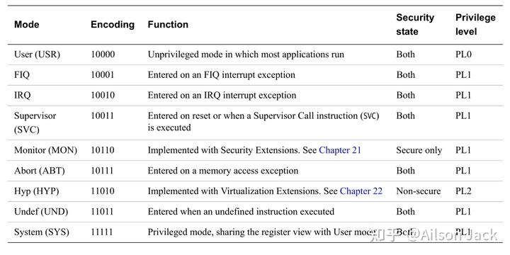
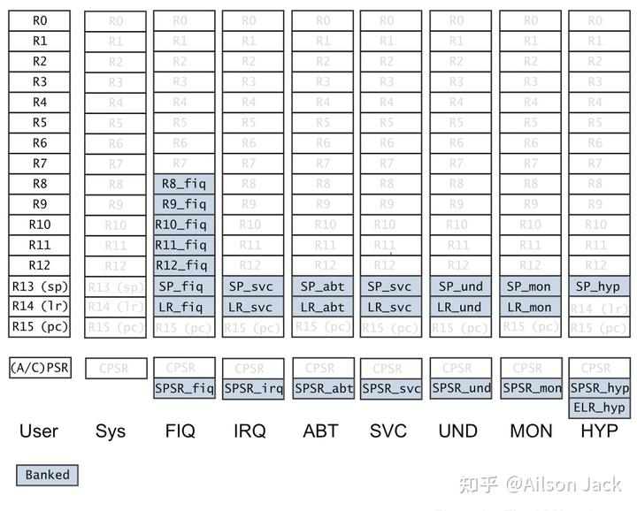

作者：Ailson Jack
链接：https://zhuanlan.zhihu.com/p/662554294
来源：知乎
著作权归作者所有。商业转载请联系作者获得授权，非商业转载请注明出处。


对于现代操作系统，通常情况下用户的应用程序运行在用户态，操作系统内核运行在内核态。用户态的应用对于系统硬件资源的访问是受限的，内核态则能够访问所有的系统硬件资源。操作系统的用户态和内核态是根据处理器的特权等级和运行模式进行硬件隔离的，这也极大的提高了操作系统的安全性。

## **安全扩展和虚拟化扩展** 

ARMv7-A体系结构支持安全扩展和虚拟化扩展。当处理器实现了安全扩展之后，处理器就存在普通世界（Normal world）和安全世界（Secure world）这两个世界，这在硬件层面上就可以将敏感数据和要求在安全环境运行的应用和普通应用完全隔离，如下图所示：



当处理器实现了虚拟化扩展之后，处理器就新增了一个hypervisor mode (Hyp)，并且也新增了一个特权级模式PL2。支持虚拟化扩展的处理器示意图如下所示：



虚拟化扩展允许在Normal world运行多个操作系统，Hypervisor只能运行在Normal world。Secure world可以运行Trusted OS和Trusted services。

## **特权等级** 

处理器的模式，特权等级和安全状态的关系如下图所示：



本文仅讨论非安全状态。在非安全状态下，存在3种特权等级（Privilege level）：PL0、PL1和PL2，描述如下：

- PL0：用户模式（User mode）运行的应用程序处于PL0特权等级。运行在用户模式的程序被称为非特权程序。非特权程序对于系统资源的访问是受限的，对应Linux的用户态。
- PL1：除了用户模式和Hyp模式外，其他模式下的程序执行都处于PL1特权等级。PL1模式是指除了用户模式和Hyp模式之外的其他模式。操作系统运行在PL1特权级。
- PL2：如果实现了虚拟化扩展，Hyp模式运行的系统管理程序处于PL2特权等级。系统管理程序将控制并启用多个操作系统在同一个处理器系统上共存和执行。

## **处理器模式** 

ARMv7-A体系结构提供了9种处理器模式，如下图所示：



从上图可以知道ARMv7-A提供的处理器模式有User、FIQ、IRQ、Supervisor（SVC）、Monitor（MON）、Abort（ABT）、Hyp、Undefined（UND）、System（SYS）模式，各个处理器模式的描述如下：

- User：用户模式，用户程序运行在User模式下，拥有受限的系统资源访问权限。
- FIQ：快中断异常处理模式，发生FIQ中断时的处理器模式，相对于中断而言，快中断拥有更高的响应等级和更低的延迟。
- IRQ：中断异常处理模式，发生IRQ中断时的处理器模式。
- Supervisor（SVC）：管理员模式，操作系统内核通常运行在该模式下，在处理器复位或者应用程序调用`svc`指令的时候将会进入到该模式，系统调用就是通过`svc`指令完成的。
- Abort（ABT）：异常终止模式，当发生Data Abort exception或者Prefetch Abort exception异常的时候进入这个模式。
- Undefined（UND）：未定义指令模式，当执行未定义指令时进入这个模式。
- System（SYS）：系统模式，系统模式和用户模式共享寄存器视图，并且目前大多数系统未使用该模式，利用这个特性我们可以在处理器启动时通过设置系统模式的SP寄存器来达到设置用户模式堆栈的目的，要设置用户模式的其他寄存器也可以这样操作。
- Monitor（MON）：监视模式，实现了安全扩展的处理器才有该模式，在该模式下执行Secure和Non-secure处理器状态的切换。
- Hyp：实现了虚拟化扩展的处理器才有该模式。

User模式处于PL0特权等级。

FIQ、IRQ、Supervisor（SVC）、Monitor（MON）、Abort（ABT）、Undefined（UND）、System（SYS）这些模式处于PL1特权等级。

Hyp模式处于PL2特权等级。

本文不讨论支持安全扩展和虚拟化扩展的场景，因此对于Monitor模式和Hyp模式也不做深入探讨。

通常情况下，应用程序运行在User模式（PL0），运行在User模式下的应用程序对硬件没有直接访问权，所有的硬件操作都需要通过系统调用向内核进行申请。操作系统内核运行在管理员模式（PL1），对系统调用、中断、异常等系统事件进行响应、处理并返回，以这种硬件隔离的方式保证了操作系统内核的安全。

以Linux操作系统为例，虽然ARMv7-A体系结构的处理器有9种模式，但是操作系统只工作在SVC和USR模式，SVC处于内核态，USR处于用户态。至于其他的异常模式，Linux只是简单的略过。比如中断模式irq，Linux只有很短的汇编代码在irq模式运行，主要是保存上下文，然后就立马切换到了SVC模式，由内核进行统一处理。

## **寄存器集** 

ARMv7-A体系结构的处理器在不同处理器模式下，对于通用寄存器的使用情况也有所不同，如下图所示：



上图中蓝色背景的寄存器属于bank寄存器，也就是相同的寄存器名对应不同的寄存器实体。从上图可以看出：

- R0~R7，PC在所有模式下是共享的。
- 系统模式和用户模式共享寄存器视图，系统模式没有bank寄存器。
- FIQ 模式下，R8~R12、SP、LR 都是该模式专门的寄存器，FIQ比IRQ响应和处理速度更快，也得益于FIQ模式具有比IRQ模式更多的bank寄存器。
- FIQ、IRQ、ABT、SVC和UND模式，都有他们自己模式下专用的SP和LR，也就是说，在模式切换的时候，不需要针对这两个寄存器进行现场保护和恢复；
- FIQ、IRQ、ABT、SVC和UND模式，都有他们自己模式下专用的SPSR。在处理器发生中断或者异常时，处理器会自动的从一个模式A进入到另一个模式B，模式A的CPSR/APSR将会自动保存到模式B的SPSR中，这样模式B中的处理程序能够通过访问SPSR寄存器得到模式A下CPSR寄存器的信息。

## **处理器模式切换** 

ARMv7-A体系结构的处理器，处理器模式是由状态寄存器CPSR的M域（BIT[4:0]）来控制的。对于用户模式而言，是没有权限操作CPSR寄存器的M域的，只能通过svc指令进入到SVC模式。对于SYS、FIQ、IRQ、ABT、SVC和UND模式而言，可以通过给CPSR寄存器的M域赋值来达到切换处理器模式的目的。各个模式的编码如下图所示：


下述代码简单的演示了处理器模式切换：

```assembly
Reset_Handler:
 cpsid i

 // ...
 // 切换到IRQ模式,并设置IRQ模式的堆栈
 cps #0x12
 ldr sp, =0x9FF00000
 
 // 切换到SYS模式,并设置SYS模式的堆栈
 // 由于SYS模式和USR模式共享寄存器视图,SYS模式一般情况下没有被使用,
 // 因此这里相当于在设置USR模式的堆栈
 cps #0x1f
 ldr sp, =0x9FE00000
 
 // 切换到SVC模式,并设置SVC模式的堆栈
 cps #0x13
 ldr sp, =0x9FD00000
 // ...

 cpsie i
 
 // ...
```

在上述代码中，使用了`cps #mode`指令来完成处理器模式的切换，在切换到相应模式之后，设置了对应模式的堆栈。

在上述代码中，为什么不直接切换到USR模式，再设置USR模式的堆栈，而要借助SYS模式来设置USR模式的堆栈呢？这个问题相信大家在学习了本节内容之后，应该还是比较简单的。

如果这篇文章对你有帮助，记得点赞和关注博主就行了。

欢迎关注博主，阅读博主其他的博文。