作者：Ailson Jack
链接：https://zhuanlan.zhihu.com/p/663981666
来源：知乎
著作权归作者所有。商业转载请联系作者获得授权，非商业转载请注明出处。


## **协处理器概述** 

ARM架构通过支持协处理器来扩展处理器的功能。ARM架构的处理器支持最多16个协处理器，通常称为CP0~CP15。下述的协处理器被ARM用于特殊用途：

- CP15：提供系统控制功能，主要用于配置MMU、TLB和Cache等功能。
- CP14：主要用于控制系统Debug功能。
- CP10、CP11：两个协处理器一起提供了对浮点运算和向量操作的支持，这两个协处理器主要用于控制和配置浮点功能和高级SIMD指令扩展。
- 其他协处理器被ARM保留用于将来使用。

本文主要说说CP15协处理器。

## **CP15协处理器总览** 

CP15是系统控制协处理器，主要用于对ARM处理器核心支持的许多特性功能进行配置。CP15协处理器支持16个32位主寄存器（primary register），命名为c0~c15。c0~c15主寄存器各自又有多个32位的物理寄存器（physical register）。CP15协处理器的大多数寄存器不能在USR模式下访问，只能在除USR模式外的其他模式下访问。下面列出c0~c15中比较常用的寄存器：

| primary register | physical register    | 描述                                                     |
| ---------------- | -------------------- | -------------------------------------------------------- |
| c0               | MIDR                 | 主ID寄存器，用于记录版本信息                             |
| c0               | MPIDR                | 多核处理器情况下，提供一种方法来唯一标识集群中的各个核心 |
| c1               | SCTLR                | 系统控制寄存器                                           |
| c1               | ACTLR                | 辅助控制寄存器                                           |
| c1               | CPACR                | 协处理器访问控制寄存器，控制访问除了CP14和CP15的协处理器 |
| c1               | SCR                  | 安全配置寄存器，被TrustZone使用                          |
| c2、c3           | TTBR0                | 一级转换页表基址寄存器0                                  |
| c2、c3           | TTBR1                | 一级转换页表基址寄存器1                                  |
| c2、c3           | TTBCR                | 页表转换控制寄存器                                       |
| c5、c6           | DFSR                 | 数据异常（Data Fault）状态寄存器                         |
| c5、c6           | IFSR                 | 指令异常（Instruction Fault）状态寄存器                  |
| c5、c6           | DFAR                 | 数据异常（Data Fault）地址寄存器                         |
| c5、c6           | IFAR                 | 指令异常（Instruction Fault）地址寄存器                  |
| c7               | branch predictor     | cache和分支预测管理功能                                  |
| c7               | barrier              | 数据和指令屏障操作                                       |
| c8               | TLB                  | TLB操作                                                  |
| c9               | performance monitors | 性能监视器                                               |
| c12              | VBAR                 | 提供非监视模式处理异常的异常基地址                       |
| c12              | MVBAR                | 提供监视模式处理异常的异常基地址                         |
| c13              | CONTEXTIDR           | 上下文ID寄存器                                           |
| c15              | CBAR                 | 配置基址寄存器，为GIC和本地时钟类型外设提供基地址        |

在CP15协处理器中，c0~c15每个主处理器下面有多个物理寄存器，上述表格只列出了部分常用的物理寄存器。

## **协处理器操作指令** 

ARMv7-A体系结构的处理器提供了`MRC`和`MCR`指令用于对协处理器进行读写操作。`MRC`指令用于将CP15协处理器中的寄存器数据读取到ARM通用寄存器中。`MCR`指令用于将ARM通用寄存器中的数据写入到CP15协处理器的寄存器中。

### **MRC**

`MRC`指令的语法如下所示：

```assembly
MRC{cond} coproc, opc1, Rt, CRn, CRm{, opc2}
```

`cond`为条件码。

`coproc`为协处理器名称，CP0~CP15协处理器分别对应名称p0~p15。

`opc1`为协处理器要执行的操作码，取指范围为0~7。

`Rt`为ARM通用寄存器，用于存储读取到的协处理器寄存器数据。

`CRn`为协处理器寄存器，对于CP15协处理器来说，`CRn`取值范围为c0~c15。

`CRm`为协处理器寄存器，对于CP15协处理器来说，通过`CRm`和`opc2`一起来确定`CRn`对应的具体寄存器。

`opc2`为可选的协处理器执行操作码，取指范围为0~7，当不需要的时候要设置为0。

`MRC`指令使用示例如下：

```assembly
# 读取主ID寄存器 MIDR 的数据到 R0 中.
MRC p15, 0, R0, c0, c0, 0
```

### **MCR**

`MCR`指令的语法如下所示：

```assembly
MCR{cond} coproc, opc1, Rt, CRn, CRm{, opc2}
```

`cond`为条件码。

`coproc`为协处理器名称，CP0\~CP15协处理器分别对应名称p0~p15。

`opc1`为协处理器要执行的操作码，取指范围为0~7。

`Rt`为ARM通用寄存器，用于存储要写入到协处理器寄存器中的数据。

`CRn`为协处理器寄存器，对于CP15协处理器来说，`CRn`取值范围为c0~c15。

`CRm`为协处理器寄存器，对于CP15协处理器来说，通过`CRm`和`opc2`一起来确定`CRn`对应的具体寄存器。

`opc2`为可选的协处理器执行操作码，取指范围为0~7，当不需要的时候要设置为0。

`MCR`指令使用示例如下：

```assembly
# 将 R0 中的配置数据写入到 SCTLR
MCR p15, 0, R0, c1, c0, 0
```

## **CP15协处理器主寄存器组成** 

CP15协处理器有c0~c15总共16个主寄存器，在每个主寄存器下面，又有多个物理寄存器。下图总结了CP15协处理器的寄存器组织形式：

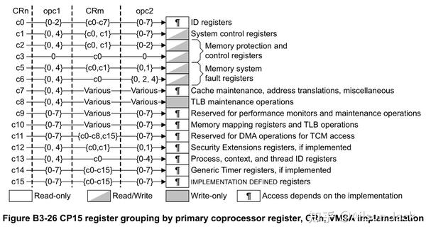

上图对于`MRC`和`MCR`指令所要使用到的一些参数都标明了，对于想要访问CP15协处理器相关寄存器，只需要看图填写好参数就行了。下面具体列一下c0~c15各个主寄存器的组成。

## **CP15协处理器c0寄存器组成** 

主寄存器c0主要提供ID相关的功能，c0寄存器的组成如下图所示：

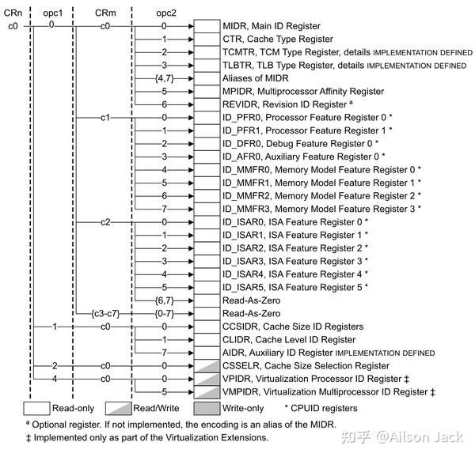

## **CP15协处理器c1寄存器组成** 

主寄存器c1主要提供系统控制相关的功能，c1寄存器的组成如下图所示：

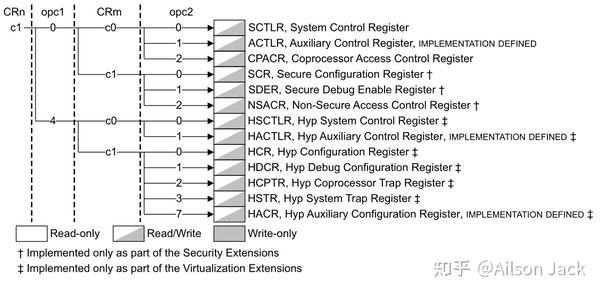

在CP15协处理器的寄存器中，系统控制寄存器SCTLR是被访问的比较多的寄存器。对SCTLR寄存器的访问需要在PL1或者更高的特权等级。SCTLR寄存器的位关系如下图所示：

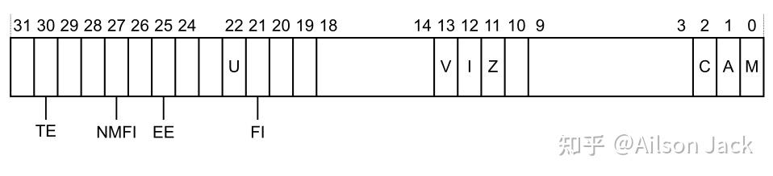

| 位   | 标志 | 说明                                                         |
| ---- | ---- | ------------------------------------------------------------ |
| 30   | TE   | Thumb异常使能，控制在异常发生时（包括reset），将会进入哪种指令集，0：ARM指令集，1：Thumb指令集 |
| 27   | NMFI | 不可屏蔽的FIQ支持，0：软件可以通过写CPSR.F位来屏蔽FIQ，1：软件不可以通过写CPSR.F位来屏蔽FIQ |
| 25   | EE   | 在进入异常处理时的大小端模式配置，0：小端，1：大端           |
| 22   | U    | 表明是否使用对齐模式                                         |
| 21   | FI   | FIQ配置使能                                                  |
| 13   | V    | 选择异常向量表基址，0：0x00000000，1：0xffff0000             |
| 12   | I    | 指令cache使能                                                |
| 11   | Z    | 分支预测使能                                                 |
| 2    | C    | 数据cache使能                                                |
| 1    | A    | 对齐检查使能                                                 |
| 0    | M    | MMU使能                                                      |

## **CP15协处理器c2 c3寄存器组成** 

主寄存器c2和c3主要提供内存保护和内存控制相关的功能，c2和c3寄存器的组成如下图所示：

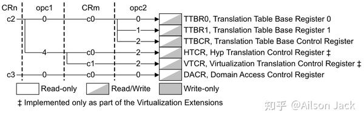

## **CP15协处理器c4寄存器组成** 

在任何基于ARMv7实现的处理器中，协处理器CP15的c4寄存器没有被使用。

## **CP15协处理器c5 c6寄存器组成** 

主寄存器c5和c6主要提供内存系统错误上报功能，c5和c6寄存器的组成如下图所示：

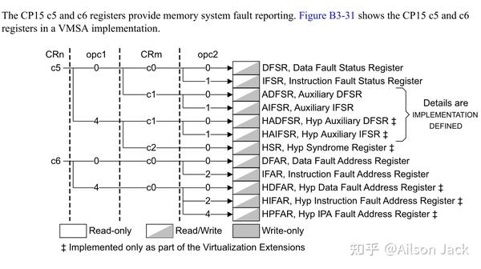

## **CP15协处理器c7寄存器组成** 

主寄存器c7主要提供cache维护，地址转换和内存屏障操作相关的功能，c7寄存器的组成如下图所示：

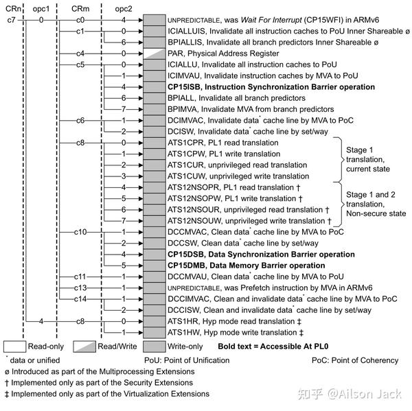

## **CP15协处理器c8寄存器组成** 

主寄存器c8主要提供TLB维护相关的功能，c8寄存器的组成如下图所示：

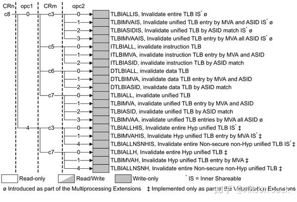

## **CP15协处理器c9寄存器组成** 

主寄存器c9保留用于分支预测，cache和TCM操作，c9寄存器的组成如下图所示：

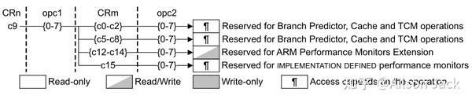

## **CP15协处理器c10寄存器组成** 

主寄存器c10主要提供内存重映射和TLB控制相关的功能，c10寄存器的组成如下图所示：

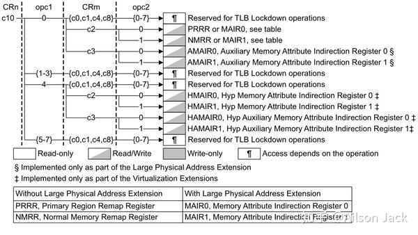

## **CP15协处理器c11寄存器组成** 

主寄存器c11保留用于TCM DMA操作，c11寄存器的组成如下图所示：

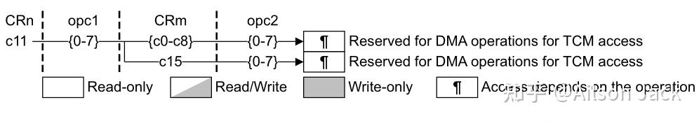

## **CP15协处理器c12寄存器组成** 

主寄存器c12提供安全扩展功能，c12寄存器的组成如下图所示：

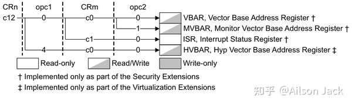

## **CP15协处理器c13寄存器组成** 

主寄存器c13提供进程ID、上下文ID和线程ID处理功能，c13寄存器的组成如下图所示：

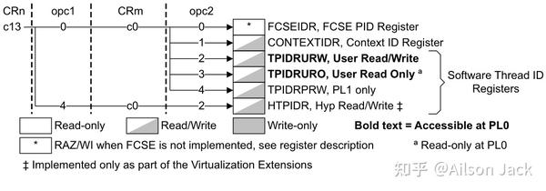

## **CP15协处理器c14寄存器组成** 

主寄存器c14保留用于通用定时器功能，c14寄存器的组成如下图所示：

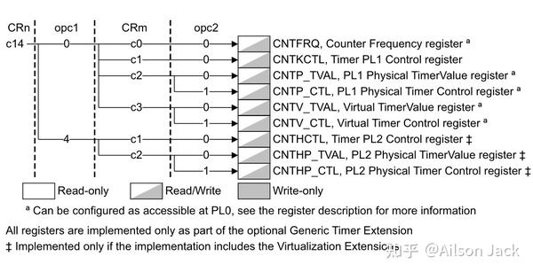

## **CP15协处理器c15寄存器组成** 

主寄存器c15由处理器实现决定。

这里只是简单的将CP15各个主寄存器的组成列出来了，方便在使用`MRC`和`MCR`指令配置CP15主寄存器时，查看指令各个参数的设置，以及对照配置的具体寄存器，至于寄存器的具体内容由于篇幅原因就不列出来了，CP15寄存器的细节可以参考ARMv7AR手册的B3.17章节内容。

如果这篇文章对你有帮助，记得点赞和关注博主就行了。

欢迎关注博主，阅读博主其他的博文。