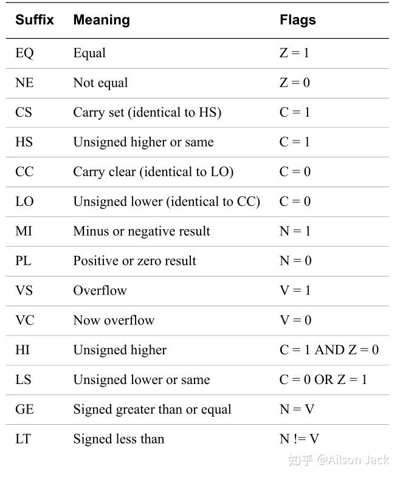
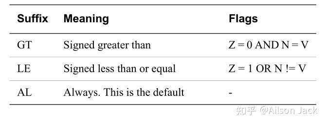

作者:Ailson Jack
链接:https://zhuanlan.zhihu.com/p/665603788
来源:知乎
著作权归作者所有.商业转载请联系作者获得授权,非商业转载请注明出处.


对于搞嵌入式驱动或者操作系统的人来说,掌握汇编语言的使用还是比较重要的,毕竟有时候在分析定位问题的时候,多多少少都会有汇编的身影.本文主要讲讲ARM指令集格式以及常用的ARM汇编指令(主要包括`LDR`和`STR`指令,`LDM`和`STM`指令,`push`和`pop`指令,`MOV`指令,`CPS`指令,`MRS`和`MSR`指令,`MRC`和`MCR`指令,其余指令暂时没列出来,用到时可以查看ARM手册进行了解).

## **ARM指令集格式** 

ARMv7架构是一个32位的处理器架构.同时ARM架构是一个加载/存储体系结构,所有的数据处理操作需要在通用寄存器中完成.

要学习了解处理器的汇编指令,那么首先可以看看汇编指令的通用表达式,具体的指令也就是使用具体的指令和参数代替通用表达式的参数.ARM指令集的指令表达如下所示:

```assembly
opcode{<cond>}{S} <Rd>, <Rn> {, <Rm>}
```

`opcode`:指令助记符,比如LDR,STR,MOV等.

`{}`:大括号括起来的内容表示可选.

`<>`:`<>`括起来的内容是必须的.

`cond`:条件码,比如EQ,NE,CS等,条件码的内容如下图所示:





`S`:可选的后缀,如果指令中添加了`S`,那么指令的执行结果将会影响到CPSR寄存器的标志位域.

`Rd`:目标寄存器.

`Rn`:第一个操作数寄存器.

`Rm`:第二个操作数寄存器.

在了解了ARM指令的表达式之后,下面就讲讲常用的汇编指令.

## **LDR和STR指令** 

`LDR`指令用于从内存中读取数据存储到通用寄存器中.`STR`指令用于将通用寄存器中的值存储到内存中.`LDR`指令的语法如下所示:

```assembly
LDR{type}{T}{cond} Rt, [Rn {, #offset}]
LDR{type}{cond} Rt, [Rn, #offset]!
LDR{type}{T}{cond} Rt, [Rn], #offset
LDR{type}{cond} Rt, [Rn, +/-Rm]
LDR{type}{cond} Rt, [Rn, +/-Rm]!
LDR{type}{T}{cond} Rt, [Rn], +/-Rm
```

`STR`指令的语法如下所示:

```assembly
STR{type}{T}{cond} Rt, [Rn {, #offset}]
STR{type}{cond} Rt, [Rn, #offset]!
STR{type}{T}{cond} Rt, [Rn], #offset
STR{type}{cond} Rt, [Rn, +/-Rm]
STR{type}{cond} Rt, [Rn, +/-Rm]!
STR{type}{T}{cond} Rt, [Rn], +/-Rm
```

`type`:操作的数据宽度,可以是:`B`(unsigned byte),`SB`(signed byte),`H`(unsigned halfword),`SH`(signed halfword).

`cond`:条件码.

`Rt`:目标寄存器.

`Rn`:存储内存操作基地址的寄存器.

`Rm`:存储偏移量的寄存器.

`offset`:立即数.

`!`:如果存在,表示最终的地址要写回`Rn`.

`T`:表示处理器是在用户模式下访问内存地址.

加载存储指令有4种寻址方式,LDR的操作描述如下(STR指令的操作类似):

- 寄存器寻址:要寻址的地址存放在寄存器中.
- 前变基寻址:在内存访问之前,将寄存器中的内存地址加上偏移量之后作为新的内存地址进行内存访问.指令形式为:`LDR Rt, [Rn, Op2]`.偏移量`Op2`可以是正数或者是负数,可以是一个立即数,可以是另一个寄存器的值,可以是另一个寄存器中的数据进行移位之后的值.
- 带写回的前变基寻址:指令形式为:`LDR Rt, [Rn, Op2]!`.该寻址模式和前变基寻址一样,只是在访问完内存之后Rn寄存器中的值就更新为运算之后得到的新内存地址的值.
- 带写回的后变基寻址:指令形式为:`LDR Rt, [Rn], #offset`和`LDR Rt, [Rn], +/-Rm`.将寄存器Rn中存储的数值作为内存地址,将该内存地址中的数据读出来存储到Rt寄存器中,然后将内存地址加减立即数offset或者Rm寄存器中的数值得到新的内存地址存储到Rn寄存器中.

上面说的这些有可能不太好懂,下面简单的列举几个例子吧:

```assembly
# 寄存器寻址
# 将R1地址处的数据读出,保存到R0中
LDR R0, [R1]

# 前变基寻址
# 将(R1+0x4)地址处的数据读出,保存到R0中
LDR R0, [R1, #0x4]
# 将(R1-0x4)地址处的数据读出,保存到R0中
LDR R0, [R1, #-0x4]
# 将(R1+R2)地址处的数据读出,保存到R0中
LDR R0, [R1, R2]
# 将((R1+(R2<<2))地址处的数据读出,保存到R0中
LDR R0, [R1, R2, LSL #2]

# 带写回的前变基寻址
# 将(R1+R2)地址处的数据读出,保存到R0中,然后更新R1=R1+R2
LDR R0, [R1, R2]!
# 将((R1+(R2<<2))地址处的数据读出,保存到R0中,然后更新R1=((R1+(R2<<2))
LDR R0, [R1, R2, LSL #2]!

# 带写回的后变基寻址
# 将R1地址处的数据读出,保存到R0中,然后更新R1=R1+0x4
LDR R0, [R1], #0x4
# 将R1地址处的数据读出,保存到R0中,然后更新R1=R1-0x4
LDR R0, [R1], #-0x4
# 将R1地址处的数据读出,保存到R0中,然后更新R1=R1+R2
LDR R0, [R1], R2
# 将R1地址处的数据读出,保存到R0中,然后更新R1=R1-R2
LDR R0, [R1], -R2
```

STR指令的操作和LDR指令类似,这里就不列举了.

### **LDR伪指令**

`LDR`相关的伪指令语法如下所示:

```assembly
# 将数据 constant 加载到 Rt 寄存器中
LDR Rt, =constant

# 将 label 所代表的地址加载到 Rt 寄存器中
LDR Rt, =label
```

下面是LDR伪指令简单的使用:

```assembly
# 将 0xaa 加载到 R0 寄存器
LDR R0, =0xaa

# 将 _start 所代表的地址加载到 R0 寄存器
LDR R0, =_start
```

## **LDM和STM指令** 

`LDM`指令用于加载指定地址上的数据保存到一个或者多个寄存器中.`STM`指令用于将一个或者多个寄存器中的数据存储到指定地址上.`LDM`和`STM`指令主要用于现场保护和数据复制.

`LDM`指令的语法如下所示:

```assembly
LDM{addr_mode}{cond} Rn{!},reglist{^}
```

`STM`指令的语法如下所示:

```assembly
STM{addr_mode}{cond} Rn{!},reglist{^}
```

`addr_mode`:地址模式,用于数据块传输的地址模式,如下所示:

```assembly
IA:每次传送后地址加4.
IB:每次传送前地址加4.
DA:每次传送后地址减4.
DB:每次传送前地址减4.
```

也可以使用相应的面向堆栈的寻址模式,如下所示:

```assembly
FD:满递减堆栈(每次传送前地址减4).
ED:空递增堆栈(每次传送前地址加4).
FA:满递增堆栈(每次传送后地址减4).
EA:空递增堆栈(每次传送后地址加4).
```

`cond`:条件码.

`Rn`:Rn存储了用于传输的初始地址.

`!`:如果存在,表示最终的地址要写回`Rn`.

`reglist`:用`{}`括起来的一个寄存器或者多个寄存器组成的列表.它可以是一个寄存器范围.如果`{}`中的寄存器超过一个,那么寄存器或者寄存器范围之间通过逗号(`,`)分隔.

`^`:如果在除了USR模式和SYS模式下存在该符号,意味着将发生下述的两个动作:

- 当寄存器列表中不包含PC时,加载/存储的是USR模式的寄存器,而不是当前模式的寄存器.
- 在使用`LDM`指令时,如果寄存器列表中包含PC时,那么除了正常的多寄存器传送外,会将SPSR 拷贝到CPSR 中,这可用于异常处理返回.

上面的内容可能不是很好理解,下面简单的列举写例子:

### **LDMIA和STMIA例子**

LDMIA例子如下所示:

```assembly
# IA:每次传送后地址加4,下面是指令执行流程的分解:
# R0=[R1]
# R2=[R1+4]
# R3=[R1+8]
# R4=[R1+12]
LDMIA R1, {R0, R2-R4}

# IA:每次传送后地址加4,最终地址要写回R1,下面是指令执行流程的分解:
# R0=[R1], R1=R1+4
# R2=[R1], R1=R1+4
# R3=[R1], R1=R1+4
# R4=[R1], R1=R1+4
LDMIA R1!, {R0, R2-R4}
```

STMIA例子如下所示:

```assembly
# IA:每次传送后地址加4,下面是指令执行流程的分解:
# [R1]=R0
# [R1+4]=R2
# [R1+8]=R3
# [R1+12]=R4
STMIA R1, {R0, R2-R4}

# IA:每次传送后地址加4,最终地址要写回R1,下面是指令执行流程的分解:
# [R1]=R0, R1=R1+4
# [R1]=R2, R1=R1+4
# [R1]=R3, R1=R1+4
# [R1]=R4, R1=R1+4
STMIA R1!, {R0, R2-R4}
```

### **LDMIB和STMIB例子**

LDMIB例子如下所示:

```assembly
# IB:每次传送前地址加4,下面是指令执行流程的分解:
# R0=[R1+4]
# R2=[R1+8]
# R3=[R1+12]
# R4=[R1+16]
LDMIB R1, {R0, R2-R4}

# IB:每次传送前地址加4,最终地址要写回R1,下面是指令执行流程的分解:
# R1=R1+4, R0=[R1]
# R1=R1+4, R2=[R1]
# R1=R1+4, R3=[R1]
# R1=R1+4, R4=[R1]
LDMIB R1!, {R0, R2-R4}
```

STMIB例子如下所示:

```assembly
# IB:每次传送前地址加4,下面是指令执行流程的分解:
# [R1+4]=R0
# [R1+8]=R2
# [R1+12]=R3
# [R1+16]=R4
STMIB R1, {R0, R2-R4}

# IB:每次传送前地址加4,最终地址要写回R1,下面是指令执行流程的分解:
# R1=R1+4, [R1]=R0
# R1=R1+4, [R1]=R2
# R1=R1+4, [R1]=R3
# R1=R1+4, [R1]=R4
STMIB R1!, {R0, R2-R4}
```

### **LDMDA和STMDA例子**

LDMDA例子如下所示:

```assembly
# DA:每次传送后地址减4,下面是指令执行流程的分解:
# R4=[R1]
# R3=[R1-4]
# R2=[R1-8]
# R0=[R1-12]
LDMDA R1, {R0, R2-R4}

# DA:每次传送后地址减4,最终地址要写回R1,下面是指令执行流程的分解:
# R4=[R1], R1=R1-4
# R3=[R1], R1=R1-4
# R2=[R1], R1=R1-4
# R0=[R1], R1=R1-4
LDMDA R1!, {R0, R2-R4}
```

STMDA例子如下所示:

```assembly
# DA:每次传送后地址减4,下面是指令执行流程的分解:
# [R1]=R4
# [R1-4]=R3
# [R1-8]=R2
# [R1-12]=R0
STMDA R1, {R0, R2-R4}

# DA:每次传送后地址减4,最终地址要写回R1,下面是指令执行流程的分解:
# [R1]=R4, R1=R1-4
# [R1]=R3, R1=R1-4
# [R1]=R2, R1=R1-4
# [R1]=R0, R1=R1-4
STMDA R1!, {R0, R2-R4}
```

### **LDMDB和STMDB例子**

LDMDB例子如下所示:

```assembly
# DB:每次传送前地址减4,下面是指令执行流程的分解:
# R4=[R1-4]
# R3=[R1-8]
# R2=[R1-12]
# R0=[R1-16]
LDMDB R1, {R0, R2-R4}

# DB:每次传送前地址减4,最终地址要写回R1,下面是指令执行流程的分解:
# R1=R1-4, R4=[R1]
# R1=R1-4, R3=[R1]
# R1=R1-4, R2=[R1]
# R1=R1-4, R0=[R1]
LDMDB R1!, {R0, R2-R4}
```

STMDB例子如下所示:

```assembly
# DB:每次传送前地址减4,下面是指令执行流程的分解:
# [R1-4]=R4
# [R1-8]=R3
# [R1-12]=R2
# [R1-16]=R0
STMDB R1, {R0, R2-R4}

# DB:每次传送前地址减4,最终地址要写回R1,下面是指令执行流程的分解:
# R1=R1-4, [R1]=R4
# R1=R1-4, [R1]=R3
# R1=R1-4, [R1]=R2
# R1=R1-4, [R1]=R0
STMDB R1!, {R0, R2-R4}
```

### **现场保护**

在数据块的传输中:`STMDB`和`LDMIA`对应使用,`STMIA`和`LDMDB`对应使用.

在堆栈操作中:`STMFD`和`LDMFD`对应使用,`STMFA`和`LDMFA`对应使用.

在子程序或者异常处理时,使用`LDMFD`和`STMFD`进行现场保护的例子如下:

```assembly
# 将R0-R7和LR入栈
STMFD SP!, {R0-R7, LR}

# 功能代码
MOV R0, #0x00
MOV R1, #0x11
MOV R2, #0x22

# 将R0-R7和LR出栈
LDMFD SP!, {R0-R7, LR}
```

同样的可以使用`STMDB`和`LDMIA`指令进行现场保护,因此上述代码可以修改成下述形式:

```assembly
# 将R0-R7和LR入栈
STMDB SP!, {R0-R7, LR}

# 功能代码
MOV R0, #0x00
MOV R1, #0x11
MOV R2, #0x22

# 将R0-R7和LR出栈
LDMIA SP!, {R0-R7, LR}
```

## **push和pop指令** 

`push`和`pop`指令主要用于子程序或者异常的现场保护.`push`指令用于将寄存器内容压入堆栈.`pop`指令用于将堆栈中的内容恢复到寄存器中.

`push`指令的语法如下所示:

```assembly
PUSH{cond} reglist
```

`pop`指令的语法如下所示:

```assembly
POP{cond} reglist
```

`cond`:条件码.

`reglist`:用`{}`括起来的一个寄存器或者多个寄存器组成的列表.它可以是一个寄存器范围.如果`{}`中的寄存器超过一个,那么寄存器或者寄存器范围之间通过逗号(`,`)分隔.

`push`指令等价于`STMDB`指令.`pop`指令等价于`LDMIA`指令.

使用`push`指令和`pop`指令保护现场的例子如下所示:

```assembly
# 将R0-R7和LR入栈
push {R0-R7, LR}

# 功能代码
MOV R0, #0x00
MOV R1, #0x11
MOV R2, #0x22

# 将R0-R7和LR出栈
pop {R0-R7, LR}
```

## **MOV指令** 

`MOV`指令主要用于将数据搬移到寄存器中.`MOV`指令的语法如下所示:

```assembly
MOV{S}{cond} Rn, Rm
MOV{cond} Rn, #imm
```

`S`:可选的后缀,如果指令中添加了`S`,那么指令的执行结果将会影响到CPSR寄存器的标志位域.

`cond`:条件码.

`Rn`:目标寄存器.

`Rm`:源寄存器.

`imm`:立即数.

`MOV`指令的使用例子如下:

```assembly
# 将 R1 寄存器中的内容搬移到 R0 寄存器
MOV R0, R1

# 将 0xaa 搬移到 R0 寄存器
MOV R0, #0xaa
```

## **CPS指令** 

可以通过`CPS`(Change Processor State)指令来修改处理器模式.`CPS`指令也可以用来使能或者禁止异常.

`CPS`指令的语法如下所示:

```assembly
CPS #mode
CPSIE iflags{, #mode}
CPSID iflags{, #mode}
```

`mode`是处理器的模式编码,比如在从其他模式下切换到SYS模式,使用下述代码即可:

```assembly
# 切换到SYS模式
CPS #0x1f
```

`IE`使能中断或者终止.

`ID`禁止中断或者终止.

`iflags`由下面的一种或者几种组成:

- `a`:表示异步终止(asynchronous abort);
- `i`:表示中断(IRQ);
- `f`:表示快中断(FIQ);

下述代码是`CPS`指令的一些简单用法:

```assembly
# 使能中断
CPSIE I

# 禁止中断
CPSID I

# 使能异步终止和快中断
CPSIE AF

# 禁止异步终止和快中断
CPSID AF

# 使能中断并切换到SYS模式
CPSIE I, #0x1f
```

## **MRS与MSR指令** 

`MRS`和`MSR`指令可用于读写程序状态寄存器CPSR,APSR和SPSR.

在ARM处理器中,只有`MRS`指令可以从程序状态寄存器CPSR,APSR和SPSR中读出数据到通用寄存器中.`MRS`指令操作程序状态寄存器的语法如下:

```assembly
MRS{cond} Rd, psr
```

`cond`为条件码.

`Rd`为目标寄存器,`Rd`不允许为R15.

`psr`为程序状态寄存器CPSR,APSR或者SPSR.

`MRS`指令的示例代码如下所示:

```assembly
# 将CPSR寄存器的值读取到R0中
MRS R0, CPSR

# 将SPSR寄存器的值读取到R1中
MRS R1, SPSR

# 将APSR寄存器的值读取到R2中
MRS R2, APSR
```

`MSR`指令可以用来写程序状态寄存器CPSR,APSR和SPSR的全部或者部分域.`MSR`指令操作程序状态寄存器的语法如下:

```assembly
MSR{cond} psr, #constant
MSR{cond} psr, Rm
MSR{cond} psr_fields, #constant
MSR{cond} psr_fields, Rm
```

`cond`为条件码.

`psr`为程序状态寄存器CPSR或者SPSR.

`constant`是一个8位立即数.ARM文档对于`constant`的介绍如下:

>  constant is an 8-bit pattern rotated by an even number of bits within a 32-bit word. (Not available in Thumb.)
>  

`Rm`是源寄存器.

`fields`由下面的一个或者多个组合而成:

- `c`:xPSR[7:0],控制位域;
- `x`:xPSR[15:8],扩展位域;
- `s`:xPSR[23:16],状态位域;
- `f`:xPSR[31:24],标志位域;

`MSR`指令的示例代码如下所示:

```assembly
# 切换到SYS模式
MRS R0, CPSR
ORR R0, R0, #0x1f
MSR CPSR, R0

# 切换到SYS模式
MSR CPSR_c, #0xDF
```

**只有在除用户模式外的其他模式下才能够修改状态寄存器**.

## **MRC和MCR指令** 

ARMv7-A体系结构的处理器提供了`MRC`和`MCR`指令用于对协处理器进行读写操作.`MRC`指令用于将协处理器中的寄存器数据读取到ARM通用寄存器中.`MCR`指令用于将ARM通用寄存器中的数据写入到协处理器的寄存器中.

### **MRC**

`MRC`指令的语法如下所示:

```assembly
MRC{cond} coproc, opc1, Rt, CRn, CRm{, opc2}
```

`cond`为条件码.

`coproc`为协处理器名称,CP0~CP15协处理器分别对应名称p0~p15.

`opc1`为协处理器要执行的操作码,取指范围为0~7.

`Rt`为ARM通用寄存器,用于存储读取到的协处理器寄存器数据.

`CRn`为协处理器寄存器,对于CP15协处理器来说,`CRn`取值范围为c0~c15.

`CRm`为协处理器寄存器,对于CP15协处理器来说,通过`CRm`和`opc2`一起来确定`CRn`对应的具体寄存器.

`opc2`为可选的协处理器执行操作码,取指范围为0~7,当不需要的时候要设置为0.

`MRC`指令使用示例如下:

```assembly
# 读取主ID寄存器 MIDR 的数据到 R0 中.
MRC p15, 0, R0, c0, c0, 0
```

### **MCR**

`MCR`指令的语法如下所示:

```assembly
MCR{cond} coproc, opc1, Rt, CRn, CRm{, opc2}
```

`cond`为条件码.

`coproc`为协处理器名称,CP0~CP15协处理器分别对应名称p0~p15.

`opc1`为协处理器要执行的操作码,取指范围为0~7.

`Rt`为ARM通用寄存器,用于存储要写入到协处理器寄存器中的数据.

`CRn`为协处理器寄存器,对于CP15协处理器来说,`CRn`取值范围为c0~c15.

`CRm`为协处理器寄存器,对于CP15协处理器来说,通过`CRm`和`opc2`一起来确定`CRn`对应的具体寄存器.

`opc2`为可选的协处理器执行操作码,取指范围为0~7,当不需要的时候要设置为0.

`MCR`指令使用示例如下:

```assembly
# 将 R0 中的配置数据写入到 SCTLR
MCR p15, 0, R0, c1, c0, 0
```

## SRS指令

将返回状态存储到堆栈.

`SRS`指令的语法如下:

```assembly
SRS{addr_mode}{cond} sp{!}, #modenum
SRS{addr_mode}{cond} #modenum{!} ; This is a pre-UAL syntax
```

`addr_mode` 为下列项之一: 

+ `IA` 每次传送之后增大地址
+ `IB` 每次传送之前增大地址 (仅 ARM) 
+ `DA` 每次传送后递减地址 (仅 ARM) 
+ `DB` 每次传送前递减地址 (满降序堆栈).

如果省略 addr_mode,则缺省情况下为 IA (Increment After,之后 增大).

`cond` 是一个可选的条件代码.

`!` 是一个可选的后缀.如果有 ! ,则最终地址会写回到 `modenum` 所指定的模式的 `sp` 中. 

`modenum` 指定模式的编号,该模式的编组 `sp` 会用作基址寄存器.


`SRS` 可将当前模式的 `lr` 和 `SPSR` 分别存储在 `modenum` 所指定模式的 `sp` 中包含的地址上及其后续一个字中.

也可选择对 `modenum` 所指定模式的 `sp` 进行更新.

对于满降序堆栈,必须使用 `SRSFD` 或 `SRSDB` .

```assembly
# 保存CPSR LR寄存器到svc模式的堆栈中去,并更新svc模式的sp寄存器
SRSFD #0x13!
```


如果这篇文章对你有帮助,记得点赞和关注博主就行了.

欢迎关注博主,阅读博主其他的博文.