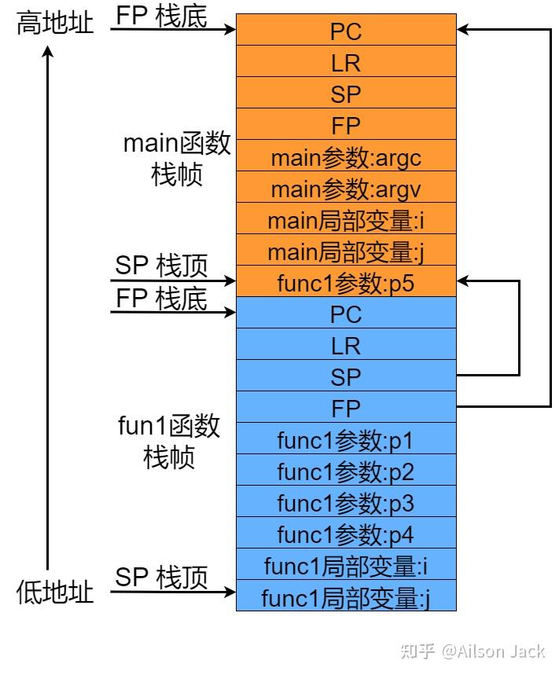
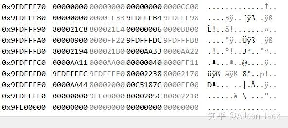

作者:Ailson Jack
链接:https://zhuanlan.zhihu.com/p/667656237
来源:知乎
著作权归作者所有.商业转载请联系作者获得授权,非商业转载请注明出处.


在嵌入式开发过程中,经常需要对代码进行调试来解决各种各样的问题,常用的调试手段有:

(1),开发环境搭配硬件仿真器进行在线调试.优点:调试过程中能够清楚的知道各个寄存器的值以及各个变量的值,程序的执行流程也能够一目了然.缺点:板卡需要引出硬件仿真器的连接口,并且需要购买硬件仿真器.

(2),通过调试串口打印信息梳理程序的执行流程,结合代码分析问题产生的原因.优点:足够简单,通过增加较多的打印信息来分析问题出现的位置,再结合代码分析问题产生的原因.缺点:没法准确的定位问题产生的位置和原因.

(3),在应用或者操作系统死机的时候,根据操作系统输出的异常栈信息进行分析,再结合镜像或者应用的反汇编代码进行定位.通常这种方法和方法(2)结合使用.

本文主要简单的讲讲栈回溯,对于以后去理解操作系统的异常栈处理打个基础吧.

ARM处理器的栈回溯主要有两种方式:一种是基于栈帧寄存器(FP)的栈回溯,另一种是unwind形式的栈回溯.本文主要讲讲基于栈帧寄存器(FP)的栈回溯.

## **栈回溯相关寄存器** 

在栈回溯过程中,主要涉及如下寄存器:

R15:又叫程序计数器(Program Counter)PC,PC主要用于存放CPU取指的地址.

R14:又叫链接寄存器(Link register)LR,LR主要用于存放函数的返回地址,即当函数返回时,知道自己该回到哪儿去继续运行.

R13:又叫堆栈指针寄存器(Stack pointer)SP,SP通常用于保存堆栈地址,在使用入栈和出栈指令时,SP中的堆栈地址会自动的更新.

R12:又叫内部过程调用暂存寄存器(Intra-Procedure-call scratch register)IP,主要用于暂存SP.

R11:又叫帧指针寄存器(Frame pointer)FP,通常指向一个函数的栈帧底部,表示一个函数栈的开始位置.

## **ARM栈帧结构** 

依据AAPCS (ARM Archtecture Procedure Call Standard)规范,当调用子函数时,子函数一开始的代码总是会执行压栈操作来保留父函数的相关信息,压栈步骤示例如下所示:

```assembly
mov ip, sp
push {fp, ip, lr, pc}
sub fp, ip, #4
sub sp, sp, #16
...
```

每个函数都有自己的栈空间,这一部分称为栈帧.栈帧在函数被调用的时候创建,在函数返回后销毁.每个函数的栈帧是由SP寄存器和FP寄存器来界定的,ARM栈帧结构典型示意图如下所示:



上图描述的栈帧,main函数和func1函数的示意代码如下:

```c
int func1(int p1, int p2, int p3, int p4, int p5)
{
    int i;
    int j;

    i = 0xf3;
    j = 0xf6;

    return 0;
}

int main(int argc, char *argv[])
{
    int i;
    int j;

    i = 0x33;
    j = 0x66;
    func1(0xa1, 0xa2, 0xa3, 0xa4, 0xa5);

    return 0;
}
```

每个函数的栈帧中都会保存调用该函数之前的PC,LR,SP,FP寄存器的值;如果函数具有参数并且函数内部使用了局部变量,那么函数栈帧中也会保存函数的参数和局部变量;如果被调用的子函数参数过多,那么多余的参数会通过父函数的栈进行传递.比如func1函数的参数p5通过main函数的栈帧进行传递的.(注:编译器的版本不同,函数栈帧中参数和局部变量的压栈顺序可能不同,PC,LR,SP和FP这4个寄存器的压栈顺序一般是固定的)

函数栈帧中的PC和LR均指向代码段,PC表示执行入栈指令时CPU正在取指的地址,LR表示当前函数返回后继续执行的地址.

## **栈回溯原理** 

在栈回溯的过程中,我们主要利用FP寄存器进行栈回溯.通过FP就可以知道当前函数的栈底,从而可以找到存储在栈帧中的LR寄存器的数据,这个数据就是函数的返回地址.同时也可以找到保存在函数栈帧中的上一级函数FP的数据,这个数据指向了上一级函数的栈底,按照同样的方法可以找出上一级函数栈帧中存储的LR和FP数据,就知道哪个函数调用了上一级函数以及这个函数的栈底地址.这就是栈回溯的流程,整个流程以FP为核心,依次找出每个函数栈帧中存储的LR和FP数据,计算出函数返回地址和上一级函数栈底地址,从而找出每一级函数调用关系.

## **栈回溯编译选项** 

当gcc的编译选项带有`-mapcs-frame`时,编译出来的代码能够将PC,LR,SP和FP寄存器的值压入函数的栈帧中.默认情况下gcc的编译选项为`-mno-apcs-frame  `,此时编译出来的代码不一定会将PC,LR,SP和FP这四个寄存器的值压入函数的栈帧中,可能只会将LR和FP寄存器的值压入函数的栈帧中.关于`-mapcs-frame`选项,gcc的手册描述如下:

```text
Generate a stack frame that is compliant with the ARM Procedure Call Standard for all functions, even if this is not strictly necessary for correct execution of the code. Specifying ‘-fomit-frame-pointer’ with this option causes the stack frames not to be generated for leaf functions. The default is ‘-mno-apcs-frame’.
This option is deprecated.
```

我这里使用的gcc信息如下:

```shell
$ arm-none-eabi-gcc -v
...
gcc version 10.3.1 20210824 (release) (GNU Arm Embedded Toolchain 10.3-2021.10)
```

虽然gcc手册上说`-mapcs-frame`选项被废弃了,但是只有添加了该选项,编译出来的代码才会将PC,LR,SP和FP寄存器的值压入函数的栈帧中.

我这里编译代码仍然使用`-mapcs-frame`选项,有知道该选项对应的新的栈帧配置选项的兄弟可以告知我一下.

## **栈回溯示例** 

根据前面的内容,这里简单的写了一个栈回溯的示例,函数调用流程为:`main -> test_a -> test_b -> test_c`.

函数的源代码如下:

```assembly
int test_a(int arg0, int arg1, int arg2, int arg3, int arg4)
{
    int a;

    a = 0xff11;

    test_b(0xbb00);

    return a;
}

int test_b(int arg0)
{
    int b;

    b = 0xff22;

    test_c(0xcc00);

    return b;
}

int test_c(int arg0)
{
    int c;

    c = 0xff33;

    return c;
}

int main(void)
{
    int val;

    val = 0xff00;

    test_a(0xaa00, 0xaa11, 0xaa22, 0xaa33, 0xaa44);

    return 0;
}
```

上述函数的反汇编内容如下:

```assembly
80002164 <test_a>:

int test_a(int arg0, int arg1, int arg2, int arg3, int arg4)
{
80002164: e1a0c00d  mov ip, sp
80002168: e92dd800  push {fp, ip, lr, pc}
8000216c: e24cb004  sub fp, ip, #4
80002170: e24dd018  sub sp, sp, #24
80002174: e50b0018  str r0, [fp, #-24] ; 0xffffffe8
80002178: e50b101c  str r1, [fp, #-28] ; 0xffffffe4
8000217c: e50b2020  str r2, [fp, #-32] ; 0xffffffe0
80002180: e50b3024  str r3, [fp, #-36] ; 0xffffffdc
 int a;

 a = 0xff11;
80002184: e30f3f11  movw r3, #65297 ; 0xff11
80002188: e50b3010  str r3, [fp, #-16]

 test_b(0xbb00);
8000218c: e3a00cbb  mov r0, #47872 ; 0xbb00
80002190: eb000003  bl 800021a4 <test_b>

 return a;
80002194: e51b3010  ldr r3, [fp, #-16]
}
80002198: e1a00003  mov r0, r3
8000219c: e24bd00c  sub sp, fp, #12
800021a0: e89da800  ldm sp, {fp, sp, pc}

800021a4 <test_b>:

int test_b(int arg0)
{
800021a4: e1a0c00d  mov ip, sp
800021a8: e92dd800  push {fp, ip, lr, pc}
800021ac: e24cb004  sub fp, ip, #4
800021b0: e24dd010  sub sp, sp, #16
800021b4: e50b0018  str r0, [fp, #-24] ; 0xffffffe8
 int b;

 b = 0xff22;
800021b8: e30f3f22  movw r3, #65314 ; 0xff22
800021bc: e50b3010  str r3, [fp, #-16]

 test_c(0xcc00);
800021c0: e3a00b33  mov r0, #52224 ; 0xcc00
800021c4: eb000003  bl 800021d8 <test_c>

 return b;
800021c8: e51b3010  ldr r3, [fp, #-16]
}
800021cc: e1a00003  mov r0, r3
800021d0: e24bd00c  sub sp, fp, #12
800021d4: e89da800  ldm sp, {fp, sp, pc}

800021d8 <test_c>:

int test_c(int arg0)
{
800021d8: e1a0c00d  mov ip, sp
800021dc: e92dd800  push {fp, ip, lr, pc}
800021e0: e24cb004  sub fp, ip, #4
800021e4: e24dd010  sub sp, sp, #16
800021e8: e50b0018  str r0, [fp, #-24] ; 0xffffffe8
 int c;

 c = 0xff33;
800021ec: e30f3f33  movw r3, #65331 ; 0xff33
800021f0: e50b3010  str r3, [fp, #-16]

 return c;
800021f4: e51b3010  ldr r3, [fp, #-16]
}
800021f8: e1a00003  mov r0, r3
800021fc: e24bd00c  sub sp, fp, #12
80002200: e89da800  ldm sp, {fp, sp, pc}

80002204 <main>:

int main(void)
{
80002204: e1a0c00d  mov ip, sp
80002208: e92dd800  push {fp, ip, lr, pc}
8000220c: e24cb004  sub fp, ip, #4
80002210: e24dd010  sub sp, sp, #16
 int val;

 val = 0xff00;
80002214: e3a03cff  mov r3, #65280 ; 0xff00
80002218: e50b3010  str r3, [fp, #-16]

 test_a(0xaa00, 0xaa11, 0xaa22, 0xaa33, 0xaa44);
8000221c: e30a3a44  movw r3, #43588 ; 0xaa44
80002220: e58d3000  str r3, [sp]
80002224: e30a3a33  movw r3, #43571 ; 0xaa33
80002228: e30a2a22  movw r2, #43554 ; 0xaa22
8000222c: e30a1a11  movw r1, #43537 ; 0xaa11
80002230: e3a00caa  mov r0, #43520 ; 0xaa00
80002234: ebffffca  bl 80002164 <test_a>

 return 0;
80002238: e3a03000  mov r3, #0
}
8000223c: e1a00003  mov r0, r3
80002240: e24bd00c  sub sp, fp, #12
80002244: e89da800  ldm sp, {fp, sp, pc}
```

当程序运行到`test_c()`函数的`return c;`代码处时,FP的值为0x9FDFFF94,此时内存数据如下:



`test_c()`函数的栈底为0x9FDFFF94,可以得到`test_c()`函数栈帧中LR为0x800021C8,FP为0x9FDFFFB4,LR是`test_c()`函数执行完成后的返回地址,与反汇编代码中`test_b()`函数调用完`test_c()`之后的下一个执行地址一致:

```assembly
800021c0: e3a00b33  mov r0, #52224 ; 0xcc00
800021c4: eb000003  bl 800021d8 <test_c>

 return b;
800021c8: e51b3010  ldr r3, [fp, #-16] // test_c() 函数返回后继续执行的地址
```

FP为0x9FDFFFB4表示`test_b()`函数的栈底为0x9FDFFFB4,有了`test_b()`函数的栈底就可以得到`test_b()`函数栈帧中LR为0x80002194,FP为0x9FDFFFDC,从而知道`test_b()`函数执行完成后的返回地址以及`test_a()`函数的栈底,依次逐级回溯,就可以知道程序的整个运行流程了.

在栈回溯的过程中我们可以利用addr2line工具辅助我们对程序执行流程的分析.

如果这篇文章对你有帮助,记得点赞和关注博主就行了.

欢迎关注博主,阅读博主其他的博文.