**目录**

 

[1.分析startup文件目录](https://blog.csdn.net/CPUOS2010/article/details/117705054#t0)

[2. 分析reset_vector_up.s](https://blog.csdn.net/CPUOS2010/article/details/117705054#t1)

[2.1 定义中断向量表](https://blog.csdn.net/CPUOS2010/article/details/117705054#t2)

[2.2 重定位系统镜像](https://blog.csdn.net/CPUOS2010/article/details/117705054#t3)

[2.3 初始化内核页表](https://blog.csdn.net/CPUOS2010/article/details/117705054#t4)

[2.4 初始化内核临时页表](https://blog.csdn.net/CPUOS2010/article/details/117705054#t5)

[2.5 设置mmu](https://blog.csdn.net/CPUOS2010/article/details/117705054#t6)

[2.6 初始化各个cpu模式下的栈](https://blog.csdn.net/CPUOS2010/article/details/117705054#t7)

[2.7 设置各个模式的栈地址](https://blog.csdn.net/CPUOS2010/article/details/117705054#t8)

[2.8 使能fpu+neon](https://blog.csdn.net/CPUOS2010/article/details/117705054#t9)

[2.9 bss段清零](https://blog.csdn.net/CPUOS2010/article/details/117705054#t10)

[2.10 跳转c语言main函数](https://blog.csdn.net/CPUOS2010/article/details/117705054#t11)

------

## 1.分析startup文件目录

reset_vector_up.s在源码中的位置为kernel\liteos_a\arch\arm\arm\src\startup，在这个目录下有两个文件，如下图所示。

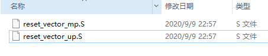

带up字样的应该是单核时启动用的，mp为多核时启动使用。

## 2. 分析reset_vector_up.s

### 2.1 定义中断向量表

如下图所示，中断向量表是放在.vectors段中，系统启动时最先执行的是reset_vector函数。

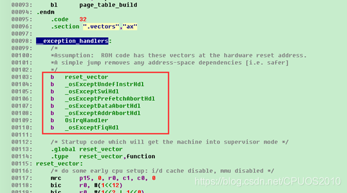

### 2.2 重定位系统镜像

我们接着来看reset_vector函数，先是关闭I/D cache和mmu，如下图所示

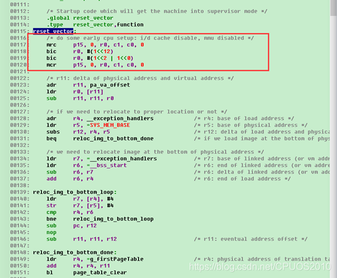

接着计算了内核运行（虚拟）地址和物理地址之间的差值保存在r11中，r11在后面代码中会被用于虚拟和物理地址之间的转换。那么内核的运行地址和物理地址是什么意思呢？

内核的运行地址就是内核设计者希望内核运行时在内存中的位置，这个地址一般在内核源码中有地方可以配置，并且链接脚本里也会用到这个地址，编译代码时所用到的跟地址相关的值都是以内核运行基址为基础进行计算的。

在liteos_a中，内核运行基址是在各个板子的board.h中配置的，如下图所示。

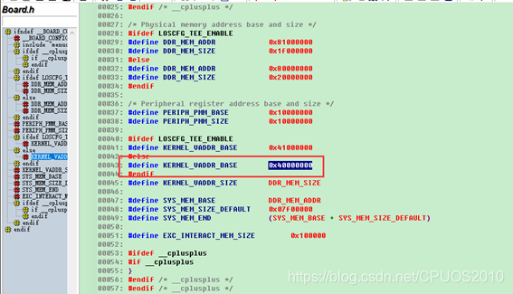

由于liteos_a是为带mmu的处理器设计的，所以这个内核运行基址的值是虚拟地址，这个KERNEL_VADDR_BASE在链接脚本board.ld.S（在kernel\liteos_a\platform\中）中会被用到，如下图所示。

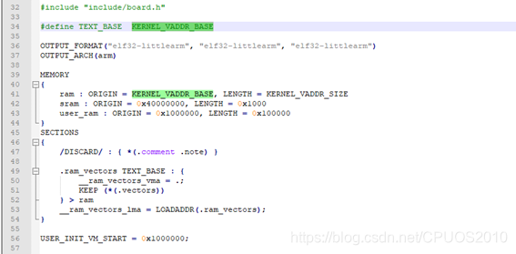

从图中我们也可以看出，中断向量表所在的vectors段是被放在内核运行基址处的。

当内核被加载到内存中时，它的起始地址就叫做加载地址，因为内核是被uboot加载的，uboot中对mmu页表不会做太复杂的映射，一般也就是一一映射，也就是物理地址和虚拟地址值是一样的，所以可以认为内核加载地址值是物理地址。从reset_vector_up.s代码中我们也可以看出，内核设计者希望我们把内核加载到内存基址处运行，如下图所示。

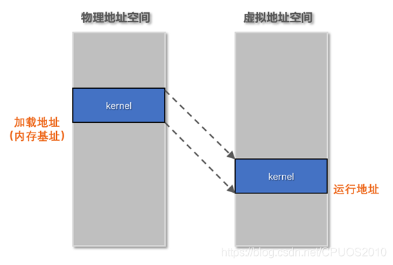

但是我们并不能保证内核被加载到内存时所在的地址就是物理内存基址，如果不是的话，那么就需要对内核镜像做重定位操作，把内核从加载地址搬到物理内存基址处，如下图所示。

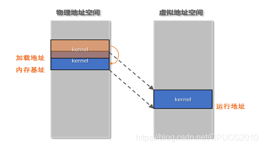

让我们回到代码里来，r11的值是内核虚拟地址和物理地址之间的差值，如果内核不需要重定位的话，这个值通过以下三条指令计算得出。

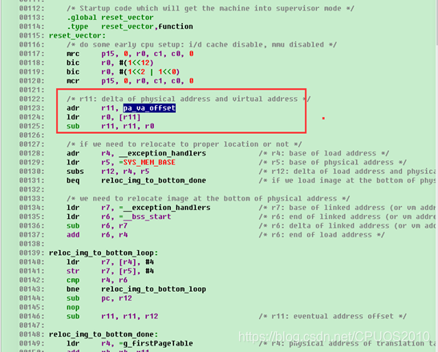

-  adr r11, pa_va_offset。这条指令表示获取pa_va_offset变量的当前运行地址，由于这时候mmu已经被关闭，所以这个值就表示pa_va_offset变量的物理地址。pa_va_offset变量定义如下图所示，可以看出，这个变量是4字节大小，变量中的值表示变量的虚拟地址，这个地址是编译器在编译的时候确定的，而编译器编译时所用到的地址都是按虚拟地址来计算的。

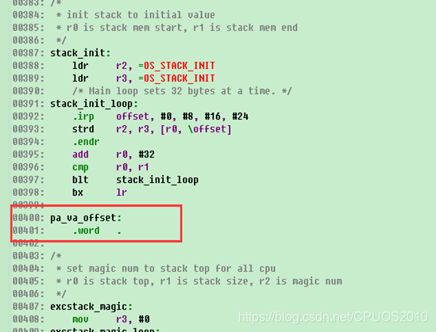

- ldr r0, [r11]。这条指令就是获取pa_va_offset变量的虚拟地址。
- sub r11, r11, r0。将pa_va_offset变量物理地址-虚拟地址得到差值。

接着根据内核的加载地址是否等于物理内存基址来判断内核是否需要重定位，如下图所示。

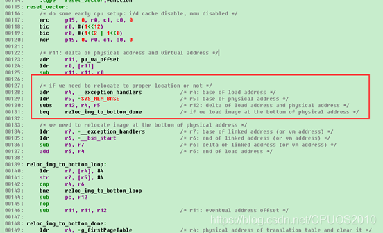

SYS_MEM_BASE也是在各个板子的board.h中设置的，如下图所示。

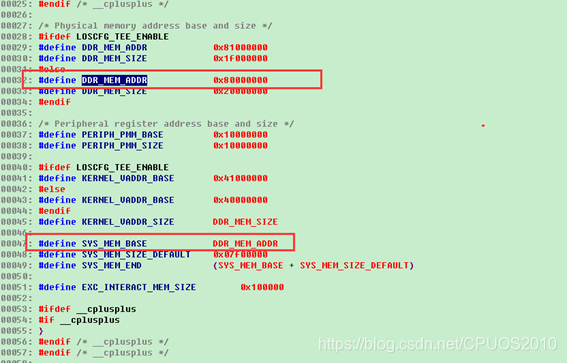

如果内核不需要重定位，直接跳转到reloc_img_to_bottom_done处执行，如果需要重定位，则将内核从加载地址拷贝到内存基址处，重定位完后跳到新地址处运行并且校正r11的值，如下图所示。

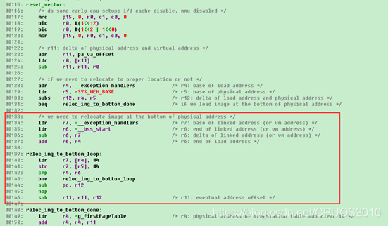

那么这里是如何知道内核是有多大的呢？答案就是通过__bss_start-__exception_handlers得到内核大小。

在源码kernel\liteos_a\tools\build中有内核的链接脚本，如果使用gcc编译的，我们就看liteos.ld，如下图所示。

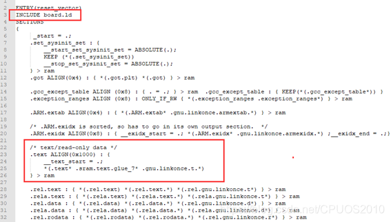

链接脚本首先包含了board.ld，这个就是前面我们看过的board.ld.S，也就是包含了vectors段，然后是text代码段，接着是只读数据段和可读写数据段，还有一些其他的段，如下图所示。

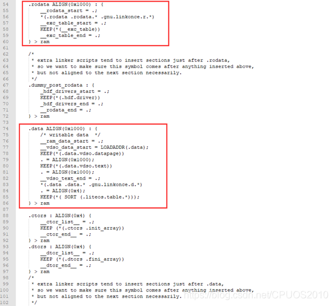

最后是bss段和临时页表，这个临时页表会在后面分析用到，如下图所示。

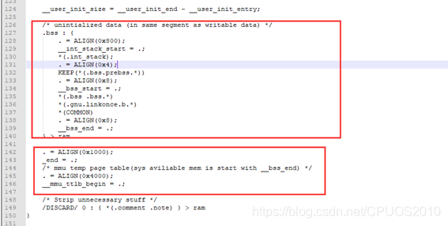

可以总结出内核镜像在内存中的大致布局如下图所示。

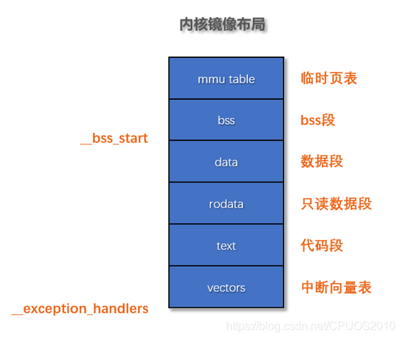

由于目前阶段有用的数据就是中断向量表+代码段+只读数据段+数据段，所以只需要复制__bss_start-__exception_handlers这么多数据到内存基址处就行了。

### 2.3 初始化内核页表

接着对内核页表进行清零，然后初始化页表，如下图所示。

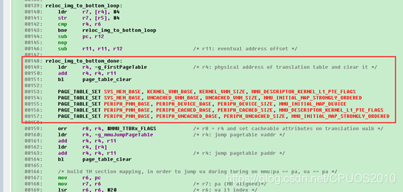

 

核页表是用数组g_firstPageTable来表示的，这个数组在kernel\liteos_a\arch\arm\arm\src\los_arch_mmu.c中定义，如下图所示。

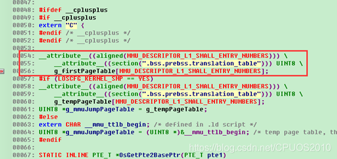

这个数组用了__attribute__修饰需要16KB地址对齐，这是arm架构要求的，页表基址需要16KB对齐，同时这个数组的大小也是16KB，因为内核页表是按1MB大小的段映射的，只有一级页表，32位地址空间物理空间最大4096MB，需要4096个段描述符，每个段描述符4字节大小，所以总共需要4096 * 4 = 16KB大小的页表空间。

我们来看看如何清零内核页表的：

- ldr r4, =g_firstPageTable。获取内核页表的虚拟地址。
- add r4, r4, r11。内核页表虚拟地址+r11=内核页表物理地址，保存在r4中。
- bl page_table_clear。这个函数很简单，就是将内核页表内存清零，如下图所示。

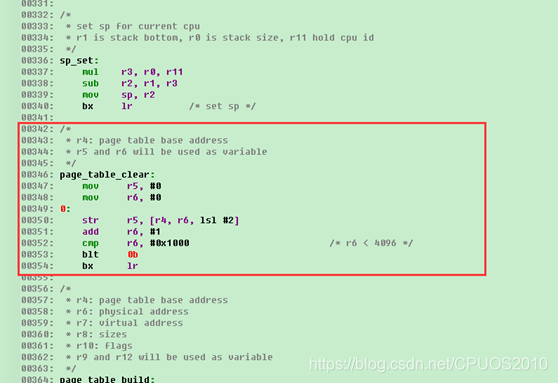

内核页表清零后紧接着用PAGE_TABLE_SET这个宏对页表进行了设置，也就是建立物理地址和虚拟地址之间的映射，这个宏如下图所示。

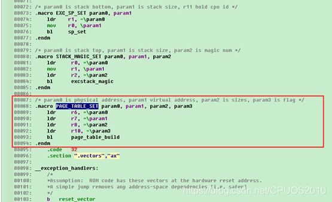

这个宏有四个参数，分别是物理地址、虚拟地址、映射大小、映射属性。将这四个值保存在系统寄存器中后调用page_table_build函数进行映射关系建立，如下图所示。

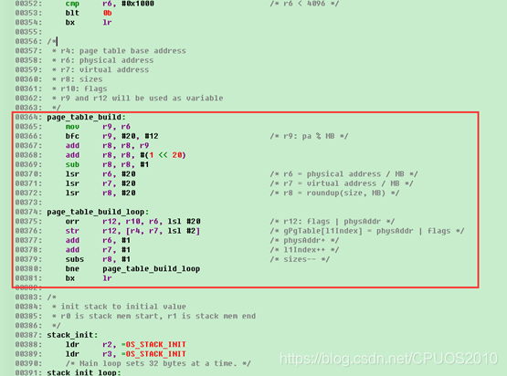

注意这个函数会将物理地址、虚拟地址还有映射大小都对齐到1MB，因为内核页表是进行1MB段式映射，然后根据虚拟地址得到页表项索引，将物理地址和映射属性组合后填入对应的页表项，都是基操。

这里建立了5次物理和虚拟地址空间的映射，总结如下图所示。

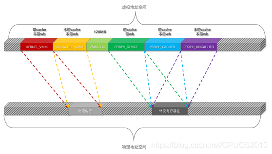

可以看出不同的虚拟地址所对应的cache属性不一样，实际使用时根据不同的需求选择不同的空间使用。

### 2.4 初始化内核临时页表

内核临时页表在系统使能mmu到使用虚拟地址运行这段期间使用。内核临时页表使用__mmu_ttlb_begin来表示，其虚拟地址保存在g_mmuJumpPageTable这个指针中，g_mmuJumpPageTable在kernel\liteos_a\arch\arm\arm\src\los_arch_mmu.c中定义，如下图所示。

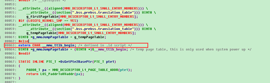

内核临时页表__mmu_ttlb_begin的位置在2.2小节已经分析过是在链接脚本中确定的。

系统首先将内核临时页表清零，这个操作和之前清零内核页表是一样的，如下图所示。

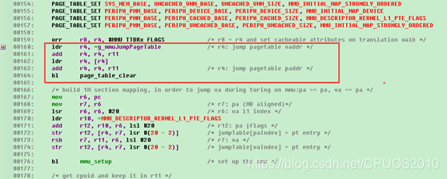

注意图中有一条语句：orr r8, r4, #MMU_TTBRx_FLAGS，这句话的意思的将内核页表物理基址值或上mmu属性标志后的值保存在r8中，这个值也就是页表寄存器的初始化值。

内核临时页表清零后接着计算当前代码的虚拟地址和物理地址分别是在哪两个个1MB段内，并对这两个段建立和当前代码所在的物理地址段映射，如下图所示。

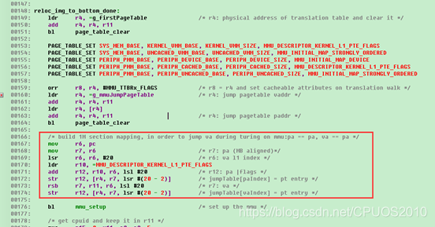

 

其中一个段所对应的物理地址和虚拟地址是一一对应的，至于为什么要这样做，在分析mmu设置代码时会分析到，这里只要知道内核临时页表设置了两个页表项即可，如下图所示。

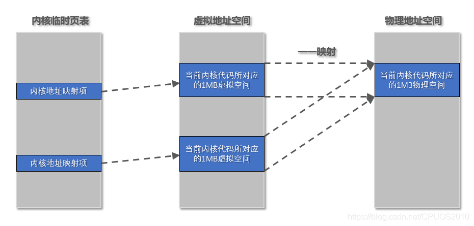

### 2.5 设置mmu

mmu的设置代码如下图所示。

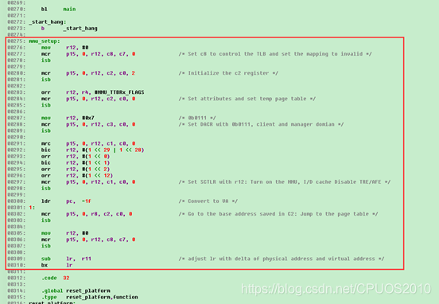

我们这里只分析比较重要的操作，首先将内核临时页表物理基址和mmu属性或起来的值设置到页表基址寄存器中，如下图所示。

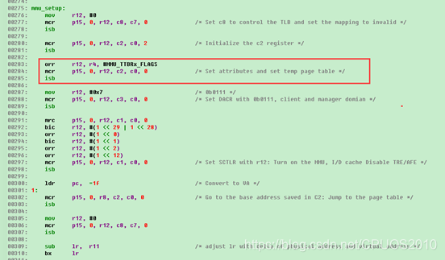

注意这时仅仅是设置了内核临时页表基址，mmu还未使能，紧接着操作系统寄存器使能mmu和i/d cache，如下图所示。

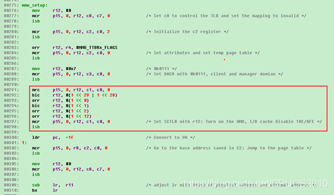

这时mmu使能了，使用的是内核临时页表，这时cpu访问内存不管是取指令还是访问数据都是需要进过mmu来翻译了，但是在mmu使能之前cpu使用的都是内核的物理地址，即使现在使能了mmu，cpu访问的地址值还是内核的物理地址值（这里仅仅从数值上来看），而又由于mmu使能了，所以cpu会把这个值当做虚拟地址的值到页表中去找其对应的物理地址来访问。所以现在明白了为什么要在内核临时页表里建立一个内核物理地址和虚拟地址一一映射的页表项了吧，因为建立了一一映射，cpu访问的地址经过mmu翻译得到的还是和原来一样的值，这样在cpu真正使用虚拟地址之前也能正常运行。

接着通过一句ldr pc, =1f来强制将cpu用虚拟地址工作，因为之前已经在内核临时页表中建立了内核虚拟地址和物理地址的映射关系，所以这时候cpu能正常工作，如下图所示。

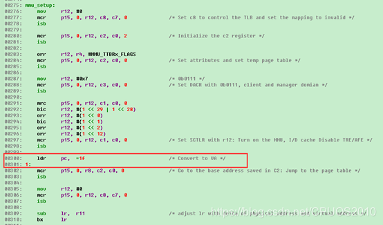

接着重新设置了页表寄存器的值为r8的值，r8的值我们在2.4小节分析过，这时保存的是内核真正工作页表的初始化值，通过设置系统寄存器进行页表的切换，如下图所示。

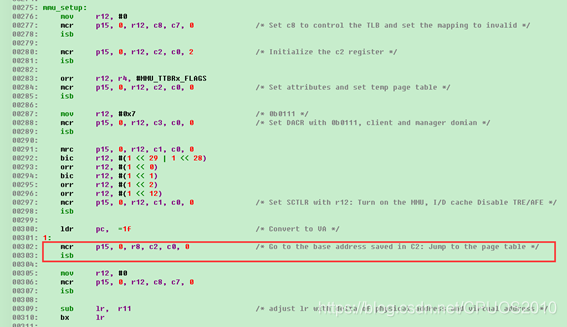

因为lr中保存的是mmu使能之前返回地址的物理地址值，这时需要转换为虚拟地址，转换算法也很简单，虚拟地址=物理地址-r11，然后返回即可。

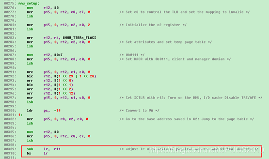

### 2.6 初始化各个cpu模式下的栈

首先判断当前cpu是否是主核，如果是主核则执行栈初始化操作，如果是从核的话就不需要初始化了，如下图所示。

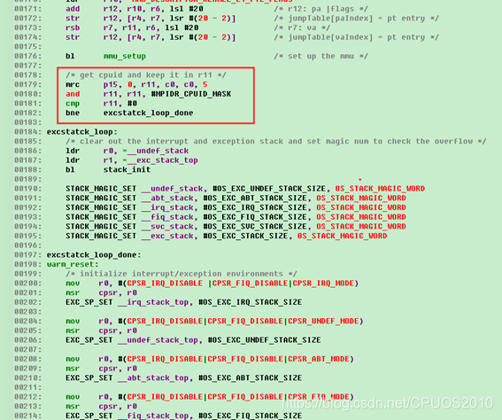

接着对栈空间进行了初始化，如下图所示。

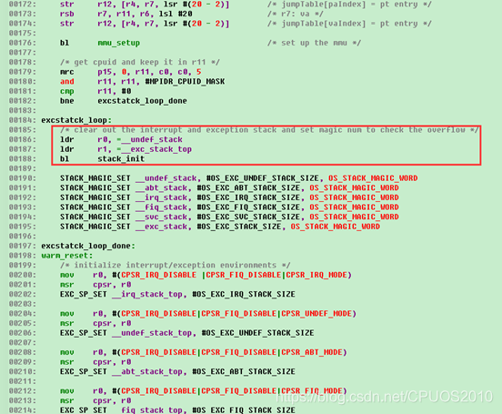

__undef_stack到__exc_stack_top之间的内存都是用作cpu各个模式下的栈空间，如下图所示。可以看出这里的栈是所有cpu核用的。

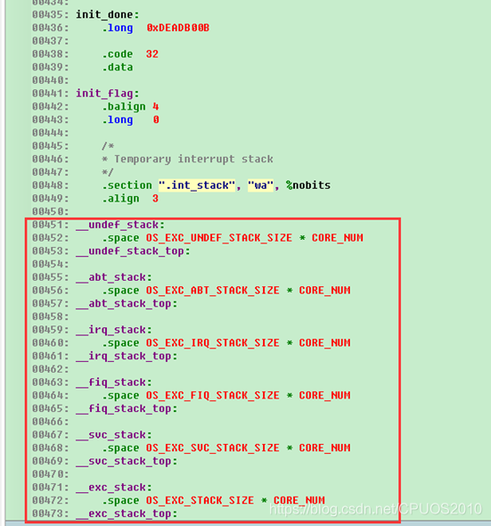

stack_init函数也很简单，就是用OS_STACK_INIT这个数值初始化整个栈空间，如下图所示。

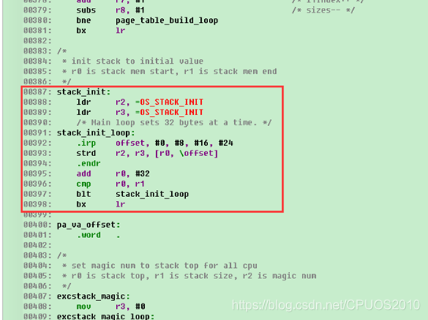

STACK_MAGIC_SET这个宏如下图所示，这个宏有三个参数：

- 栈起始地址
- 栈大小
- 栈要初始化的数值

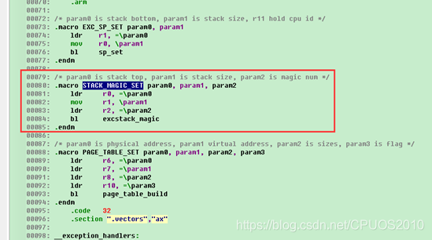

excstack_magic函数也很简单，就是将栈空间设置为固定的值，如下图所示。

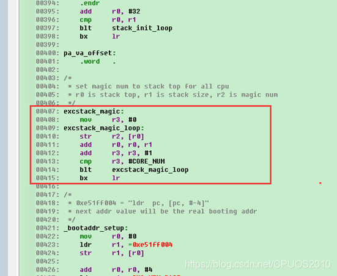

### 2.7 设置各个模式的栈地址

接着将各个模式下的栈地址设置到对应模式下的栈指针sp寄存器中，如下图所示。

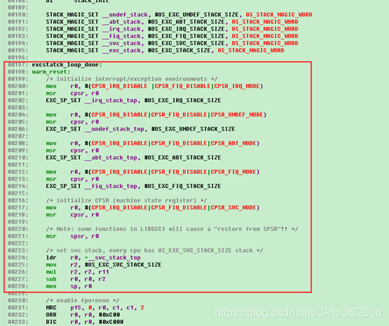

EXC_SP_SET宏有三个参数，如下图所示。

- 栈起始地址
- 栈大小
- 当前cpu id

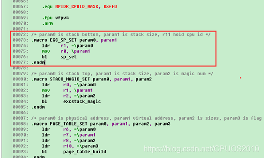

sp_set函数就是根据cpu id来计算正确的栈地址值并设置到sp中，如下图所示。

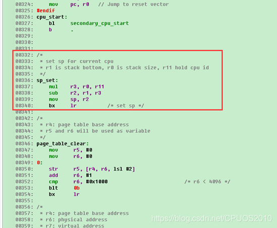

### 2.8 使能fpu+neon

这个就是一些系统寄存器的操作，如下图所示。

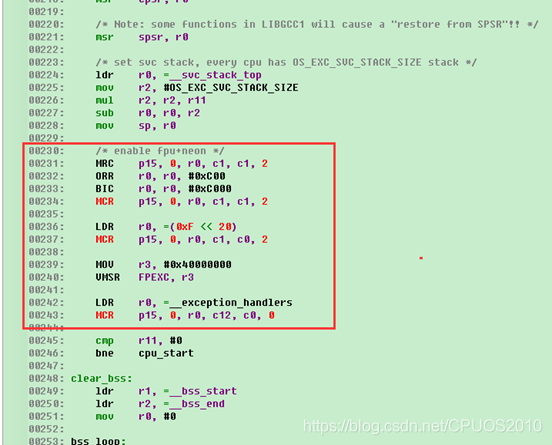

### 2.9 bss段清零

首先判断当前cpu是不是主核，如果是主核，则执行bss段清零，如果是从核则不需要执行bbs段清零，如下图所示。

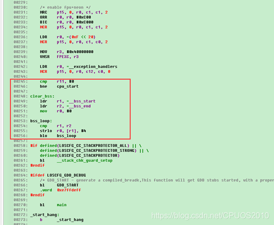

### 2.10 跳转c语言main函数

从汇编跳转c语言的前提是设置好栈地址，这个在前面已经设置好了，这里直接跳到main函数执行，main函数在kernel\liteos_a\platform\main.c中，如下图所示。

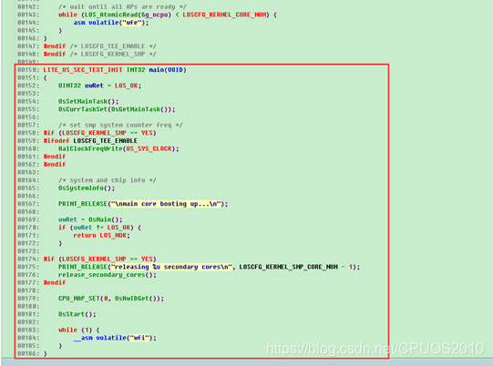

 