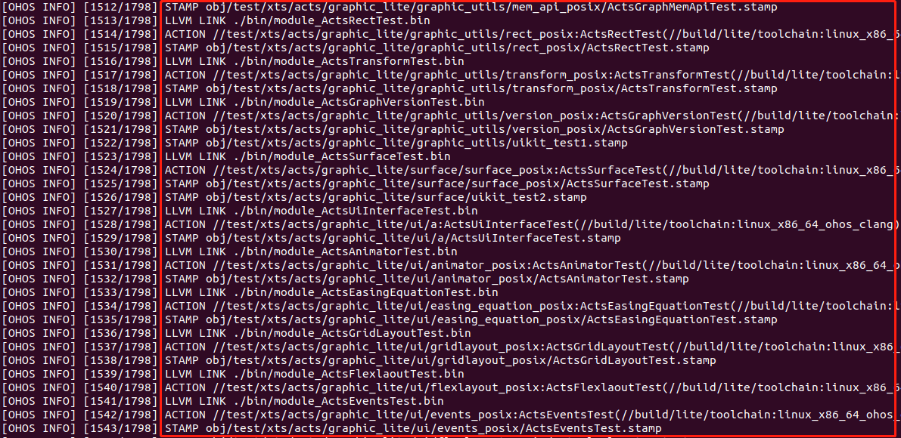

编译运行相关篇为: 

* [v84.02 鸿蒙内核源码分析(编译过程) | 简单案例说透中间过程](/blog/84.md)
* [v85.03 鸿蒙内核源码分析(编译构建) | 编译鸿蒙防掉坑指南](/blog/85.md)
* [v86.04 鸿蒙内核源码分析(GN语法) | 如何构建鸿蒙系统](/blog/86.md)
* [v87.03 鸿蒙内核源码分析(忍者无敌) | 忍者的特点就是一个字](/blog/87.md)
* [v88.04 鸿蒙内核源码分析(ELF格式) | 应用程序入口并非main](/blog/88.md)
* [v89.03 鸿蒙内核源码分析(ELF解析) | 敢忘了她姐俩你就不是银](/blog/89.md)
* [v90.04 鸿蒙内核源码分析(静态链接) | 一个小项目看中间过程](/blog/90.md)
* [v91.04 鸿蒙内核源码分析(重定位) | 与国际接轨的对外发言人](/blog/91.md)
* [v92.01 鸿蒙内核源码分析(动态链接) | 正在制作中 ... ](/blog/92.md)
* [v93.05 鸿蒙内核源码分析(进程映像) | 程序是如何被加载运行的](/blog/93.md)
* [v94.01 鸿蒙内核源码分析(应用启动) | 正在制作中 ... ](/blog/94.md)
* [v95.06 鸿蒙内核源码分析(系统调用) | 开发者永远的口头禅](/blog/95.md)
* [v96.01 鸿蒙内核源码分析(VDSO) | 正在制作中 ... ](/blog/96.md)


### ninja | 忍者

`ninja`是一个叫 `Evan Martin`的谷歌工程师开源的一个自定义的构建系统，最早是用于 `chrome`的构建，`Martin`给它取名 `ninja`(忍者)的原因是因为它`strikes quickly`(快速出击)。这是忍者的特点，看来`Martin`很迷恋岛国文化，动作片估计没少看。 可惜`Martin`不了解中国文化，不然叫小李飞刀更合适些。究竟有多块呢？ 用`Martin`自己的话说是当一个文件被修改后，`ninja`从发现到编译速度是`make`的十倍。有没有十倍不是本篇讨论的重点，人家做出来了，就算是牛皮也该人家吹。本篇是要对鸿蒙如何使用ninja做一个比较详细的阐述。

`ninja`是一个重视速度的构建系统，与其对标的是`Make`，它们都依赖于文件的时间戳进行检测重编。

* 它的设计目的是让更高级别的构建系统生成其输入端文件，其并不希望你手动去编`.ninja`文件，可以生成`.ninja`的工具有`gn`，`cmake`，`premake`，甚至你自己都可以写个 `ninja` 生成工具。
* `ninja`非常高效，可理解为构建系统中的汇编语言。
* `ninja`文件没有分支、循环的流程控制，是被指定了一堆规则的文件，所以要比`Makefile`简单很多
* 目前已知的`GoogleChrome`，`Android`的一部分，`LLVM`， `V8`， 方舟编译器， 鸿蒙 等大型系统都使用到了`ninja`构建。
  
### 基本概念

```txt
概念 中译 解释
edge 边      即build语句，指定目标（输出）、规则与输入，是编译过程拓扑图中的一条边（edge）。
target 目标 编译过程需要产生的目标，由build语句指定。
output 输出 build语句的前半段，是target的另一种称呼。
input 输入 build语句的后半段，用来产生output的文件或目标，另一种称呼是依赖。
rule 规则 通过指定command与一些内置变量，决定如何从输入产生输出。
pool 池      一组rule或edge，通过指定其depth，可以控制并行上限。
scope 作用域 变量的作用范围，有rule与build语句的块级，也有文件级别。rule也有scope。
--------------------------------------------------------------------------------------------
关键字   作用
build   定义一个edge。
rule   定义一个rule。
pool   定义一个pool。
default   指定默认的一个或多个target。
include   添加一个ninja文件到当前scope。
subninja  添加一个ninja文件，其scope与当前文件不同。
phony     一个内置的特殊规则，指定非文件的target。
```

### 简单的ninja

首先 `ninja` 一定是简单的，呆板的。凡是能被工具生成的东西，一定是在不断的重复某种简单，众多的简单按一定的规则有效叠加起来就能解决复杂的问题，请仔细想想是不是这个道理。`ninja`简单到没什么语法，只是几个概念和规则。 以至于 [ninja参考手册](https://weharmony.gitee.io/ninja/index.html) 比 [gn参考手册](https://weharmony.gitee.io/gn/docs/reference.html) 简单的太多。

看个示例:

```shell
cflags = -Wall -Werror  #全局变量
rule cc
  command = gcc $cflags -c $in -o $out

build foo.o: cc foo.c

build special.o: cc special.c
  cflags = -Wall #局部变量，范围只在编译special.c上有效
```

**解读**

* `cflags`:定义一个用户变量，用于给规则传参。
* `rule`:定义一个叫`cc`的规则。
  * `command`:将生成bash命令，接收外部三个参数
* 第一个`build`，将`foo.c`用`cc`规则编译成`foo.o`
  * 最终编译选项:`gcc -Wall -Werror -c foo.c -o foo.o`
* 第二个`build`，将`special.c`用`cc`规则编译成`special.o`
  * 最终编译选项:`gcc -Wall -c foo.c -o foo.o`
* `in`，`out`是`ninja`的两个内置变量。  

### phony规则

跟称呼`弗拉基米尔·弗拉基米罗维奇·普京`为`普总`一样，
有些文件路径会很长，`ninja`提供取别名的功能，这仅仅是为了方便。

```shell
build ability: phony ./libability.so
build ability_notes: phony obj/foundation/aafwk/aafwk_lite/frameworks/ability_lite/ability_notes.stamp
build ability_test: phony obj/foundation/aafwk/aafwk_lite/services/abilitymgr_lite/unittest/ability_test.stamp
build ability_test_pageAbilityTest_group_lv0: phony obj/foundation/aafwk/aafwk_lite/services/abilitymgr_lite/unittest/test_lv0/page_ability_test/ability_test_pageAbilityTest_group_lv0.stamp
```

有了上面的铺垫，读懂鸿蒙的`ninja`部分应该没多大障碍了。

### 鸿蒙 | ninja

在[v60.xx 鸿蒙内核源码分析(gn应用篇) | gn语法及在鸿蒙的使用 ]篇的末尾已说明通过 `gn gen`生成了以下文件和目录

```shell
turing@ubuntu:/home/openharmony/code-v1.1.1-LTS/out/hispark_aries/ipcamera_hispark_aries$ ls
args.gn  build.ninja  build.ninja.d  NOTICE_FILE  obj  test_info  toolchain.ninja
```

* `args.gn` :一些参数
* `build.ninja` : `ninja`的主文件
* `build.ninja.d` :记录生成所有`.ninja` 所依赖的BUILD.gn文件路劲列表，一个BUILD.gn就生成一个.ninja文件
* obj :各组件模块构建/编译文件输出地。
* toolchain :放置ninja规则，将被 subninja 进 build.ninja

### build.ninja

`build.ninja`内容如下:

```shell
ninja_required_version = 1.7.2

rule gn
  command = ../../../../tools/gn --root=../../.. -q --dotfile=../../../build/lite/.gn --script-executable=python3 gen .
  description = Regenerating ninja files

build build.ninja: gn
  generator = 1
  depfile = build.ninja.d

subninja toolchain.ninja


build ability: phony ./libability.so
build ability_notes: phony obj/foundation/aafwk/aafwk_lite/frameworks/ability_lite/ability_notes.stamp
build ability_test: phony obj/foundation/aafwk/aafwk_lite/services/abilitymgr_lite/unittest/ability_test.stamp
build ability_test_pageAbilityTest_group_lv0: phony obj/foundation/aafwk/aafwk_lite/services/abilitymgr_lite/unittest/test_lv0/page_ability_test/ability_test_pageAbilityTest_group_lv0.stamp
#此处省略诸多 phony ..

build all: phony $
    ./libcameraApp.so $
    obj/applications/sample/camera/cameraApp/cameraApp_hap.stamp $
    ./libgallery.so $
    ...

default all
```

**解读**

* 前面部分是定义一个 `gn`规则，用于干嘛呢？ 重新生成一遍 `*ninja`文件
* `subninja`相当于 `#include`文件
* `default all`，指定默认的一个或多个target

### toolchain | 定义规则

`toolchain.ninja` 定义了编译c，c++，汇编器，链接，静态/动态链接库，时间戳，拷贝等规则。 内容如下:

```shell
rule cxx
  command = /root/llvm/bin/clang++ ${defines} ${include_dirs} ${cflags_cc} -c ${in} -o ${out}
  description = clang++ ${out}
  depfile = ${out}.d
  deps = gcc
rule alink
  command = /root/llvm/bin/llvm-ar -cr ${out} @"${out}.rsp"
  description = AR ${out}
  rspfile = ${out}.rsp
  rspfile_content = ${in}
rule link
  command = /root/llvm/bin/clang ${ldflags} ${in} ${libs}   -o ${output_dir}/bin/${target_output_name}${output_extension}
  description = LLVM LINK ${output_dir}/bin/${target_output_name}${output_extension}
  rspfile = ${output_dir}/bin/${target_output_name}${output_extension}.rsp
  rspfile_content = ${in}
rule solink
  command = /root/llvm/bin/clang -shared ${ldflags} ${in} ${libs} -o ${output_dir}/${target_output_name}${output_extension}
  description = SOLINK ${output_dir}/${target_output_name}${output_extension}
  rspfile = ${output_dir}/${target_output_name}${output_extension}.rsp
  rspfile_content = ${in}
rule stamp
  command = /usr/bin/touch ${out}
  description = STAMP ${out}
rule asm
  command = /root/llvm/bin/clang ${include_dirs} ${asmflags} -c ${in} -o ${out}
  description = ASM ${out}
  depfile = ${out}.d
  deps = gcc
rule cc
  command = /root/llvm/bin/clang ${defines} ${include_dirs} ${cflags} ${cflags_c} -c ${in} -o ${out}
  description = clang ${out}
rule copy
  command = cp -afd ${in} ${out}
  description = COPY ${in} ${out}
```

* 注意这些规则中的描述`description`字段，其后面的内容会打到控制台上，每一条输出都是一次 `build`，如图所示，通过这些描述就知道使用了什么规则去构建。

  

### 组件编译

本篇以编译`ability`组件为例说明 `ninja`对组件的编译情况。每个组件都有自己的`.ninja`，描述组件的编译细节。而整个鸿蒙系统就是由众多的类似`.ninja`构建编译完成的。

```
├── foundation
│   ├── aafwk
│   │   └── aafwk_lite
│   │       ├── frameworks
│   │       │   ├── ability_lite
│   │       │   │   └── ability.ninja
```

`ability.ninja`内容如下:

```shell
defines = -DOHOS_APPEXECFWK_BMS_BUNDLEMANAGER \
          -D_XOPEN_SOURCE=700 -DOHOS_DEBUG \
          -D_FORTIFY_SOURCE=2 \
          -D__LITEOS__ -D__LITEOS_A__
include_dirs = -I../../../foundation/aafwk/aafwk_lite/frameworks/abilitymgr_lite/include \
               -I../../../foundation/aafwk/aafwk_lite/frameworks/want_lite/include \
               -I../../../foundation/aafwk/aafwk_lite/interfaces/innerkits/abilitymgr_lite \
               -I../../../foundation/aafwk/aafwk_lite/interfaces/kits/want_lite \
               -I../../../foundation/aafwk/aafwk_lite/interfaces/kits/ability_lite \
               -I../../../foundation/appexecfwk/appexecfwk_lite/utils/bundle_lite \
               -I../../../foundation/appexecfwk/appexecfwk_lite/interfaces/kits/bundle_lite \
               -I../../../foundation/appexecfwk/appexecfwk_lite/frameworks/bundle_lite/include \
               -I../../../foundation/graphic/ui/frameworks -I../../../foundation/graphic/surface/interfaces/kits \
               -I../../../foundation/distributedschedule/samgr_lite/interfaces/kits/registry \
               -I../../../foundation/distributedschedule/samgr_lite/interfaces/kits/samgr \
               -I../../../foundation/communication/ipc_lite/frameworks/liteipc/include \
               -I../../../kernel/liteos_a/kernel/include \
               -I../../../kernel/liteos_a/kernel/common \
               -I../../../third_party/bounds_checking_function/include \
               -I../../../third_party/freetype/include \
               -I../../../utils/native/lite/kv_store/innerkits \
               -I../../../utils/native/lite/include \
               -I../../../foundation/aafwk/aafwk_lite/frameworks/ability_lite/include \
               -I../../../foundation/aafwk/aafwk_lite/frameworks/ability_lite \
               -I/root/llvm/include/c++/v1 \
               -I../../../prebuilts/lite/sysroot/usr/include/arm-liteos \
               -I../../../base/hiviewdfx/hilog_lite/interfaces/native/innerkits/hilog \
               -I../../../base/hiviewdfx/hilog_lite/interfaces/native/innerkits \
               -I../../../third_party/bounds_checking_function/include \
               -I../../../third_party/bounds_checking_function/include \
               -I../../../foundation/communication/ipc_lite/interfaces/kits \
               -I../../../utils/native/lite/include
cflags = -Wall -Wno-format -Wno-format-extra-args -fPIC \
          --target=arm-liteos \
          --sysroot=/home/openharmony/prebuilts/lite/sysroot \
          -Oz -flto -mfloat-abi=softfp -mcpu=cortex-a7 -nostdlib -fno-common -fno-builtin -fno-strict-aliasing -Wall -fsigned-char -mno-unaligned-access -fno-omit-frame-pointer -fstack-protector-all -fPIC
cflags_cc = -Wall -Wno-format -Wno-format-extra-args -fPIC \
            --target=arm-liteos \
            --sysroot=/home/openharmony/prebuilts/lite/sysroot \
            -Oz -flto -mfloat-abi=softfp -mcpu=cortex-a7 -nostdlib -fno-common -fno-builtin -fno-strict-aliasing -Wall -mno-unaligned-access -fno-omit-frame-pointer -fstack-protector-all -fexceptions -std=c++11 -fPIC
target_output_name = libability

build obj/foundation/aafwk/aafwk_lite/frameworks/ability_lite/src/libability.ability.o: cxx ../../../foundation/aafwk/aafwk_lite/frameworks/ability_lite/src/ability.cpp
build obj/foundation/aafwk/aafwk_lite/frameworks/ability_lite/src/libability.ability_context.o: cxx ../../../foundation/aafwk/aafwk_lite/frameworks/ability_lite/src/ability_context.cpp
build obj/foundation/aafwk/aafwk_lite/frameworks/ability_lite/src/libability.ability_env.o: cxx ../../../foundation/aafwk/aafwk_lite/frameworks/ability_lite/src/ability_env.cpp
build obj/foundation/aafwk/aafwk_lite/frameworks/ability_lite/src/libability.ability_env_impl.o: cxx ../../../foundation/aafwk/aafwk_lite/frameworks/ability_lite/src/ability_env_impl.cpp
build obj/foundation/aafwk/aafwk_lite/frameworks/ability_lite/src/libability.ability_event_handler.o: cxx ../../../foundation/aafwk/aafwk_lite/frameworks/ability_lite/src/ability_event_handler.cpp
build obj/foundation/aafwk/aafwk_lite/frameworks/ability_lite/src/libability.ability_loader.o: cxx ../../../foundation/aafwk/aafwk_lite/frameworks/ability_lite/src/ability_loader.cpp
build obj/foundation/aafwk/aafwk_lite/frameworks/ability_lite/src/libability.ability_main.o: cxx ../../../foundation/aafwk/aafwk_lite/frameworks/ability_lite/src/ability_main.cpp
build obj/foundation/aafwk/aafwk_lite/frameworks/ability_lite/src/libability.ability_scheduler.o: cxx ../../../foundation/aafwk/aafwk_lite/frameworks/ability_lite/src/ability_scheduler.cpp
build obj/foundation/aafwk/aafwk_lite/frameworks/ability_lite/src/libability.ability_thread.o: cxx ../../../foundation/aafwk/aafwk_lite/frameworks/ability_lite/src/ability_thread.cpp

build ./libability.so: solink \
  obj/foundation/aafwk/aafwk_lite/frameworks/ability_lite/src/libability.ability.o \
  obj/foundation/aafwk/aafwk_lite/frameworks/ability_lite/src/libability.ability_context.o \
  obj/foundation/aafwk/aafwk_lite/frameworks/ability_lite/src/libability.ability_env.o \
  obj/foundation/aafwk/aafwk_lite/frameworks/ability_lite/src/libability.ability_env_impl.o \
  obj/foundation/aafwk/aafwk_lite/frameworks/ability_lite/src/libability.ability_event_handler.o \
  obj/foundation/aafwk/aafwk_lite/frameworks/ability_lite/src/libability.ability_loader.o \
  obj/foundation/aafwk/aafwk_lite/frameworks/ability_lite/src/libability.ability_main.o \
  obj/foundation/aafwk/aafwk_lite/frameworks/ability_lite/src/libability.ability_scheduler.o \
  obj/foundation/aafwk/aafwk_lite/frameworks/ability_lite/src/libability.ability_thread.o \
  ./libabilitymanager.so ./libbundle.so ./libhilog_shared.so ./libliteipc_adapter.so \
  ./libsec_shared.so ./libutils_kv_store.so || obj/utils/native/lite/kv_store/kv_store.stamp
  ldflags = -lstdc++ \
  --target=arm-liteos \
  --sysroot=/home/openharmony/prebuilts/lite/sysroot \
  -L/root/llvm/lib/arm-liteos/c++ \
  -L/home/openharmony/prebuilts/lite/sysroot/usr/lib/arm-liteos \
  -L/root/llvm/lib/clang/9.0.0/lib/arm-liteos \
  -lclang_rt.builtins -lc -lc++ -lc++abi \
  --sysroot=/home/openharmony/prebuilts/lite/sysroot \
  -mcpu=cortex-a7 -lc \
  -L/home/openharmony/out/hispark_aries/ipcamera_hispark_aries \
  -Wl，-rpath-link=/home/openharmony/out/hispark_aries/ipcamera_hispark_aries -Wl，-z，now -Wl，-z，relro -Wl，-z，noexecstack
  libs =
  frameworks =
  output_extension = .so
  output_dir = .
```

**解读**

* `defines`，`include_dirs`，`cflags_cc`都是用户自定义变量，为了给 `rule cxx`准备参数，对`.cpp`的编译使用了这个规则

  ```shell
  rule cxx
    command = /root/llvm/bin/clang++ ${defines} ${include_dirs} ${cflags_cc} -c ${in} -o ${out}
    description = clang++ ${out}
    depfile = ${out}.d
    deps = gcc
  ```

* `in`，`out`是两个内置变量，无须定义，值由`build`提供，如此就编译成了一个个的 `.o`文件。
* 在最后在当前目录下使用了`solink`规则，生成一个动态链接库`libability.so`。

  ```shell
  rule solink
    command = /root/llvm/bin/clang -shared ${ldflags} ${in} ${libs} -o ${output_dir}/${target_output_name}${output_extension}
    description = SOLINK ${output_dir}/${target_output_name}${output_extension}
    rspfile = ${output_dir}/${target_output_name}${output_extension}.rsp
    rspfile_content = ${in}
  ```

### ability | 最终生成文件

```shell
turing@ubuntu:/home/openharmony/code-v1.1.1-LTS/out/hispark_aries/ipcamera_hispark_aries/obj/foundation/aafwk/aafwk_lite/frameworks/ability_lite$ tree
.
├── aafwk_abilitykit_lite.stamp
├── ability.ninja
├── ability_notes.stamp
└── src
    ├── libability.ability_context.o
    ├── libability.ability_env_impl.o
    ├── libability.ability_env.o
    ├── libability.ability_event_handler.o
    ├── libability.ability_loader.o
    ├── libability.ability_main.o
    ├── libability.ability.o
    ├── libability.ability_scheduler.o
    └── libability.ability_thread.o

1 directory， 12 files
turing@ubuntu:/home/openharmony/code-v1.1.1-LTS/out/hispark_aries/ipcamera_hispark_aries/obj/foundation/aafwk/aafwk_lite/frameworks/ability_lite$ stat ability_notes.stamp 
  File: ability_notes.stamp
  Size: 0          Blocks: 0          IO Block: 4096   regular empty file
Device: 805h/2053d Inode: 1217028     Links: 1
Access：(0644/-rw-r--r--)  Uid：( 1000/  turing)   Gid：(    0/    root)
Access: 2021-07-21 00:38:52.237373740 -0700
Modify: 2021-07-21 00:34:30.207312566 -0700
Change: 2021-07-21 00:34:30.207312566 -0700
```


  

