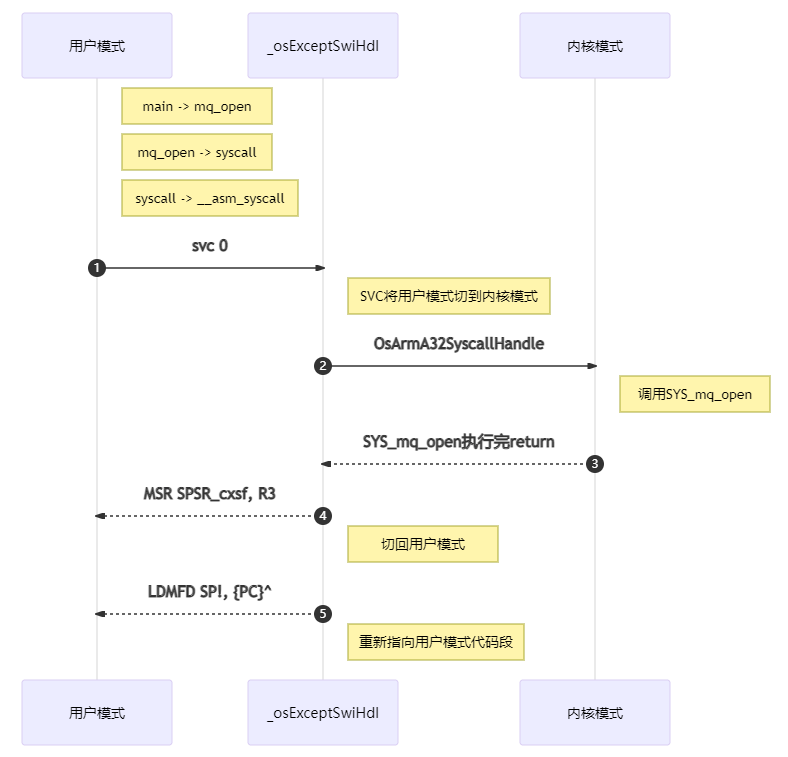
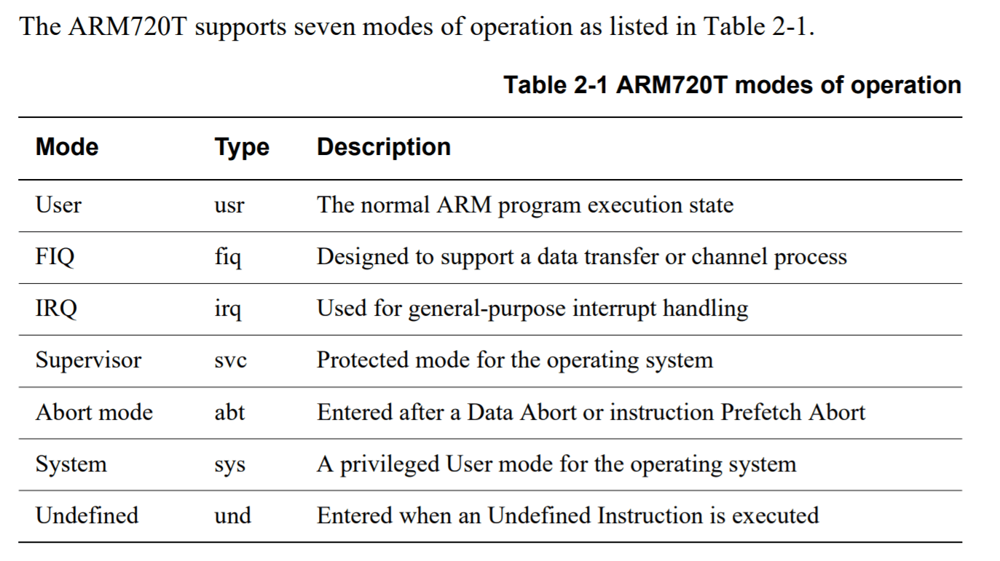

编译运行相关篇为: 

* [v84.02 鸿蒙内核源码分析(编译过程) | 简单案例说透中间过程](/blog/84.md)
* [v85.03 鸿蒙内核源码分析(编译构建) | 编译鸿蒙防掉坑指南](/blog/85.md)
* [v86.04 鸿蒙内核源码分析(GN语法) | 如何构建鸿蒙系统](/blog/86.md)
* [v87.03 鸿蒙内核源码分析(忍者无敌) | 忍者的特点就是一个字](/blog/87.md)
* [v88.04 鸿蒙内核源码分析(ELF格式) | 应用程序入口并非main](/blog/88.md)
* [v89.03 鸿蒙内核源码分析(ELF解析) | 敢忘了她姐俩你就不是银](/blog/89.md)
* [v90.04 鸿蒙内核源码分析(静态链接) | 一个小项目看中间过程](/blog/90.md)
* [v91.04 鸿蒙内核源码分析(重定位) | 与国际接轨的对外发言人](/blog/91.md)
* [v92.01 鸿蒙内核源码分析(动态链接) | 正在制作中 ... ](/blog/92.md)
* [v93.05 鸿蒙内核源码分析(进程映像) | 程序是如何被加载运行的](/blog/93.md)
* [v94.01 鸿蒙内核源码分析(应用启动) | 正在制作中 ... ](/blog/94.md)
* [v95.06 鸿蒙内核源码分析(系统调用) | 开发者永远的口头禅](/blog/95.md)
* [v96.01 鸿蒙内核源码分析(VDSO) | 正在制作中 ... ](/blog/96.md)


### 本篇说清楚系统调用

读本篇之前建议先读v08。xx 鸿蒙内核源码分析(总目录)  工作模式篇。

本篇通过一张图和七段代码详细说明系统调用的整个过程，代码一捅到底，直到汇编层再也捅不下去。
先看图，这里的模式可以理解为空间，因为模式不同运行的栈空间就不一样。



**过程解读**

* 在应用层`main`中使用系统调用`mq_open`(posix标准接口)
* `mq_open`被封装在库中，这里直接看库里的代码。
* `mq_open`中调用`syscall`，将参数传给寄出器 `R7，R0~R6`
* `SVC 0` 完成用户模式到内核模式(SVC)的切换
* `_osExceptSwiHdl`运行在svc模式下。
* PC寄存器直接指向`_osExceptSwiHdl`处取指令。
* `_osExceptSwiHdl`是汇编代码，先保存用户模式现场(R0~R12寄存器)，并调用`OsArmA32SyscallHandle`完成系统调用
* `OsArmA32SyscallHandle`中通过系统调用号(保存在R7寄存器)查询对应的注册函数`SYS_mq_open`
* `SYS_mq_open`是本次系统调用的实现函数，完成后return回到`OsArmA32SyscallHandle`
* `OsArmA32SyscallHandle`再return回到`_osExceptSwiHdl`
* `_osExceptSwiHdl`恢复用户模式现场(R0~R12寄存器)
* 从内核模式(SVC)切回到用户模式，PC寄存器也切回用户现场。
* 由此完成整个系统调用全过程

### 七段追踪代码，逐个分析

### 1.应用程序 main

```c
int main(void)
{
 char mqname[NAMESIZE]， msgrv1[BUFFER]， msgrv2[BUFFER];
 const char *msgptr1 = "test message1";
 const char *msgptr2 = "test message2 with differnet length";
 mqd_t mqdes;
 int prio1 = 1， prio2 = 2;
 struct timespec ts;
 struct mq_attr attr;
 int unresolved = 0， failure = 0;
 sprintf(mqname， "/" FUNCTION "_" TEST "_%d"， getpid());
 attr.mq_msgsize = BUFFER;
 attr.mq_maxmsg = BUFFER;
 mqdes = mq_open(mqname， O_CREAT | O_RDWR， S_IRUSR | S_IWUSR， &attr);
 if (mqdes == (mqd_t)-1) {
  perror(ERROR_PREFIX "mq_open");
  unresolved = 1;
 }
 if (mq_send(mqdes， msgptr1， strlen(msgptr1)， prio1) != 0) {
  perror(ERROR_PREFIX "mq_send");
  unresolved = 1;
 }
 printf("Test PASSED\n");
 return PTS_PASS;
}
```

### 2. mq_open 发起系统调用

```c
mqd_t mq_open(const char *name， int flags， ...)
{
 mode_t mode = 0;
 struct mq_attr *attr = 0;
 if (*name == '/') name++;
 if (flags & O_CREAT) {
  va_list ap;
  va_start(ap， flags);
  mode = va_arg(ap， mode_t);
  attr = va_arg(ap， struct mq_attr *);
  va_end(ap);
 }
 return syscall(SYS_mq_open， name， flags， mode， attr);
}
```

**解读**

* `SYS_mq_open` 是真正的系统调用函数，对应一个系统调用号`__NR_mq_open`，通过宏`SYSCALL_HAND_DE`F将`SysMqOpen`注册到`g_syscallHandle`中。

```c
static UINTPTR g_syscallHandle[SYS_CALL_NUM] = {0}; //系统调用入口函数注册
static UINT8 g_syscallNArgs[(SYS_CALL_NUM + 1) / NARG_PER_BYTE] = {0};//保存系统调用对应的参数数量
#define SYSCALL_HAND_DEF(id， fun， rType， nArg)                                             \
    if ((id) < SYS_CALL_NUM) {                                                             \
        g_syscallHandle[(id)] = (UINTPTR)(fun);                                            \
        g_syscallNArgs[(id) / NARG_PER_BYTE] |= ((id) & 1) ？ (nArg) << NARG_BITS ：(nArg); \
    }                                                                                      \

    #include "syscall_lookup.h"
#undef SYSCALL_HAND_DEF

SYSCALL_HAND_DEF(__NR_mq_open， SysMqOpen， mqd_t， ARG_NUM_4)  
```

* `g_syscallNArgs`为注册函数的参数个数，也会一块记录下来。
* 四个参数为 SYS_mq_open的四个参数，后续将保存在R0~R3寄存器中

### 3. syscall

```c
long syscall(long n， ...)
{
 va_list ap;
 syscall_arg_t a，b，c，d，e，f;
 va_start(ap， n);
 a=va_arg(ap， syscall_arg_t);
 b=va_arg(ap， syscall_arg_t);
 c=va_arg(ap， syscall_arg_t);
 d=va_arg(ap， syscall_arg_t);
 e=va_arg(ap， syscall_arg_t);
 f=va_arg(ap， syscall_arg_t);//最多6个参数
 va_end(ap);
 return __syscall_ret(__syscall(n，a，b，c，d，e，f));
}
//4个参数的系统调用时底层处理
static inline long __syscall4(long n， long a， long b， long c， long d)
{
 register long a7 __asm__("a7") = n; //将系统调用号保存在R7寄存器
 register long a0 __asm__("a0") = a; //R0
 register long a1 __asm__("a1") = b; //R1
 register long a2 __asm__("a2") = c; //R2
 register long a3 __asm__("a3") = d; //R3
 __asm_syscall("r"(a7)， "0"(a0)， "r"(a1)， "r"(a2)， "r"(a3))
}
```

**解读**

* 可变参数实现所有系统调用的参数的管理，可以看出，在鸿蒙内核中系统调用的参数最多不能大于6个
* R7寄存器保存了系统调用号，R0~R5保存具体每个参数
* 可变参数的具体实现后续有其余篇幅详细介绍，敬请关注。

### 4. svc 0

```c
//切到SVC模式
#define __asm_syscall(...) do { \
 __asm__ __volatile__ ( "svc 0" \
 : "=r"(x0) : __VA_ARGS__ : "memory"， "cc"); \
 return x0; \
 } while (0)
```

看不太懂的没关系，这里我们只需要记住：系统调用号存放在r7寄存器，参数存放在r0，r1，r2寄存器中，返回值最终会存放在寄存器r0中




```c
    b   reset_vector            @开机代码
    b   _osExceptUndefInstrHdl  @异常处理之CPU碰到不认识的指令
    b   _osExceptSwiHdl   @异常处理之:软中断
    b   _osExceptPrefetchAbortHdl @异常处理之:取指异常
    b   _osExceptDataAbortHdl  @异常处理之:数据异常
    b   _osExceptAddrAbortHdl  @异常处理之:地址异常
    b   OsIrqHandler    @异常处理之:硬中断
    b   _osExceptFiqHdl    @异常处理之:快中断
```

**解读**

* `svc` 全称是 SuperVisor Call，完成工作模式的切换。不管之前是7个模式中的哪个模式，统一都切到`SVC`管理模式。但你也许会好奇，ARM软中断不是用`SWI`吗，这里怎么变成了`SVC`了，请看下面一段话，是从ARM官网翻译的：
    >   SVC
        超级用户调用。
        语法
        SVC{cond} #immed
        其中：
        cond
            是一个可选的条件代码（请参阅条件执行）。
        immed
            是一个表达式，其取值为以下范围内的一个整数：
                在 ARM 指令中为 0 到 224–1（24 位值）
                在 16 位 Thumb 指令中为 0-255（8 位值）。
        用法
        SVC 指令会引发一个异常。 这意味着处理器模式会更改为超级用户模式，CPSR 会保存到超级用户模式 SPSR，并且执行会跳转到 SVC 向量（请参阅《开发指南》中的第 6 章 处理处理器异常）。
        处理器会忽略 immed。 但异常处理程序会获取它，借以确定所请求的服务。
        Note
        作为 ARM 汇编语言开发成果的一部分，SWI 指令已重命名为 SVC。 在此版本的 RVCT 中，SWI 指令反汇编为 SVC，并提供注释以指明这是以前的 SWI。
        条件标记
        此指令不更改标记。
        体系结构
        此 ARM 指令可用于所有版本的 ARM 体系结构。
* 而软中断对应的处理函数为 `_osExceptSwiHdl`，即PC寄存器将跳到`_osExceptSwiHdl`执行

### 5. _osExceptSwiHdl

```c
@ Description: Software interrupt exception handler
_osExceptSwiHdl: @软中断异常处理
    @保存任务上下文(TaskContext) 开始... 一定要对照TaskContext来理解
    SUB     SP， SP， #(4 * 16) @先申请16个栈空间用于处理本次软中断
    STMIA   SP， {R0-R12}  @TaskContext.R[GEN_REGS_NUM] STMIA从左到右执行，先放R0 .. R12
    MRS     R3， SPSR   @读取本模式下的SPSR值
    MOV     R4， LR    @保存回跳寄存器LR

    AND     R1， R3， #CPSR_MASK_MODE                          @ Interrupted mode 获取中断模式
    CMP     R1， #CPSR_USER_MODE                              @ User mode 是否为用户模式
    BNE     OsKernelSVCHandler                               @ Branch if not user mode 非用户模式下跳转
 @ 当为用户模式时，获取SP和LR寄出去值
    @ we enter from user mode， we need get the values of  USER mode r13(sp) and r14(lr).
    @ stmia with ^ will return the user mode registers (provided that r15 is not in the register list).
    MOV     R0， SP            @获取SP值，R0将作为OsArmA32SyscallHandle的参数
    STMFD   SP!， {R3}                                        @ Save the CPSR 入栈保存CPSR值 => TaskContext.regPSR
    ADD     R3， SP， #(4 * 17)                                @ Offset to pc/cpsr storage 跳到PC/CPSR存储位置
    STMFD   R3!， {R4}                                        @ Save the CPSR and r15(pc) 保存LR寄存器 => TaskContext.PC
    STMFD   R3， {R13， R14}^                                  @ Save user mode r13(sp) and r14(lr) 从右向左 保存 => TaskContext.LR和SP
    SUB     SP， SP， #4           @ => TaskContext.resved
    PUSH_FPU_REGS R1 @保存中断模式(用户模式模式)           
 @保存任务上下文(TaskContext) 结束
    MOV     FP， #0                                           @ Init frame pointer
    CPSIE   I @开中断，表明在系统调用期间可响应中断
    BLX     OsArmA32SyscallHandle /*交给C语言处理系统调用，参数为R0，指向TaskContext的开始位置*/
    CPSID   I @执行后续指令前必须先关中断
 @恢复任务上下文(TaskContext) 开始
    POP_FPU_REGS R1            @弹出FP值给R1
    ADD     SP， SP，#4           @ 定位到保存旧SPSR值的位置
    LDMFD   SP!， {R3}                                        @ Fetch the return SPSR 弹出旧SPSR值
    MSR     SPSR_cxsf， R3                                    @ Set the return mode SPSR 恢复该模式下的SPSR值

    @ we are leaving to user mode， we need to restore the values of USER mode r13(sp) and r14(lr).
    @ ldmia with ^ will return the user mode registers (provided that r15 is not in the register list)

    LDMFD   SP!， {R0-R12}          @恢复R0-R12寄存器
    LDMFD   SP， {R13， R14}^                                  @ Restore user mode R13/R14 恢复用户模式的R13/R14寄存器
    ADD     SP， SP， #(2 * 4)         @定位到保存旧PC值的位置
    LDMFD   SP!， {PC}^                                       @ Return to user 切回用户模式运行
 @恢复任务上下文(TaskContext) 结束

OsKernelSVCHandler:@主要目的是保存ExcContext中除(R0~R12)的其他寄存器
    ADD     R0， SP， #(4 * 16) @跳转到保存PC，LR，SP的位置，此时R0位置刚好是SP的位置
    MOV     R5， R0    @由R5记录SP位置，因为R0要暂时充当SP寄存器来使用
    STMFD   R0!， {R4}                                        @ Store PC => ExcContext.PC
    STMFD   R0!， {R4}           @ 相当于保存了=>  ExcContext.LR
    STMFD   R0!， {R5}           @ 相当于保存了=>  ExcContext.SP

    STMFD   SP!， {R3}                                        @ Push task`s CPSR (i.e. exception SPSR). =>ExcContext.regPSR
    SUB     SP， SP， #(4 * 2)                                 @ user sp and lr => =>ExcContext.USP，ULR

    MOV     R0， #OS_EXCEPT_SWI                               @ Set exception ID to OS_EXCEPT_SWI.
                @ 设置异常ID为软中断
    B       _osExceptionSwi                                  @ Branch to global exception handler.
                @ 跳到全局异常处理
```

**解读**

* 运行到此处，已经切到SVC的栈运行，所以先保存上一个模式的现场
* 获取中断模式，软中断的来源可不一定是用户模式，完全有可能是SVC本身，比如系统调用中又发生系统调用。就变成了从SVC模式切到SVC的模式
* `MOV     R0， SP` ;sp将作为参数传递给`OsArmA32SyscallHandle`
* 调用 `OsArmA32SyscallHandle` 这是所有系统调用的统一入口
* 注意看`OsArmA32SyscallHandle`的参数 `UINT32 *regs`

### 6. OsArmA32SyscallHandle

```c
/* The SYSCALL ID is in R7 on entry.  Parameters follow in R0..R6 */
/******************************************************************
由汇编调用，见于 los_hw_exc.S    / BLX    OsArmA32SyscallHandle
SYSCALL是产生系统调用时触发的信号，R7寄存器存放具体的系统调用ID，也叫系统调用号
regs:参数就是所有寄存器
注意:本函数在用户态和内核态下都可能被调用到
//MOV     R0， SP @获取SP值，R0将作为OsArmA32SyscallHandle的参数
******************************************************************/
LITE_OS_SEC_TEXT UINT32 *OsArmA32SyscallHandle(UINT32 *regs)
{
    UINT32 ret;
    UINT8 nArgs;
    UINTPTR handle;
    UINT32 cmd = regs[REG_R7];//C7寄存器记录了触发了具体哪个系统调用
 
    if (cmd >= SYS_CALL_NUM) {//系统调用的总数
        PRINT_ERR("Syscall ID: error %d !!!\n"， cmd);
        return regs;
    }

    if (cmd == __NR_sigreturn) {//收到 __NR_sigreturn 信号
        OsRestorSignalContext(regs);//恢复信号上下文
        return regs;
    }

    handle = g_syscallHandle[cmd];//拿到系统调用的注册函数，类似 SysRead 
    nArgs = g_syscallNArgs[cmd / NARG_PER_BYTE]; /* 4bit per nargs */
    nArgs = (cmd & 1) ？ (nArgs >> NARG_BITS) ：(nArgs & NARG_MASK);//获取参数个数
    if ((handle == 0) || (nArgs > ARG_NUM_7)) {//系统调用必须有参数且参数不能大于8个
        PRINT_ERR("Unsupport syscall ID: %d nArgs: %d\n"， cmd， nArgs);
        regs[REG_R0] = -ENOSYS;
        return regs;
    }
 //regs[0-6] 记录系统调用的参数，这也是由R7寄存器保存系统调用号的原因
    switch (nArgs) {//参数的个数 
        case ARG_NUM_0:
        case ARG_NUM_1:
            ret = (*(SyscallFun1)handle)(regs[REG_R0]);//执行系统调用，类似 SysUnlink(pathname);
            break;
        case ARG_NUM_2://如何是两个参数的系统调用，这里传三个参数也没有问题，因被调用函数不会去取用R2值
        case ARG_NUM_3:
            ret = (*(SyscallFun3)handle)(regs[REG_R0]， regs[REG_R1]， regs[REG_R2]);//类似 SysExecve(fileName， argv， envp);
            break;
        case ARG_NUM_4:
        case ARG_NUM_5:
            ret = (*(SyscallFun5)handle)(regs[REG_R0]， regs[REG_R1]， regs[REG_R2]， regs[REG_R3]，
                                         regs[REG_R4]);
            break;
        default: //7个参数的情况
            ret = (*(SyscallFun7)handle)(regs[REG_R0]， regs[REG_R1]， regs[REG_R2]， regs[REG_R3]，
                                         regs[REG_R4]， regs[REG_R5]， regs[REG_R6]);
    }

    regs[REG_R0] = ret;//R0保存系统调用返回值
    OsSaveSignalContext(regs);//保存信号上下文现场

    /* Return the last value of curent_regs.  This supports context switches on return from the exception.
     * That capability is only used with theSYS_context_switch system call.
     */
    return regs;//返回寄存器的值
}
```

**解读**

* 参数是`regs`对应的就是R0~Rn
* R7保存的是系统调用号，R0~R3保存的是 `SysMqOpen`的四个参数
* `g_syscallHandle[cmd]`就能查询到 `SYSCALL_HAND_DEF(__NR_mq_open， SysMqOpen， mqd_t， ARG_NUM_4)`注册时对应的 `SysMqOpen`函数
* `*(SyscallFun5)handle`此时就是`SysMqOpen`
* 注意看 SysMqOpen 的参数是最开始的 `main`函数中的
   `mqdes = mq_open(mqname， O_CREAT | O_RDWR， S_IRUSR | S_IWUSR， &attr);`
  由此完成了真正系统调用的过程

### 7. SysMqOpen

```c
mqd_t SysMqOpen(const char *mqName， int openFlag， mode_t mode， struct mq_attr *attr)
{
    mqd_t ret;
    int retValue;
    char kMqName[PATH_MAX + 1] = { 0 };

    retValue = LOS_StrncpyFromUser(kMqName， mqName， PATH_MAX);
    if (retValue < 0) {
        return retValue;
    }
    ret = mq_open(kMqName， openFlag， mode， attr);//一个消息队列可以有多个进程向它读写消息
    if (ret == -1) {
        return (mqd_t)-get_errno();
    }
    return ret;
}
```

**解读**

* 此处的`mq_open`和main函数的`mq_open`其实是两个函数体实现。一个是给应用层的调用，一个是内核层使用，只是名字一样而已。
* `SysMqOpen`是返回到 `OsArmA32SyscallHandle` `regs[REG_R0] = ret;`
* `OsArmA32SyscallHandle`再返回到 `_osExceptSwiHdl`
* `_osExceptSwiHdl`后面的代码是用于恢复用户模式现场和`SPSR`，`PC` 等寄存器。

以上为鸿蒙系统调用的整个过程。  
关于寄存器(R0~R15)在每种模式下的使用方式，后续将由其他篇详细说明，敬请关注。


  

